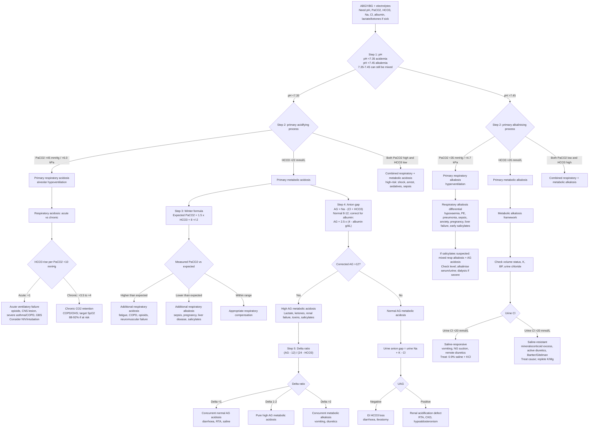

## Overview

Acid-base homeostasis maintains arterial pH between 7.35 and 7.45. Deviations beyond this range impair enzyme function, alter drug ionisation, and disrupt cardiovascular physiology. Four primary disorders exist — metabolic acidosis, metabolic alkalosis, respiratory acidosis, and respiratory alkalosis — and they may coexist as mixed disorders. A systematic approach to ABG interpretation is essential: it is a logical, stepwise process, not a pattern-recognition exercise.

## The Systematic ABG Approach

A reliable six-step method:

**Step 1 — pH:** Is it acidaemia (<7.35), alkalaemia (>7.45), or normal?

**Step 2 — Primary disorder:** Which parameter explains the pH?
- If pH is low: is PaCO₂ high (respiratory acidosis) or HCO₃ low (metabolic acidosis)?
- If pH is high: is PaCO₂ low (respiratory alkalosis) or HCO₃ high (metabolic alkalosis)?

**Step 3 — Compensation:** Is there appropriate compensation? Compensation returns pH toward normal but never fully corrects it.

| Primary Disorder | Compensation | Formula |
|----------------|-------------|---------|
| Metabolic acidosis | ↓ PaCO₂ (hyperventilation) | Expected PaCO₂ = 1.5 × HCO₃ + 8 (±2) — Winter's formula |
| Metabolic alkalosis | ↑ PaCO₂ (hypoventilation) | Expected PaCO₂ = 0.7 × HCO₃ + 21 (±2) |
| Respiratory acidosis (acute) | ↑ HCO₃ by 1 mmol/L per 1.3 kPa ↑ PaCO₂ | |
| Respiratory acidosis (chronic) | ↑ HCO₃ by 3.5 mmol/L per 1.3 kPa ↑ PaCO₂ | |
| Respiratory alkalosis (acute) | ↓ HCO₃ by 2 mmol/L per 1.3 kPa ↓ PaCO₂ | |
| Respiratory alkalosis (chronic) | ↓ HCO₃ by 5 mmol/L per 1.3 kPa ↓ PaCO₂ | |

If compensation is greater or lesser than expected, a second primary disorder is present (mixed disorder).

**Step 4 — Anion gap** (if metabolic acidosis): AG = Na+ − (Cl− + HCO₃−). Normal = 8–12 mmol/L (or 12–16 if albumin is included). A raised anion gap indicates unmeasured anions in the blood.

**Step 5 — Delta-delta ratio** (if raised AG metabolic acidosis): (AG − 12) / (24 − HCO₃). Ratio <1 = additional normal AG metabolic acidosis. Ratio >2 = additional metabolic alkalosis.

**Step 6 — Clinical context:** Integrate with history, examination, and other investigations.

---

## Metabolic Acidosis

### High Anion Gap Metabolic Acidosis

**Mnemonic — MUDPILES:**

| Letter | Cause |
|--------|-------|
| M | Methanol |
| U | Uraemia (renal failure) |
| D | DKA / starvation ketoacidosis / alcoholic ketoacidosis |
| P | Propylene glycol, paracetamol |
| I | Isoniazid, iron |
| L | Lactic acidosis |
| E | Ethylene glycol |
| S | Salicylates |

**Lactic acidosis** is the most common cause of high AG metabolic acidosis in hospitalised patients:
- **Type A** (hypoperfusion): septic shock, cardiogenic shock, haemorrhage, mesenteric ischaemia
- **Type B** (cellular dysfunction without hypoperfusion): metformin toxicity (most important drug cause), liver failure, mitochondrial disease, malignancy

**DKA**: Absolute or relative insulin deficiency → uninhibited lipolysis → free fatty acid release → hepatic ketogenesis → acetoacetate and beta-hydroxybutyrate accumulate → high AG metabolic acidosis. PaCO₂ is low (Kussmaul breathing = respiratory compensation). HCO₃ mirrors the severity of acidosis.

### Normal Anion Gap (Hyperchloraemic) Metabolic Acidosis

The anion gap is normal because HCO₃ loss is replaced by chloride. Causes:

| Setting | Causes |
|---------|--------|
| Renal | Renal tubular acidosis (RTA), CKD (early), acetazolamide |
| GI | Diarrhoea (HCO₃ loss in stool), ileostomy, fistulae |
| Iatrogenic | Excessive normal saline administration, TPN |

**Renal tubular acidosis (RTA):**
- **Type 1 (distal RTA)**: Distal tubule cannot secrete H+. Urine pH >5.5 despite acidaemia. Hypokalaemia. Causes: Sjögren's syndrome, SLE, amphotericin. Risk of nephrocalcinosis and renal calculi.
- **Type 2 (proximal RTA)**: Proximal tubule cannot reabsorb HCO₃. Associated with Fanconi syndrome (glucosuria, aminoaciduria, phosphaturia). Causes: myeloma, Wilson's disease, ifosfamide.
- **Type 4 (hyperkalaemic RTA)**: Aldosterone deficiency or resistance → impaired NH₄+ excretion → hyperkalaemia. Most common RTA. Causes: diabetic nephropathy (hyporeninaemic hypoaldosteronism), ACEi/ARB, spironolactone.

**Urine anion gap** (UAG = Urine Na + K − Cl) helps distinguish renal from GI causes of normal AG metabolic acidosis:
- Negative UAG: NH₄+ excretion is intact → GI cause (diarrhoea)
- Positive UAG: NH₄+ excretion is impaired → renal cause (RTA)

---

## Metabolic Alkalosis

**Mechanisms:** Either excess base gain (bicarbonate ingestion, blood transfusion — citrate) or acid loss (vomiting, nasogastric suction, mineralocorticoid excess, diuretics).

**Maintenance of metabolic alkalosis:** The kidney has enormous capacity to excrete bicarbonate and would normally correct alkalosis rapidly. Metabolic alkalosis is sustained only when there is a reason the kidney retains bicarbonate — usually volume depletion (ECFV contraction) or hypokalaemia.

**Saline-responsive vs saline-resistant:**

| Urine Cl− | Category | Cause | Treatment |
|-----------|---------|-------|-----------|
| <20 mmol/L (saline-responsive) | Volume-depleted, Cl− depleted | Vomiting, diuretics (after cessation), post-hypercapnia | IV saline (0.9% NaCl) + KCl |
| >20 mmol/L (saline-resistant) | Volume-expanded, mineralocorticoid excess | Conn's syndrome, Cushing's, Bartter/Gitelman syndrome | Treat underlying cause |

Vomiting causes metabolic alkalosis by HCl loss. The "paradoxical aciduria" seen in prolonged vomiting (urine pH acid despite systemic alkalosis) occurs because severe hypokalaemia and volume depletion force the kidney to exchange H+ for Na+ reabsorption, maintaining volume at the cost of perpetuating alkalosis.

---

## Respiratory Acidosis

PaCO₂ elevated → pH falls. Indicates alveolar hypoventilation — the respiratory system cannot eliminate sufficient CO₂.

**Causes:** Central drive suppression (opiates, sedatives, brainstem injury), neuromuscular failure (GBS, myasthenia, MND), chest wall restriction (obesity, kyphoscoliosis), upper airway obstruction, severe COPD or asthma exacerbation.

**Acute vs chronic:** Chronic hypercapnia (COPD baseline) produces metabolic compensation — elevated HCO₃. The pH is near-normal despite elevated PaCO₂. An acute rise in PaCO₂ produces a precipitous fall in pH without time for renal compensation.

**Treatment:** Treat the underlying cause. NIV or invasive ventilation for ventilatory failure. Avoid oxygen therapy that abolishes hypoxic drive in chronic CO₂ retainers (target SpO₂ 88–92%).

---

## Respiratory Alkalosis

PaCO₂ reduced → pH rises. Indicates alveolar hyperventilation — CO₂ elimination exceeds production.

**Causes:** Hypoxia-driven (pneumonia, PE, pulmonary oedema, altitude), direct central drive stimulation (anxiety/hyperventilation, salicylate toxicity — early, pregnancy, liver failure, fever, CNS disease), iatrogenic over-ventilation.

**Features of acute alkalosis:** Perioral tingling, carpopedal spasm (Trousseau's sign), tetany — from reduced ionised calcium (alkalosis increases Ca²+ binding to albumin).

**Treatment:** Treat the underlying cause. In anxiety-driven hyperventilation: reassurance and breathing retraining (not rebreathing into a bag — this may cause hypoxia).

---

## Mixed Disorders

A mixed disorder exists when pH, PaCO₂, and HCO₃ cannot all be explained by a single primary disorder with appropriate compensation. Common combinations:

| Combination | Clinical Example |
|------------|----------------|
| Metabolic acidosis + respiratory alkalosis | Salicylate toxicity, sepsis |
| Metabolic acidosis + metabolic alkalosis | DKA with vomiting; renal failure with vomiting |
| Respiratory acidosis + metabolic alkalosis | COPD + diuretics; COPD + vomiting |
| Respiratory acidosis + metabolic acidosis | Cardiac arrest |

## Clinical Insight

Winter's formula is the single most important compensation formula to know. In any metabolic acidosis, calculate the expected PaCO₂. If the measured PaCO₂ is higher than predicted, there is a concurrent respiratory acidosis (the patient is not compensating fully — consider sedatives, neuromuscular disease). If lower than predicted, there is a concurrent respiratory alkalosis.

Salicylate toxicity classically presents as a mixed respiratory alkalosis and metabolic acidosis — a pattern that should always trigger measurement of salicylate levels. Early stages are dominated by direct respiratory centre stimulation (alkalosis); later stages by uncoupling of oxidative phosphorylation (acidosis).

Metabolic alkalosis from vomiting is sustained by volume depletion — the kidney prioritises sodium reabsorption at the expense of bicarbonate excretion. The treatment is saline (volume replacement). Without correcting the volume deficit, giving bicarbonate alone worsens the alkalosis; the kidney will immediately excrete it.
