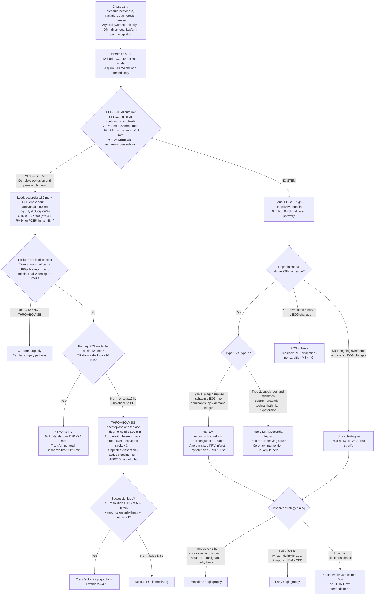

## Overview

Acute coronary syndrome (ACS) is a spectrum of conditions caused by acute myocardial ischaemia, unified by a common pathological mechanism: rupture or erosion of a vulnerable atherosclerotic plaque followed by platelet aggregation and thrombus formation. The three subtypes — unstable angina, NSTEMI, and STEMI — differ in the degree of coronary occlusion and the extent of myocardial injury.

| Feature | Unstable Angina | NSTEMI | STEMI |
|---------|----------------|--------|-------|
| Occlusion | Partial | Partial | Complete |
| Troponin | Normal | Elevated | Elevated |
| ST elevation | No | No | Yes |
| Management | Medical ± angiography | Medical ± angiography | Immediate reperfusion |

A critical distinction exists between **Type I NSTEMI** (true plaque rupture with thrombus) and **Type II NSTEMI** (supply-demand mismatch from a secondary cause such as anaemia, sepsis, or tachyarrhythmia). These are managed fundamentally differently — Type II requires treatment of the underlying cause, not coronary intervention.

## Pathophysiology

The process begins with endothelial injury, LDL infiltration into the intima, and macrophage recruitment. Oxidised LDL is engulfed by macrophages to form foam cells, which accumulate into a fatty streak and eventually a fibrous plaque with a lipid-rich necrotic core. The fibrous cap — particularly at its shoulder regions — is vulnerable to rupture under shear stress.

Rupture exposes subendothelial collagen and tissue factor, triggering platelet adhesion, activation, and aggregation, followed by activation of the coagulation cascade. The resulting thrombus causes partial or complete coronary occlusion.

**Irreversible myocardial necrosis begins within 20–40 minutes of complete occlusion** and progresses as a wavefront from the subendocardium outward toward the epicardium. This is the biological basis of the maxim: time is muscle.

**ECG localisation** allows identification of the culprit vessel:

| Territory | Culprit Vessel | ECG Leads |
|-----------|---------------|-----------|
| Inferior | RCA | II, III, aVF |
| Anteroseptal | LAD | V1–V2 |
| Anteroapical | LAD | V3–V4 |
| Anterolateral | LCx | I, aVL, V5–V6 |
| Posterior | PDA | V1–V3 ST depression (do posterior leads) |
| Right ventricular | Proximal RCA | V4R |

## Clinical Presentation

**Typical presentation:** Central chest pressure, tightness, or heaviness — often described as a weight or band. Radiation to the left arm, jaw, or neck. Associated diaphoresis, nausea, and dyspnoea. Pain builds over minutes (unlike aortic dissection, which is maximal at onset).

**Atypical presentations** are more common in women, elderly patients, and diabetics. These include isolated dyspnoea, jaw or arm pain alone, epigastric discomfort, and unexplained presyncope. A normal-feeling presentation does not exclude ACS.

**Right ventricular infarction** (proximal RCA occlusion) deserves special mention. It presents with the triad of hypotension, elevated JVP, and clear lung fields. These patients are preload-dependent — nitrates and diuretics are dangerous. Treatment is IV fluid resuscitation.

**Must-not-miss differentials:**

- **Aortic dissection** — tearing pain maximal at onset, radiating to the back, with BP asymmetry between arms. Thrombolysis in this setting is fatal.
- **Pulmonary embolism** — pleuritic pain, dyspnoea, risk factors for DVT.
- **Pericarditis** — sharp, positional pain, friction rub, diffuse saddle-shaped ST elevation with PR depression.

## Diagnosis

**ECG within 10 minutes of arrival** is the single most time-critical investigation. Do not delay it for anything.

STEMI is defined by ST elevation ≥1mm in ≥2 contiguous limb leads, or ≥2mm in V2–V3 (≥2.5mm in men under 40, ≥1.5mm in women), or new LBBB with a clinical picture consistent with ACS.

**High-sensitivity troponin** rises within 1–3 hours of myocardial injury. A 0h/3h protocol using validated pathways can effectively rule in or rule out NSTEMI. A single negative troponin at presentation does not exclude unstable angina.

**CXR** assesses for pulmonary oedema and mediastinal widening (which should raise concern for dissection). **Echocardiography** identifies regional wall motion abnormalities, LV function, and mechanical complications.

## Management

### Immediate — All ACS

- **Aspirin 300mg** chewed immediately
- **P2Y12 inhibitor** — ticagrelor 180mg loading dose is preferred over clopidogrel (superior outcomes in PLATO trial). Prasugrel is an alternative but is contraindicated in prior stroke/TIA, age over 75, or weight under 60kg.
- **Anticoagulation** — LMWH (enoxaparin 1mg/kg SC BD) or UFH
- **Oxygen** only if SpO₂ is below 90%
- **GTN** for ongoing pain if systolic BP is adequate. Strictly avoid in RV infarction and if PDE5 inhibitors have been taken within 24–48 hours.
- **High-intensity statin** — atorvastatin 80mg as early as possible
- **Beta-blocker** — reduces myocardial oxygen demand. Avoid in cardiogenic shock, acute decompensated heart failure, and significant bradycardia.

### STEMI — Reperfusion Strategy

**Primary PCI** is the gold standard. The target is door-to-balloon time of ≤90 minutes at a PCI-capable centre, or ≤120 minutes if transfer is required.

**Thrombolysis** is used when primary PCI cannot be delivered within 120 minutes. Tenecteplase or alteplase are standard agents. The patient must still be transferred to a PCI centre after successful thrombolysis.

**Absolute contraindications to thrombolysis:** prior haemorrhagic stroke at any time, ischaemic stroke within 3 months, suspected aortic dissection, active bleeding (excluding menstruation), BP >180/110 uncontrolled.

### NSTEMI — Risk Stratification

The **TIMI score** (0–7) guides the urgency of invasive strategy. A score ≥3 favours early angiography within 24 hours. Immediate angiography is indicated for haemodynamic instability, cardiogenic shock, refractory chest pain, or life-threatening arrhythmia.

### Secondary Prevention

All patients post-ACS receive:

| Medication | Duration / Notes |
|-----------|-----------------|
| Aspirin 75mg | Indefinitely |
| P2Y12 inhibitor (ticagrelor or clopidogrel) | 12 months post-stent |
| High-intensity statin | Indefinitely |
| ACE inhibitor or ARB | Indefinitely, especially if EF <40% |
| Beta-blocker | Indefinitely post-MI |
| Aldosterone antagonist | If EF <40% with HF or diabetes |

## Complications

Post-MI complications follow a predictable timeline:

| Complication | Timing | Key Features |
|-------------|--------|-------------|
| Ventricular fibrillation | Any time, especially first 24h | Most common cause of early death. Defibrillate immediately. |
| Acute pericarditis | Within 1 week | Pleuritic chest pain, friction rub. Treat with aspirin + colchicine. |
| Papillary muscle rupture | 3–5 days | Acute severe MR, pulmonary oedema, new systolic murmur. Surgical emergency. |
| VSD (septal rupture) | 3–5 days | New holosystolic murmur at LLSB, biventricular failure. Surgical emergency. |
| Free wall rupture | 5 days–2 weeks | Haemopericardium, tamponade, PEA arrest. Frequently fatal. |
| LV aneurysm | Weeks–months | Persistent ST elevation, risk of mural thrombus and embolism. |
| Dressler syndrome | Weeks–months | Autoimmune pericarditis. Fever, raised ESR. Treat with NSAIDs + colchicine. |

## Clinical Insight

The inferior STEMI deserves particular vigilance. Any patient with ST elevation in II, III, and aVF should have right-sided leads (V4R) recorded immediately to identify RV involvement. These patients have a completely different haemodynamic profile — they need volume, not vasodilators.

Never administer thrombolytics without first excluding aortic dissection. A patient with a tearing interscapular pain and asymmetric pulses who is thrombolysed for a presumed STEMI may not survive the mistake.

The troponin is not the diagnosis. In Type II NSTEMI, troponin rises because of supply-demand mismatch — sepsis, tachycardia, or severe anaemia — and rushing that patient to the catheterisation laboratory achieves nothing. Identify and treat the cause.
