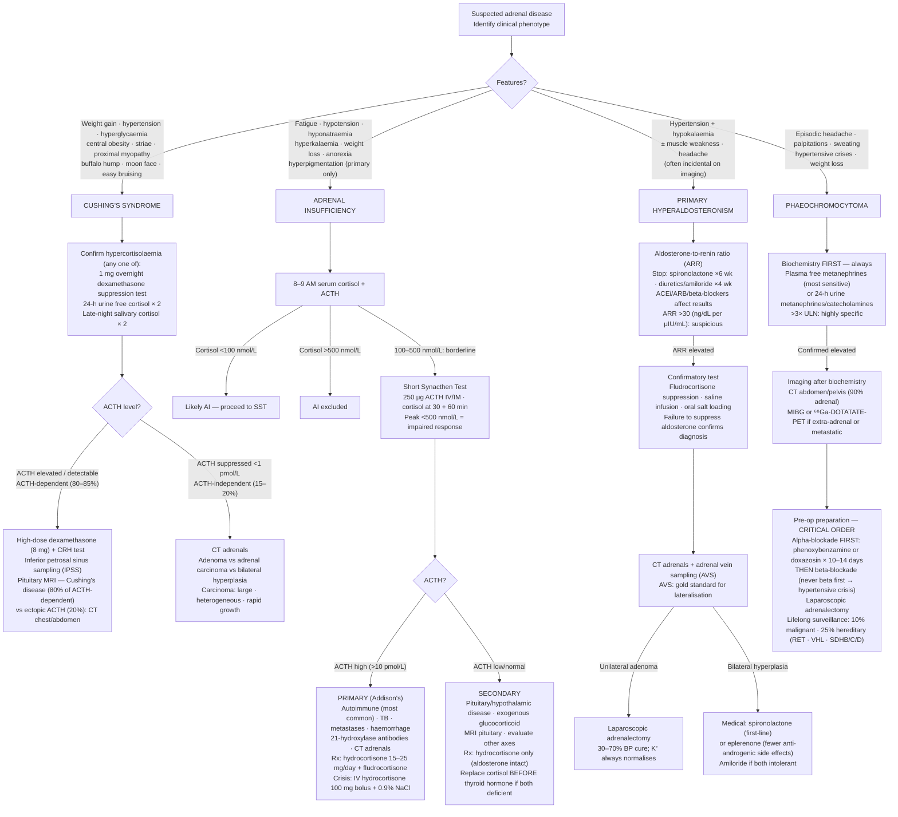

## Overview

The adrenal glands produce three categories of hormones from anatomically distinct zones: **glucocorticoids** (cortisol — zona fasciculata), **mineralocorticoids** (aldosterone — zona glomerulosa), and **androgens** (DHEA — zona reticularis). The adrenal medulla produces catecholamines (adrenaline, noradrenaline). Each zone is subject to distinct pathological conditions — excess or deficiency of any hormone produces a recognisable clinical syndrome.

---

## Cushing's Syndrome

### Pathophysiology

Cushing's syndrome is the clinical state resulting from prolonged, inappropriate exposure to glucocorticoids. **Exogenous corticosteroid use** is by far the most common cause overall.

**Endogenous Cushing's — ACTH-dependent (80%):**
- **Cushing's disease** (~70% of endogenous): Pituitary corticotroph adenoma oversecreting ACTH → bilateral adrenal hyperplasia → excess cortisol. Most common cause of endogenous Cushing's.
- **Ectopic ACTH secretion** (~10%): Small cell lung cancer (most common), carcinoid tumours, medullary thyroid cancer, phaeochromocytoma. Often presents with hypokalaemia and hyperpigmentation (from excess ACTH/MSH effect) and rapid severe hypercortisolism.

**ACTH-independent (~20%):**
- Adrenal adenoma (unilateral, functioning — autonomous cortisol production)
- Adrenal carcinoma (rare, often virilising due to androgen excess)
- Bilateral micronodular/macronodular hyperplasia (rare)

### Clinical Presentation

The clinical features of Cushing's reflect the catabolic, immunosuppressive, and metabolic effects of excess glucocorticoids:

**Specific to Cushing's (high discriminatory value):**
- **Proximal muscle weakness** — inability to rise from a chair or climb stairs without using arms
- **Wide purple striae** (>1 cm) — on abdomen, breasts, thighs (thin pale striae can occur in obesity — the breadth and colour are the distinguishing features)
- **Easy bruising and thin skin** (reduced collagen synthesis)
- **Osteoporosis** — fractures, vertebral compression

**Common but not specific:**
- Central obesity, moon face (rounded), buffalo hump (dorsal fat pad), supraclavicular fat pads
- Hypertension (~80%)
- Glucose intolerance or diabetes (~60%)
- Hirsutism, acne, menstrual irregularity (androgen excess from adrenal)
- Depression, cognitive impairment, psychosis

**Ectopic ACTH clue**: Hyperpigmentation (ACTH → MSH cross-reaction) + severe hypokalaemia + rapid onset weight loss (often obscures the typical Cushingoid features).

### Diagnosis — A Three-Step Process

**Step 1: Confirm hypercortisolism (at least two abnormal tests):**

| Test | Abnormal Result | Notes |
|------|---------------|-------|
| 24-hour urinary free cortisol (UFC) | >3× upper limit of normal | Collect ×2 on separate days |
| Late-night salivary cortisol | Elevated (×2 collections) | Cortisol normally troughs at midnight; loss of diurnal rhythm in Cushing's |
| Overnight low-dose dexamethasone suppression test (1 mg LDDST) | Cortisol >50 nmol/L at 8am after 1 mg dexamethasone at 11pm | Normal response is cortisol suppression; failure to suppress confirms Cushing's |
| 48-hour low-dose DST | As above | More specific |

**Step 2: Measure plasma ACTH:**
- Low/undetectable ACTH → **ACTH-independent** → image adrenal glands (CT adrenals)
- Normal or elevated ACTH → **ACTH-dependent** → Step 3

**Step 3: Distinguish pituitary from ectopic ACTH:**
- **MRI pituitary** — macroadenoma >6 mm visible in ~50–60% of Cushing's disease; microadenoma often invisible
- **CRH stimulation test** — IV CRH → ACTH and cortisol rise in pituitary-dependent disease (cortisol >20% rise); minimal response in ectopic
- **High-dose DST (8 mg)** — suppression >50% suggests pituitary source; ectopic tumours typically do not suppress
- **Inferior petrosal sinus sampling (IPSS)** — gold standard to confirm pituitary source and lateralise the adenoma before surgery. Central:peripheral ACTH ratio >2 (basal) or >3 (post-CRH) confirms pituitary origin.

### Management

**Cushing's disease**: Transsphenoidal pituitary surgery (first-line — ~80% remission for microadenoma). If surgery fails or recurs: repeat surgery, pituitary radiotherapy, bilateral adrenalectomy (causes Nelson's syndrome — ACTH-secreting tumour enlarges without cortisol feedback — hyperpigmentation). **Medical adrenal blockade** as bridge to surgery or for inoperable disease: metyrapone (inhibits 11-beta-hydroxylase), ketoconazole, osilodrostat, mifepristone.

**Adrenal adenoma**: Unilateral laparoscopic adrenalectomy. Contralateral adrenal is suppressed — prescribe perioperative hydrocortisone cover; may take months to recover.

**Ectopic ACTH**: Treat the primary tumour (resect carcinoid if possible). Medical adrenal blockade for palliation. Bilateral adrenalectomy if unresectable and severe.

---

## Addison's Disease (Primary Adrenal Insufficiency)

### Pathophysiology

Primary adrenal insufficiency (PAI/Addison's disease) results from destruction of the adrenal cortex, causing deficiency of all three hormone classes: **cortisol, aldosterone, and androgens**.

**Causes:**
- **Autoimmune** (most common in developed world, ~80%): Anti-21-hydroxylase antibodies → bilateral adrenal cortex destruction. Associated with other autoimmune conditions (Type 1 DM, Hashimoto's, Graves', vitiligo, coeliac disease, pernicious anaemia — **autoimmune polyendocrine syndrome**).
- **TB** (most common worldwide): Bilateral adrenal destruction — calcification visible on AXR/CT.
- Metastatic malignancy (bilateral, most commonly lung, breast, renal)
- Bilateral adrenal haemorrhage (Waterhouse-Friderichsen syndrome — fulminant meningococcaemia; also anticoagulation)
- HIV, CMV adrenalitis
- Drugs: ketoconazole, mitotane, rifampicin (induces cortisol metabolism)

**Secondary adrenal insufficiency**: ACTH deficiency from pituitary/hypothalamic disease or (most commonly) exogenous glucocorticoid use causing HPA axis suppression. Aldosterone is preserved (regulated by RAAS, not ACTH) → no mineralocorticoid deficiency → no hyponatraemia/hyperkalaemia/postural hypotension from salt wasting. No hyperpigmentation (ACTH is low, not high).

### Clinical Presentation

**Chronic Addison's:**
- **Fatigue, weakness, anorexia, weight loss** — non-specific, often diagnosed late
- **Hyperpigmentation** — pathognomonic of primary adrenal insufficiency; from excess ACTH/MSH activity on melanocytes. Affects skin creases (palm creases), buccal mucosa (gum and lip), scars, pressure areas, and normal sun-exposed areas.
- **Postural hypotension** — from aldosterone deficiency → sodium wasting → volume depletion
- Salt craving (compensation for sodium loss)
- Nausea, abdominal pain, diarrhoea
- Hypoglycaemia (especially in children)
- **Biochemistry**: Hyponatraemia (SIADH + aldosterone deficiency), hyperkalaemia (aldosterone deficiency), metabolic acidosis, eosinophilia, lymphocytosis, raised urea (dehydration)

**Addisonian crisis (acute adrenal insufficiency)**:
Precipitated by intercurrent illness, surgery, trauma, or vomiting (preventing oral steroid absorption). **Profound hypotension, tachycardia, confusion, nausea, vomiting, fever, abdominal pain, hypoglycaemia**. A medical emergency with high mortality if untreated.

### Diagnosis

**Short synacthen test (SST)**: Gold standard. IM/IV synthetic ACTH (synacthen/tetracosactide) 250 µg → measure cortisol at 0 and 30 minutes. Normal response: cortisol ≥550 nmol/L at 30 minutes. Failure to rise to threshold = primary or secondary adrenal insufficiency.

**Random cortisol**: Cortisol <100 nmol/L in an unwell patient is consistent with adrenal insufficiency. Cortisol >550 nmol/L makes Addison's unlikely.

**ACTH level**: Markedly elevated (often >200 pmol/L) in primary adrenal insufficiency (Addison's). Low in secondary.

**Anti-21-hydroxylase antibodies**: Positive in autoimmune Addison's (~90%).

**Imaging**: CT adrenals — bilateral enlargement (TB, infiltration), calcification (TB, haemorrhage), or atrophy (autoimmune).

### Management

**Acute adrenal crisis:**
1. IV hydrocortisone 100 mg immediately (do not delay for investigation)
2. IV saline 0.9% resuscitation
3. Treat hypoglycaemia (dextrose IV)
4. Identify and treat precipitant (usually infection)
5. Oral steroids once stable; fludrocortisone once oral fluids tolerated

**Chronic replacement:**
- **Hydrocortisone** 15–20 mg/day in divided doses (10 mg morning, 5 mg early afternoon — mimic diurnal cortisol rhythm)
- **Fludrocortisone** 50–200 µg/day — mineralocorticoid replacement for primary adrenal insufficiency
- DHEA replacement in women with fatigue and low libido (add-on)

**Sick day rules (essential patient education):**
- Minor illness, fever: double or triple steroid dose
- Vomiting/diarrhoea: unable to absorb oral steroids → **IM hydrocortisone 100 mg self-injection** or present to hospital
- Surgery: 100 mg IV hydrocortisone pre-induction + infusion during procedure
- Steroid emergency card and MedicAlert bracelet mandatory

---

## Primary Hyperaldosteronism (Conn's Syndrome)

**Pathophysiology**: Excess autonomous aldosterone secretion from adrenal adenoma (~35%) or bilateral adrenal hyperplasia (~60%). Aldosterone → sodium retention → hypertension → hypokalaemia (K+ secretion for Na+ reabsorption) → metabolic alkalosis.

**Clinical**: Hypertension + spontaneous hypokalaemia (most consistent feature, though 40% have normal K+). Muscle weakness, cramps, polyuria (nephrogenic DI from hypokalaemia), headache.

**When to screen**: Hypertension with spontaneous hypokalaemia, resistant hypertension (≥3 drugs), hypertension at age <40, adrenal incidentaloma with hypertension.

**Diagnosis**: **Aldosterone:renin ratio (ARR)** — screen (stop spironolactone/amiloride 4 weeks before). ARR >30–40 with aldosterone >400 pmol/L is suggestive. Confirm with saline infusion test or fludrocortisone suppression test (failure to suppress aldosterone = confirmed).

**Localise**: CT adrenals (adenoma vs bilateral hyperplasia). **Adrenal vein sampling (AVS)** — gold standard for lateralisation before surgery. Do not operate based on CT alone — CT misidentifies the dominant side in 40%.

**Management**: Unilateral adenoma → laparoscopic adrenalectomy (hypertension improves in >90%, resolves in ~50%). Bilateral hyperplasia → **spironolactone** (aldosterone antagonist) or eplerenone (fewer anti-androgenic side effects).

---

## Phaeochromocytoma

**Pathophysiology**: Catecholamine-secreting tumour of chromaffin cells — adrenal medulla (phaeochromocytoma, >90%) or extra-adrenal paraganglia (paraganglioma). ~10% malignant, ~10% bilateral, ~10% extra-adrenal, ~10% in children, ~10% familial (MEN2A/2B, VHL, NF1, SDH mutations).

**Clinical (the 5 Hs)**: Hypertension (sustained or paroxysmal — episodic hypertensive crises are classic), Headache, Hyperhidrosis (sweating), pallor/flushing, palpitations (tachycardia). Episodic attacks lasting minutes to hours, often triggered by exercise, Valsalva, or direct abdominal palpation/anaesthesia.

**Diagnosis**: 24-hour urinary or plasma **metanephrines** (normetanephrine and metanephrine) — most sensitive and specific test (>95% sensitivity). Catecholamines less sensitive. Image with CT/MRI adrenals; **¹²³I-MIBG scan** for occult/metastatic disease.

**Management**: **Alpha-blocker first (phenoxybenzamine or doxazosin) for 10–14 days** → then beta-blocker. **Never give beta-blocker first** — unopposed alpha stimulation causes paradoxical severe hypertension. Surgical resection after alpha-blockade is definitive.

## Clinical Insight

Adrenal crisis is under-recognised and under-treated. Any patient with known adrenal insufficiency who presents unwell — particularly with hypotension — should receive IM or IV hydrocortisone 100 mg immediately before waiting for investigations. The treatment is safe, the delay is not. All patients with Addison's disease should be trained in self-injection of IM hydrocortisone and carry a steroid emergency card at all times.

The aldosterone:renin ratio should be checked in all patients with resistant hypertension. Primary hyperaldosteronism is the most common cause of secondary hypertension — far more prevalent (~10%) than previously recognised. Discovering it changes management: a unilateral adenoma is cured by surgery, avoiding lifelong antihypertensive polypharmacy. An untreated aldosterone excess causes end-organ damage beyond that explained by the blood pressure alone (direct cardiac and renal toxicity).

Never give a beta-blocker first to a patient with phaeochromocytoma. The adrenergic physiology is critical: phenylephrine (from the tumour) acts on alpha receptors to cause vasoconstriction. Beta-blockers remove the beta-mediated vasodilation and cardiac output support — leaving only the vasoconstrictive alpha stimulation unopposed, causing a hypertensive crisis and potential catastrophe. Always alpha-block first, then carefully add beta-blockade.
