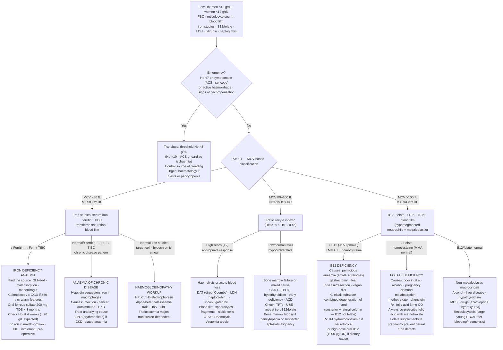

## Overview

Anaemia is defined as a haemoglobin concentration below the reference range for age and sex — broadly <130 g/L in adult men and <120 g/L in adult women. It is a sign, not a diagnosis. Every anaemia requires a cause. The most productive initial approach is morphological classification by MCV, which immediately narrows the differential and directs investigation.

| MCV | Classification | Key Causes |
|-----|---------------|-----------|
| <80 fL | Microcytic | Iron deficiency, thalassaemia, anaemia of chronic disease (sometimes), sideroblastic |
| 80–100 fL | Normocytic | Acute blood loss, haemolysis, anaemia of chronic disease, renal failure, mixed deficiency |
| >100 fL | Macrocytic | B12/folate deficiency, hypothyroidism, liver disease, alcohol, drugs, myelodysplasia |

## Pathophysiology

### Iron Deficiency Anaemia

Iron is essential for haemoglobin synthesis — specifically for haem formation in developing erythroblasts. Depletion follows a predictable sequence: iron stores depleted first (falling ferritin) → transferrin saturation falls → iron-deficient erythropoiesis → microcytic hypochromic anaemia.

Causes fall into three categories: inadequate intake (vegetarian/vegan diet), increased demand (pregnancy), and blood loss. Blood loss is the most clinically important — menorrhagia in premenopausal women, and GI bleeding in men and postmenopausal women. Malabsorption (coeliac disease, post-gastrectomy, H. pylori) is an underrecognised cause.

**In any man or postmenopausal woman with iron deficiency anaemia, a GI source must be excluded — upper and lower GI endoscopy is mandatory.**

### Megaloblastic Anaemia — B12 and Folate Deficiency

Both B12 and folate are required for DNA synthesis, specifically for thymidine production via the folate cycle. Deficiency impairs nuclear maturation while cytoplasmic growth continues, producing large immature cells with open chromatin (megaloblastic change). The same process affects all rapidly dividing cells — granulocytes develop hypersegmented nuclei (≥5 lobes, or any neutrophil with 6+ lobes — the earliest blood film finding).

B12 deficiency uniquely causes neurological damage: **subacute combined degeneration of the cord (SACD)** — demyelination of the dorsal columns (loss of proprioception, vibration sense, positive Romberg) and corticospinal tracts (spasticity, hyperreflexia, upgoing plantars). Folate deficiency does not cause SACD.

**Pernicious anaemia** is the most common cause of B12 deficiency in developed countries. Autoimmune gastritis destroys parietal cells → loss of intrinsic factor (IF) → failure of the IF-B12 complex to bind the cubilin receptor in the terminal ileum → B12 malabsorption. Anti-IF antibodies are specific (~50% sensitivity); anti-parietal cell antibodies are sensitive but less specific.

### Anaemia of Chronic Disease (ACD)

Chronic inflammation (infection, autoimmune disease, malignancy) stimulates IL-6 → hepatic hepcidin production → hepcidin degrades ferroportin on macrophages and enterocytes → iron trapped in storage → reduced iron availability for erythropoiesis. Classically normocytic, but microcytic in 25–30%.

Distinguishing ACD from iron deficiency:

| Feature | Iron Deficiency | ACD |
|---------|----------------|-----|
| Ferritin | Low (<15 µg/L) | Normal or elevated |
| TIBC | High | Low or normal |
| Serum iron | Low | Low |
| Transferrin saturation | Low | Low |
| Soluble transferrin receptor | High | Normal |

When both coexist (common in IBD, malignancy), ferritin may be misleadingly normal — sTfR or bone marrow iron stores confirm the picture.

## Clinical Presentation

Symptoms depend on severity, speed of onset, and cardiorespiratory reserve. Fatigue, reduced exercise tolerance, dyspnoea on exertion, palpitations, headache, and pallor (conjunctival, palmar, nail bed) are universal. In severe anaemia: tachycardia, flow murmur, and cardiac failure.

**Iron deficiency-specific features**: Koilonychia (spoon-shaped nails), angular stomatitis, glossitis, brittle hair, pica (craving non-food substances — ice, clay, starch), and dysphagia from a post-cricoid web (Plummer-Vinson syndrome — rare).

**B12/folate deficiency**: Megaloblastic features plus mild jaundice from intramedullary haemolysis. Neurological features in B12 deficiency as described above — can occur without anaemia or macrocytosis in ~25% of cases.

## Diagnosis

**Blood film** — the most informative single investigation:
- Microcytic hypochromic with pencil cells: iron deficiency
- Hypersegmented neutrophils + oval macrocytes: megaloblastic anaemia
- Target cells + basophilic stippling: thalassaemia
- Schistocytes: microangiopathic haemolytic anaemia
- Tear-drop cells (dacrocytes): myelofibrosis

**Iron studies**: Ferritin (best single test for iron deficiency when inflammation is absent), serum iron, TIBC, transferrin saturation.

**B12 and folate**: Serum B12 has low sensitivity — some deficient patients have borderline levels. Methylmalonic acid (MMA) is elevated specifically in B12 deficiency; homocysteine rises in both B12 and folate deficiency. MMA is the most specific confirmatory test for functional B12 deficiency.

**Reticulocyte count**: Elevated in haemolysis and acute blood loss (appropriate response). Low or normal in nutritional deficiency and aplasia (inadequate response — the bone marrow cannot compensate).

## Management

### Iron Deficiency

Identify and treat the cause — this is more important than the iron supplementation itself.

**Oral iron**: Ferrous sulfate 200 mg TDS is first-line. Take on an empty stomach for better absorption (though GI side effects are more common). Avoid calcium, tea, antacids, and PPIs within 2 hours. Expect Hb rise of ~10–20 g/L per 2 weeks. Continue for 3 months after normalisation to replete stores.

**IV iron** (ferric carboxymaltose, iron sucrose): For malabsorption, oral intolerance, ongoing losses exceeding oral replacement, IBD, CKD, or pre-operative optimisation. Faster and more reliable. Small risk of hypersensitivity.

### B12 Deficiency

**Hydroxocobalamin IM 1 mg**: Alternate days for 2 weeks (loading), then every 3 months for life — for pernicious anaemia and other absorptive defects. Oral B12 is ineffective when the defect is absorptive. High-dose oral cyanocobalamin (1–2 mg daily) works only for dietary deficiency via passive diffusion.

**Critical**: Never give folate alone to a patient with suspected mixed B12/folate deficiency. Folate corrects the haematological abnormality while B12-related neurological damage progresses unchecked.

### Folate Deficiency

Folic acid 5 mg OD orally for 4 months. Address the underlying cause. Prophylactic folic acid 400 µg/day for all women planning pregnancy and during the first 12 weeks (reduces neural tube defect risk by ~70%); 5 mg/day for high-risk women.

## Complications

- Cardiac failure from severe anaemia (Hb <60–70 g/L)
- SACD from untreated B12 deficiency — potentially irreversible after 6 months
- Plummer-Vinson syndrome and koilonychia (chronic iron deficiency)
- Pernicious anaemia carries 2–3× increased risk of gastric carcinoma and carcinoid — endoscopic surveillance is recommended

## Clinical Insight

A ferritin below 30 µg/L indicates iron depletion even before anaemia develops. Conversely, a normal ferritin in the context of chronic inflammation does not exclude coexisting iron deficiency — ferritin is an acute phase reactant. In a patient with IBD or malignancy, a ferritin of 80 µg/L may still represent functional iron deficiency. Use transferrin saturation and sTfR to resolve the ambiguity.

The neurological complications of B12 deficiency can occur without anaemia or macrocytosis. Approximately 25% of patients with SACD have a normal blood count at diagnosis. Any patient with unexplained peripheral neuropathy, posterior column signs, or cognitive decline warrants B12 measurement regardless of the Hb or MCV.

Iron deficiency in a man or a postmenopausal woman demands GI investigation. The anaemia is the presenting symptom; the cause may be a resectable colorectal cancer. Treating the ferritin without investigating the source is an incomplete — and potentially dangerous — response.
