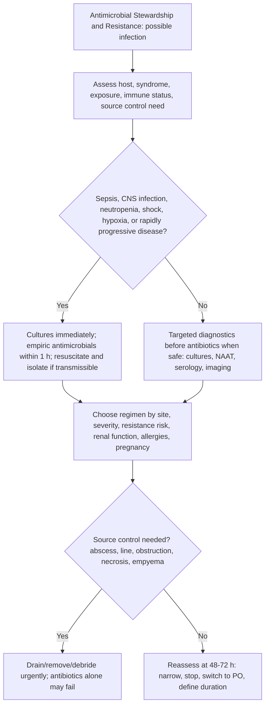

## Overview

Antimicrobial resistance (AMR) is one of the most significant threats to global health. Without action, AMR is projected to cause 10 million deaths annually by 2050 — exceeding current cancer mortality. The drivers are well understood: overuse and misuse of antibiotics in humans and agriculture, inadequate diagnostics driving empirical prescribing, poor infection prevention and control, and inadequate development of new antimicrobials. Antimicrobial stewardship (AMS) is the systematic effort to optimise antibiotic prescribing — ensuring the right drug, right dose, right duration, for the right patient.

## Mechanisms of Antimicrobial Resistance

Bacteria acquire resistance through four main mechanisms:

**1. Enzymatic drug inactivation**: Beta-lactamases hydrolyse the beta-lactam ring. Extended-spectrum beta-lactamases (ESBLs — plasmid-mediated, found in *E. coli* and *Klebsiella*) inactivate most penicillins and cephalosporins. Carbapenemases (NDM, KPC, OXA — often carried on transmissible plasmids) inactivate carbapenems — the last-resort antibiotics. Aminoglycoside-modifying enzymes inactivate aminoglycosides.

**2. Target modification**: Alteration of the antibiotic's target reduces binding. MRSA (*Staphylococcus aureus*) acquires the mecA gene → produces PBP2a (a modified penicillin-binding protein with low affinity for all beta-lactams). VRE (*Enterococcus*) modifies the D-Ala-D-Ala peptidoglycan terminus to D-Ala-D-Lac — vancomycin cannot bind.

**3. Reduced drug influx/increased efflux**: Loss of outer membrane porins in Gram-negatives (OprD loss in *Pseudomonas* — imipenem resistance). Efflux pumps actively expel antibiotics before they reach their targets (important in fluoroquinolone and macrolide resistance).

**4. Bypass mechanisms**: Organisms acquire alternative metabolic pathways that do not require the inhibited enzyme.

**Resistance spread — horizontal gene transfer (HGT)**: Resistance genes spread between bacteria (and species) via:
- **Conjugation** — direct cell-to-cell transfer via plasmids (most clinically important — allows rapid inter-species spread)
- **Transformation** — uptake of naked DNA from the environment
- **Transduction** — phage-mediated transfer

Plasmids carrying multiple resistance genes (co-resistance) explain why treating with one antibiotic can select for resistance to multiple unrelated antibiotics simultaneously.

## Key Resistant Organisms

| Organism | Resistance Pattern | Clinical Relevance |
|---------|-------------------|-------------------|
| MRSA | All beta-lactams | Skin/soft tissue, bacteraemia, prosthetic device infections |
| ESBL-producing *E. coli* / *Klebsiella* | Most penicillins + cephalosporins | UTI, bacteraemia; oral options limited |
| CPE (carbapenemase-producing Enterobacterales) | Carbapenems | Extreme drug resistance; limited treatment options |
| VRE | Vancomycin | Bloodstream infections in haematology/oncology |
| *Clostridioides difficile* | N/A (CDI caused by disruption of normal flora) | Post-antibiotic diarrhoea; spores survive routine cleaning |
| *Pseudomonas aeruginosa* | Intrinsically resistant to many antibiotics | Hospital-acquired pneumonia, burns, CF |
| *Acinetobacter baumannii* | Extensive drug resistance possible | ICU, ventilator-associated pneumonia |

---

## Antimicrobial Stewardship in Practice

### The Five Key Questions Before Prescribing

1. **Does this patient have a bacterial infection?** Most febrile illnesses in the community are viral. Viral URTI, bronchitis, and most sore throats do not require antibiotics. Distinguish colonisation (asymptomatic bacteriuria) from infection (symptomatic UTI).

2. **Does this patient need antibiotics now, or can we wait for culture results?** In haemodynamically stable patients, delaying empirical treatment while awaiting cultures allows targeted therapy and reduces broad-spectrum exposure.

3. **What is the right antibiotic and route?** Use the narrowest-spectrum agent effective against the most likely pathogen. IV therapy is rarely necessary in non-severely ill patients — oral bioavailability of many antibiotics (flucloxacillin, co-amoxiclav, doxycycline, ciprofloxacin) is excellent.

4. **What is the right dose and duration?** Under-dosing drives resistance; over-long courses select for resistant colonisers. For most community infections, short courses (3–5 days for UTI, 5 days for community pneumonia) are as effective as longer ones.

5. **Is IV-to-oral switch indicated?** Most patients on IV antibiotics can switch to oral within 48–72 hours when they are clinically improving, tolerating oral intake, and have no contraindication to the oral route. This reduces central line complications, hospital stay, and cost.

### Asymptomatic Bacteriuria — The Most Common Prescribing Error in Hospital Medicine

The scenario above illustrates a classic and extremely common prescribing error. A positive urine dipstick in an elderly care home resident with no urinary symptoms does not represent a UTI — it represents **asymptomatic bacteriuria (ASB)**, which is present in up to 50% of elderly institutionalised women. Treating ASB:
- Does not reduce mortality, prevent symptomatic UTI, or improve functional outcomes
- Selects for resistant organisms
- Increases risk of *C. difficile* infection
- Exposes patients to antibiotic side effects

The confusion and falls in this patient require a proper assessment — dehydration, medication review, orthostatic hypotension, delirium from another source — not immediate antibiotics for a positive dipstick.

**Urine dipstick should only be sent if the patient has symptoms of UTI** (dysuria, frequency, suprapubic pain, new offensive urine). In the absence of symptoms, do not send urine for culture. If inadvertently sent and positive, do not treat unless the patient develops symptoms.

### IV-to-Oral Switch Criteria

Switch IV to oral when ALL of the following are met:
- Clinically improving (falling inflammatory markers, resolving fever)
- Tolerating oral intake
- Normal GI absorption (no vomiting, diarrhoea, surgical bowel)
- No organisms requiring IV treatment (MRSA bacteraemia, endocarditis, meningitis)
- Appropriate oral agent available for the identified organism

### Antibiotic De-escalation

Once blood or tissue culture results are available, de-escalate to the narrowest effective antibiotic. If cultures are negative and the patient is improving, consider stopping antibiotics. Broad-spectrum regimens (piperacillin-tazobactam, meropenem, vancomycin) started empirically for undifferentiated sepsis should never be continued simply because they were started — they should be reviewed at 48–72 hours.

---

## Drug-Specific Stewardship Points

**Fluoroquinolones (ciprofloxacin, levofloxacin):** Excellent broad-spectrum activity and oral bioavailability. However, they are associated with *C. difficile*, tendon rupture (particularly Achilles, especially in elderly and on corticosteroids), peripheral neuropathy (potentially irreversible), aortic aneurysm/dissection, and CNS effects. MHRA 2019 safety review restricted their use: only when no alternative exists. Do not use for simple UTI, sore throat, or LRTI as first-line.

**Co-amoxiclav:** Associated with cholestatic jaundice — risk increases with repeated courses and duration. Avoid where amoxicillin or co-trimoxazole alone would suffice.

**Clindamycin:** Highest risk of *C. difficile* infection of any antibiotic class. Use only when specifically indicated (anaerobic infections, penicillin-severe allergy in bone/joint infection, necrotising fasciitis).

**Carbapenems (meropenem, ertapenem):** Last resort for ESBL and resistant Gram-negative infections. Overuse drives CPE emergence — the existential threat in hospital-acquired infection.

---

## *Clostridioides difficile* (CDI)

Antibiotic-associated diarrhoea caused by toxin-producing *C. difficile* — a spore-forming, Gram-positive anaerobe. Antibiotics disrupt normal colonic flora → *C. difficile* overgrowth → toxin A (enterotoxin) and toxin B (cytotoxin) → colonic mucosal damage.

**Highest risk antibiotics**: Clindamycin, fluoroquinolones, third-generation cephalosporins (ceftriaxone, cefotaxime), co-amoxiclav, broad-spectrum antibiotics.

**Presentation**: Watery diarrhoea (≥3 stools in 24 hours), cramping, and fever after antibiotic use. Severe CDI: WBC >15 × 10⁹/L, rising creatinine, fever >38.5°C. Fulminant CDI: pseudo-membranous colitis, toxic megacolon, colonic perforation.

**Diagnosis**: Stool GDH antigen + toxin A/B EIA (two-step testing). If discordant: PCR. Endoscopy not required routinely — pseudomembranes are pathognomonic but not always present.

**Management**:
- Stop the precipitating antibiotic where clinically safe
- Mild: **oral vancomycin** 125 mg QDS for 10 days (superior to metronidazole in all but mildest disease)
- Severe: **oral vancomycin** 500 mg QDS ± IV metronidazole
- Fulminant: vancomycin PR + IV metronidazole; colectomy if not responding
- Recurrent CDI: **fidaxomicin** (superior to vancomycin for recurrence prevention)
- Multiple recurrences: **faecal microbiota transplant (FMT)** — highly effective (>80–90% cure rate)
- Infection control: alcohol hand gel does NOT kill *C. difficile* spores — soap and water essential

## Complications

**AMR infections**: High morbidity and mortality from limited treatment options; prolonged hospital stays; need for toxic last-resort drugs (colistin, fosfomycin).

***C. difficile***: Toxic megacolon, colonic perforation, death (particularly in elderly).

**Appropriate therapy withheld**: Undertreating genuine infections while avoiding antibiotics is equally dangerous — the goal is appropriate prescribing, not minimising all antibiotic use regardless of clinical need.

## Clinical Insight

The urine dipstick is one of the most misused diagnostic tests in medicine. It is extremely sensitive — designed to screen for the possibility of infection, not confirm it. Leucocyte esterase and nitrites indicate pyuria and bacteriuria, which occur in colonisation, contamination, and genuine infection alike. In the absence of symptoms, a positive dipstick in any patient — but especially the elderly — is not a diagnosis and should not be treated. Train yourself to ask "does this patient have symptoms of UTI?" before you even look at the dipstick result.

Antibiotic duration is as important as choice. The evidence base supports shorter courses for most infections than were traditionally given. A 3-day course for uncomplicated lower UTI is as effective as 7 days. A 5-day course for community-acquired pneumonia is equivalent to 7–10 days in non-severe disease. Every additional day of unnecessary antibiotics selects for resistance, increases adverse effects, and prolongs hospitalisation. Stop when it is clinically appropriate to stop — not when an arbitrary round number is reached.

FMT for recurrent *C. difficile* is one of the most elegantly logical treatments in medicine: restore the disrupted microbiome with donor stool. It achieves >85% cure rates for recurrent CDI — far superior to any antibiotic regimen. It is safe, increasingly accessible, and should be considered after a second recurrence rather than being kept as a last resort after multiple failures.
