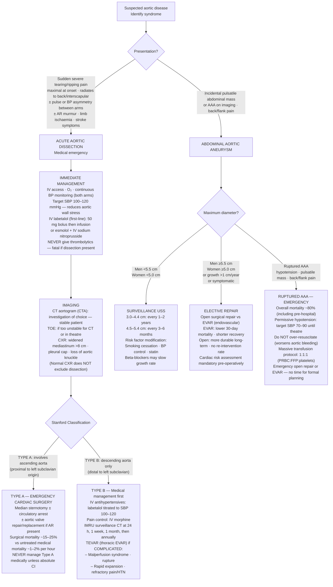

## Overview

Aortic disease encompasses two life-threatening entities: **aortic dissection** — a tear in the aortic intima allowing blood to track into a false lumen — and **aortic aneurysm** — pathological dilation of the aorta that risks catastrophic rupture. Both conditions share risk factors and demand urgent recognition, but their immediate management differs fundamentally.

---

## Aortic Dissection

### Pathophysiology

Aortic dissection begins with a **tear in the intima**, typically at points of maximal mechanical stress: the proximal ascending aorta (2–3 cm above the aortic valve) and the descending aorta just distal to the left subclavian artery (ligamentum arteriosum). Pulsatile blood pressure forces blood into the media, creating a **false lumen** that propagates both proximally and distally, shearing off branch vessel origins and disrupting aortic valve support.

**Classification — Stanford (most clinically used):**

| Type | Involvement | Urgency | Treatment |
|------|------------|---------|-----------|
| Type A | Involves ascending aorta (regardless of origin) | Surgical emergency | Emergency open repair |
| Type B | Descending only (distal to left subclavian) | Urgent medical management | BP control; TEVAR if complicated |

**Risk factors:** Hypertension (most important, present in >70%), bicuspid aortic valve, Marfan syndrome, Ehlers-Danlos syndrome, Turner syndrome, coarctation, cocaine use, pregnancy (particularly third trimester), prior aortic surgery.

### Clinical Presentation

The classical presentation is **sudden onset tearing or ripping pain**, maximal at onset (distinguishing it from the crescendo pattern of ACS), radiating to the interscapular back (descending dissection) or to the anterior chest (ascending). Migration of pain reflects propagation of the dissection.

**Complications that may dominate the presentation:**

- **Aortic regurgitation** — ascending dissection disrupts aortic valve support → acute severe AR → acute pulmonary oedema
- **Cardiac tamponade** — proximal extension into the pericardial space
- **Coronary occlusion** — dissection flap occluding RCA or LAD → MI pattern; STEMI in the context of possible dissection demands exclusion of dissection before thrombolysis
- **Stroke** — carotid artery involvement
- **Limb ischaemia** — iliac involvement
- **Paraplegia** — anterior spinal artery compromise
- **Mesenteric ischaemia** — SMA involvement
- **Acute kidney injury** — renal artery compromise

**BP asymmetry between arms** (>20 mmHg) is a highly specific but insensitive finding — present in about 20–30% of cases.

### Diagnosis

**CT aortography** is the investigation of choice — it defines the extent of dissection, the true and false lumens, and branch vessel involvement. It is rapidly available and highly accurate (sensitivity >95%).

**CXR** — widened mediastinum (>8cm) is classic but present in only ~60%. Other findings: loss of aortic knuckle, left pleural effusion (haemothorax from leaking descending dissection).

**Important:** Do not give thrombolytics for suspected STEMI until aortic dissection has been excluded. In a patient with chest pain and ST elevation, features suggesting dissection (tearing pain, back radiation, BP asymmetry, AR murmur, mediastinal widening) demand CT first.

**TOE** — if patient is too unstable for CT; can be performed in the operating theatre.

### Management

**All patients:**
- IV **labetalol** — reduces both heart rate and blood pressure, decreasing aortic wall stress. Target HR <60 bpm and systolic 100–120 mmHg.
- If labetalol unavailable: IV esmolol (short-acting beta-blocker) to control HR first, then vasodilator.
- IV access, group and crossmatch, ITU-level monitoring.

**Type A dissection:**
- Emergency cardiac surgery — mortality without surgery approaches 50% at 48 hours. Every hour counts.
- Even in elderly patients, the risk of surgery is outweighed by the near-certain mortality of conservative management.

**Type B dissection:**
- Uncomplicated: medical management (BP and HR control), close imaging surveillance.
- Complicated (malperfusion — limb, renal, mesenteric ischaemia; refractory pain; rapid expansion): **TEVAR** (thoracic endovascular aortic repair) is preferred over open surgery.

---

## Aortic Aneurysm

### Pathophysiology

An aneurysm is defined as focal dilation of the aorta to >1.5× its normal diameter. **Abdominal aortic aneurysm (AAA)** — normal infrarenal aorta diameter ~2cm; aneurysm defined as ≥3cm — is the most clinically significant. The wall weakens due to atherosclerosis, chronic inflammation, and metalloproteinase-mediated degradation of elastin and collagen. Risk of rupture increases exponentially with diameter.

**Risk factors:** Age >65, male sex, smoking (most important modifiable factor — quintuples risk), hypertension, atherosclerosis, family history, COPD.

### Clinical Presentation

**Unruptured AAA** is usually asymptomatic and discovered incidentally or on screening USS. It may present with back or abdominal pain as it expands.

**Ruptured AAA** — classic triad:
1. Sudden severe abdominal or back pain
2. Pulsatile abdominal mass
3. Haemodynamic instability (hypotension, tachycardia)

Retroperitoneal containment may temporarily limit haemorrhage, producing transient haemodynamic stability — this is deceptive. These patients may arrive in the emergency department relatively stable and deteriorate rapidly.

### Management

**Screening:** In the UK, all men aged 65 are offered a one-off abdominal USS. AAA is detected in ~2% — allowing elective intervention before rupture.

**Surveillance by diameter:**

| Diameter | Interval |
|---------|---------|
| 3.0–4.4 cm | Annual USS |
| 4.5–5.4 cm | 3-monthly USS |
| ≥5.5 cm | Refer for surgical repair |

**Repair:**
- **EVAR** (endovascular aortic repair) — less invasive, preferred in most patients
- **Open repair** — for anatomically unsuitable EVAR candidates or younger patients
- Emergency open or endovascular repair for rupture — mortality is ~40–50% even with surgery

**Thoracic aneurysm:** Repair indicated at ≥5.5cm (ascending) or ≥6.0cm (descending), or faster growth >5mm in 6 months.

## Complications

- Aortic dissection: death from rupture, cardiac tamponade, stroke, visceral malperfusion, acute AR, spinal cord ischaemia
- AAA: rupture (catastrophic haemorrhage), aortoenteric fistula, distal embolism, thrombosis

## Clinical Insight

The single most dangerous mistake in aortic dissection is thrombolysis. When a patient presents with chest pain and ST elevation and might have a dissection, the consequences of giving thrombolytics — haemopericardium, exsanguination — are irreversible. Take 10 minutes to get a CT before committing.

In ruptured AAA, do not be reassured by haemodynamic stability. Retroperitoneal tamponade is temporary. Resuscitate judiciously — permissive hypotension (target systolic ~80–90 mmHg) is preferred to aggressive fluid resuscitation, which can disrupt the clot and precipitate free rupture.

Any man over 65 presenting to primary care should be asked whether he has ever had an abdominal aortic aneurysm screen. The one-off USS screening programme reduces AAA mortality by ~50% through early detection of asymptomatic disease.
