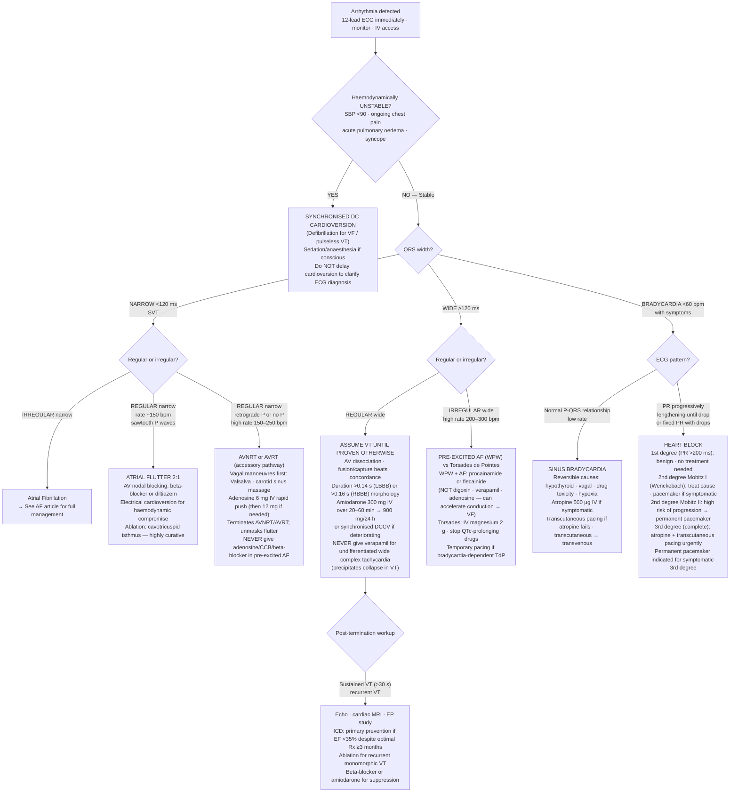

## Overview

Arrhythmias arise from disturbances in the generation or conduction of electrical impulses through the heart. Understanding them requires a structured approach: first, is the patient haemodynamically stable? Second, is the QRS narrow or wide? Third, what is the mechanism?

**Three mechanisms of arrhythmia:**

1. **Re-entry** — most common. An electrical impulse travels in a self-sustaining circuit when two pathways exist with different conduction velocities and refractory periods (AVNRT, AFL, VT, AF).
2. **Abnormal automaticity** — ectopic pacemaker fires spontaneously (junctional rhythm, accelerated idioventricular rhythm).
3. **Triggered activity** — afterdepolarisations that generate new action potentials; early afterdepolarisations cause torsades de pointes; delayed afterdepolarisations cause digoxin toxicity.

---

## Approach to Any Tachycardia

**Step 1 — Haemodynamic stability:**

If the patient is haemodynamically **unstable** (hypotension, reduced consciousness, chest pain, acute pulmonary oedema), perform **immediate synchronised DC cardioversion** regardless of the rhythm. Do not waste time with drugs in an unstable patient.

**Step 2 — QRS width:**

- **Narrow QRS (<120ms):** Supraventricular in origin (above the His bundle). Safe to use AV-nodal blocking agents.
- **Wide QRS (≥120ms):** Ventricular tachycardia until proven otherwise. Treat as VT if in doubt — misidentifying VT as SVT with aberrancy and giving verapamil can be fatal.

---

## Narrow Complex Tachycardias

### Sinus Tachycardia

Rate 100–220 bpm. P waves upright in lead II, preceding each QRS. This is not a primary arrhythmia — it is a physiological response to pain, fever, hypovolaemia, PE, anaemia, hyperthyroidism, or anxiety. Treat the cause.

### AVNRT (AV Nodal Re-entrant Tachycardia)

The most common paroxysmal SVT. Re-entry circuit uses fast and slow pathways within or adjacent to the AV node. Rate 150–250 bpm, perfectly regular.

**ECG:** P waves buried within or immediately after the QRS (retrograde P waves). Pseudo-R' in V1 (retrograde P distorting terminal QRS) and pseudo-S in inferior leads are characteristic clues.

**Management (stepwise):**
1. **Vagal manoeuvres** — modified Valsalva (strain then lie flat with legs raised) is the most effective; carotid sinus massage (avoid if bruit present)
2. **Adenosine IV** — 6mg rapid IV push followed by immediate saline flush; 12mg if fails; 18mg if still fails. Very short half-life (~10 seconds). Causes transient AV block, terminating re-entry. Warn the patient of transient chest tightness and flushing. **Contraindicated in asthma** (bronchospasm) and **in AF with WPW** (see below).
3. **Verapamil** 5mg IV — if adenosine fails or is contraindicated (except in WPW)
4. **Synchronised DC cardioversion** — if drug therapy fails or patient is unstable
5. **Long-term:** Catheter ablation of the slow pathway — curative in >95%

### Atrial Flutter

Macro re-entry circuit within the right atrium around the tricuspid annulus (cavotricuspid isthmus). Atrial rate ~300 bpm, ventricular rate 150 bpm (2:1 block), 100 bpm (3:1), or 75 bpm (4:1).

**ECG:** Classic sawtooth flutter waves at ~300 bpm, best seen in inferior leads and V1. Regular or regularly irregular.

Rate control (as for AF), anticoagulation (same stroke risk as AF), cardioversion, or catheter ablation (cavotricuspid isthmus ablation, >95% curative).

---

## Wide Complex Tachycardias

**Assume ventricular tachycardia until proven otherwise.** Features that strongly favour VT over SVT with aberrancy:

| Feature | Significance |
|---------|-------------|
| AV dissociation | Pathognomonic of VT — P waves march through independently |
| Fusion beats | Pathognomonic — sinus and ventricular impulse fuse |
| Capture beats | Pathognomonic — sinus impulse briefly captures ventricles |
| QRS >160ms | Very wide favours VT |
| Concordance V1–V6 | All positive or all negative suggests VT |
| Northwest axis | Extreme axis (positive aVR, negative I and aVF) |
| History of MI or cardiomyopathy | Prior structural disease → almost always VT |

### Ventricular Tachycardia (VT)

≥3 consecutive ventricular beats at >100 bpm. Monomorphic (uniform QRS) or polymorphic.

| Status | Management |
|--------|-----------|
| Pulseless VT | CPR + immediate unsynchronised defibrillation |
| Haemodynamically unstable with pulse | Synchronised DC cardioversion |
| Haemodynamically stable | IV amiodarone 150mg over 10 min, then infusion. Procainamide as alternative. |

Long-term: ICD for secondary prevention (post-cardiac arrest or sustained VT with structural heart disease); beta-blocker; treat underlying cause.

### Torsades de Pointes

Polymorphic VT with a sinusoidal twisting QRS axis around the baseline — "twisting of the points". Associated with a **prolonged QT interval**.

**Causes of long QT:**

| Category | Examples |
|---------|---------|
| Drugs | Antiarrhythmics (amiodarone, sotalol, quinidine), antipsychotics (haloperidol, quetiapine), antibiotics (azithromycin, fluconazole), methadone |
| Electrolytes | Hypokalaemia, hypomagnesaemia, hypocalcaemia |
| Congenital | Romano-Ward (autosomal dominant), Jervell-Lange-Nielsen (with congenital deafness) |

**Management:**
- **IV magnesium sulphate 2g** — first-line for stable torsades, even if Mg is normal
- Remove offending drug; correct electrolytes (target K+ >4.5, Mg2+ >1.0)
- Cardioversion if unstable
- Temporary pacing at increased rate (shortens QT) for bradycardia-dependent torsades
- ICD for congenital LQTS with recurrent events

---

## Bradyarrhythmias and Heart Block

### Heart Blocks

| Degree | ECG | Clinical Significance | Management |
|--------|-----|----------------------|-----------|
| First degree | PR >200ms, all P waves conducted | Benign | None |
| Second degree Mobitz I (Wenckebach) | Progressive PR lengthening then dropped QRS | Block at AV node; often benign; common in inferior MI | Usually none; atropine if symptomatic |
| Second degree Mobitz II | Fixed PR then sudden dropped QRS without warning | Block below AV node (His-Purkinje); high risk of complete block | Permanent pacemaker |
| Third degree (complete) | Complete AV dissociation; escape rhythm | Inferior MI → transient; anterior MI → permanent | Transcutaneous pacing acutely; permanent pacemaker |

**RCA supplies the AV node** — inferior MI causes AV block that is usually transient and responds to atropine. Anterior MI damages the bundle branches and causes permanent complete block requiring pacing.

---

## Wolff-Parkinson-White Syndrome

WPW involves an **accessory pathway** (bundle of Kent) connecting atria to ventricles, bypassing the AV node. Pre-excitation produces:
- **Short PR** (<120ms)
- **Delta wave** (slurred upstroke of QRS from early ventricular activation)
- **Wide QRS**

During sinus rhythm, WPW is often asymptomatic or causes palpitations from re-entry (orthodromic or antidromic AVRT).

**The danger: AF in WPW.** The accessory pathway has no decremental conduction properties — it will conduct AF impulses at the full atrial rate of 300+ bpm directly to the ventricles, potentially causing VF and SCD.

**ECG of AF in WPW:** Rapidly irregular, extremely wide, bizarre QRS complexes at rates >200 bpm — completely different from AF through the AV node.

**Treatment of AF in WPW:**
- **Procainamide or flecainide IV** — slow accessory pathway conduction
- DC cardioversion if haemodynamically unstable
- **Absolutely contraindicated: adenosine, verapamil, diltiazem, digoxin** — all block the AV node, forcing all conduction through the accessory pathway, potentially triggering VF

**Long-term:** Catheter ablation of the accessory pathway — curative, first-line recommendation.

## Complications

- Sudden cardiac death — VF, WPW with AF, torsades de pointes, HCM-related VT
- Tachycardia-induced cardiomyopathy — reversible with rate control
- Stroke and systemic embolism — AF, AFL
- Syncope and trauma from arrhythmia-induced hypotension

## Clinical Insight

The most dangerous error in arrhythmia management is giving verapamil to a patient with VT, or to a patient with AF and WPW. Both can precipitate haemodynamic collapse or VF. Wide complex tachycardia in a patient with prior heart disease is VT until proven otherwise — treat it accordingly.

Adenosine is both diagnostic and therapeutic in SVT. If the rhythm terminates, the diagnosis is confirmed as AV-nodal dependent (AVNRT or AVRT). If the rhythm does not terminate but AV block is transiently revealed (flutter waves, irregular AF pattern), the diagnosis is flutter or AF with aberrancy.

The QT interval is temperature- and rate-dependent. Always correct for heart rate (QTc). A QTc >500ms on a new drug is a clinical alarm — review and consider stopping the offending agent before it causes torsades.
