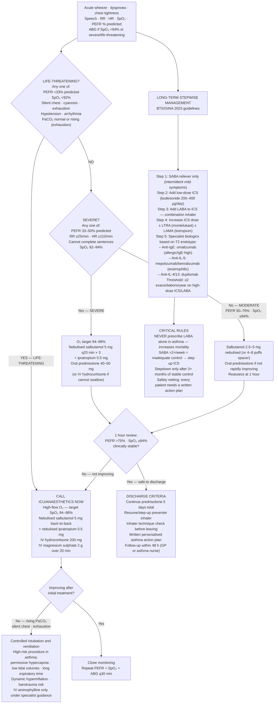

## Overview

Asthma is a chronic inflammatory airway disease characterised by variable, reversible airflow obstruction and bronchial hyperresponsiveness. It affects roughly 8% of the population and remains a significant cause of preventable death — the majority of fatal and near-fatal attacks occur in patients with inadequately treated or under-recognised severe disease.

## Pathophysiology

Asthma is fundamentally a disease of airway inflammation. In allergic asthma — the most common phenotype — allergen exposure in a sensitised individual triggers a type I (IgE-mediated) hypersensitivity response. Allergen-specific IgE on mast cell surfaces cross-links on re-exposure, triggering degranulation and release of histamine, cysteinyl leukotrienes, and prostaglandins. This produces the early phase response (minutes) characterised by bronchospasm, mucus hypersecretion, and oedema.

The late phase response (4–8 hours later) is driven by eosinophil recruitment and activation, producing further airway inflammation and a prolonged period of bronchial hyperresponsiveness. Repeated cycles of inflammation and repair lead to **airway remodelling** — subepithelial fibrosis, smooth muscle hypertrophy, and goblet cell hyperplasia — producing partially fixed obstruction in chronic poorly controlled disease.

The result: increased airway resistance → air trapping → hyperinflation → ventilation-perfusion mismatch → hypoxaemia. In early acute attacks, patients hyperventilate, producing a **low PaCO₂**. A rising or normal PaCO₂ in an acute attack therefore means the patient is tiring — this is a pre-arrest warning.

**Non-allergic triggers** include viral upper respiratory tract infections (the most common trigger for acute attacks in both children and adults), exercise, cold air, aspirin and NSAIDs, beta-blockers, occupational sensitisers, and emotional stress.

**Aspirin-exacerbated respiratory disease (AERD / Samter's triad):** Asthma + aspirin/NSAID sensitivity + nasal polyps. Results from shunting of arachidonic acid metabolism toward the leukotriene pathway when COX-1 is inhibited. Avoid all NSAIDs including selective COX-2 inhibitors. Paracetamol is generally safe.

## Clinical Presentation

**Symptoms:** Episodic wheeze (expiratory), breathlessness, chest tightness, and cough — typically worse at night and early morning, and triggered by identifiable factors.

**Signs:** Expiratory wheeze, prolonged expiratory phase, use of accessory muscles in acute attacks. In severe attacks: inability to complete sentences, tachycardia, tachypnoea.

**Acute severity assessment:**

| Feature | Moderate | Severe | Life-threatening |
|---------|---------|--------|-----------------|
| PEFR | 50–75% best | 33–50% best | <33% best |
| Speech | Full sentences | Phrases only | Single words |
| SpO₂ | >95% | 92–95% | <92% |
| Respiratory rate | <25/min | ≥25/min | — |
| PaCO₂ | Low (hyperventilating) | Low | Normal or rising |

**A silent chest in the context of acute asthma is a pre-arrest sign** — absent wheeze means no airflow, not improvement.

**Differential for wheeze:**
- COPD — older smoker, fixed obstruction, reduced DLCO
- Acute pulmonary oedema ("cardiac asthma") — bibasal crepitations, raised JVP, cardiac history, CXR evidence of pulmonary oedema
- Anaphylaxis — allergen exposure, urticaria, angioedema, hypotension
- Foreign body aspiration — sudden onset, unilateral wheeze, no prodrome
- Vocal cord dysfunction — predominantly inspiratory stridor, normal spirometry, anxiety-related

## Diagnosis

**Spirometry with reversibility testing:** Obstructive pattern (FEV1/FVC <0.7) with **significant reversibility** — defined as ≥12% AND ≥200mL improvement in FEV1 after salbutamol. This distinguishes asthma from COPD (where obstruction is fixed).

**PEFR diurnal variability >20%** across multiple readings is diagnostic of variable airflow obstruction.

**FeNO (fractional exhaled nitric oxide):** Elevated in eosinophilic airway inflammation. Supports diagnosis and guides ICS dosing. A high FeNO predicts response to ICS.

**Bronchial challenge testing (methacholine or mannitol):** Used when spirometry is normal but clinical suspicion remains high. Demonstrates bronchial hyperresponsiveness.

**Allergy testing:** Skin prick tests or specific IgE (RAST) for allergen sensitisation — guides allergen avoidance and identifies candidates for immunotherapy.

## Management

### Acute Asthma

**Immediate:**
- Oxygen — 40–60%, target SpO₂ 94–98% (contrast with COPD where target is 88–92%)
- **Nebulised salbutamol** 2.5–5mg immediately; repeat every 20 minutes or continuously in severe attacks
- **Nebulised ipratropium bromide** 0.5mg — add in severe and life-threatening attacks; repeat 4–6 hourly
- **Oral prednisolone** 40–50mg (or IV hydrocortisone 100mg if unable to swallow) — start immediately; continue for 5 days

**Escalation for life-threatening or inadequate response at one hour:**
- **IV magnesium sulphate 2g over 20 minutes** — causes smooth muscle relaxation; first-line escalation agent in life-threatening asthma
- **IV aminophylline** — used in refractory cases but narrow therapeutic window; monitor levels
- **Heliox** — helium-oxygen mixture reduces airway resistance; used as a temporising measure
- **Senior anaesthetic review** for potential intubation — intubating a severe asthmatic carries high risk and should be a last resort

**Discharge criteria:** PEFR >75% predicted and sustained at 60 minutes, SpO₂ ≥94%, patient comfortable and able to use inhaler correctly.

**Mandatory before discharge:** Written personalised asthma action plan, preventer inhaler prescribed and technique checked, GP follow-up within 48 hours, education on trigger avoidance.

### Chronic Management — BTS/SIGN Stepwise Approach

| Step | Treatment |
|------|----------|
| 1 | SABA (salbutamol) PRN — for intermittent symptoms |
| 2 | Add low-dose ICS (beclometasone, budesonide, or fluticasone) |
| 3 | Add LABA (formoterol or salmeterol) as fixed-dose ICS/LABA combination. **Never prescribe LABA without ICS.** |
| 4 | Increase ICS dose; consider LTRA (montelukast) or LAMA (tiotropium) |
| 5 | Biologic therapy for severe eosinophilic or allergic asthma; oral steroids (lowest effective dose) |

**LABA without ICS is dangerous in asthma.** It is associated with increased risk of severe attacks and asthma-related death (SMART trial). Always prescribe as a fixed-dose combination (e.g., salmeterol/fluticasone, formoterol/budesonide).

**Biologic therapies for severe asthma:**
- **Omalizumab** (anti-IgE) — for allergic asthma with elevated total IgE and sensitisation to a perennial allergen
- **Mepolizumab, benralizumab** (anti-IL-5/IL-5R) — for eosinophilic asthma with blood eosinophils ≥300 cells/µL
- **Dupilumab** (anti-IL-4Rα) — for type 2 inflammatory asthma; also treats coexisting atopic dermatitis

## Complications

- Near-fatal and fatal asthma attacks — most deaths are preventable with adequate treatment and recognition of severity
- Pneumothorax and pneumomediastinum — from raised intrathoracic pressure during acute attack
- Hypokalaemia — from high-dose beta-agonists and systemic steroids (monitor electrolytes)
- Airway remodelling — irreversible fixed obstruction with chronic poor control
- Adrenal suppression — from long-term high-dose ICS; counsel patients never to stop steroids abruptly

## Clinical Insight

A rising PaCO₂ in an acute asthma attack is a medical emergency. In acute asthma, patients hyperventilate and their PaCO₂ should be low — typically 3.5–4.0 kPa. A PaCO₂ that is normal (4.5–6.0 kPa) or, worse, elevated means the patient is exhausting their respiratory reserve and ventilatory failure is imminent. Call anaesthetics immediately and do not delay escalation.

The LABA-without-ICS rule is absolute. On examinations, any answer that involves prescribing a LABA as monotherapy in asthma is wrong. In COPD, LABA monotherapy is standard — this distinction is a frequent source of error.

Many deaths from asthma occur in patients who were not recognised as severe. Patients with brittle asthma, frequent hospitalisations, prior intubation, or poor adherence are at highest risk. These patients need a specialist-led care plan, ready access to rescue medication, and a low threshold for emergency review.
