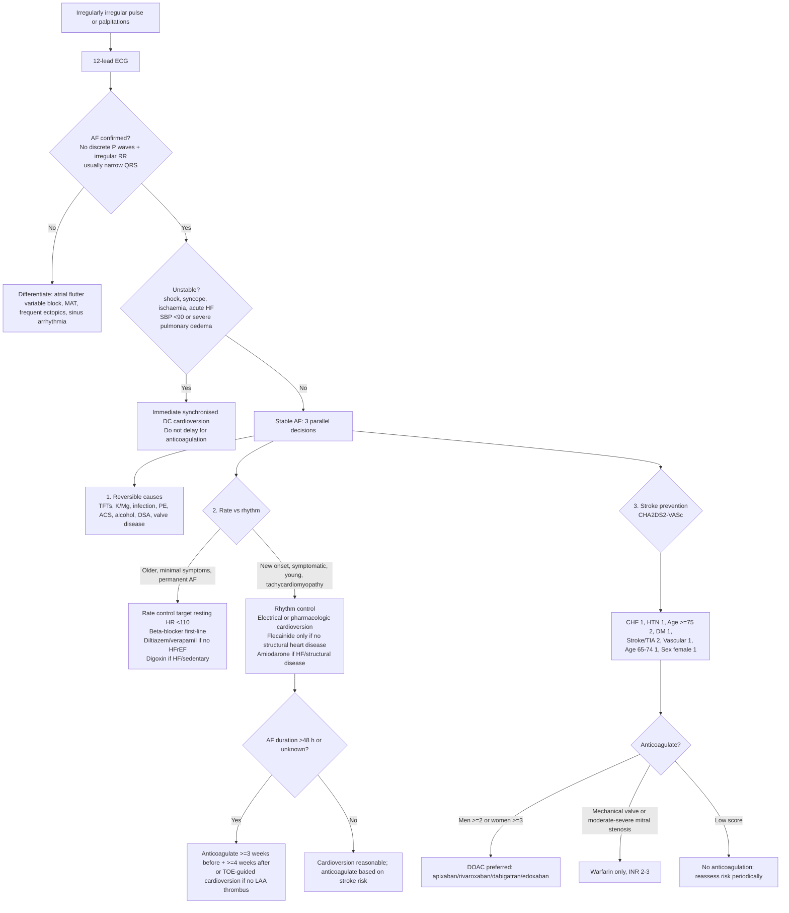

## Overview

Atrial fibrillation (AF) is the most common sustained cardiac arrhythmia, affecting 1–2% of the general population and rising sharply with age. It is characterised by chaotic, disorganised electrical activity in the atria — predominantly triggered by ectopic foci at the pulmonary vein ostia — causing loss of coordinated atrial contraction and an irregular ventricular response.

**Classification:**

| Type | Definition |
|------|-----------|
| First detected | First diagnosed episode, regardless of duration |
| Paroxysmal | Self-terminating, usually <48 hours |
| Persistent | Duration >7 days or requiring cardioversion |
| Long-standing persistent | Continuous AF >1 year |
| Permanent | Rate control accepted; rhythm control no longer pursued |

## Pathophysiology

Ectopic foci at the pulmonary vein ostia fire at 350–600 impulses per minute, overwhelming the sinus node. The AV node acts as a gatekeeper, allowing only a fraction of these impulses through — producing the characteristic irregularly irregular ventricular response.

Three major pathophysiological consequences follow:

1. **Loss of atrial kick** — atria contribute 20–30% of ventricular filling, particularly important in patients with diastolic dysfunction or mitral stenosis
2. **Left atrial appendage stasis** — sluggish blood flow in the LAA promotes thrombus formation, the primary source of cardioembolic stroke. AF increases stroke risk fivefold.
3. **Tachycardia-induced cardiomyopathy** — uncontrolled ventricular rate over weeks to months causes reversible LV systolic dysfunction, which normalises with rate control

## Clinical Presentation

AF may be completely asymptomatic and discovered incidentally, or may present with palpitations, breathlessness, fatigue, reduced exercise tolerance, or pre-syncope. In patients with pre-existing poor LV function or mitral stenosis, the loss of atrial kick can precipitate acute pulmonary oedema.

**Common precipitants/associated conditions:**
- Hypertensive heart disease (most common)
- Ischaemic heart disease
- Heart failure (AF and HF mutually worsen each other)
- Valvular disease, particularly mitral stenosis and MR
- Hyperthyroidism — **always check TFTs in new AF**
- Acute illness: PE, pneumonia, sepsis
- Alcohol excess ("holiday heart")
- OSA

## Diagnosis

**ECG is diagnostic:** absence of P waves (or irregular fibrillatory baseline), irregularly irregular RR intervals, and typically narrow QRS complexes (unless aberrant conduction or pre-existing BBB is present).

<!-- Wikimedia Commons: "ECG Atrial Fibrillation.svg" by Ewingdo; vectorised by Marnanel, CC BY-SA 4.0, https://commons.wikimedia.org/wiki/File:ECG_Atrial_Fibrillation.svg -->

**Differential for irregular pulse:**
- Frequent ectopics — P waves visible, premature beats interspersed
- Atrial flutter with variable block — sawtooth waves at ~300 bpm, regularly irregular
- Multifocal atrial tachycardia — ≥3 P wave morphologies, associated with COPD

**Investigations:**
- TFTs (mandatory — hyperthyroidism is a common, reversible cause)
- U&E, FBC, LFTs, troponin if ischaemia suspected
- Echocardiogram — assess LA size, LV function, valvular disease
- Transoesophageal echo (TOE) — to exclude LAA thrombus before cardioversion if AF duration >48 hours

**Stroke risk — CHA₂DS₂-VASc score:**

| Letter | Risk Factor | Points |
|--------|------------|--------|
| C | Congestive heart failure | 1 |
| H | Hypertension | 1 |
| A₂ | Age ≥75 | 2 |
| D | Diabetes mellitus | 1 |
| S₂ | Stroke / TIA history | 2 |
| V | Vascular disease | 1 |
| A | Age 65–74 | 1 |
| Sc | Female sex | 1 |

Anticoagulation is recommended for men with a score ≥2 and women with a score ≥3.

## Management

### Haemodynamically Unstable

Immediate synchronised DC cardioversion, regardless of AF duration.

### Haemodynamically Stable — Two Decisions

**Decision 1: Rate vs Rhythm Control**

Rate control targets a resting ventricular rate of <110 bpm and is appropriate for older, minimally symptomatic patients or those with permanent AF.

Rhythm control — restoring and maintaining sinus rhythm — is preferred in younger, symptomatic patients and those with recent-onset AF. The EAST-AFNET 4 trial (2020) demonstrated that early rhythm control reduces cardiovascular events compared with rate control alone, shifting the paradigm toward rhythm control in most patients.

| Strategy | First-line Agents | Notes |
|---------|------------------|-------|
| Rate control | Bisoprolol (first-line); diltiazem or verapamil if beta-blocker contraindicated; digoxin if HF or sedentary | Target resting HR <110 bpm |
| Rhythm control (acute) | DC cardioversion; IV flecainide (no structural disease); IV amiodarone (structural disease/HF) | Rule out thrombus first if >48h |
| Rhythm control (long-term) | Flecainide, propafenone (no structural disease); amiodarone (structural disease) | Catheter ablation increasingly preferred |

**Decision 2: Anticoagulation**

- DOACs (apixaban, rivaroxaban, dabigatran, edoxaban) are preferred over warfarin in non-valvular AF — more predictable, fewer interactions, no monitoring required
- **Warfarin (INR 2–3) is mandatory in valvular AF** — mechanical prosthetic valves, moderate-severe rheumatic mitral stenosis. DOACs are not validated in these settings.
- If cardioversion planned and AF duration >48 hours: anticoagulate for ≥3 weeks before and ≥4 weeks after, OR perform TOE to exclude LAA thrombus prior

**Catheter ablation** (pulmonary vein isolation) offers better rhythm control than antiarrhythmic drugs in paroxysmal AF and is increasingly used as first-line in appropriate patients.

## Complications

- Cardioembolic stroke — the most feared complication
- Tachycardia-induced cardiomyopathy — reversible with rate control
- Heart failure precipitation or decompensation
- Bleeding risk from anticoagulation

## Clinical Insight

Hyperthyroidism is identified in around 10–15% of patients presenting with new AF, and rate control alone — without antithyroid treatment — will fail. Beta-blockers are first-line for both rate control and symptom management while awaiting euthyroidism, at which point AF often resolves spontaneously.

Valvular AF is a distinct entity. In patients with mechanical heart valves or rheumatic mitral stenosis, DOACs are not an option regardless of CHA₂DS₂-VASc score — they were specifically excluded from the landmark DOAC trials and warfarin remains mandatory.

The risk of cardioversion in unprotected AF is real. A patient cardioverted from AF of unknown duration without adequate anticoagulation may throw a thrombus that had been sitting silently in the LAA. When in doubt, image first with TOE or anticoagulate for three weeks before converting.
