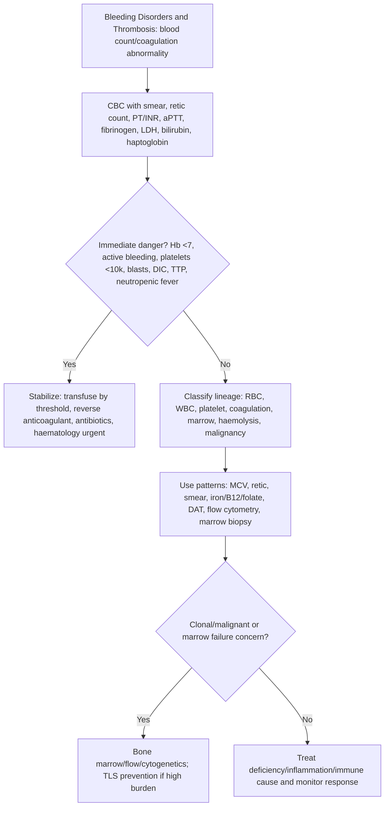

## Overview

Haemostasis depends on a coordinated interaction between the vascular endothelium, platelets, and the coagulation cascade. Disorders of bleeding arise from defects in any of these components. Thrombosis arises from their dysregulation in the opposite direction. Understanding the anatomy of haemostasis — primary (platelet plug) versus secondary (fibrin clot via coagulation cascade) — is essential to interpreting coagulation tests and localising the defect.

## Pathophysiology

### Normal Haemostasis

**Primary haemostasis** (platelet plug formation):
1. Vascular injury exposes subendothelial collagen
2. von Willebrand factor (vWF) bridges collagen and GPIb on platelets → platelet adhesion
3. Platelets activate → shape change → release of ADP, thromboxane A2 → further platelet recruitment → aggregation via GPIIb/IIIa and fibrinogen
4. Forms an unstable platelet plug

**Secondary haemostasis** (coagulation cascade — fibrin reinforcement):
The cascade amplifies the initial signal via two interconnecting pathways:
- **Extrinsic pathway**: Tissue factor (exposed at injury site) + FVII → activates FX
- **Intrinsic pathway**: Contact activation → FXII → FXI → FIX → (with FVIII) activates FX
- **Common pathway**: FX + FV (prothrombinase complex) → prothrombin → thrombin → fibrinogen → fibrin

**Interpreting coagulation tests:**

| Test | Measures | Prolonged by |
|------|---------|-------------|
| PT (prothrombin time) | Extrinsic + common pathway | FVII, FX, FV, FII, fibrinogen deficiency; warfarin; liver disease |
| APTT | Intrinsic + common pathway | FVIII, FIX, FXI, FXII deficiency; heparin; lupus anticoagulant |
| TT (thrombin time) | Fibrinogen → fibrin conversion | Heparin, fibrinogen deficiency, high FDP |
| Bleeding time / PFA-100 | Platelet function | Platelet disorders, vWD, aspirin |

### Haemophilia A and B

**Haemophilia A** (FVIII deficiency) and **Haemophilia B** (FIX deficiency) are X-linked recessive disorders — affecting males, carried by females. Haemophilia A is ~5× more common. Severity is determined by residual factor activity:

| Severity | Factor level | Clinical features |
|---------|-------------|------------------|
| Severe (<1%) | Spontaneous bleeding — haemarthroses, muscle haematomas, intracranial haemorrhage |
| Moderate (1–5%) | Bleeding with minor trauma |
| Mild (>5%) | Bleeding only with significant trauma or surgery |

**Haemarthroses** (bleeding into joints — knees, elbows, ankles) are the hallmark of severe haemophilia and lead to chronic haemophilic arthropathy from iron deposition and synovial inflammation.

APTT is prolonged; PT is normal; platelet count and bleeding time are normal.

### von Willebrand Disease (vWD)

The most common inherited bleeding disorder (~1% of the population). vWF has two roles: bridging platelet adhesion at the injury site (primary haemostasis) and acting as a carrier for FVIII in the circulation (protecting it from proteolysis). vWD therefore produces features of both platelet-type bleeding (mucocutaneous — epistaxis, menorrhagia, easy bruising) and, in type 3 (severe deficiency), factor VIII deficiency-like features.

**Types**: Type 1 (partial quantitative deficiency — most common, ~70%, autosomal dominant), Type 2 (qualitative defects), Type 3 (near-complete absence — severe).

### Immune Thrombocytopaenia (ITP)

Autoimmune destruction of platelets by anti-GPIIb/IIIa antibodies. Leads to mucocutaneous bleeding (petechiae, purpura, epistaxis, menorrhagia). Primary ITP is a diagnosis of exclusion; secondary ITP is associated with SLE, CLL, HIV, H. pylori, and drugs.

### Thrombophilia and Venous Thromboembolism

Virchow's triad — the three contributors to thrombus formation: stasis (immobility, venous obstruction), endothelial injury, and hypercoagulability.

**Inherited thrombophilias:**

| Condition | Mechanism | VTE Risk |
|-----------|----------|---------|
| Factor V Leiden | Resistance to activated protein C; most common | 3–8× |
| Prothrombin G20210A mutation | Elevated prothrombin levels | 2–4× |
| Antithrombin deficiency | Reduced inhibition of thrombin and FXa | 10–20× |
| Protein C deficiency | Reduced inactivation of FVa and FVIIIa | 10× |
| Protein S deficiency | Cofactor for protein C | 5–10× |

**Antiphospholipid syndrome (APS)**: Acquired thrombophilia. Antiphospholipid antibodies (anticardiolipin, anti-β2-glycoprotein I, lupus anticoagulant) paradoxically cause both thrombosis (arterial and venous) and recurrent pregnancy loss. Lupus anticoagulant is a misnomer — it prolongs the APTT in vitro but causes thrombosis in vivo.

## Clinical Presentation

### Localising the Defect — Bleeding Pattern

The pattern of bleeding points to the component of haemostasis that is defective:

| Feature | Platelet/vWD | Coagulation factor |
|---------|-------------|-------------------|
| Type of bleeding | Mucocutaneous — petechiae, purpura, epistaxis, gum, menorrhagia | Deep tissue — haemarthroses, muscle haematomas |
| Onset after injury | Immediate | Delayed (hours) |
| Petechiae | Yes | No |
| Haemarthroses | Rare | Classic in haemophilia |
| Response to pressure | Responsive | Poor |

### Thrombosis

**DVT**: Unilateral leg swelling, erythema, warmth, and tenderness. Homan's sign (calf pain on dorsiflexion) is unreliable — do not use it clinically. Wells score guides pre-test probability; D-dimer rules out in low probability; duplex USS confirms.

**PE**: Dyspnoea, pleuritic chest pain, haemoptysis, tachycardia. CTPA is the investigation of choice. High-risk PE (haemodynamic compromise): thrombolysis or catheter-directed therapy. ECG: sinus tachycardia (most common), S1Q3T3 (classic but insensitive), right heart strain pattern.

**Cerebral vein thrombosis (CVT)**: Headache (most common symptom), seizures, focal deficit. Associated with oral contraceptives, thrombophilia, pregnancy. MRI with venography is diagnostic. Anticoagulate even if haemorrhagic transformation is present.

## Diagnosis

**Coagulation screen** (PT, APTT, TT, fibrinogen): First step. Identifies the pathway affected.

**Mixing studies**: If APTT is prolonged, mix patient plasma 1:1 with normal plasma and repeat APTT:
- Corrects → factor deficiency (the normal plasma provides the missing factor)
- Does not correct → inhibitor present (lupus anticoagulant, acquired factor inhibitor)

**Specific factor assays**: FVIII and FIX for haemophilia; vWF antigen and activity for vWD.

**Platelet function**: PFA-100 or aggregometry for platelet function defects; platelet count for thrombocytopaenia.

**Thrombophilia screen**: Protein C, protein S, antithrombin, Factor V Leiden (DNA), prothrombin mutation (DNA), antiphospholipid antibodies. Perform at least 3 months after an acute thrombotic event and off anticoagulation — acute thrombosis and anticoagulants interfere with results. Do not screen during acute illness or pregnancy.

**D-dimer**: High sensitivity, low specificity. Excellent for ruling out VTE in low-probability patients (NPV >99%). Elevated in many benign conditions — infection, inflammation, malignancy, pregnancy, post-operatively. Do not use it as a rule-in test.

## Management

### Haemophilia

**Factor replacement**: Recombinant FVIII (haemophilia A) or FIX (haemophilia B) concentrate. Dose calculation: 1 unit/kg FVIII raises FVIII level by ~2%; 1 unit/kg FIX raises FIX level by ~1%. Target factor levels for major bleeds: >80%; minor bleeds: 30–50%.

**Prophylaxis**: Regular factor infusions 2–3× weekly for severe haemophilia — prevents haemarthroses and arthropathy. This is now standard of care.

**Extended half-life products**: PEGylated or Fc-fusion factor concentrates — less frequent infusions (weekly or less).

**Emicizumab**: Bispecific antibody mimicking the cofactor function of FVIII — subcutaneous, weekly/fortnightly/monthly dosing. Now first-line prophylaxis for haemophilia A with or without inhibitors.

**Inhibitors**: ~30% of severe haemophilia A patients develop FVIII inhibitors (IgG antibodies that neutralise infused FVIII). Manage with bypassing agents (recombinant FVIIa or activated prothrombin complex concentrate) or immune tolerance induction.

**DDAVP (desmopressin)**: Releases stored vWF and FVIII from endothelial cells — useful for mild haemophilia A and type 1 vWD; ineffective for severe disease or type 2/3 vWD.

### ITP

- **First-line**: Oral prednisolone ± IVIG (for rapid platelet rise when needed urgently). H. pylori eradication (raises platelet count in ~50% of H. pylori-positive ITP).
- **Second-line**: Rituximab, thrombopoietin receptor agonists (eltrombopag, romiplostim), splenectomy (now less used).
- Platelet transfusion for life-threatening bleeding only — destroyed rapidly by antibodies.

### Anticoagulation for VTE

**Acute treatment**: Direct oral anticoagulants (DOACs) are first-line for most VTE — apixaban (10 mg BD × 7 days then 5 mg BD) or rivaroxaban (15 mg BD × 21 days then 20 mg OD). Low molecular weight heparin (LMWH) followed by warfarin — reserved for specific indications (cancer-associated VTE now also DOAC eligible; mechanical heart valves require warfarin).

**Duration:**
- Provoked VTE (surgery, immobility): 3 months
- Unprovoked VTE: minimum 3 months; discuss extended therapy based on bleeding risk vs recurrence risk
- Cancer-associated VTE: extended treatment for as long as cancer is active
- APS: lifelong warfarin (target INR 2–3; some high-risk patients 3–4)

**Thrombolysis**: For PE with haemodynamic compromise (systolic BP <90 mmHg). Systemic alteplase (100 mg over 2 hours) or catheter-directed therapy. Contraindicated: recent surgery, stroke, bleeding.

## Complications

- Haemophilic arthropathy — progressive joint destruction from recurrent haemarthroses
- Inhibitor development in haemophilia — renders standard factor replacement ineffective
- Warfarin over-anticoagulation — intracranial haemorrhage (most feared), GI bleeding; reverse with vitamin K ± 4-factor PCC (not FFP — too slow)
- Post-thrombotic syndrome — chronic venous insufficiency after DVT (50% of patients); prevent with compression stockings
- Chronic thromboembolic pulmonary hypertension (CTEPH) — 3–4% after PE; suspect if persistent dyspnoea after PE treatment; assess with V/Q scan

## Clinical Insight

The mixing study is the most important and underutilised test in coagulation. A prolonged APTT that corrects on mixing indicates a factor deficiency (haemophilia, heparin effect). One that does not correct indicates an inhibitor — the lupus anticoagulant being the most important. These two scenarios have completely opposite clinical implications: factor deficiency causes bleeding; lupus anticoagulant causes thrombosis. The mixing study distinguishes them with a 15-minute incubation.

Lupus anticoagulant is one of medicine's great confusing misnomers. It prolongs the APTT in the laboratory because it interferes with phospholipid-dependent coagulation assays. In vivo, however, it causes thrombosis — arterial and venous — and recurrent pregnancy loss. A patient with a prolonged APTT who is not bleeding but has had recurrent clots almost certainly has antiphospholipid syndrome, not haemophilia.

DDAVP works for mild haemophilia A because it releases stored FVIII — but it only works if there are stores to release. Patients with severe haemophilia A (FVIII <1%) have no stores; DDAVP is useless. Before any procedure in a patient with known mild haemophilia A, a DDAVP challenge test (measuring FVIII level before and after DDAVP) should be performed to confirm responsiveness.
