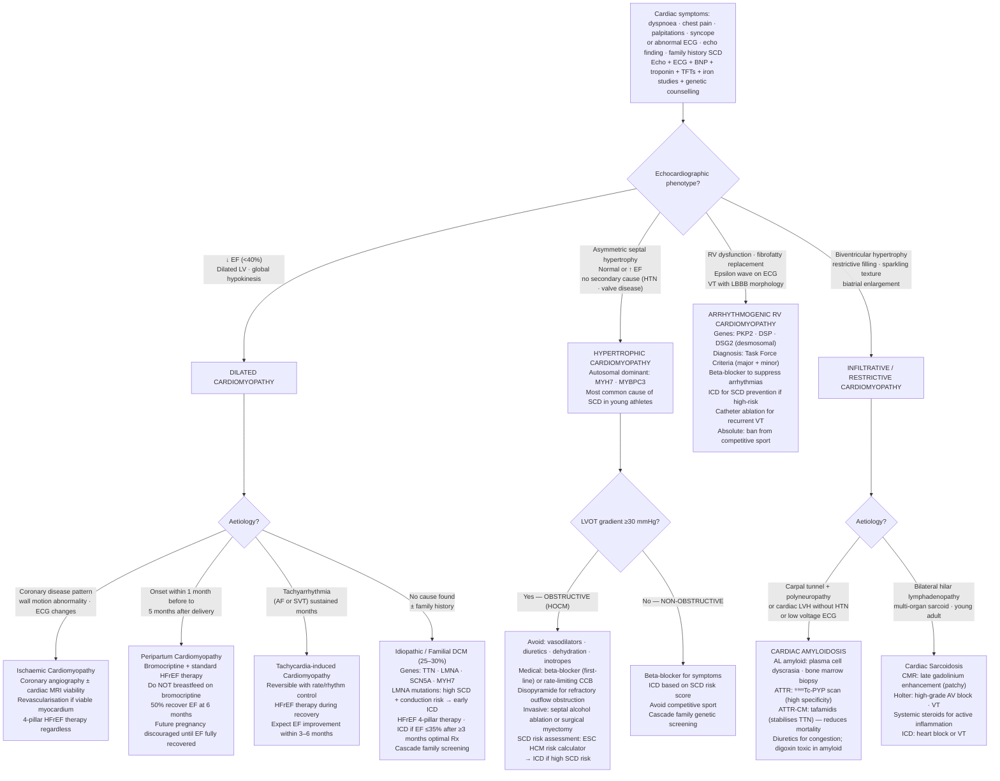

## Overview

Cardiomyopathies are primary diseases of the heart muscle that are not explained by ischaemia, hypertension, or valvular or congenital heart disease. The four major types — dilated, hypertrophic, restrictive, and arrhythmogenic right ventricular — have distinct pathologies, presentations, and management strategies.

---

## Hypertrophic Cardiomyopathy (HCM)

### Pathophysiology

HCM is caused by mutations in sarcomere protein genes, most commonly **β-myosin heavy chain** or **myosin-binding protein C** (autosomal dominant, variable penetrance). The result is disorganised, hypertrophied cardiomyocytes with interstitial fibrosis, producing **asymmetric septal hypertrophy**.

In two-thirds of patients, the hypertrophied septum obstructs the LVOT dynamically. Systolic anterior motion (SAM) of the mitral valve worsens the obstruction. The key feature is that this obstruction is **dynamic** — it worsens with conditions that reduce ventricular volume or increase contractility.

**Murmur behaviour:**

| Manoeuvre | Effect on LV Volume | Effect on Murmur |
|-----------|--------------------|--------------------|
| Standing, Valsalva | Decreases preload → smaller LV | Murmur louder |
| Squatting, leg raise, handgrip | Increases preload → larger LV | Murmur softer |

This is the opposite of aortic stenosis and MR, which both soften with Valsalva.

### Clinical Presentation

- Exertional chest pain, dyspnoea, and palpitations
- **Exertional syncope** — fixed cardiac output cannot increase to meet demand
- **Sudden cardiac death** — the most common cause of SCD in young athletes. Often the first manifestation.
- Harsh systolic murmur at LLSB; bifid carotid pulse; S4 (stiff, non-compliant ventricle)

**Risk factors for SCD in HCM:**
- Prior cardiac arrest or sustained VT
- Family history of HCM-related SCD
- Unexplained syncope
- Massive LV hypertrophy (wall thickness ≥30mm)
- LVOT gradient ≥30 mmHg at rest
- Non-sustained VT on Holter monitoring

### Management

- **Beta-blocker** — first-line. Slows heart rate, increases diastolic filling time, reduces outflow gradient.
- **Verapamil** — if beta-blocker not tolerated.
- **Avoid:** vasodilators, nitrates, diuretics (all reduce preload, worsen obstruction), digoxin (increases contractility, worsens obstruction)
- **ICD** — for high-risk patients, based on 5-year SCD risk calculators (HCM Risk-SCD)
- **Septal myectomy or alcohol septal ablation** — for refractory severe LVOT obstruction
- **Restriction from competitive sport** — all patients with HCM, regardless of symptoms

---

## Dilated Cardiomyopathy (DCM)

### Pathophysiology

DCM is characterised by four-chamber dilation and systolic dysfunction (EF <40%), resulting from loss of contractile myocytes and replacement with fibrous tissue. It is the most common cardiomyopathy and the leading indication for cardiac transplantation.

**Causes:**

| Category | Examples |
|---------|---------|
| Genetic (~50%) | Titin (TTN), lamin A/C mutations — autosomal dominant |
| Viral myocarditis | Coxsackievirus B (most common), CMV, EBV |
| Toxic | Alcohol (most common toxic cause), cocaine, doxorubicin (dose-dependent), trastuzumab |
| Peripartum | Onset in last month of pregnancy to 5 months postpartum |
| Takotsubo | Triggered by severe emotional stress; apical ballooning, reversible |
| Tachycardia-induced | Chronic uncontrolled tachyarrhythmia — reversible with rate control |
| Chagas disease | *Trypanosoma cruzi* — important cause in Latin America |

### Management

Treat as HFrEF — GDMT with ACEi/ARB/ARNI, beta-blocker, MRA, SGLT2 inhibitor. ICD if EF <35% after ≥3 months of optimal therapy. Identify and remove the cause (e.g., abstinence in alcoholic DCM, rate control in tachycardia-induced).

---

## Restrictive Cardiomyopathy

### Pathophysiology

Myocardial infiltration causes the ventricle to become stiff and non-compliant, impairing diastolic filling. Systolic function is often initially preserved. Elevated filling pressures cause prominent right heart failure symptoms.

**Causes:**

| Cause | Distinguishing Feature |
|------|----------------------|
| Amyloidosis (most common) | Low-voltage ECG + thick walls on echo ("voltage-mass mismatch"); "sparkling" myocardium; apple-green birefringence on Congo red stain |
| Sarcoidosis | Heart block, VT, systemic granulomatous disease |
| Haemochromatosis | Iron studies elevated, liver disease, diabetes |
| Radiation | Prior chest radiotherapy |
| Endomyocardial fibrosis | Eosinophilia (Loeffler's), tropical regions |

Cardiac amyloidosis deserves particular attention. ATTR amyloidosis (wild-type, formerly senile amyloid) is increasingly recognised in elderly men. Tafamidis reduces mortality in ATTR-CM (ATTR-ACT trial). The mismatch between low ECG voltage and increased wall thickness on echo is the key diagnostic clue.

### Management

Treat the underlying cause. Diuretics for congestion. Cardiac transplantation for refractory cases. Avoid digoxin in amyloid (binds to amyloid fibrils, increases toxicity risk).

---

## Arrhythmogenic Right Ventricular Cardiomyopathy (ARVC)

Fibro-fatty replacement of the RV myocardium, caused by mutations in **desmosomal proteins** (most commonly plakophilin-2). Presents with VT with LBBB morphology (ectopic focus in RV), palpitations, syncope, or SCD — typically in young athletes.

**ECG:** Epsilon wave (terminal notch after QRS in V1–V3), T-wave inversions in V1–V3, right precordial ST changes.

**Management:** Restrict from competitive sport, beta-blocker, ICD for high-risk patients, catheter ablation for recurrent VT.

## Complications

- Sudden cardiac death — particularly HCM and ARVC
- Progressive HF — DCM, end-stage restrictive
- AF and other arrhythmias
- Thromboembolic events in DCM (mural thrombus, especially with EF <25%)

## Clinical Insight

Peripartum cardiomyopathy is underdiagnosed. Any woman presenting in the last month of pregnancy or within five months of delivery with breathlessness and signs of heart failure requires urgent echocardiography. Recovery is possible but not guaranteed, and recurrence in subsequent pregnancies is real — these patients need careful counselling before attempting future pregnancies.

Doxorubicin cardiotoxicity is dose-dependent but also cumulative. Baseline echo before initiating anthracycline chemotherapy and serial monitoring throughout is mandatory. By the time symptoms develop, significant irreversible damage may have occurred.

Takotsubo cardiomyopathy mimics STEMI exactly — anterior ST elevation, troponin rise, and wall motion abnormalities. The clue is a recent severe emotional or physical stressor and, on angiography, completely normal coronary arteries with characteristic apical ballooning. It is reversible in most cases within weeks.
