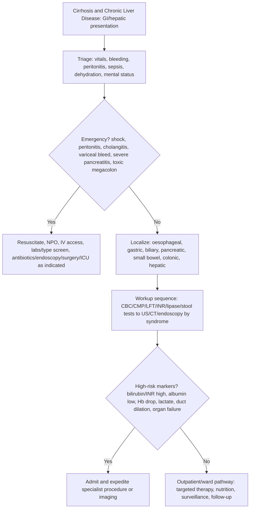

## Overview

Cirrhosis represents the end-stage of all chronic liver diseases — the final common pathway of sustained hepatic injury leading to diffuse fibrosis, architectural distortion, and regenerative nodule formation. Despite widely different aetiologies, cirrhosis produces a consistent clinical syndrome through two main pathophysiological consequences: **portal hypertension** (causing varices, ascites, and splenomegaly) and **hepatocellular dysfunction** (causing impaired synthetic function, encephalopathy, and jaundice). The complications of cirrhosis are themselves life-threatening and require systematic anticipation and management.

## Pathophysiology

**Fibrosis and cirrhosis**: Repeated hepatic injury from any cause activates hepatic stellate cells (Ito cells), which transdifferentiate into myofibroblasts, secreting collagen (predominantly type I and III) into the space of Disse. Diffuse fibrosis disrupts normal hepatic architecture, obliterating sinusoids and creating regenerative nodules. These nodules are surrounded by fibrous bands but lack normal portal-hepatic blood flow, resulting in functional impairment.

**Portal hypertension**: Normal portal venous pressure is 5–10 mmHg. In cirrhosis, fibrosis and regenerative nodules increase intrahepatic vascular resistance. Sinusoidal hypertension leads to portosystemic collateral formation — oesophageal and gastric varices (the most clinically important), haemorrhoids, and caput medusae. Splanchnic vasodilation (nitric oxide-mediated) further increases portal pressure by increasing portal blood flow.

**Ascites**: The most common major complication. Portal hypertension raises hydrostatic pressure in splanchnic capillaries → transudation of fluid into the peritoneal cavity. Hypoalbuminaemia reduces oncotic pressure. RAAS and sympathetic activation causes renal sodium and water retention, perpetuating fluid accumulation.

**Common causes of cirrhosis:**

| Cause | Notes |
|-------|-------|
| Alcohol-related liver disease | Most common in UK; CAGE questionnaire, MCV, GGT |
| Non-alcoholic fatty liver disease (NAFLD/MAFLD) | Fastest growing cause worldwide; associated with metabolic syndrome |
| Chronic hepatitis C | Treat with direct-acting antivirals (DAAs) |
| Chronic hepatitis B | Treat with tenofovir or entecavir; vaccination of contacts |
| Primary biliary cholangitis (PBC) | Middle-aged women; elevated ALP; anti-mitochondrial antibody (AMA) |
| Primary sclerosing cholangitis (PSC) | Strongly associated with UC; elevated ALP; MRCP shows beaded biliary tree |
| Autoimmune hepatitis | Elevated IgG; ANA, anti-smooth muscle antibody; responds to steroids |
| Haemochromatosis | Hereditary iron overload; elevated ferritin, transferrin saturation >45%; HFE gene mutation |
| Wilson's disease | Copper accumulation; young patient; Kayser-Fleischer rings; low caeruloplasmin |
| Alpha-1 antitrypsin deficiency | Lung disease + liver disease |

## Clinical Presentation

**Compensated cirrhosis**: May be entirely asymptomatic, discovered incidentally on imaging or bloods. Fatigue and abdominal discomfort are common. Signs may be subtle.

**Decompensated cirrhosis** — the development of any major complication:

**Cutaneous and peripheral signs**: Spider naevi (>5 is significant — in the drainage territory of the SVC), palmar erythema, leuconychia, Terry's nails, Dupuytren's contracture, parotid enlargement (alcohol), gynaecomastia, testicular atrophy, loss of axillary/pubic hair (hypoestrogenism), asterixis (hepatic encephalopathy).

**The major complications** are best understood together:

| Complication | Mechanism | Key Management |
|-------------|-----------|---------------|
| Variceal haemorrhage | Portal hypertension → varices → rupture | Band ligation; terlipressin; propranolol for primary/secondary prevention |
| Ascites | Portal HTN + hypoalbuminaemia + RAAS activation | Sodium restriction; spironolactone; furosemide; paracentesis |
| Spontaneous bacterial peritonitis (SBP) | Bacterial translocation into ascitic fluid | IV ceftriaxone; IV albumin; norfloxacin prophylaxis |
| Hepatic encephalopathy | Nitrogenous waste accumulation; ammonia toxicity; altered neurotransmission | Lactulose; rifaximin; treat precipitant |
| Hepatorenal syndrome (HRS) | Renal vasoconstriction from splanchnic vasodilation | Terlipressin + albumin; dialysis bridge; transplantation |
| Hepatocellular carcinoma (HCC) | Chronic regeneration → oncogenesis | 6-monthly USS + AFP screening in all cirrhotic patients |
| Coagulopathy | Reduced clotting factor synthesis | Vitamin K; FFP if active bleeding |

## Diagnosis

**Liver function tests**: Elevated bilirubin (jaundice), elevated transaminases (ALT/AST — degree of active inflammation), elevated ALP and GGT (biliary involvement or alcohol), reduced albumin (synthetic function), prolonged PT/INR (synthetic function — sensitive early marker).

**Liver synthetic function is best reflected by**: Albumin, PT/INR, and bilirubin — these three form the basis of the Child-Pugh score and MELD score.

**Child-Pugh score** (A/B/C):

| Variable | 1 point | 2 points | 3 points |
|---------|---------|---------|---------|
| Bilirubin (µmol/L) | <34 | 34–50 | >50 |
| Albumin (g/L) | >35 | 28–35 | <28 |
| PT prolongation (sec) | <4 | 4–6 | >6 |
| Ascites | None | Mild | Severe |
| Encephalopathy | None | Grade 1–2 | Grade 3–4 |

Child-Pugh A (5–6): compensated; B (7–9): moderate; C (10–15): decompensated, poor prognosis.

**Liver biopsy**: Gold standard for diagnosis and staging of fibrosis, but rarely needed if non-invasive markers (FibroScan, FIB-4 score) and clinical features are consistent.

**USS abdomen**: Assess liver texture, portal vein diameter, spleen size, ascites. 6-monthly USS + AFP for HCC surveillance in all cirrhotic patients.

**Ascitic fluid analysis** (diagnostic tap in all new ascites):
- Neutrophil count ≥250 cells/mm³ = spontaneous bacterial peritonitis (SBP) — treat immediately
- SAAG (serum-ascites albumin gradient) ≥11 g/L = portal hypertension
- Cytology — malignant cells suggest peritoneal metastasis

## Management

### Ascites

- Sodium restriction (<88 mmol/day or <2 g/day dietary salt)
- **Spironolactone** (aldosterone antagonist) — first-line. Start at 100 mg/day, titrate to 400 mg/day
- **Furosemide** — add if spironolactone alone insufficient; maintain 100:40 ratio with spironolactone
- **Large-volume paracentesis (LVP)** — for tense or refractory ascites. Give **IV human albumin 8 g per litre of ascites drained** to prevent post-paracentesis circulatory dysfunction (PPCD) — failure to give albumin risks precipitating HRS
- Transjugular intrahepatic portosystemic shunt (TIPSS) for refractory ascites not responding to LVP

### Spontaneous Bacterial Peritonitis (SBP)

Infection of ascitic fluid without any intra-abdominal source. Organisms typically Gram-negative enteric bacteria (*E. coli*, *Klebsiella*) from bacterial translocation.

Diagnosis: ascitic fluid neutrophil count ≥250 cells/mm³ (treat without waiting for culture).

- **IV ceftriaxone** 2g/day for 5 days (first-line)
- **IV albumin** 1.5 g/kg on day 1 and 1 g/kg on day 3 — reduces risk of HRS and mortality
- **Long-term prophylaxis** after a first episode of SBP: oral norfloxacin 400 mg/day or co-trimoxazole

### Hepatic Encephalopathy (HE)

Neuropsychiatric syndrome from accumulation of nitrogenous waste (primarily ammonia) bypassing the liver through portosystemic shunts. Ranges from subtle cognitive changes (grade 1) to coma (grade 4).

**Precipitants (treat the precipitant first)**: Infection, GI bleeding (blood in gut is a nitrogenous load), constipation, dehydration, electrolyte disturbance, renal failure, sedating drugs, excessive protein intake.

- **Lactulose** — softens stool and acidifies the colon, trapping NH₄⁺ ions. Target 2–3 soft stools per day.
- **Rifaximin** — non-absorbable antibiotic; reduces gut ammonia-producing bacteria. Add to lactulose for recurrent or persistent HE (RFHE trial: reduces hospitalisation).

### Hepatorenal Syndrome (HRS)

Functional renal failure in advanced cirrhosis — renal vasoconstriction secondary to severe splanchnic vasodilation. Kidneys are structurally normal. Precipitants: SBP, LVP without albumin, nephrotoxins, hypovolaemia.

Two types:
- **HRS type 1 (now HRS-AKI)**: Rapid deterioration, doubling of creatinine within 2 weeks. Median survival without treatment ~2 weeks.
- **HRS type 2 (now HRS-CKD)**: More gradual; typically in refractory ascites.

Treatment: **Terlipressin IV** (or noradrenaline) + **IV albumin 1 g/kg/day** — terlipressin causes splanchnic vasoconstriction, improving renal perfusion. Renal replacement therapy as bridge. Liver transplantation is the only definitive treatment.

### Hepatocellular Carcinoma (HCC)

Cirrhosis (from any cause) and hepatitis B are the major risk factors. Present with weight loss, RUQ pain, decompensation in a previously stable cirrhotic, or elevated AFP. **6-monthly ultrasound + AFP** for surveillance in all patients with cirrhosis.

Treatment depends on stage (Barcelona Clinic Liver Cancer, BCLC staging): resection or ablation for early disease, sorafenib/atezolizumab-bevacizumab for advanced disease.

### Liver Transplantation

The only definitive treatment for end-stage liver disease. Indications based on MELD score (Model for End-Stage Liver Disease — incorporates creatinine, bilirubin, INR): MELD ≥15 warrants listing. Abstinence from alcohol for ≥6 months is required for alcohol-related cirrhosis.

## Complications

- Variceal haemorrhage — 30% per episode 6-week mortality
- HRS — median survival 2 weeks untreated
- HCC — develops in ~2–3% of cirrhotic patients per year
- Malnutrition and sarcopenia — major determinant of outcomes
- Coagulopathy and thrombocytopenia (hypersplenism) — paradoxically, cirrhotic patients can be both pro-thrombotic and pro-haemorrhagic simultaneously

## Clinical Insight

Albumin infusion after large-volume paracentesis is not optional. Draining 5 litres of ascites without albumin replacement causes post-paracentesis circulatory dysfunction — the already-vasodilated splanchnic circulation receives a further reduction in effective circulating volume, precipitating HRS. The dose is 8 g albumin per litre of ascites removed. This single step prevents a catastrophic complication.

Rifaximin reduces episodes of overt hepatic encephalopathy and reduces hospitalisation. It should be added to lactulose in any patient with a second episode of overt HE. The lack of systemic absorption means it can be used in patients with renal impairment and carries minimal risk of Clostridium difficile infection compared with systemically absorbed antibiotics.

A cirrhotic patient presenting with decompensation (new encephalopathy, ascites, jaundice, or bleeding) requires a systematic search for a precipitant before attributing the deterioration to disease progression. SBP, urinary tract infection, GI bleeding, medication change, alcohol relapse, or occult HCC are all reversible precipitants. Missing a treatable precipitant in a patient who appears to be "progressing" is a common and avoidable error.
