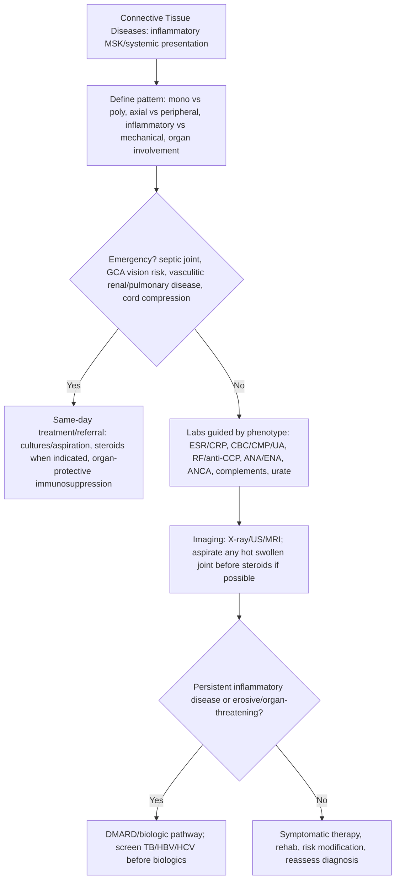

## Overview

The connective tissue diseases (CTDs) are a group of autoimmune conditions that share the features of systemic inflammation, autoantibody production, and involvement of multiple organ systems. Systemic lupus erythematosus (SLE) is the paradigmatic CTD. Others include systemic sclerosis, Sjögren's syndrome, idiopathic inflammatory myopathies (polymyositis/dermatomyositis), and mixed connective tissue disease (MCTD). Each has characteristic autoantibody profiles, clinical features, and treatment strategies.

## Pathophysiology

### Systemic Lupus Erythematosus

SLE results from a failure of self-tolerance with production of pathogenic autoantibodies — particularly against nuclear antigens (ANA, anti-dsDNA, anti-Smith). The mechanism involves:
- Defective clearance of apoptotic cells → nuclear material persists extracellularly → recognised as foreign → B-cell and T-cell autoimmune activation
- Type I interferon pathway activation (from nucleic acid-sensing TLRs) → perpetuates inflammation
- **Immune complex deposition** in target organs (kidney glomeruli, skin, choroid plexus, synovium) → complement activation → tissue damage

**Anti-dsDNA** antibodies correlate with disease activity and predict lupus nephritis — titres fall with treatment and rise before flares. **Complement consumption** (low C3, C4) reflects active immune complex disease.

**Lupus nephritis** is the most serious organ manifestation. Immune complex deposition in the mesangium and glomerular capillaries activates complement → glomerulonephritis. ISN/RPS classification I–VI: Class III/IV (focal/diffuse proliferative) is the most severe and requires aggressive immunosuppression; Class V (membranous) causes nephrotic syndrome.

### Antiphospholipid Syndrome (APS)

APS may occur in isolation (primary) or in the context of SLE (~30% of SLE patients have antiphospholipid antibodies; ~10% have clinical APS). Antiphospholipid antibodies (anticardiolipin IgG/IgM, anti-β2-glycoprotein I, lupus anticoagulant) cause thrombosis (arterial and venous) and pregnancy morbidity through platelet activation, endothelial dysfunction, and complement activation on the trophoblast.

**Pregnancy morbidity**: Recurrent early miscarriage (<10 weeks), late fetal loss (≥10 weeks), pre-eclampsia, placental insufficiency.

**Catastrophic APS (CAPS)**: Rare, life-threatening — thrombosis in multiple organs simultaneously; 50% mortality. Treat with anticoagulation, steroids, IVIG, and plasma exchange.

### Systemic Sclerosis (Scleroderma)

Characterised by: vasculopathy (Raynaud's phenomenon — earliest manifestation), immune activation, and progressive fibrosis of skin and internal organs. Two subtypes:

**Limited cutaneous SSc (lcSSc)**: Skin involvement limited to face and distal limbs. The **CREST syndrome** variant: Calcinosis, Raynaud's, oEsophageal dysmotility, Sclerodactyly, Telangiectasia. Associated with **anti-centromere antibody**. Pulmonary hypertension is the major complication (occurs late, in the absence of significant fibrotic lung disease).

**Diffuse cutaneous SSc (dcSSc)**: Skin involvement proximal to elbows/knees and on the trunk. Rapidly progressive. **Anti-Scl-70 (anti-topoisomerase I)** antibody — associated with interstitial lung disease (the major complication). Renal crisis (hypertensive emergency from renal arteriolar involvement) — treat with ACE inhibitor immediately (captopril).

### Inflammatory Myopathies

**Dermatomyositis (DM)**: Immune-mediated inflammatory myopathy + characteristic skin manifestations. Heliotrope rash (violaceous periorbital oedema + erythema), Gottron's papules (erythematous papules over knuckles — pathognomonic), V-sign (chest), shawl sign (upper back). Anti-Mi-2, anti-Jo-1 (and other anti-aminoacyl-tRNA synthetase antibodies — associated with antisynthetase syndrome: myositis + ILD + mechanic's hands + arthritis). **Malignancy association**: ~20% of DM is paraneoplastic — screen all adults.

**Polymyositis (PM)**: Similar to DM without skin features. Proximal muscle weakness — difficulty rising from chair, climbing stairs, lifting arms above head. Elevated CK. The diagnosis of PM has become narrower as many cases previously labelled PM are now reclassified as inclusion body myositis or anti-synthetase syndrome.

**Inclusion body myositis (IBM)**: Most common inflammatory myopathy in patients >50. Slowly progressive. Distal and proximal weakness (distinguishes from PM/DM). Finger flexor weakness and quadriceps wasting are characteristic. Does not respond to immunosuppression — the most important reason to distinguish it from PM.

### Sjögren's Syndrome

Autoimmune exocrinopathy — lymphocytic infiltration of salivary and lacrimal glands → dry eyes (keratoconjunctivitis sicca) and dry mouth (xerostomia). Primary Sjögren's is standalone; secondary occurs in the context of RA, SLE, or other CTDs.

**Anti-Ro (SSA)** and **anti-La (SSB)** antibodies — characteristic. Anti-Ro in a pregnant woman crosses the placenta → neonatal lupus and **congenital heart block** (third-degree AVB from fibrosis of the conducting system) — requires foetal cardiac monitoring.

Systemic features: fatigue (dominant), peripheral neuropathy, glomerulonephritis, vasculitis, interstitial lung disease. Increased risk of NHL (~40× — from chronic B-cell stimulation).

## Clinical Presentation

### SLE — The Great Imitator

SLE can mimic almost any medical condition. The SLICC and ACR/EULAR classification criteria capture its breadth:

| Domain | Features |
|--------|---------|
| Constitutional | Fever, fatigue, weight loss |
| Mucocutaneous | Malar (butterfly) rash (spares nasolabial folds); discoid rash; photosensitivity; oral ulcers (painless); hair loss |
| Musculoskeletal | Non-erosive arthritis (symmetric, small joints — similar distribution to RA but does not erode) |
| Renal | Proteinuria, haematuria, casts — lupus nephritis |
| Neuropsychiatric | Seizures, psychosis, stroke, transverse myelitis, peripheral neuropathy, cognitive impairment |
| Haematological | Haemolytic anaemia (Coombs positive), lymphopaenia, thrombocytopaenia, leucopaenia |
| Serositis | Pleuritis, pericarditis |
| Cardiovascular | Libman-Sacks endocarditis (sterile verrucous vegetations — APS-associated); accelerated atherosclerosis |

**Jaccoud's arthropathy**: Deforming but non-erosive arthritis in SLE — reducible deformities from capsule and tendon laxity (unlike RA where deformities are fixed from structural damage).

## Diagnosis

### Autoantibody Profile — The Rheumatology Cheat Sheet

| Antibody | Condition | Notes |
|---------|-----------|-------|
| ANA | Screen — SLE, all CTDs | High sensitivity, low specificity; titre and pattern matter |
| Anti-dsDNA | SLE (specific) | Correlates with disease activity; predicts nephritis |
| Anti-Smith | SLE (highly specific, ~25% sensitive) | Does not correlate with activity |
| Anti-Ro (SSA) | Sjögren's, SLE, neonatal lupus | Anti-Ro+ in pregnancy → foetal heart block risk |
| Anti-La (SSB) | Sjögren's, SLE | Usually with anti-Ro |
| Anti-centromere | Limited SSc (CREST) | Pulmonary hypertension risk |
| Anti-Scl-70 | Diffuse SSc | ILD risk |
| Anti-Jo-1 | Antisynthetase syndrome | Myositis + ILD + mechanic's hands |
| Anti-Mi-2 | Dermatomyositis | Classic DM association |
| RF, Anti-CCP | RA | Anti-CCP highly specific |
| ANCA (PR3/MPO) | Vasculitis | GPA (cANCA/PR3), MPA (pANCA/MPO) |
| Anti-GBM | Goodpasture's | Linear IgG on renal biopsy |

**ANA cascade**: ANA positive → if ≥1:160, further testing: anti-dsDNA, anti-Smith, anti-Ro, anti-La, antiphospholipid antibodies, complement (C3, C4), urinalysis, renal function.

**Renal biopsy**: Mandatory for proteinuria >500 mg/24h or active urinary sediment in SLE — to classify lupus nephritis and guide treatment intensity.

## Management

### SLE

**Hydroxychloroquine** (antimalarial): Started in all SLE patients without contraindication — reduces flare frequency, prevents lupus nephritis, reduces damage accrual, and improves survival. Annual retinal screening after 5 years (rare macular toxicity). Reduces cardiovascular and thrombotic risk.

**Mild-moderate disease** (skin, joints, serositis): NSAIDs for joint symptoms, topical steroids for skin, low-dose prednisolone for serositis. Hydroxychloroquine as background.

**Moderate-severe disease or steroid-dependent**: Add azathioprine (maintenance immunosuppression — also safe in pregnancy), mycophenolate mofetil (first-line for lupus nephritis class III/IV/V — safer than cyclophosphamide for fertility).

**Severe/organ-threatening disease** (nephritis, neuropsychiatric, haematological):
- **Induction**: High-dose prednisolone + mycophenolate mofetil (preferred) or IV cyclophosphamide (Euro-Lupus regimen — lower cumulative dose, equivalent efficacy)
- **Maintenance**: Mycophenolate or azathioprine; taper prednisolone to minimum
- **Belimumab** (anti-BLyS/BAFF): First biologic approved for SLE; reduces flares and steroid burden; add-on to standard therapy
- **Anifrolumab** (anti-type I interferon receptor): Approved 2023 for moderate-severe SLE

**Lupus nephritis** — additional measures: ACE inhibitor/ARB (reduce proteinuria), blood pressure target <130/80, hydroxychloroquine maintained throughout, low-dose aspirin if APS antibodies present.

### Systemic Sclerosis

No proven disease-modifying treatment for the fibrotic process. Management is organ-specific:
- **Raynaud's**: Calcium channel blockers (nifedipine), PDE5 inhibitors (sildenafil) for severe; prostacyclin infusion (iloprost) for digital ulcers
- **ILD**: Nintedanib (antifibrotic) or mycophenolate — slow progression; tocilizumab has emerging evidence
- **Pulmonary hypertension**: ERA (bosentan, ambrisentan), PDE5 inhibitors, prostacyclins — refer to PH centre
- **Scleroderma renal crisis**: IV captopril immediately; emergency — DO NOT use steroids (precipitates renal crisis)
- **GI dysmotility**: Prokinetics (metoclopramide), PPI, nutritional support

### Inflammatory Myopathy

High-dose prednisolone + steroid-sparing immunosuppression (azathioprine or methotrexate). IV methylprednisolone for severe or rapidly progressive disease. IVIG for refractory DM or rapidly progressive ILD. Physiotherapy critical for maintaining and restoring muscle function. Screen for underlying malignancy in all adults with DM.

## Complications

**SLE**: Lupus nephritis → ESRD; neuropsychiatric lupus; accelerated atherosclerosis; APS-related thrombosis and pregnancy loss; infection (from immunosuppression and disease itself); lymphoma risk (from chronic B-cell activation); damage from long-term steroids.

**APS**: Stroke, DVT, PE, recurrent miscarriage, CAPS.

**Systemic sclerosis**: Pulmonary hypertension (leading cause of death in lcSSc), ILD (leading cause of death in dcSSc), scleroderma renal crisis, severe GI dysmotility.

**Sjögren's**: Lymphoma (MALT lymphoma of salivary glands), renal tubular acidosis, peripheral neuropathy, corneal damage.

## Clinical Insight

Complement levels (C3, C4) and anti-dsDNA together give a dynamic picture of SLE activity. Rising anti-dsDNA with falling complement often precedes a clinical flare by weeks. In a patient with SLE presenting with new proteinuria and a rising anti-dsDNA, do not wait for the creatinine to rise before acting — the window for preventing progressive nephritis is narrow. Renal biopsy and escalation of immunosuppression should happen now, not when the eGFR is 40.

Hydroxychloroquine is not optional in SLE — it is the backbone of treatment. Studies consistently show it reduces mortality, reduces flare frequency, halves the risk of developing lupus nephritis, and reduces the risk of cardiovascular events and thrombosis. A patient with SLE not on hydroxychloroquine (without a contraindication) is undertreated regardless of what else they are taking.

Any patient with recurrent pregnancy loss, unexplained arterial or venous thrombosis, or thrombocytopenia should be tested for antiphospholipid antibodies — on two occasions, 12 weeks apart (to exclude transient positivity). APS is one of the most important and most treatable causes of recurrent miscarriage, and its diagnosis changes management profoundly: lifelong anticoagulation for thrombotic APS; low-dose aspirin + LMWH throughout pregnancy for obstetric APS.
