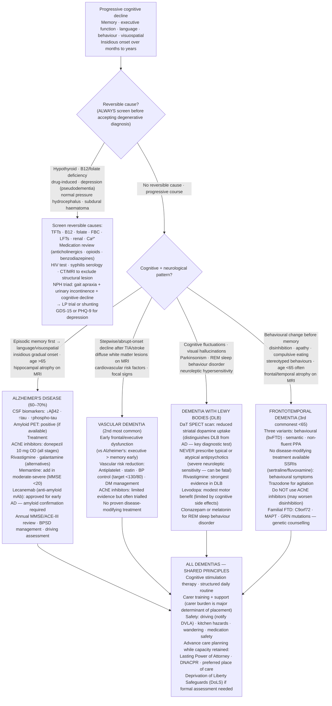

## Overview

Dementia is a syndrome of progressive, acquired cognitive decline affecting multiple domains — memory, language, visuospatial function, executive function, personality — of sufficient severity to impair daily functioning. It is not a normal part of ageing. The global prevalence is approximately 55 million, with Alzheimer's disease accounting for 60–70% of cases. Early and accurate diagnosis matters — not because treatments are highly effective, but because it enables planning, driving cessation, legal and financial decisions, carer support, and identification of treatable mimics.

## Pathophysiology

### Alzheimer's Disease

The most common cause of dementia. Characterised by two pathological hallmarks:

1. **Amyloid plaques** — extracellular deposits of beta-amyloid (Aβ) peptide, cleaved from amyloid precursor protein (APP). The amyloid cascade hypothesis proposes that accumulation of Aβ is the primary initiating event, triggering downstream tau pathology and neuronal loss.

2. **Neurofibrillary tangles** — intracellular aggregates of hyperphosphorylated tau protein, disrupting axonal transport and causing neuronal death.

The hippocampus and entorhinal cortex are earliest and most severely affected, explaining the characteristic early episodic memory impairment. Neurodegeneration then spreads to association cortices, producing language, visuospatial, and executive deficits.

Cholinergic pathways (nucleus basalis of Meynert) are early casualties — the rationale for acetylcholinesterase inhibitors as treatment.

### Vascular Dementia

The second most common cause. Results from cerebrovascular disease — cortical infarcts (multi-infarct dementia), small vessel disease (subcortical/white matter ischaemia), or strategic single infarcts in critical areas (thalamus, hippocampus). Often coexists with Alzheimer's pathology (mixed dementia). Presents with stepwise progression, focal neurological deficits, prominent executive dysfunction early, and preserved memory until later stages.

### Lewy Body Dementia (DLB)

Third most common. Characterised by **alpha-synuclein Lewy body** pathology in cortical neurons. Core features: fluctuating cognition (day-to-day variation in alertness and attention), **recurrent vivid visual hallucinations** (fully formed figures, animals, or people — often non-threatening), and **parkinsonism** (bradykinesia, rigidity, falls). REM sleep behaviour disorder (acting out dreams — often precedes dementia by years) is a prodromal feature.

**Critical prescribing alert**: Lewy body patients have extreme sensitivity to antipsychotics — even small doses of haloperidol or risperidone can cause irreversible parkinsonism, reduced consciousness, and death. If psychosis requires treatment, use quetiapine at very low doses with extreme caution.

### Frontotemporal Dementia (FTD)

Disproportionate atrophy of the frontal and temporal lobes. Presents typically in the 50s–60s — younger than Alzheimer's. Three variants:
- **Behavioural variant (bvFTD)**: Personality change, disinhibition, apathy, loss of empathy, ritualised behaviours, hyperphagia — memory relatively preserved until late
- **Semantic dementia**: Progressive loss of word meaning; fluent but empty speech; bilateral temporal atrophy
- **Progressive non-fluent aphasia**: Halting, effortful speech; grammatical errors; left perisylvian atrophy

FTD is associated with TDP-43 and FUS pathology, and with motor neurone disease (FTD-ALS overlap).

**Comparison of dementia subtypes:**

| Feature | Alzheimer's | Vascular | Lewy Body | FTD |
|---------|------------|---------|-----------|-----|
| Onset | Insidious | Stepwise | Insidious | Insidious |
| Memory | Early, prominent | Variable | Fluctuates | Preserved initially |
| Hallucinations | Rare early | Rare | Visual, prominent | Rare |
| Parkinsonism | Late | Sometimes | Yes (core) | Rare |
| Personality change | Late | Variable | May occur | Early, prominent |
| Neuroimaging | Medial temporal atrophy | White matter changes, infarcts | Posterior cortical atrophy | Frontal/temporal atrophy |
| Age | >65 typically | >65 typically | >65 typically | 50s–60s |

## Clinical Presentation

**The seven warning signs of dementia:**
- Forgetting recently learned information (episodic memory — earliest in AD)
- Difficulty planning or problem-solving
- Confusion with time or place
- Difficulty with familiar tasks
- New problems with language
- Misplacing objects and inability to retrace steps
- Changes in personality or mood

Distinguish dementia from:
- **Normal ageing**: Slower processing speed, occasional name-tip-of-tongue experiences, but no functional decline
- **Mild cognitive impairment (MCI)**: Objective cognitive decline without functional impairment; 10–15% per year conversion to dementia
- **Delirium**: Acute, fluctuating confusion with impaired attention — always look for an acute cause. Dementia is a major risk factor for delirium.
- **Depression**: "Pseudodementia" — cognitive impairment from depression, potentially reversible with treatment. Key clue: patient emphasises their deficits ("I can't remember anything"), whereas dementia patients minimise or lack insight.

## Diagnosis

**Cognitive testing:**
- MMSE (Mini-Mental State Examination) — 30-point scale; screening tool, not diagnostic; influenced by education and language
- MoCA (Montreal Cognitive Assessment) — 30-point scale; more sensitive for MCI and executive dysfunction; preferred in clinical practice
- GPCOG, 6-CIT — validated GP screening tools

**Bloods to exclude treatable causes** (mandatory in every patient presenting with cognitive decline):
- TFTs — hypothyroidism causes reversible cognitive impairment
- B12 and folate — deficiency causes cognitive impairment, reversible if treated early
- FBC, U&E, LFTs, glucose, calcium — systemic disease, renal failure, hepatic encephalopathy
- Syphilis serology (in appropriate patients)
- HIV in younger patients
- Cortisol / Addison's disease if suspected

**Neuroimaging:**
- MRI brain preferred over CT — greater sensitivity for structural causes, white matter changes, hippocampal atrophy patterns, vascular disease
- FDG-PET — shows characteristic hypometabolism patterns by subtype; used in diagnostic uncertainty
- Amyloid PET — directly visualises Aβ deposition; expensive; primarily in research and specialist settings
- DAT scan (dopamine transporter SPECT) — reduced in DLB and Parkinson's dementia; normal in Alzheimer's. Helps distinguish DLB from AD when hallucinations or parkinsonism are present.

**CSF biomarkers** (in younger patients or diagnostic uncertainty):
- Reduced Aβ42, elevated tau and phospho-tau — highly specific for Alzheimer's pathology
- Alpha-synuclein — DLB

## Management

### Non-pharmacological (cornerstone)

- Cognitive stimulation therapy — structured group activities; improves cognition and quality of life
- Structured activities, environmental modification (labels, clocks, calendars)
- Carer education and support — carer burnout is a major cause of care home admission
- Advanced care planning — mental capacity assessment, lasting power of attorney, advance directives
- Driving cessation — legally required; DVLA notification
- Safeguarding from financial and physical abuse

### Pharmacological — Alzheimer's Disease and DLB

**Acetylcholinesterase inhibitors (AChEI):** Donepezil (first-line), rivastigmine, galantamine. Inhibit breakdown of acetylcholine in synaptic cleft, compensating for cholinergic neuron loss. Modest but consistent benefit in cognition, function, and behaviour in mild-moderate AD and DLB. Rivastigmine is preferred in DLB. Side effects: GI (nausea, diarrhoea — take at night), bradycardia, syncope.

**Memantine:** NMDA receptor antagonist; blocks excessive glutamate excitotoxicity. Used in moderate-severe AD or if AChEI is not tolerated. Can be combined with AChEI in moderate-severe disease. Modest but real benefit in function and global outcomes.

**Disease-modifying therapies:** Lecanemab and donanemab (anti-amyloid monoclonal antibodies) have demonstrated slowing of clinical decline in early AD in recent trials and have received FDA approval. Not yet widely available on NHS. Associated with amyloid-related imaging abnormalities (ARIA) — cerebral oedema and microhaemorrhage.

**Vascular dementia:** No specific pharmacological treatment. Optimise vascular risk factors aggressively — BP control, antiplatelet therapy, statin, diabetes management, smoking cessation.

**Behavioural and psychological symptoms of dementia (BPSD):** Agitation, aggression, psychosis, wandering. Non-pharmacological approaches first. If pharmacological treatment is needed: low-dose risperidone (6–12 weeks, for psychosis/aggression in AD — avoid in DLB). NEVER use first-generation antipsychotics (haloperidol) in DLB.

## Complications

- Falls and fractures — particularly in DLB and vascular dementia
- Aspiration pneumonia — dysphagia in advanced dementia; leading cause of death
- Malnutrition and dehydration
- Pressure sores
- Urinary incontinence and infections
- Carer burnout — serious psychological morbidity in family carers
- Abuse and financial exploitation

## Clinical Insight

The earliest and most sensitive cognitive domain to screen is **episodic memory** — specifically, the ability to learn and retain new information. Ask the patient to recall three words after a 5-minute delay. Inability to recall any of three words after delay, despite prompting, is the hallmark of hippocampal-dependent memory loss in Alzheimer's disease.

Lewy body dementia is regularly diagnosed as Alzheimer's, and the consequence can be fatal. When an elderly patient with dementia is admitted with worsening confusion or psychosis and given haloperidol, the possibility of undiagnosed DLB should always be considered. The core diagnostic triad — fluctuating cognition, visual hallucinations, parkinsonism — is highly specific. A DAT scan confirms it.

Depression and dementia are frequently confused and frequently coexist. In a patient who is "not coping" cognitively and is clearly low in mood, always treat the depression first — with an SSRI, for 6 months — before concluding the cognitive impairment is degenerative. True Alzheimer's does not reverse with antidepressants; pseudodementia often does.
