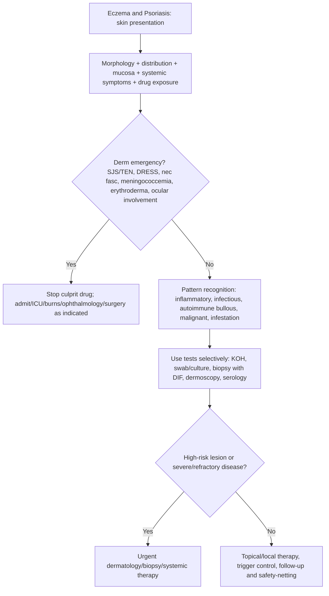

## Overview

Eczema (atopic dermatitis) and psoriasis are the two most common chronic inflammatory skin diseases. Both are immune-mediated, both are genetically influenced, and both significantly impair quality of life — but their immunopathology, clinical patterns, triggers, and treatments differ substantially. Distinguishing them clinically is usually straightforward; managing them effectively requires an understanding of their pathophysiology.

---

## Atopic Eczema (Atopic Dermatitis)

### Pathophysiology

Atopic eczema is a chronic, relapsing inflammatory skin disease driven by a disrupted skin barrier combined with a dysregulated type 2 immune response.

The primary defect is in the **skin barrier** — particularly loss-of-function mutations in the **filaggrin gene (FLG)**. Filaggrin is a structural protein that cross-links keratin filaments and contributes to the formation of the stratum corneum "brick-and-mortar" structure. FLG mutations are found in ~30% of Europeans and are the strongest genetic risk factor for atopic eczema. Barrier disruption allows allergen penetration and transepidermal water loss, triggering immune sensitisation.

The immune response in eczema is **Th2-dominated**: IL-4 and IL-13 (from Th2 cells and ILC2s) drive IgE production, mast cell activation, and eosinophil recruitment. IL-13 also directly suppresses filaggrin expression, creating a vicious cycle. IL-31 is the principal itch cytokine — critically targeted by newer biologics.

The **atopic march** describes the typical progression: eczema in infancy → sensitisation and food allergy → allergic rhinitis → asthma in childhood. Each condition reflects allergen sensitisation through a disrupted barrier, then airway exposure.

### Clinical Presentation

**Distribution by age is diagnostic:**

| Age Group | Distribution |
|-----------|-------------|
| Infants (<2 years) | Face (cheeks), scalp, extensor surfaces |
| Children (2–12 years) | Flexural surfaces — antecubital fossae, popliteal fossae, wrists, neck |
| Adults | Flexures, hands, face, and upper chest; may become widespread |

**Features:**
- Intense pruritus — the hallmark; "the itch that rashes, not the rash that itches"
- Erythema, xerosis (dry skin), lichenification (skin thickening from chronic rubbing — linear skin markings)
- Weeping, crusting in acute flares
- Excoriations from scratching
- Dennie-Morgan lines (infraorbital folds), allergic shiners, keratosis pilaris

**Triggers:** Soap and detergents (most common), wool clothing, heat and sweating, stress, infection (especially *S. aureus* — colonises eczematous skin in >90%, promoting flares), food allergens (in young children — mainly egg, milk, wheat, peanut), aeroallergens (house dust mite, pet dander).

**Diagnosis:** Clinical — no specific test required. Based on the UK Working Party criteria: itchy skin in the last 12 months + ≥3 of: onset <2 years, flexural involvement, history of asthma/hay fever, dry skin, visible flexural eczema.

IgE-based allergy testing (RAST or skin prick testing) to identify specific triggers in refractory or food-triggered eczema. Patch testing to exclude contact dermatitis.

### Management

**The stepwise approach (NICE NG190):**

| Step | Severity | Treatment |
|------|---------|----------|
| 1 | Mild | Emollients (liberally, frequently — at least twice daily). Avoid soap. |
| 2 | Mild-moderate flares | Add mild/moderate topical corticosteroid (hydrocortisone 1% for face/flexures; betamethasone valerate for body). Short courses. |
| 3 | Moderate | Moderate-potent topical corticosteroids. Consider topical calcineurin inhibitors (tacrolimus, pimecrolimus — steroid-sparing, especially for face). |
| 4 | Severe | Potent topical corticosteroids (clobetasol). Wet wraps. Phototherapy (NB-UVB). |
| 5 | Refractory severe | Systemic immunosuppression: ciclosporin (fast onset), methotrexate, azathioprine. |
| 6 | Biologic | **Dupilumab** (anti-IL-4Rα — blocks IL-4 and IL-13 simultaneously). NICE-approved for severe eczema failing systemics. Transformative efficacy. |

**Emollients** are the foundation of all treatment — not an add-on. They restore the barrier, reduce transepidermal water loss, and reduce the frequency and severity of flares when used consistently. Apply within 3 minutes of bathing (trap moisture). Prescribe generously (500g per week).

**Topical corticosteroid potency:**

| Potency | Example | Use |
|---------|---------|-----|
| Mild | Hydrocortisone 1% | Face, flexures, infants |
| Moderate | Clobetasone butyrate (Eumovate) | Body in children |
| Potent | Betamethasone valerate (Betnovate) | Adult body |
| Very potent | Clobetasol propionate (Dermovate) | Lichenified plaques, palms/soles |

Finger-tip unit (FTU) — the amount squeezed from the fingertip to the first crease — is 0.5g and treats approximately 2 adult hand areas.

---

## Psoriasis

### Pathophysiology

Psoriasis is a chronic, immune-mediated inflammatory disease characterised by accelerated keratinocyte proliferation and maturation. The normal epidermal turnover time is 28 days; in psoriasis it is 3–5 days.

The central immunological event is **dendritic cell activation** → presentation of self-antigens to T-cells in regional lymph nodes → primed **Th17 cells** (predominant in psoriasis, unlike Th2 in eczema) home to skin → IL-17 and IL-22 drive keratinocyte proliferation. TNF-α amplifies the inflammatory cascade. This is the basis for biologic targeting: anti-TNF (adalimumab, infliximab), anti-IL-12/23 (ustekinumab), anti-IL-17 (secukinumab, ixekizumab), and anti-IL-23 (risankizumab, guselkumab).

**Genetics**: Strong HLA-Cw6 association (~60% of early-onset plaque psoriasis). ~30% risk if one parent affected; ~65% if both.

### Clinical Presentation

**Plaque psoriasis** (most common, ~85%): Well-demarcated, erythematous plaques with adherent silvery-white (micaceous) scale. Auspitz sign — removal of scale reveals pin-point bleeding from dilated dermal capillaries (pathognomonic). Distribution: extensor surfaces (elbows, knees), scalp, sacrum, umbilicus. Unlike eczema: extensor rather than flexural, little itch initially.

**Variants:**

| Type | Features | Notes |
|------|---------|-------|
| Guttate | Small (raindrop-sized) plaques scattered over trunk | Often triggered by streptococcal URTI; young adults; may resolve spontaneously |
| Inverse/flexural | Bright red, non-scaly plaques in skin folds (axillae, groin, submammary) | Confused with fungal infection; confirm with skin scrapings |
| Erythrodermic | Generalised erythema >90% BSA | Medical emergency — thermoregulatory failure, high-output cardiac failure, hypothermia; admit |
| Pustular (generalised) | Sterile pustules on erythematous base | Medical emergency — fever, systemic illness; can be triggered by abrupt steroid withdrawal |
| Palmoplantar | Pustules or plaques on palms and soles | Painful; disabling |

**Nail changes** (~50%): Pitting (most common), onycholysis (separation of nail from bed), subungual hyperkeratosis, oil drop sign (salmon-coloured patch under nail plate).

**Psoriatic arthritis** (~20–30% of psoriasis patients): Five patterns — distal interphalangeal (DIP) joint disease (classic — with nail changes), asymmetric oligoarthritis, symmetric polyarthritis (RA-like but seronegative), axial arthritis (sacroiliitis), and arthritis mutilans (telescoping fingers — rare, destructive). Screen all psoriasis patients for joint symptoms.

**Triggers**: Stress (most common), streptococcal infection (guttate), drugs (lithium, beta-blockers, NSAIDs, antimalarials, ACEi), alcohol, skin trauma (Koebner phenomenon — new lesions at sites of trauma), withdrawal of systemic steroids.

**The Koebner phenomenon** (isomorphic response): New psoriatic lesions developing at sites of cutaneous trauma (scratches, surgical incisions, burns). Also seen in lichen planus, vitiligo, and warts.

### Diagnosis

Clinical — characteristic morphology and distribution. Skin biopsy if in doubt: elongated rete ridges, parakeratosis (nuclei retained in stratum corneum — failed differentiation), neutrophil microabscesses (Munro's microabscesses) in stratum corneum, dilated blood vessels in dermal papillae.

Screen for psoriatic arthritis in all patients.

### Management

**Topical (mild-moderate):**
- **Vitamin D analogues** (calcipotriol, calcitriol) — first-line for body plaques. Inhibit keratinocyte proliferation, promote differentiation. Avoid on face and flexures (irritant). Use once or twice daily.
- **Topical corticosteroids** — effective for scalp and body; useful in combination with calcipotriol (Dovobet — calcipotriol + betamethasone dipropionate — most effective topical). Avoid continuous use (tachyphylaxis, skin atrophy).
- **Coal tar** — old but effective; anti-proliferative; useful for scalp (shampoo form).

**Phototherapy (moderate-severe):**
- **Narrowband UVB (NB-UVB)** — first-line phototherapy. 3× weekly. Effective for plaque, guttate, and palmoplantar psoriasis.
- **PUVA** (psoralen + UVA) — more effective but higher carcinogenicity risk; largely replaced by NB-UVB.

**Systemic therapy (moderate-severe — DLQI >10, PASI >10):**

| Drug | Mechanism | Key Monitoring |
|------|-----------|---------------|
| Methotrexate | Folate antagonist → anti-inflammatory | FBC, LFTs weekly initially; liver biopsy or Fibroscan after cumulative dose; supplement folic acid |
| Ciclosporin | Calcineurin inhibitor | BP, renal function monthly; max 2 years continuous use |
| Acitretin | Vitamin A analogue (retinoid) | Teratogenic — avoid in women of childbearing age for 3 years post-treatment; LFTs, lipids |

**Biologics (severe or failing systemics):**
- **Anti-TNF**: Adalimumab, etanercept, infliximab — screen for TB and hepatitis B before starting
- **Anti-IL-17**: Secukinumab, ixekizumab — most effective for plaque psoriasis; avoid in IBD
- **Anti-IL-23**: Risankizumab, guselkumab — favourable safety profile; high efficacy
- **Anti-IL-12/23**: Ustekinumab — less frequent dosing (every 12 weeks maintenance)

PASI (Psoriasis Area and Severity Index) and DLQI (Dermatology Life Quality Index) guide treatment escalation. NICE criteria for biologics: PASI ≥10 + DLQI >10 after failure of ≥2 standard systemic treatments.

## Complications

**Eczema**: Secondary bacterial infection (*S. aureus* — impetigo/eczema herpeticum if HSV superinfection — medical emergency: IV aciclovir); eczema herpeticum; erythroderma; psychological morbidity; sleep disruption.

**Psoriasis**: Psoriatic arthritis (up to 30% — irreversible joint damage if untreated); erythroderma (emergency); generalised pustular psoriasis (emergency); cardiovascular risk (psoriasis is an independent CV risk factor — treat like diabetes for CV risk management); depression.

## Clinical Insight

Eczema herpeticum is an emergency and is commonly missed. It presents as a sudden widespread worsening of eczema with punched-out monomorphic erosions, often with fever. It is HSV superinfection on atopic skin, and without IV aciclovir, it can cause systemic dissemination and death. Any atopic patient with an acute widespread flare and erosive lesions must prompt consideration of this diagnosis — swab for HSV PCR and treat empirically while awaiting results.

In psoriasis, never withdraw systemic corticosteroids abruptly. This is one of the most reliable ways to precipitate generalised pustular psoriasis — a potentially life-threatening emergency. Systemic corticosteroids are rarely indicated in psoriasis precisely because of this risk. When a psoriasis patient is admitted for any reason and has been on steroids, taper carefully.

Psoriatic arthritis precedes the skin rash in approximately 10–15% of patients. A young patient with seronegative inflammatory arthritis, particularly involving DIP joints, should always have their skin and nails examined carefully and be asked specifically about psoriasis in family members.
