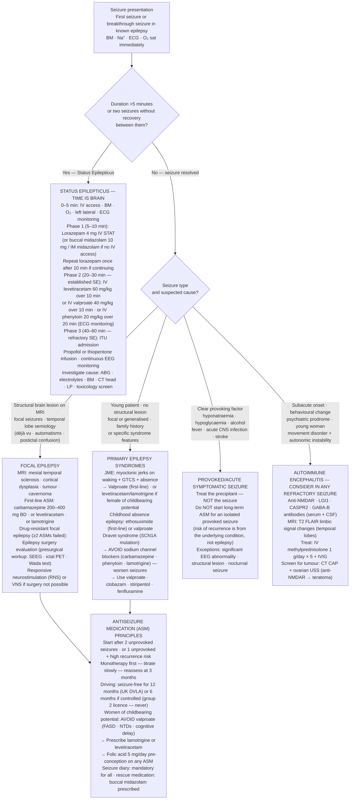

## Overview

A seizure is a transient episode of abnormal, excessive, or synchronous neuronal activity. Epilepsy is defined as a tendency to have recurrent unprovoked seizures — operationally, this means two unprovoked seizures more than 24 hours apart, or one unprovoked seizure with a high probability of recurrence (>60% over 10 years), or a diagnosis of an epilepsy syndrome. The distinction between a provoked (acute symptomatic) seizure and an unprovoked seizure is fundamental — it determines whether long-term antiseizure medication (ASM) is indicated.

## Pathophysiology

Seizures arise from an imbalance between excitatory (glutamatergic) and inhibitory (GABAergic) neuronal activity, producing abnormal hypersynchronous discharges in a network of neurons. The character of the seizure depends on the location of onset and the pattern of propagation.

**Focal seizures** arise from a discrete cortical area — the seizure semiology reflects the function of that area (e.g., focal motor seizure from the motor cortex, focal sensory aura from the sensory cortex, déjà vu or epigastric rising sensation from the temporal lobe). They may or may not impair awareness. They can evolve to **bilateral tonic-clonic seizures** (formerly called secondary generalisation).

**Generalised seizures** involve both hemispheres from onset. The most clinically important are:
- **Tonic-clonic** (formerly "grand mal"): tonic phase (rigidity, cry, apnoea, cyanosis) → clonic phase (rhythmic jerking) → postictal phase (confusion, somnolence, Todd's paresis)
- **Absence** (formerly "petit mal"): brief (5–20 seconds) loss of awareness with staring; abrupt onset and offset; no postictal confusion. Child freezes mid-sentence, then resumes. Triggered by hyperventilation.
- **Myoclonic**: sudden brief involuntary muscle jerks; typically in the morning after waking; associated with juvenile myoclonic epilepsy (JME)
- **Atonic** (drop attacks): sudden loss of muscle tone → fall; associated with Lennox-Gastaut syndrome

**Common epilepsy syndromes:**

| Syndrome | Age | Key Features | EEG |
|---------|-----|-------------|-----|
| Childhood absence epilepsy | 4–12 | Classic absences; normal development; usually resolves | 3 Hz spike-wave |
| Juvenile myoclonic epilepsy (JME) | Adolescence | Morning myoclonus, tonic-clonic on waking, absences; lifelong | Polyspike-wave |
| Temporal lobe epilepsy | Any | Most common focal epilepsy; aura (déjà vu, rising sensation); automatisms | Temporal sharp waves |
| Dravet syndrome | Infancy | Severe; SCN1A mutation; febrile seizures; treatment-resistant | — |

## Clinical Presentation

**Seizure semiology** — the pattern of symptoms during the event — is the most important diagnostic information, and it comes from witnesses. Always obtain a detailed witness account.

**Features favouring epileptic seizure:**
- Aura preceding the event (focal onset)
- Tonic-clonic sequence with clear phases
- Tongue biting (lateral tongue — pathognomonic of tonic-clonic seizure; tip biting occurs in syncope)
- Incontinence (supportive but not specific)
- Post-ictal confusion and somnolence lasting minutes to hours
- Post-ictal focal weakness (Todd's paresis) — unilateral weakness lasting minutes to hours after the seizure, indicating focal onset

**Features favouring syncope (vasovagal / cardiogenic):**
- Trigger (prolonged standing, heat, pain, fear, micturition, cough)
- Prodrome (tunnel vision, nausea, diaphoresis, fading hearing)
- Brief (seconds) convulsive jerking in syncope is common and does not indicate epilepsy
- Rapid (<30 seconds) full recovery without confusion
- Pallor before and flushing after the event

**Features favouring non-epileptic attack disorder (NEAD/PNES):**
- Prolonged duration (>5 minutes) without pharmacological intervention
- Eyes closed throughout (eyes open in tonic-clonic seizure)
- Gradual rather than abrupt onset and offset
- Pelvic thrusting, side-to-side head movement, opisthotonus
- Preserved awareness during apparent bilateral convulsions
- Normal serum prolactin (rises transiently after tonic-clonic seizures)

**Status epilepticus**: Continuous seizure activity lasting ≥5 minutes, or two or more seizures without full recovery of consciousness between them. A neurological emergency with 10–20% mortality — escalating treatment must begin immediately.

## Diagnosis

**No single test diagnoses epilepsy.** The diagnosis is clinical — based on a detailed history, witness account, and seizure semiology. Investigations support the diagnosis, identify aetiology, and guide treatment.

**Immediate investigations after first seizure:**
- Blood glucose, Na+, Ca2+, Mg2+, FBC, U&E, LFTs, CRP — exclude metabolic and infective causes
- ECG — QTc prolongation, Brugada pattern, structural heart disease causing cardiogenic syncope
- CT head — if focal deficit, raised ICP signs, immunocompromised, anticoagulated, or first seizure in an adult (to exclude structural lesion)

**EEG (electroencephalogram):**
- Not a "seizure detector" — a normal EEG does not exclude epilepsy (~50% of people with epilepsy have a normal interictal EEG on first recording)
- Interictal epileptiform discharges (IEDs) support the diagnosis and help classify syndrome
- Sleep-deprived EEG and prolonged EEG increase sensitivity
- Video-EEG telemetry (recording seizure simultaneously with EEG) is the gold standard for classification and for diagnosing NEAD

**MRI brain**: Preferred over CT for epilepsy investigation. Identifies structural causes: hippocampal sclerosis (most common cause of temporal lobe epilepsy), cortical dysplasia, tumours, vascular malformations, old infarcts. Use epilepsy-specific MRI protocol.

**Serum prolactin**: Rises 10–20 minutes after a generalised tonic-clonic seizure and returns to normal within 1 hour. Can help distinguish from NEAD but not from syncope (also raises prolactin). Specificity is moderate — do not rely on it in isolation.

**Genetic testing**: Increasingly important. JME, Dravet syndrome (SCN1A), and many other genetic epilepsies can be confirmed molecularly, guiding drug selection (e.g., sodium channel blockers worsen Dravet syndrome).

## Management

### First Seizure

A first unprovoked seizure does not automatically mandate antiseizure medication. The decision depends on the risk of recurrence:
- High recurrence risk (structural brain lesion, significant EEG abnormality, neurological deficit, nocturnal seizure, focal onset) → discuss ASM
- Low recurrence risk (normal MRI, normal EEG, no provoking factors) → withhold ASM, advise on driving and safety

**Provoked (acute symptomatic) seizures** (hypoglycaemia, hyponatraemia, encephalitis, acute stroke) — treat the underlying cause; long-term ASM is not indicated unless seizures persist after the acute illness resolves.

### Chronic Epilepsy — Antiseizure Medications

Drug choice is guided by seizure type, syndrome, sex, comorbidities, and drug interactions. No single drug suits all.

| Seizure Type | First-line Agents | Notes |
|-------------|-----------------|-------|
| Focal (with or without bilateral spread) | Lamotrigine, levetiracetam, lacosamide | Carbamazepine also first-line but more interactions |
| Generalised tonic-clonic | Valproate (most effective), lamotrigine, levetiracetam | Valproate contraindicated in women of childbearing age |
| Absence | Ethosuximide (first-line), valproate, lamotrigine | Carbamazepine and phenytoin worsen absences |
| Myoclonic (JME) | Valproate, levetiracetam, lamotrigine | Lifelong treatment usually needed; carbamazepine worsens myoclonus |

**Sodium valproate** is the most broadly effective antiseizure drug but is **absolutely contraindicated in pregnancy** without specialist review — it carries a 10% risk of congenital malformations and a 30–40% risk of neurodevelopmental harm in children exposed in utero. The MHRA Valproate Pregnancy Prevention Programme (PPP) requires annual review, two forms of contraception, and a risk acknowledgement form for all women of childbearing potential. It must not be initiated in women of childbearing potential without this process.

**Lamotrigine** — broad-spectrum, generally well-tolerated, safe in pregnancy (lower teratogenicity risk). Titrate slowly to avoid Stevens-Johnson syndrome (rash).

**Levetiracetam** — broad-spectrum, no drug interactions, renally cleared. Behavioural side effects (irritability, aggression) limit tolerability in some.

### Status Epilepticus — Emergency Protocol

| Time | Step | Drug |
|------|------|------|
| 0–5 min | Resuscitation: ABC, IV access, glucose, O₂ | Glucose IV if hypoglycaemic |
| 5–10 min | First-line benzodiazepine | IV lorazepam 4 mg (or IM midazolam 10 mg buccal/intranasal if no IV access) |
| 10–15 min | Repeat benzodiazepine if seizure continues | IV lorazepam 4 mg (second dose) |
| 20–30 min | Second-line antiseizure drug | IV levetiracetam 60 mg/kg (max 4.5 g) OR IV valproate 40 mg/kg OR IV phenytoin 20 mg/kg |
| >30 min | Refractory status — anaesthetic | Refer to ICU; propofol, thiopental, or midazolam infusion; EEG monitoring |

### Driving and Lifestyle

- **Driving**: In the UK, a first unprovoked seizure prohibits driving for **12 months**. A second seizure or established epilepsy: seizure-free for **12 months** before restarting (Group 1 licence). DVLA must be notified — the patient's responsibility.
- Advise on seizure safety: shower rather than bathe, supervision around water, cooking safety (microwave preferred), heights, ladders
- Alcohol — lowers seizure threshold; advise moderation
- Sleep deprivation — potent seizure trigger, particularly in JME

## Complications

- Status epilepticus — 10–20% mortality; neuronal injury from prolonged seizure activity even without hypoxia
- SUDEP (sudden unexpected death in epilepsy) — 1:1000 per year in uncontrolled epilepsy; mechanism unclear; associated with nocturnal seizures, prone position, lack of supervision
- Aspiration pneumonia — postictal aspiration
- Fractures and head injury from falls
- Teratogenicity from antiseizure medications — particularly valproate
- Psychiatric comorbidity — depression and anxiety are extremely common in epilepsy (often untreated)

## Clinical Insight

Lateral tongue biting is pathognomonic of a generalised tonic-clonic seizure — it occurs because the jaw clamps during the tonic phase and the tongue is displaced laterally between the teeth. Tip-of-tongue biting occurs in syncope from falling and biting the floor. This one sign, elicited from the history, often decides the diagnosis.

Valproate and women of childbearing age is one of the highest-profile drug safety issues in neurology. Every woman of childbearing age on valproate should be on the PPP, using effective contraception, and reviewed annually. If a woman on valproate becomes pregnant unexpectedly, do not stop it abruptly (seizure risk), but refer urgently to a specialist — folic acid 5 mg daily, detailed foetal anomaly scanning, and a joint decision about continued therapy.

The postictal state tells you as much as the seizure itself. A patient who was witnessed to "black out" and shakes briefly is often labelled as having a seizure when they had a syncopal episode with convulsive movements. A patient who recovers fully in 30 seconds had a syncope. A patient who is confused and somnolent for 20–30 minutes had a seizure. The postictal period is the single most discriminating feature.
