## Overview

Fluid and electrolyte disorders are among the most common and clinically significant problems encountered in hospital medicine. Disorders of sodium and potassium are particularly important — sodium dysregulation governs water distribution and cell volume across the entire body, while potassium abnormalities carry direct, life-threatening cardiac consequences. A systematic, physiological approach — always asking why the kidney is failing to correct the abnormality — avoids dangerous empirical treatment.

---

## Sodium Disorders

### Hyponatraemia (Na+ <135 mmol/L)

Hyponatraemia almost always reflects excess water relative to sodium — not sodium deficiency per se. The kidney is the primary regulator of water excretion via ADH (antidiuretic hormone / vasopressin), and most hyponatraemia is caused by inappropriate ADH action or excessive water intake that overwhelms normal suppression.

**Stepwise assessment:**

**Step 1 — Serum osmolality:** Is the hyponatraemia truly hypotonic (osmolality <280)?
- Isotonic (280–295): pseudohyponatraemia from severe hyperlipidaemia or hyperproteinaemia
- Hypertonic (>295): hyperglycaemia or mannitol (water drawn into plasma, diluting sodium)
- Hypotonic (<280): true hyponatraemia — proceed to Step 2

**Step 2 — Volume status:** Is the patient hypovolaemic, euvolaemic, or hypervolaemic?

| Volume Status | Urine Na+ | Causes |
|--------------|---------|--------|
| Hypovolaemic, urine Na+ <20 | Salt lost via gut/skin | Vomiting, diarrhoea, burns, third spacing |
| Hypovolaemic, urine Na+ >20 | Salt lost via kidney | Diuretics, Addison's disease, cerebral salt wasting |
| Euvolaemic | Urine Na+ >20 | SIADH (most common), hypothyroidism, glucocorticoid deficiency |
| Hypervolaemic, urine Na+ <20 | Sodium and water retained; more water than salt | Heart failure, cirrhosis, nephrotic syndrome |
| Hypervolaemic, urine Na+ >20 | Kidney fails to excrete water | CKD, AKI |

**SIADH (Syndrome of Inappropriate ADH Secretion):**

The most common cause of euvolaemic hypotonic hyponatraemia. Diagnostic criteria: hyponatraemia + low serum osmolality + urine osmolality >100 mOsm/kg (inappropriately concentrated) + urine Na+ >20 mmol/L + euvolaemia + no adrenal/thyroid insufficiency.

Causes of SIADH: CNS disorders (meningitis, encephalitis, stroke, head injury, SAH), pulmonary disease (pneumonia, TB, lung cancer), malignancy (small cell lung cancer — paraneoplastic), drugs (SSRIs, thiazides, carbamazepine, opiates, PPIs, cyclophosphamide), post-operative state.

**Symptoms of hyponatraemia** correlate with acuity and severity:
- Mild (125–134): nausea, headache, malaise
- Moderate (120–124): confusion, lethargy
- Severe (<120 or acute): seizures, respiratory arrest, brain herniation, death

**Treatment — the critical principle: correct sodium at a rate that avoids osmotic demyelination syndrome (ODS)**

ODS (central pontine myelinolysis) occurs when sodium is corrected too rapidly in chronic hyponatraemia. Chronic hyponatraemia (>48 hours) allows the brain to adapt by exporting organic osmolytes. Rapid correction reverses this slowly — brain cells shrink, causing demyelination of the pons and basal ganglia. Clinical features: dysarthria, dysphagia, quadriplegia, locked-in syndrome. These may appear days after "successful" correction.

**Safe correction rate:** Maximum 10 mmol/L per 24 hours (some guidelines say 8 mmol/L per 24 hours in high-risk patients: alcohol use, malnutrition, hypokalaemia, liver disease).

**Exception:** Acute symptomatic hyponatraemia (onset <48 hours, seizures, obtundation) — rapid correction is safe and necessary. Give 150 mL of 3% hypertonic saline over 20 minutes, repeat once or twice if seizing. Target: raise Na+ by 5 mmol/L in the first hour to stop seizures, then slow down.

**Treatment by cause:**
- SIADH: fluid restriction (750–1000 mL/day) ± demeclocycline ± tolvaptan (vasopressin receptor antagonist) for severe/refractory
- Hypovolaemic: 0.9% NaCl (restores volume, suppresses ADH)
- Hypervolaemic: treat underlying cause (diuretics for HF, cirrhosis)

### Hypernatraemia (Na+ >145 mmol/L)

Hypernatraemia indicates water deficit relative to sodium. It is almost always due to inadequate water intake (impaired thirst or access — elderly, unconscious) or excessive water losses.

**Causes:**
- Inadequate intake: inability to drink (ICU, dementia, intubation), impaired thirst
- Extrarenal water loss: diarrhoea, vomiting, fever, burns, excessive sweating
- Renal water loss: diabetes insipidus (DI)
- Hypertonic sodium gain: hypertonic saline, excessive NaHCO₃

**Diabetes insipidus:** ADH deficiency (central DI) or renal resistance to ADH (nephrogenic DI) → inability to concentrate urine → large volumes of dilute urine (polyuria >3 L/day) with hypernatraemia. Diagnosed by water deprivation test ± desmopressin challenge.

**Treatment:** Free water replacement. Oral water if possible. IV 5% dextrose or 0.45% saline. Correct at no more than 10–12 mmol/L per day to avoid cerebral oedema (rapid correction causes brain swelling — the opposite of ODS but equally dangerous).

---

## Potassium Disorders

### Hypokalaemia (K+ <3.5 mmol/L)

**Consequences:** Hyperpolarises the cell membrane, increasing the threshold for cardiac excitation. Mild hypokalaemia causes fatigue and muscle weakness; severe hypokalaemia causes life-threatening arrhythmias and rhabdomyolysis.

**ECG changes (in order of severity):** Flattening of T waves → prominent U waves (positive deflection after T wave, best in V2–V3) → prolonged PR → ST depression → widened QRS → VF.

**Causes:**

| Setting | Mechanism | Examples |
|---------|-----------|---------|
| Transcellular shift | K+ moves into cells | Insulin, catecholamines, alkalosis, beta-agonists, hypokalaemic periodic paralysis |
| GI loss | K+ rich intestinal fluid lost | Vomiting (metabolic alkalosis → K+ shifts into cells), diarrhoea, fistulae, laxative abuse |
| Renal loss | Aldosterone drives K+ excretion | Loop and thiazide diuretics (most common), Conn's syndrome, Cushing's, Bartter/Gitelman, hypomagnesaemia, RTA type 1/2, amphotericin |
| Inadequate intake | Rare in isolation | Eating disorders, prolonged fasting |

**Hypomagnesaemia** perpetuates hypokalaemia by increasing renal K+ wasting. Any hypokalaemia that does not correct with potassium replacement should prompt measurement of serum magnesium.

**Treatment:**
- Mild (3.0–3.5): oral potassium (KCl sachets)
- Moderate (2.5–3.0): oral or IV potassium
- Severe (<2.5 or symptomatic/ECG changes): IV KCl. Maximum safe IV rate is 20 mmol/hour via central line (10 mmol/hour peripherally). Never give as bolus — cardiac arrest.
- Always replace magnesium concurrently if deficient

### Hyperkalaemia (K+ >5.5 mmol/L)

The most immediately dangerous electrolyte disorder — the cardiac membrane becomes less stable, predisposing to fatal arrhythmias.

**ECG changes (in order of severity):** Peaked (tented) T waves → PR prolongation → flattened P waves → widened QRS → sine wave pattern → VF/asystole.

**Causes:**

| Mechanism | Examples |
|-----------|---------|
| Increased intake or release | Excessive IV K+, blood transfusion, rhabdomyolysis, haemolysis, tumour lysis syndrome |
| Transcellular shift out of cells | Acidosis, insulin deficiency (DKA), beta-blockers, digoxin toxicity, succinylcholine |
| Reduced renal excretion | AKI/CKD, ACEi/ARB, spironolactone, NSAIDs, Addison's disease, type 4 RTA |
| Pseudohyperkalaemia | Haemolysis of sample, prolonged tourniquet, extreme thrombocytosis/leucocytosis |

**Emergency treatment (K+ ≥6.5 or ECG changes):**

| Step | Drug | Mechanism | Onset |
|------|------|-----------|-------|
| 1 | IV calcium gluconate 10% 10–20 mL | Membrane stabilisation — does NOT lower K+ | Seconds |
| 2 | Insulin 10 units + 50% dextrose 50 mL IV | Shifts K+ into cells | 15–30 min |
| 3 | Nebulised salbutamol 10–20 mg | Additional intracellular shift | 15–30 min |
| 4 | Patiromer or SZC (oral) | Removes K+ from gut | Hours |
| 5 | Dialysis | Definitive removal | Immediate |

Sodium bicarbonate is no longer routinely recommended for isolated hyperkalaemia — it has modest and unpredictable effect in non-acidotic patients.

---

## Intravenous Fluid Therapy Principles

### Crystalloids

**0.9% Normal saline:** 154 mmol/L Na+ and Cl−. No potassium. Supraphysiological chloride → hyperchloraemic metabolic acidosis with large volumes. Still preferred for hypovolaemia in patients with hyponatraemia (raises sodium) or hypochloraemic alkalosis.

**Hartmann's (compound sodium lactate):** Balanced crystalloid — Na+ 131, K+ 5, Ca2+ 2, HCO₃ equivalent 29, Cl− 111 mmol/L. Preferred for resuscitation (less acidosis, closer to plasma composition). Do not use in hyperkalaemia or significant hypernatraemia.

**5% Dextrose:** Effectively free water — glucose is metabolised rapidly. Used for hypernatraemia and hypoglycaemia. Not a resuscitation fluid (distributes throughout body water, not just intravascular space).

### Assessing Fluid Status

Clinical assessment of volume status before prescribing IV fluids:
- Euvolaemic patient with adequate oral intake: no IV fluids needed
- Signs of hypovolaemia (tachycardia, hypotension, oliguria, dry mucous membranes): IV crystalloid resuscitation bolus
- Signs of hypervolaemia (raised JVP, pulmonary oedema, peripheral oedema): restrict IV fluids, consider diuretics

```mermaid
flowchart TD
    A["Electrolyte abnormality or fluid status disorder\nSerum Na · K · Mg · Ca · phosphate · eGFR · blood gas\nECG if K⁺ abnormal"] --> KPLUS{"K⁺ ≥5.5 mmol/L?"}

    KPLUS -->|"K⁺ ≥6.5 or ECG changes\n(peaked T waves · wide QRS · P-wave loss · sine wave)"| HYPERK["HYPERKALAEMIA — CARDIAC EMERGENCY\nECG immediately: if changes present → treat as emergency\n1. IV calcium gluconate 10% 10 mL over 10 min (stabilise membrane — does NOT lower K⁺)\n   Repeat if ECG changes persist\n2. IV insulin 10 units + 50 mL 50% dextrose (lowers K⁺ 0.5–1.5 mmol/L within 15–30 min)\n3. Salbutamol 10–20 mg nebulised (additive to insulin · shifts K⁺ into cells)\n4. Calcium resonium PO/PR (onset hours) · patiromer · sodium zirconium cyclosilicate\n5. Haemodialysis if refractory or ESRD\nReview and stop: ACEi/ARB · NSAIDs · potassium supplements\nTreat cause: AKI · Addison's · metabolic acidosis · rhabdomyolysis"]

    KPLUS -->|"No"| KMINUS{"K⁺ <3.5 mmol/L?"}

    KMINUS -->|"K⁺ <3.0 or symptomatic\n(arrhythmia · weakness · U waves on ECG)"| HYPOK["HYPOKALAEMIA\nMild (3.0–3.5): oral KCl (Sando-K or Slow-K)\nSevere (<3.0 or symptomatic): IV KCl max 20 mmol/h via central line (NEVER IV bolus)\n— Always check Mg²⁺ simultaneously —\nHypomagnesaemia perpetuates hypokalaemia (impairs tubular K reabsorption)\n→ IV magnesium sulphate 20 mmol over 4 h if Mg²⁺ <0.7 mmol/L\nCauses: GI loss (diarrhoea/vomiting/ileostomy) · thiazide/loop diuretics\nConn's syndrome · renal tubular acidosis · Bartter/Gitelman syndrome\nUrine K/Cr ratio >2 mEq/mmol = renal loss · <2 = GI loss/intracellular shift"]

    KMINUS -->|"No"| NAPLUS{"Na⁺ disorder?"}

    NAPLUS -->|"Na⁺ <135 mmol/L\nHyponatraemia"| HYPONAT{"Serum osmolality?"}

    HYPONAT -->|"Serum osm <275 mOsm/kg\n(hypotonic — true hyponatraemia)"| VOLSTAT{"Volume status?"}
    VOLSTAT -->|"Hypovolaemic\nurine Na <20 = extrarenal loss\nurine Na >20 = renal/adrenal cause"| HYPOVOL["HYPOVOLAEMIC HYPONATRAEMIA\nVolume replacement: IV 0.9% NaCl\nNa⁺ corrects as RAAS activity suppresses\nCauses: diarrhoea · vomiting · diuretics · haemorrhage\nAddison's disease: urine Na >20 despite volume depletion (cortisol/aldosterone deficiency)\n→ Hydrocortisone IV + 0.9% NaCl urgently"]
    VOLSTAT -->|"Euvolaemic\nurine Na >30 · urine osm >100"| SIADH["SIADH (most common euvolaemic hyponatraemia)\nDiagnosis: serum osm <275 · urine osm >100 · urine Na >30 · clinical euvolaemia\nCauses: CNS (meningitis · SAH · subdural · tumour)\nLung (SCLC · pneumonia) · drugs (SSRIs · thiazides · carbamazepine · cyclophosphamide)\nManagement:\nMild-moderate: fluid restrict 500–750 mL/day\nSevere/symptomatic (seizures · coma): 3% hypertonic saline 100 mL IV over 10 min (repeat ×2)\nTolvaptan (V2-receptor antagonist): chronic severe SIADH · hospital-only initiation\nCORRECT AT ≤10 mmol/L per 24 h — risk of osmotic demyelination syndrome (ODS)"]
    VOLSTAT -->|"Hypervolaemic\noedema · ↑JVP · ascites\nurine Na <20"| HYPERVOL["HYPERVOLAEMIC HYPONATRAEMIA\nHeart failure · cirrhosis · nephrotic syndrome\nFree water restriction (500–1000 mL/day)\nTreat underlying condition (diuretics in HF · albumin/paracentesis in cirrhosis)"]

    NAPLUS -->|"Na⁺ >145 mmol/L\nHypernatraemia"| HYPERNA["HYPERNATRAEMIA\nAlways = free water deficit (rarely Na⁺ excess)\nCauses: insensible losses (burns · fever) · diabetes insipidus · inadequate water intake\nDiabetes insipidus (DI):\nSerum osm >295 + inappropriately dilute urine osm <300 (polyuria · polydipsia)\nCentral DI: ADH deficiency → responds to desmopressin (DDAVP) 0.1 µg SC/IV\nNephrogenic DI: ADH resistance (lithium · hypercalcaemia · CKD)\n→ low-Na diet + amiloride + thiazide (paradoxically reduce urine volume)\nTreatment: replace free water deficit at ≤10 mmol/L per 24 h\nFree water deficit (L) = 0.6 × IBW × ((Na/140) − 1)\nGive: 5% dextrose or 0.45% NaCl — NEVER correct hypernatraemia rapidly (cerebral oedema)"]
```

## Clinical Insight

Thiazide diuretics and SSRIs are the two most common drug causes of SIADH — and they are frequently prescribed together in elderly women. The combination produces synergistic hyponatraemia. When an elderly woman on these drugs presents confused, the sodium is the first thing to check.

Osmotic demyelination is irreversible. Once the sodium has been corrected too rapidly and pontine demyelination occurs, there is no treatment that reverses it. The prevention — correct at ≤10 mmol/L per 24 hours — takes precedence over any desire to normalise the sodium quickly. If overcorrection occurs, paradoxically re-lowering the sodium with desmopressin and 5% dextrose can prevent demyelination in the first 24 hours.

Never bolus potassium intravenously. A bolus of concentrated KCl causes immediate cardiac arrest. Potassium must always be given as a slow infusion, adequately diluted, with cardiac monitoring. This is one of the highest-risk drug errors in hospital medicine.
