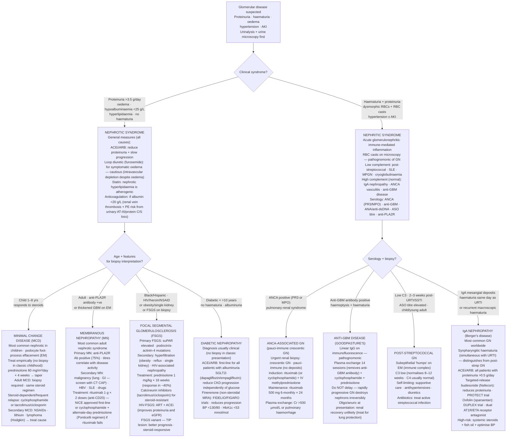

## Overview

Glomerular diseases are a heterogeneous group of conditions characterised by inflammation or structural injury to the glomerulus — the filtering unit of the nephron. They present through two distinct clinical syndromes — nephrotic and nephritic — each reflecting different patterns of glomerular injury. Identifying the syndrome is the first step; determining the underlying histological diagnosis directs specific treatment.

## Pathophysiology

The glomerulus consists of three filtration barriers: fenestrated endothelial cells, the glomerular basement membrane (GBM), and podocytes (specialised epithelial cells with foot processes). Charge and size selectivity are maintained by heparan sulphate proteoglycans in the GBM and the intact slit diaphragm between podocyte foot processes.

**Nephrotic syndrome** results from loss of the charge barrier or podocyte injury, allowing albumin to pass through the GBM into the filtrate. Massive proteinuria (>3.5 g/24 hours) leads to hypoalbuminaemia, which reduces plasma oncotic pressure, causing fluid to shift into the interstitium — producing oedema. The liver compensates by increasing lipoprotein synthesis, causing hyperlipidaemia. Lipoprotein and lipid in the urine produce the characteristic frothy appearance.

**Nephritic syndrome** results from inflammatory disruption of the GBM — immune complex deposition or anti-GBM antibodies cause complement activation, inflammatory cell influx, and destruction of the glomerular architecture. RBCs leak through the damaged basement membrane (haematuria with dysmorphic RBCs and RBC casts), protein leaks in moderate amounts, and sodium and water retention causes hypertension and oedema.

**Distinguishing the syndromes:**

| Feature | Nephrotic | Nephritic |
|---------|----------|---------|
| Proteinuria | Massive (>3.5 g/24h) | Mild–moderate |
| Haematuria | Absent | Present (RBC casts) |
| Blood pressure | Normal or low | Hypertensive |
| Oedema | Prominent (periorbital, peripheral) | Mild |
| Albumin | Low (<30 g/L) | Normal or mildly low |
| GFR | Often preserved initially | Often reduced |

## Nephrotic Syndrome — Causes and Distinguishing Features

**Minimal change disease (MCD):**

The most common cause of nephrotic syndrome in children under 8 years. On light microscopy, the glomeruli appear entirely normal. Electron microscopy reveals diffuse **effacement (fusion) of podocyte foot processes** — the only abnormality. There is no immune complex deposition on immunofluorescence. The pathogenesis involves T-cell dysfunction producing a circulating factor that injures podocytes.

Presentation is classic nephrotic syndrome: periorbital oedema (worst in the morning), peripheral oedema, frothy urine, marked hypoalbuminaemia, and hypercholesterolaemia. Blood pressure is typically normal or low. Haematuria is absent.

MCD responds dramatically to corticosteroids — >90% achieve complete remission within 4–8 weeks of prednisolone. In adults, MCD is associated with NSAIDs and Hodgkin lymphoma.

**Focal segmental glomerulosclerosis (FSGS):**

Segmental scarring affecting some (focal) glomeruli in only part of the glomerular tuft (segmental). It is the most common cause of primary nephrotic syndrome in adults and the leading glomerular cause of ESRD in the Western world.

Primary FSGS involves circulating podocyte permeability factors. Secondary causes include HIV, heroin use, severe obesity, sickle cell disease, and reflux nephropathy. Genetic mutations in podocyte proteins (NPHS1, NPHS2, WT1) cause inherited FSGS in children.

Steroid resistance is common (~50%). Management involves ACEi/ARB for proteinuria reduction; ciclosporin or tacrolimus for steroid-resistant cases.

**Membranous nephropathy:**

The most common cause of primary nephrotic syndrome in adults aged 40–60. Characterised by subepithelial immune complex deposits producing the "spike and dome" appearance on electron microscopy (spikes = GBM projections between deposits).

**Anti-PLA2R antibodies** (anti-phospholipase A2 receptor) are present in ~70–80% of primary membranous nephropathy cases — highly specific and now used for diagnosis (reducing the need for biopsy in classic presentations), monitoring, and predicting relapse.

Secondary causes: malignancy (lung, colon, breast — always screen for occult cancer in adults with membranous nephropathy, especially >50 years), hepatitis B, SLE, drugs (gold, penicillamine, NSAIDs).

One-third undergo spontaneous remission. Treatment for progressive disease: **rituximab** (anti-CD20) is now first-line over cyclophosphamide-based regimens (MENTOR trial).

**Diabetic nephropathy:**

Most common cause of ESRD worldwide. The earliest change is microalbuminuria (ACR >3 mg/mmol) due to glomerular hyperfiltration and mesangial expansion. Pathologically, the Kimmelstiel-Wilson nodule — nodular mesangial expansion — is pathognomonic on histology. Management: ACEi/ARB + SGLT2 inhibitor + glycaemic and BP control.

## Nephritic Syndrome — Causes and Distinguishing Features

**IgA nephropathy (Berger's disease):**

The most common glomerulonephritis worldwide. Characterised by IgA immune complex deposition in the glomerular mesangium. Presents with **episodic macroscopic haematuria occurring 1–3 days after an upper respiratory tract infection or exercise** (synpharyngitic haematuria — concurrent with the infection, not 2–3 weeks later as in PSGN). May also cause asymptomatic persistent microscopic haematuria with proteinuria.

Prognosis varies — 20–30% progress to ESRD over 20 years. Complement levels are normal. Management: ACEi/ARB for proteinuria, fish oil, and steroids for progressive disease with heavy proteinuria.

**Post-streptococcal glomerulonephritis (PSGN):**

Classic childhood presentation following Group A beta-haemolytic streptococcal infection (pharyngitis or skin infection) by **2–3 weeks** — the latent period allows time for immune complex formation. Features: haematuria (cola-coloured urine), periorbital oedema, hypertension, oliguria, elevated ASOT (anti-streptolysin O) titre.

Complement: **low C3, normal C4** (alternative pathway activation). Immunofluorescence shows granular "starry sky" deposits of IgG and C3. Generally self-limiting in children; worse prognosis in adults and elderly.

**Anti-GBM disease (Goodpasture's syndrome):**

Autoantibodies against **type IV collagen** in the GBM (and alveolar basement membrane) cause rapidly progressive GN and pulmonary haemorrhage. Young men (pulmonary haemorrhage dominant) and elderly (renal failure dominant).

Immunofluorescence shows **linear IgG deposition** along the GBM — the pattern is distinctive from the granular deposits of immune complex disease. Treatment: urgent plasmapheresis (to remove circulating antibodies) + cyclophosphamide + steroids. Without treatment, progression to dialysis-dependent renal failure occurs within days to weeks.

**ANCA-associated vasculitis (AAV):**

Pauci-immune GN — minimal or no immune deposits on immunofluorescence (characteristic). Crescent formation on biopsy. Causes: granulomatosis with polyangiitis (GPA, formerly Wegener's — cANCA/PR3), microscopic polyangiitis (MPA — pANCA/MPO), eosinophilic GPA (EGPA, Churg-Strauss — pANCA/MPO).

Systemic features: saddle-nose deformity and nasal/oral ulcers (GPA), pulmonary cavities and haemoptysis, mononeuritis multiplex. Treatment: cyclophosphamide or rituximab + high-dose steroids for induction; azathioprine or rituximab for maintenance.

**Lupus nephritis:**

SLE involves the kidney in up to 60% of cases. WHO/ISN classes I–VI range from minimal mesangial (I) to sclerosing (VI), with diffuse proliferative nephritis (class III/IV) being the most severe. Low C3 and C4 (classical complement pathway activation by immune complexes), positive ANA and anti-dsDNA. Treat active nephritis with mycophenolate mofetil or cyclophosphamide + steroids.

## Diagnosis

**Initial workup for any suspected glomerular disease:**

- Urine dipstick, microscopy (RBC casts, dysmorphic RBCs), 24-hour urine protein or ACR
- U&E, albumin, complement (C3, C4), ANCA, anti-GBM, ANA, anti-dsDNA, anti-PLA2R
- ASOT, throat swab, hepatitis B/C, HIV
- SPEP and UPEP (Bence-Jones protein) — myeloma presenting as nephrotic syndrome
- CXR and CT chest/abdomen — screen for malignancy in adult-onset nephrotic syndrome

**Renal biopsy** is required in adults with glomerular disease to determine histological diagnosis, guide treatment, and prognosticate. Children with classic MCD presentation are treated empirically with steroids without biopsy — biopsy only if atypical features, steroid resistance, or adult-onset.

## Management Principles

**Nephrotic syndrome — general measures:**

- ACEi or ARB: reduce proteinuria and slow progression
- Diuretics (furosemide ± aldosterone antagonist): for oedema — use cautiously (intravascular depletion despite peripheral oedema)
- Statins: hyperlipidaemia in nephrotic syndrome is atherogenic
- Anticoagulation: consider in membranous nephropathy with albumin <20 g/L — risk of renal vein thrombosis and systemic thromboembolic events due to urinary loss of antithrombin III, protein C and S

**Disease-specific immunosuppression:** as outlined per cause above.

## Complications

- Thromboembolism — particularly renal vein thrombosis in membranous nephropathy (loss of anticoagulant proteins)
- Infection — loss of immunoglobulins in urine increases susceptibility to encapsulated organisms (*S. pneumoniae*) — consider prophylactic penicillin and pneumococcal vaccination
- ESRD — most common with FSGS, lupus nephritis, AAV, and anti-GBM disease
- Hypertensive crisis — particularly with rapidly progressive GN
- Complications of immunosuppression — infection, bone disease, malignancy with cyclophosphamide

## Clinical Insight

The timing of haematuria in relation to infection is diagnostically critical. IgA nephropathy causes macroscopic haematuria **concurrent** with the pharyngitis — the patient notices blood in the urine at the same time as the sore throat. PSGN causes haematuria **2–3 weeks after** the throat infection — the latent period reflects the time needed for immune complex formation. Getting this history precisely right determines the diagnosis before any test result.

Anti-PLA2R antibody testing has transformed the diagnosis of membranous nephropathy. A positive anti-PLA2R in a patient with classic nephrotic syndrome and no secondary cause effectively confirms primary membranous nephropathy — obviating biopsy in many cases, and allowing monitoring of treatment response (titre correlates with disease activity).

Goodpasture's disease requires plasmapheresis as the cornerstone of treatment. The circulating anti-GBM antibodies are directly pathogenic, and removing them with plasma exchange dramatically improves renal and pulmonary outcomes. Immunosuppression alone without plasmapheresis is insufficient.
