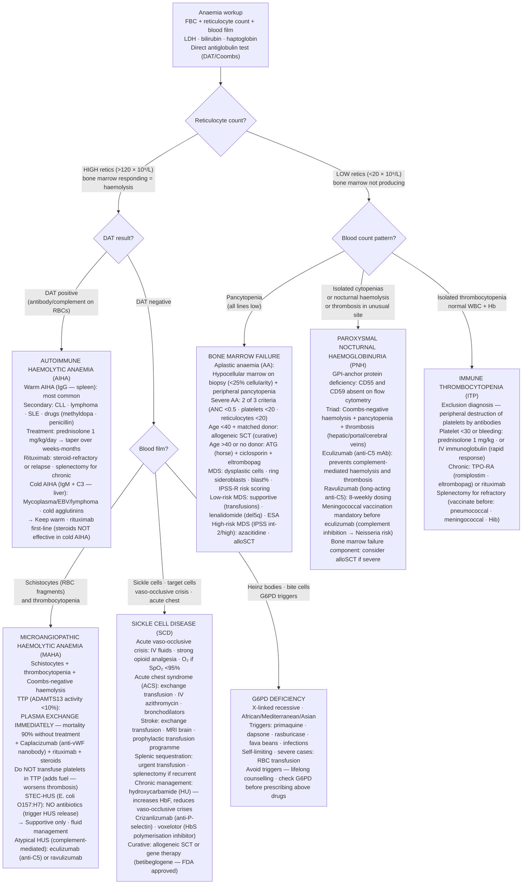

## Overview

Haemolytic anaemias result from premature destruction of red blood cells — either within the vasculature (intravascular haemolysis) or by phagocytes in the spleen and liver (extravascular haemolysis). Bone marrow failure syndromes result from destruction, suppression, or replacement of the marrow's haematopoietic stem cells. Both categories produce anaemia, but through entirely different mechanisms with distinct clinical and laboratory profiles.

## Pathophysiology

### Haemolysis — General Mechanisms

Normal RBC lifespan is 120 days. Haemolysis reduces this. The clinical consequences depend on the rate of haemolysis and the bone marrow's compensatory capacity:
- Elevated bilirubin (unconjugated) from haem catabolism → jaundice
- Elevated LDH (released from lysed cells)
- Reduced haptoglobin (binds free haemoglobin — depleted in haemolysis)
- Elevated reticulocyte count (compensatory marrow response)
- Haemoglobinuria and haemosiderinuria in intravascular haemolysis (dark urine)

**Intravascular haemolysis** (RBCs destroyed in the circulation): Haemoglobinaemia, haemoglobinuria, haemosiderinuria, markedly reduced haptoglobin. Causes: AIHA (warm IgG, cold IgM), mechanical (prosthetic valve, TTP/HUS), G6PD deficiency (in acute episodes), paroxysmal nocturnal haemoglobinuria (PNH).

**Extravascular haemolysis** (RBCs destroyed by macrophages in spleen/liver): Splenomegaly, jaundice, gallstones (from chronic bilirubin production). Haptoglobin less dramatically reduced. Causes: hereditary spherocytosis, thalassaemia, sickle cell disease.

### Sickle Cell Disease (SCD)

A point mutation in the beta-globin gene (Glu→Val at position 6) produces haemoglobin S (HbS). When deoxygenated, HbS polymerises → RBCs deform into a rigid sickle shape. Sickling is promoted by hypoxia, dehydration, cold, acidosis, and infection.

Sickled cells cause disease through two mechanisms:

1. **Vaso-occlusion**: Rigid sickled cells and activated endothelium cause microvascular obstruction → tissue ischaemia → pain (the vaso-occlusive crisis), organ infarction
2. **Haemolysis**: Sickled cells have a shortened lifespan (10–20 days vs 120 normal) → chronic haemolytic anaemia, elevated bilirubin, gallstones, leg ulcers, pulmonary hypertension (from chronic haemolysis)

Homozygous HbSS = sickle cell anaemia (most severe). HbSC and HbS/β-thalassaemia are compound heterozygous states with variable severity. HbAS (sickle cell trait) is generally asymptomatic but confers some malaria resistance.

**Acute chest syndrome (ACS)** — the most common cause of death in SCD: new pulmonary infiltrate + chest pain ± fever ± hypoxia. Caused by sickling in pulmonary vasculature, fat embolism from infarcted marrow, or infection. Medical emergency — mortality 3–9% per episode. Treat aggressively.

**Functional asplenia**: Repeated splenic infarction from sickling → autosplenectomy by early childhood. Predisposes to encapsulated organism sepsis (*Streptococcus pneumoniae*, *Haemophilus influenzae*, *Meningococcus*) — penicillin prophylaxis and vaccination are lifelong requirements.

### Thalassaemias

Thalassaemias result from reduced or absent synthesis of alpha or beta globin chains. Unpaired chains are unstable and precipitate, damaging the RBC membrane.

**Beta-thalassaemia major** (homozygous β0): No functional beta chains. Severe transfusion-dependent anaemia presenting in infancy when HbF switches to HbA. Compensatory extramedullary haematopoiesis → skeletal deformities ("hair-on-end" skull X-ray, frontal bossing, maxillary hypertrophy — the classic "chipmunk facies"). Massive splenomegaly. Iron overload from transfusions → cardiomyopathy, liver disease, endocrinopathy (chelation with desferrioxamine or deferasirox is lifelong).

**Beta-thalassaemia trait**: Microcytic anaemia with a normal ferritin — distinguished from iron deficiency by elevated HbA2 (>3.5%) on Hb electrophoresis and a normal/elevated red cell count (in iron deficiency, RBC count falls).

**Alpha-thalassaemia**: Four alpha genes — one or two deletions are clinically silent or cause mild microcytosis. Three deletions (HbH disease) causes moderate haemolytic anaemia. Four deletions (Hb Bart's / hydrops fetalis) is incompatible with postnatal life.

### Autoimmune Haemolytic Anaemia (AIHA)

**Warm AIHA**: IgG antibodies bind RBCs at 37°C → partial phagocytosis by splenic macrophages → spherocytes (loss of membrane without cytoplasm loss). Causes: idiopathic, SLE, CLL, drugs (methyldopa, penicillin). Direct Coombs test (DAT) positive for IgG. Treat with prednisolone; rituximab for refractory cases.

**Cold AIHA**: IgM antibodies bind at <31°C → complement activation → intravascular haemolysis. Causes: Mycoplasma pneumoniae (polyclonal IgM), infectious mononucleosis (EBV), cold agglutinin disease (monoclonal IgM — associated with lymphoproliferative disorders). DAT positive for C3d only. Avoid cold, keep warm; rituximab; treat underlying lymphoma.

### G6PD Deficiency

X-linked recessive. G6PD protects RBCs from oxidative stress via the pentose phosphate pathway. Deficiency leaves RBCs vulnerable to oxidative haemolysis when exposed to triggers: infections (most common trigger), drugs (primaquine, dapsone, rasburicase, nitrofurantoin), fava beans (favism).

Acute haemolytic episode: Heinz bodies (denatured Hb precipitates) on blood film, bite cells (Heinz bodies phagocytosed from the cell edge). Haemolysis is self-limiting — the older, more deficient cells lyse first, leaving a younger, less deficient population. Screen for G6PD deficiency before prescribing oxidant drugs.

### Aplastic Anaemia

Immune-mediated destruction of haematopoietic stem cells → pancytopaenia from an empty, fat-replaced marrow. Most cases are acquired (autoimmune T-cell attack on stem cells); inherited forms include Fanconi anaemia and dyskeratosis congenita.

Classified by severity:
- **Severe AA (SAA)**: Bone marrow cellularity <25% + at least 2 of: neutrophils <0.5 × 10⁹/L, platelets <20 × 10⁹/L, reticulocytes <20 × 10⁹/L
- **Very severe AA (VSAA)**: SAA + neutrophils <0.2 × 10⁹/L

Paroxysmal nocturnal haemoglobinuria (PNH) is closely related — a somatic mutation in PIG-A gene → loss of GPI-anchored complement regulatory proteins (CD55, CD59) on RBC surface → complement-mediated intravascular haemolysis. PNH, aplastic anaemia, and myelodysplasia form a disease spectrum with overlapping biology.

## Clinical Presentation

### Haemolysis

Features of anaemia (fatigue, pallor, dyspnoea) + jaundice (unconjugated) + dark urine (intravascular) + splenomegaly (extravascular, chronic). Pigment gallstones from chronic bilirubin excess.

**SCD crisis presentations**:
- **Vaso-occlusive crisis (VOC)**: Severe pain — hands and feet in children (dactylitis), long bones, back, chest in adults. Most common SCD complication.
- **Acute chest syndrome**: Chest pain + hypoxia + new infiltrate. Medical emergency.
- **Aplastic crisis**: Parvovirus B19 infects erythroid precursors → transient red cell aplasia → profound anaemia (reticulocyte count falls to near zero — the only time in SCD when the reticulocyte count is low)
- **Splenic sequestration**: Sudden trapping of blood in the spleen → acute massive splenomegaly + haemodynamic collapse → immediate blood transfusion
- **Stroke**: Most common in children; affects 10% by age 20 without prophylaxis
- **Priapism**: Vaso-occlusion in the corpus cavernosum — urological emergency

### Aplastic Anaemia

Pancytopaenia: anaemia (fatigue, dyspnoea), neutropaenia (infections — mouth ulcers, fever), thrombocytopaenia (petechiae, mucosal bleeding). Splenomegaly and lymphadenopathy are absent (distinguishes from infiltrative marrow disease).

## Diagnosis

**Haemolysis screen**: FBC, reticulocyte count, blood film, unconjugated bilirubin, LDH, haptoglobin, urinalysis (haemoglobinuria).

**DAT (direct antiglobulin test / Coombs)**: Detects IgG or complement on RBC surface — positive in AIHA.

**Haemoglobin electrophoresis/HPLC**: Identifies HbS, HbC, HbA2 (thalassaemia), HbF — essential for haemoglobinopathy diagnosis. Sickle solubility test is a screen only; HPLC is confirmatory.

**G6PD assay**: Enzyme activity measurement. Avoid testing immediately after a haemolytic episode — young cells have higher G6PD activity and give falsely normal results.

**Bone marrow trephine**: Mandatory for aplastic anaemia — hypocellular marrow with fat replacement. Also required to exclude infiltration and MDS.

**PNH clone by flow cytometry**: CD59 and CD55 expression on RBCs and neutrophils — loss confirms PNH clone. Sensitive for small clones.

## Management

### Sickle Cell Disease

**Acute vaso-occlusive crisis**:
- Analgesia: IV morphine/patient-controlled analgesia; do not withhold opioids
- IV fluids (hydration reduces sickling)
- Oxygen only if SpO₂ <95% (unnecessary oxygen does not help and may suppress erythropoiesis)
- Warmth
- Treat infection if present
- Exchange transfusion for ACS, stroke, or priapism

**Acute chest syndrome**: Antibiotics (ceftriaxone + azithromycin — covers atypical organisms), top-up or exchange transfusion, bronchodilators, HDU monitoring. NIV/ventilation if deteriorating.

**Disease-modifying therapy**:
- **Hydroxyurea (hydroxycarbamide)**: Increases HbF production (HbF does not polymerise with HbS) → reduces sickling frequency. Reduces VOC frequency by ~50%, ACS, and hospitalisation. Offer to all patients with ≥3 painful crises per year.
- **Voxelotor**: Inhibits HbS polymerisation directly — increases Hb and reduces haemolysis.
- **Crizanlizumab**: Anti-P-selectin antibody — reduces endothelial adhesion and vaso-occlusion.
- **Allogeneic SCT**: Only curative option. Offered to severely affected children with a matched sibling donor. Gene therapy (betibeglogene autotemcel) — approved 2023 in some countries; potentially curative.

**Prophylaxis**: Lifelong penicillin V, pneumococcal/meningococcal/Hib vaccination, folic acid supplementation, TCD (transcranial Doppler) screening for stroke risk in children (start hydroxyurea or chronic transfusion if TCD elevated).

### Aplastic Anaemia

**Supportive**: Irradiated, CMV-negative blood products; platelet transfusions for bleeding (threshold typically 10 × 10⁹/L); antifungal and antibacterial prophylaxis.

**Definitive treatment**:
- **Age <40 with matched sibling donor**: Allogeneic SCT — curative in ~85%
- **No matched sibling or age >40**: **Anti-thymocyte globulin (ATG) + ciclosporin + eltrombopag** — immunosuppressive therapy; response in ~70–80%
- Matched unrelated donor SCT for non-responders to IST

### Haemolytic Anaemias

**Warm AIHA**: Prednisolone 1 mg/kg/day → taper over months. Rituximab for refractory/relapsing disease. Splenectomy (less favoured now).

**Cold AIHA**: Avoid cold exposure. Rituximab. Treat underlying lymphoproliferative disorder. Steroids are largely ineffective.

**G6PD deficiency**: Supportive during acute episode. Avoid triggers. No specific treatment.

**Hereditary spherocytosis**: Folic acid supplementation. Splenectomy if moderate-severe disease (curative of haemolysis; vaccinate and use penicillin prophylaxis post-splenectomy).

## Complications

- **SCD**: Stroke, avascular necrosis (femoral/humeral head), chronic kidney disease, retinopathy (annual screening), pulmonary hypertension (haemolysis-related), leg ulcers, priapism, increased surgical risk (perioperative exchange transfusion)
- **Thalassaemia major**: Iron overload → dilated cardiomyopathy (leading cause of death), liver cirrhosis, endocrinopathy (diabetes, hypogonadism, hypothyroidism)
- **Aplastic anaemia**: Risk of evolving to MDS, AML, or PNH (~15–20% at 10 years)
- **Splenectomy** (for any indication): Overwhelming post-splenectomy infection (OPSI) — encapsulated organisms; lifelong penicillin and vaccination mandatory; MedicAlert bracelet

## Clinical Insight

Acute chest syndrome is the leading cause of death in sickle cell disease and the most dangerous complication to underestimate. It can begin as what appears to be a simple vaso-occlusive crisis with chest pain — and deteriorate to respiratory failure within hours. Any SCD patient with chest pain plus hypoxia plus a new infiltrate is in ACS until proven otherwise. Exchange transfusion, not simple top-up transfusion, is the treatment of choice for severe ACS — it reduces HbS percentage while avoiding hyperviscosity.

Parvovirus B19 in sickle cell disease causes aplastic crisis — and it is the one situation where the reticulocyte count is low. SCD patients have a compensated haemolytic anaemia maintained by brisk marrow output; when B19 knocks out erythropoiesis even briefly, the Hb plummets catastrophically. These patients need urgent transfusion and isolation (B19 is transmitted by respiratory droplets — they must not be on a ward with immunocompromised patients or pregnant women).

The distinction between beta-thalassaemia trait and iron deficiency anaemia is clinically critical and frequently confused. Both cause microcytic anaemia. In thalassaemia trait: the RBC count is high or normal, ferritin is normal, and the MCV is disproportionately low. In iron deficiency: the RBC count is low and ferritin is low. HbA2 >3.5% on HPLC confirms thalassaemia trait. This matters because prescribing iron to a patient with thalassaemia trait is ineffective and unnecessary — and because genetic counselling is essential if both partners in a couple carry beta-thalassaemia trait (25% risk of a child with beta-thalassaemia major).
