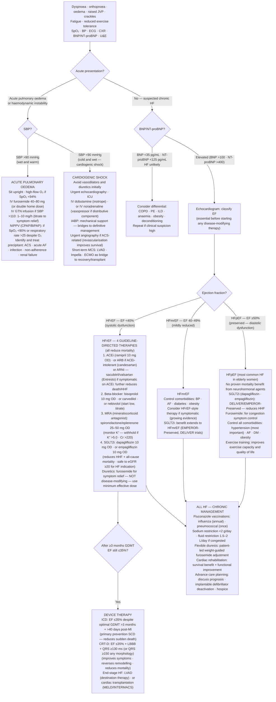

## Overview

Heart failure (HF) is a clinical syndrome in which the heart cannot pump sufficient blood to meet the body's metabolic demands, or can only do so at the cost of elevated filling pressures. It is the final common pathway of many cardiac conditions.

Classification by ejection fraction drives treatment decisions:

| Type | EF | Typical Cause |
|------|----|--------------|
| HFrEF (reduced) | <40% | Ischaemic heart disease, dilated cardiomyopathy |
| HFmrEF (mildly reduced) | 40–49% | Mixed or recovering |
| HFpEF (preserved) | ≥50% | Hypertension, diabetes, obesity, ageing |

**High-output heart failure** — a distinct entity where cardiac output is elevated but still cannot meet massively increased metabolic demands. Causes include severe anaemia, hyperthyroidism, arteriovenous fistula, wet beriberi (thiamine deficiency), Paget's disease, and pregnancy.

## Pathophysiology

When cardiac output falls, compensatory mechanisms are activated. The RAAS releases angiotensin II and aldosterone, causing sodium and water retention and increasing preload. The sympathetic nervous system increases heart rate and causes vasoconstriction, raising afterload. Ventricular hypertrophy and remodelling occur.

These responses initially maintain cardiac output but are ultimately maladaptive. Chronic volume and pressure overload leads to progressive ventricular dilation, fibrosis, and further dysfunction. This is the biological rationale for ACE inhibitors, beta-blockers, MRAs, and SGLT2 inhibitors — each interrupts a different arm of this neurohormonal cascade.

**Left heart failure** causes elevated pulmonary venous pressure, producing pulmonary oedema and the symptoms of dyspnoea, orthopnoea, and PND. **Right heart failure** causes elevated systemic venous pressure, producing peripheral oedema, raised JVP, hepatomegaly, and ascites. Most patients develop biventricular failure over time.

## Clinical Presentation

**Symptoms:** Exertional dyspnoea (earliest symptom), orthopnoea, paroxysmal nocturnal dyspnoea, fatigue, ankle swelling, abdominal fullness, reduced exercise tolerance.

**Signs:** Elevated JVP, third heart sound (S3 — volume overload, dilated ventricle), fourth heart sound (S4 — stiff non-compliant ventricle, more common in HFpEF), displaced apex beat, bibasal crepitations, pleural effusions, peripheral oedema.

**CXR findings in pulmonary oedema:**

| Finding | What it represents |
|---------|-------------------|
| Upper lobe venous diversion | Pulmonary venous hypertension |
| Kerley B lines | Interstitial oedema in lymphatics |
| Cardiomegaly (CTR >0.5) | Cardiac enlargement |
| Bat-wing perihilar shadowing | Alveolar oedema |
| Pleural effusions | Bilateral, right > left |

**BNP and NT-proBNP** have high sensitivity and excellent negative predictive value. A normal BNP in an untreated patient makes significant heart failure very unlikely and effectively excludes it in the right clinical context.

## Diagnosis

**Echocardiography is essential** — it determines ejection fraction, identifies the underlying cause (wall motion abnormalities, valvular disease, pericardial pathology), and guides therapy. No pharmacological treatment for HFrEF should be started without a confirmed EF.

**Bloods:** BNP/NT-proBNP, FBC (anaemia worsens HF), U&E (baseline before ACEi and diuretics), LFTs, TFTs (hypothyroidism), HbA1c, fasting lipids.

**ECG:** LVH, AF (common precipitant), ischaemic changes, LBBB (predicts CRT benefit).

## Management

### Acute Decompensated Heart Failure

- Sit the patient upright to reduce venous return
- Oxygen to maintain SpO₂ >94%
- **IV furosemide** — give 2.5× the patient's usual oral dose intravenously (better bioavailability acutely). Monitor urine output, electrolytes, and creatinine closely.
- **GTN infusion** — if systolic BP >90 mmHg. Reduces both preload and afterload.
- **CPAP or BiPAP** — for acute pulmonary oedema not responding to initial measures
- **Inotropes** (dobutamine) — for cardiogenic shock or refractory decompensation
- Do **not** start or continue beta-blockers during acute decompensation

### Chronic HFrEF — Guideline-Directed Medical Therapy

Four drug classes independently reduce mortality and should be initiated and up-titrated in all eligible patients:

| Pillar | Drug Class | Example | Key Trial |
|--------|-----------|---------|-----------|
| 1 | ACEi / ARB / ARNI | Ramipril, sacubitril-valsartan | CONSENSUS, PARADIGM-HF |
| 2 | Beta-blocker | Bisoprolol, carvedilol | MERIT-HF, COPERNICUS |
| 3 | MRA | Spironolactone, eplerenone | RALES, EPHESUS |
| 4 | SGLT2 inhibitor | Dapagliflozin, empagliflozin | DAPA-HF, EMPEROR-Reduced |

**ARNI (sacubitril-valsartan)** is superior to ACE inhibitor monotherapy and should be used in patients who remain symptomatic on an ACEi. It cannot be combined with an ACEi — a 36-hour washout period is required before switching.

**SGLT2 inhibitors** reduce HF hospitalisation and cardiovascular death in HFrEF regardless of whether the patient has diabetes. This is now a first-line recommendation.

**Diuretics** (furosemide, torsemide) relieve congestion and improve symptoms but have no proven mortality benefit. Use the lowest effective dose.

### Device Therapy

- **ICD** — indicated if EF remains <35% despite ≥3 months of optimal medical therapy, for primary prevention of sudden cardiac death
- **CRT (biventricular pacing)** — indicated if EF <35% with LBBB and QRS >120ms. Improves cardiac synchrony, symptoms, and survival.
- **Heart transplantation / LVAD** — for end-stage refractory HF

### HFpEF

No therapy has yet demonstrated mortality reduction in HFpEF. Management focuses on treating the underlying causes (hypertension, AF, obesity, diabetes), relieving congestion with diuretics, and controlling heart rate. SGLT2 inhibitors show emerging mortality benefit in HFpEF (EMPEROR-Preserved trial) and are increasingly used.

## Complications

- Arrhythmias — AF is both a cause and complication of HF; ventricular arrhythmias cause sudden death
- Cardiorenal syndrome — progressive renal impairment from reduced perfusion and venous congestion
- Cardiac cachexia — in advanced HF; worsens prognosis
- Thromboembolic events — particularly with severely reduced EF or AF

## Clinical Insight

The most common precipitant of acute decompensation is medication non-compliance or dietary indiscretion (excess sodium and fluid intake). Always ask about this before attributing decompensation to disease progression.

Never start a beta-blocker in acute decompensated HF — it can precipitate cardiogenic shock. Stabilise first with diuretics and vasodilators, then introduce the beta-blocker at a low dose once the patient is euvolaemic.

BNP-guided therapy — titrating diuretics and neurohormonal blockade to drive BNP toward normal — is associated with better outcomes and is a practical tool for outpatient HF management.
