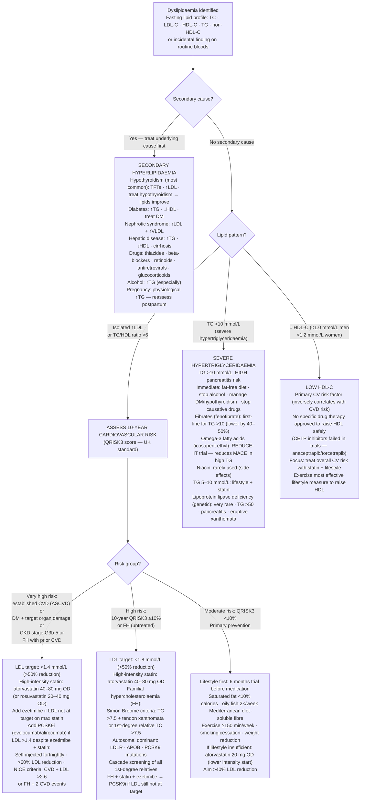

## Overview

Hyperlipidaemia encompasses elevated total cholesterol, LDL cholesterol, triglycerides, or a combination, and represents one of the most important modifiable risk factors for atherosclerotic cardiovascular disease. Elevated LDL is causally and dose-dependently related to coronary artery disease, stroke, and peripheral arterial disease. Management is guided by overall cardiovascular risk, not absolute lipid levels in isolation.

## Pathophysiology

LDL carries cholesterol from the liver to peripheral tissues. Elevated LDL infiltrates the arterial intima, undergoes oxidation, and is ingested by macrophages to form foam cells — the cellular basis of the atherosclerotic plaque. HDL performs reverse cholesterol transport, carrying cholesterol back to the liver for excretion. Higher HDL is therefore protective.

**Lipoprotein(a) [Lp(a)]** — a modified LDL particle with an additional apolipoprotein(a) chain — is an independent, predominantly genetically determined cardiovascular risk factor. It is not reduced by statins and requires specific attention in patients with premature CVD.

**Familial hypercholesterolaemia (FH)** is an autosomal dominant disorder caused by mutations in the LDL receptor, apolipoprotein B, or PCSK9 genes. Loss of functional LDL receptors severely impairs LDL clearance from the circulation. Untreated, most patients develop premature coronary artery disease (men by age 40–50, women 10–15 years later).

**Secondary causes** of dyslipidaemia to exclude before starting therapy:

| Cause | Effect on Lipids |
|------|----------------|
| Hypothyroidism | ↑LDL, ↑TG |
| Type 2 diabetes | ↑TG, ↓HDL |
| CKD and nephrotic syndrome | ↑LDL, ↑TG |
| Alcohol excess | ↑TG, ↑HDL |
| Cushing's syndrome | ↑LDL, ↑TG |
| Drugs: corticosteroids, thiazides, beta-blockers | ↑TG, ↓HDL |

## Clinical Presentation

Hyperlipidaemia is asymptomatic until it causes cardiovascular disease. Clinical signs of severe dyslipidaemia:

- **Tendon xanthomata** — firm, painless deposits over Achilles tendons and extensor tendons of the fingers; highly specific for familial hypercholesterolaemia
- **Xanthelasma** — lipid deposits around the eyelids; less specific than tendon xanthomata
- **Corneal arcus** — lipid ring around the cornea; significant if present in patients under 45
- **Eruptive xanthomata** — small yellowish papules on the buttocks, shoulders, or extensor surfaces; indicate severe hypertriglyceridaemia (TG usually >10 mmol/L)
- **Lipaemia retinalis** — creamy appearance of retinal vessels; TG typically >20 mmol/L

## Diagnosis

**Fasting lipid profile:** Total cholesterol, LDL, HDL, triglycerides, and calculated non-HDL cholesterol (total minus HDL — a better surrogate for atherogenic lipoproteins than LDL alone).

**Cardiovascular risk assessment:** QRISK3 (UK) or SCORE2 (European) to estimate 10-year cardiovascular risk, which guides treatment thresholds.

**Familial hypercholesterolaemia:** Diagnosed clinically using Dutch Lipid Clinic Network (DLCN) criteria or Simon Broome criteria — incorporating LDL level, clinical features (tendon xanthomata), and family history. LDL >5 mmol/L with a first-degree relative with similar levels or premature CVD should trigger evaluation. Genetic testing confirms the diagnosis.

**Secondary cause screen:** TFTs, fasting glucose/HbA1c, U&E, LFTs, urine ACR — perform before initiating lipid-lowering therapy.

**Baseline before starting statin:** LFTs and CK.

## Management

### Lifestyle — Mandatory for All

- Reduce saturated fat (replace with unsaturated); increase soluble fibre (oats, legumes, psyllium)
- Regular aerobic exercise — raises HDL, reduces TG
- Weight loss — reduces LDL and TG, raises HDL
- Alcohol reduction — dramatically lowers triglycerides
- Smoking cessation — raises HDL, reduces overall cardiovascular risk

### Cardiovascular Risk Categories and LDL Targets

| Risk Category | Definition | LDL Target |
|-------------|-----------|-----------|
| Very high | Established CVD, DM with organ damage, CKD ≥G3, FH + risk factor, SCORE2 ≥10% | <1.4 mmol/L AND ≥50% reduction |
| High | Single markedly elevated risk factor, CKD G3, SCORE2 5–10% | <1.8 mmol/L |
| Moderate | SCORE2 1–5% | <2.6 mmol/L |
| Low | SCORE2 <1% | <3.0 mmol/L |

### Statins — First-Line

Statins inhibit **HMG-CoA reductase**, the rate-limiting enzyme of hepatic cholesterol synthesis. This upregulates LDL receptor expression, increasing LDL clearance from the circulation.

**High-intensity statins** reduce LDL by ≥50%: atorvastatin 40–80mg, rosuvastatin 20–40mg.

Indications for statin therapy include: all patients with established CVD; primary prevention when 10-year QRISK ≥10%; all patients with FH; all patients with diabetes over 40 (or younger with additional risk factors).

**Side effects:**
- Myopathy — myalgia in 5–10% of patients. Check CK if symptomatic. Rhabdomyolysis is rare but serious.
- Elevated transaminases — usually transient; significant hepatotoxicity is uncommon
- New-onset diabetes — small increased risk; does not outweigh cardiovascular benefit in high-risk patients

**Risk of myopathy is increased by:** High statin dose, co-prescription of fibrates (especially gemfibrozil — never combine), CYP3A4 inhibitors (clarithromycin, azole antifungals, grapefruit juice), and untreated hypothyroidism.

### Ezetimibe

Inhibits intestinal cholesterol absorption at the NPC1L1 transporter. Reduces LDL by approximately 15–20%. Add to statin if LDL target not achieved on maximum tolerated statin dose (IMPROVE-IT trial: modest additional cardiovascular benefit when added to statin post-ACS).

### PCSK9 Inhibitors (Evolocumab, Alirocumab)

Monoclonal antibodies that inhibit PCSK9, preventing LDL receptor degradation. This markedly increases LDL receptor density and LDL clearance — reducing LDL by 50–60% on top of statin therapy.

Indicated for: very high-risk patients not at LDL target on maximum statin + ezetimibe; statin-intolerant patients with FH; patients with recurrent CVD events. Evidence from FOURIER (evolocumab) and ODYSSEY OUTCOMES (alirocumab) trials demonstrates significant reduction in cardiovascular events.

### Hypertriglyceridaemia

TG 2–10 mmol/L: lifestyle (alcohol, refined carbohydrates, weight), treat secondary causes, add fenofibrate or omega-3 fatty acids if needed. Statins have modest TG-lowering effect and address overall CV risk.

TG >10 mmol/L: significant risk of **acute pancreatitis** — urgent treatment with fenofibrate, strict dietary fat restriction, and alcohol abstinence. Hospitalisation if TG >20 mmol/L or pancreatitis occurs.

## Complications

- Premature atherosclerosis with MI and stroke — particularly in FH
- Acute pancreatitis — from severe hypertriglyceridaemia (TG >10 mmol/L)
- Statin-associated myopathy and rhabdomyolysis (rare)

## Clinical Insight

Tendon xanthomata are pathognomonic of familial hypercholesterolaemia. A patient with LDL >5 mmol/L and this finding has FH until proven otherwise. Cascade screening of first-degree relatives is mandatory — each child has a 50% chance of inheriting the condition, and early treatment prevents premature heart disease.

Lp(a) is not measured in a standard lipid panel and is not reduced by statins. In patients with premature CVD, recurrent events on optimal medical therapy, or a strong family history unexplained by standard lipid levels, measure Lp(a). Elevated levels (>50 mg/dL or >125 nmol/L) indicate very high cardiovascular risk and may justify PCSK9 inhibitor therapy.

Never combine gemfibrozil with a statin. The combination dramatically increases the risk of rhabdomyolysis through CYP2C8-mediated inhibition of statin metabolism. Fenofibrate is the safe fibrate to use in combination with statins when both are needed.
