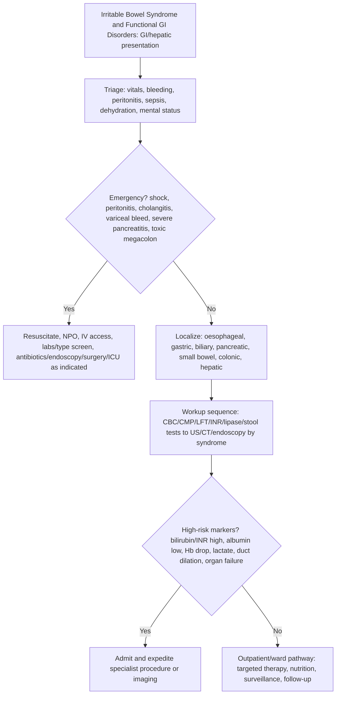

## Overview

Irritable bowel syndrome (IBS) is the most common functional gastrointestinal disorder, affecting approximately 10–15% of the population globally. It is characterised by recurrent abdominal pain related to defecation, associated with a change in stool frequency or form — in the absence of structural or biochemical abnormalities to explain symptoms. IBS is not a diagnosis of exclusion in younger patients without alarm features — it is a positive clinical diagnosis based on symptom criteria.

## Pathophysiology

IBS does not have a single unifying mechanism. It is best understood as a disorder of **gut-brain axis dysregulation**, in which multiple factors interact:

**Visceral hypersensitivity**: Altered processing of afferent gut signals — normal bowel contractions and distension produce exaggerated pain perception. This explains why IBS patients report pain from colonic activities that would be imperceptible in healthy individuals.

**Altered gut motility**: Accelerated transit in IBS-D (diarrhoea-predominant), delayed transit in IBS-C (constipation-predominant).

**Psychological factors**: Anxiety, depression, and psychosocial stress are bidirectionally linked to IBS through the gut-brain axis. The relationship is not causative — psychological factors do not "cause" IBS in a simple sense — but they profoundly modulate symptom perception and disability.

**Post-infectious IBS**: Develops in ~10–25% of patients following acute gastroenteritis (*Campylobacter*, *Salmonella*, viral). The mechanism involves sustained mucosal low-grade inflammation, altered gut microbiome, and increased enterochromaffin cells (serotonin-producing).

**Small intestinal bacterial overgrowth (SIBO)**: Contributes to IBS-D in some patients — hydrogen breath test can identify this subgroup.

**Microbiome dysbiosis**: Altered composition of the gut microbiome is consistently found in IBS, though causality is unclear.

## Clinical Presentation

**Rome IV criteria for IBS** (the internationally accepted diagnostic standard):

Recurrent abdominal pain on average ≥1 day/week over the last 3 months, associated with ≥2 of:
1. Related to defecation (onset or improvement)
2. Associated with change in stool frequency
3. Associated with change in stool form (appearance)

Symptoms must have been present for the last 3 months, with onset ≥6 months before diagnosis.

**IBS subtypes** (by Bristol Stool Form Scale):
- **IBS-C** (constipation-predominant): hard, lumpy stools (Bristol 1–2) >25% of bowel movements
- **IBS-D** (diarrhoea-predominant): loose, mushy or watery stools (Bristol 6–7) >25%
- **IBS-M** (mixed): both patterns
- **IBS-U** (unclassified)

**Associated features**: Bloating, abdominal distension, mucus in stools, incomplete evacuation, urgency. Extraintestinal features: fatigue, fibromyalgia, headaches, urinary symptoms, dyspareunia — all associated with central sensitisation.

**Always ask about alarm features that mandate investigation regardless of IBS presentation:**
- Age >50 at symptom onset
- Rectal bleeding
- Unexplained weight loss
- Nocturnal symptoms (waking from sleep — organic disease)
- Family history of CRC or IBD
- Iron deficiency anaemia
- Change in a previously stable symptom pattern

## Diagnosis

IBS is a **positive clinical diagnosis** — based on Rome IV criteria in the absence of alarm features. In younger patients (<50) without alarm features, a positive diagnosis can be made in primary care without extensive investigation.

**Minimum investigations to exclude organic disease (NICE NG61):**
- FBC — anaemia
- CRP or ESR — raised in IBD, not elevated in IBS
- Coeliac serology (anti-tTG IgA + total IgA) — coeliac disease is an important and commonly missed IBS mimic
- Thyroid function — hypo/hyperthyroidism causes bowel habit changes
- Faecal calprotectin — highly sensitive for bowel inflammation; if normal, IBD is very unlikely

**Additional tests in appropriate clinical context:**
- Colonoscopy — if alarm features, age >50, or ongoing diagnostic doubt
- CA-125 — if bloating and abdominal pain in women >50 (exclude ovarian cancer)
- Hydrogen breath test — if SIBO or lactose intolerance suspected
- Food diary — identify triggers (FODMAPs, dairy, caffeine, alcohol)

**Commonly confused with IBS:**
- Coeliac disease — similar symptoms; always check serology
- Microscopic colitis — watery diarrhoea, normal colonoscopy, biopsy diagnostic; common in middle-aged women on NSAIDs or SSRIs
- Bile acid malabsorption — post-cholecystectomy or post-ileal resection; SeHCAT scan diagnostic; responds to cholestyramine
- Lactose/fructose intolerance — dietary exclusion trial
- SIBO — hydrogen breath test; antibiotic treatment (rifaximin)

## Management

Management of IBS requires a **biopsychosocial approach** — addressing the physiological, psychological, and lifestyle components together. Symptom severity, patient health beliefs, and level of distress determine the intensity of intervention.

### Communication and Education

Positive, confident diagnosis with clear explanation of the gut-brain axis model. Acknowledge that symptoms are real and not "all in the head." Reassure that IBS does not progress to cancer or IBD. Set realistic expectations — complete resolution is uncommon; the goal is symptom control and quality of life. Address health anxiety directly and compassionately.

### Dietary Modification

**Low-FODMAP diet** (Fermentable Oligosaccharides, Disaccharides, Monosaccharides, and Polyols): Highly effective for reducing bloating, flatulence, and diarrhoea — randomised evidence shows response in ~60–70% of patients. Should be dietitian-supervised: 6-week elimination phase followed by systematic reintroduction to identify personal triggers. Long-term strict avoidance of all FODMAPs is unnecessary and nutritionally restrictive.

**General dietary advice**: Regular small meals, adequate fluid intake, reduce caffeine and carbonated drinks, limit alcohol, avoid known personal triggers.

### Pharmacological Treatment

There is no single universally effective drug for IBS. Treatments target the predominant symptom:

| Symptom | Drug | Notes |
|---------|------|-------|
| Abdominal pain/cramps | Antispasmodics (mebeverine, hyoscine, peppermint oil) | First-line for pain; taken PRN before meals |
| Constipation (IBS-C) | Ispaghula husk (soluble fibre), laxatives (macrogol, lactulose) — avoid insoluble fibre (worsens bloating) | Linaclotide for refractory IBS-C (NICE approved) |
| Diarrhoea (IBS-D) | Loperamide PRN | Reduce dose gradually to avoid constipation |
| Global symptom improvement | Tricyclic antidepressants (amitriptyline 10–30 mg nocte) at low (sub-antidepressant) doses | Central pain modulation; improves sleep; reduces bowel transit |
| Global symptoms | SSRIs (fluoxetine, citalopram) | If prominent psychological component or TCA not tolerated |
| IBS-D refractory | Rifaximin (non-absorbable antibiotic) | If SIBO contributing; limited evidence |

**Antidepressants in IBS are analgesics, not antidepressants**: The low doses used in IBS (amitriptyline 10 mg) are far below antidepressant doses (75–150 mg). Their benefit derives from modulating central pain processing and reducing gut transit — make this clear to patients to improve acceptance and adherence.

### Psychological Therapies

For patients with moderate-severe IBS, refractory IBS, or prominent psychological comorbidity:
- **Cognitive behavioural therapy (CBT)** — most evidence; addresses unhelpful illness beliefs and behaviours
- **Gut-directed hypnotherapy** — highly effective in RCTs; reduces visceral hypersensitivity
- **Mindfulness-based stress reduction**
- **Psychodynamic psychotherapy**

These are not offered instead of other treatments — they are offered alongside them.

## Complications

IBS does not cause structural damage to the bowel and does not progress to IBD or colorectal cancer. The major morbidity is:
- Impaired quality of life — social isolation, inability to work, relationship strain
- Anxiety and depression — bidirectional relationship; both more prevalent in IBS
- Iatrogenic harm — unnecessary investigations, inappropriate surgeries (appendicectomy, hysterectomy for pain)
- Financial burden — IBS is among the top causes of GP consultations and sick leave

## Clinical Insight

Coeliac disease is the most important condition to exclude in patients presenting with IBS-type symptoms. It affects ~1% of the population, causes identical symptoms to IBS, and is managed with a gluten-free diet — not low-FODMAP or antispasmodics. Anti-tTG IgA serology is cheap, highly sensitive, and should be routine in every new IBS presentation. The patient must be consuming gluten at the time of testing for the test to be valid.

The low-FODMAP diet has the best evidence of any dietary intervention in IBS but requires dietitian supervision. Patients who self-attempt it often omit the reintroduction phase — resulting in an unnecessarily restrictive long-term diet that limits multiple healthy food groups. The goal is not permanent avoidance of all FODMAPs but identification of personal triggers through systematic reintroduction.

Antispasmodics should be taken before meals rather than reactively after symptoms start. The pain of IBS is driven by colonic smooth muscle spasm in response to food-stimulated peristalsis — taking mebeverine or peppermint oil 20 minutes before eating blunts this response rather than treating it after it has occurred.
