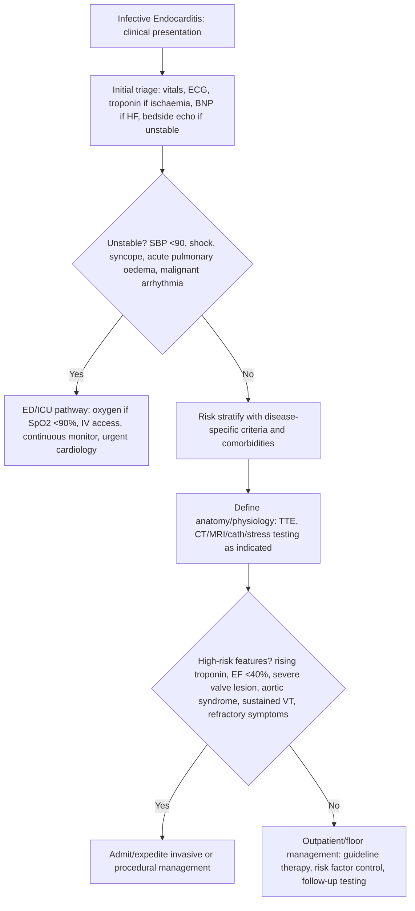

## Overview

Infective endocarditis (IE) is infection of the endocardial surface of the heart, most commonly involving the cardiac valves. It is characterised by the formation of **vegetations** — masses of fibrin, platelets, and microorganisms adherent to the valve surface — that can cause local destruction, embolism, and haematogenous seeding of distant sites. Despite advances in treatment, mortality remains 15–30%.

## Pathophysiology

IE begins with endothelial injury — from turbulent flow across a diseased valve, a prosthetic surface, or an intravascular catheter — exposing subendothelial collagen and triggering platelet aggregation and fibrin deposition. This sterile thrombus becomes infected during an episode of bacteraemia. Most bacteraemias are transient and cleared by immune defences, but organisms capable of adhering to the thrombus establish a persistent infection.

**Vegetations** grow by accretion, becoming increasingly infected and friable. They cause disease through three mechanisms:
1. **Local destruction** — valvular regurgitation, annular abscess, conduction defects (AV block suggests perivalvular extension)
2. **Embolism** — septic emboli to brain, kidneys, spleen, coronary arteries, or (in right-sided IE) lungs
3. **Immune complex deposition** — Osler nodes, Janeway lesions, Roth spots, glomerulonephritis

**Organisms by clinical setting:**

| Setting | Typical Organism |
|---------|----------------|
| Native valve, community | *Streptococcus viridans* (most common) |
| Healthcare-associated / IV access | *Staphylococcus aureus* (most virulent) |
| IV drug use | *S. aureus* (right-sided, tricuspid valve) |
| Prosthetic valve, early (<1 year) | *S. epidermidis*, *S. aureus* |
| Prosthetic valve, late (>1 year) | As native valve |
| Dental procedure | *Streptococcus* spp |
| Colorectal malignancy | *Streptococcus bovis* — always investigate for colon cancer |
| Culture-negative IE | *Coxiella burnetii* (Q fever), *Bartonella*, HACEK organisms |

## Clinical Presentation

IE typically presents as a **subacute systemic illness** with fever, night sweats, malaise, and weight loss. New or changing murmur is an important sign but may be absent initially. A high index of suspicion is required.

**Peripheral stigmata (immune complex and embolic phenomena):**

| Finding | Description | Mechanism |
|---------|------------|-----------|
| Splinter haemorrhages | Linear haemorrhages under nails | Microemboli |
| Janeway lesions | Painless haemorrhagic macules on palms/soles | Septic emboli |
| Osler nodes | Painful raised nodules on fingertips/toes | Immune complex deposition |
| Roth spots | Retinal haemorrhages with pale centre | Immune complex deposition |
| Clubbing | In chronic IE | |
| Splenomegaly | Immune activation | |

**Remember:** Janeway = painless (J is friendly), Osler = painful (O is for Ouch).

**New AV block in a patient with IE** indicates perivalvular abscess (extension of infection to the AV node) — this demands urgent surgical review.

## Diagnosis

**The Modified Duke Criteria** stratify patients into definite, possible, or rejected IE:

**Major criteria:**
- Positive blood cultures with typical organism (≥2 separate sets, or persistent bacteraemia)
- Evidence of endocardial involvement on echocardiography (vegetation, abscess, new valvular regurgitation, or new prosthetic valve dehiscence)

**Minor criteria:**
- Predisposing cardiac condition or IV drug use
- Fever ≥38°C
- Vascular phenomena (arterial emboli, septic pulmonary infarcts, Janeway lesions)
- Immunological phenomena (Osler nodes, Roth spots, positive rheumatoid factor, GN)
- Positive blood cultures not meeting major criteria

**Definite IE:** 2 major, or 1 major + 3 minor, or 5 minor criteria.

**Blood cultures:** Three sets from three separate sites, at least one hour apart, before any antibiotics. This is the single most important investigation.

**Echocardiography:**
- **TOE is superior to TTE** for detecting vegetations, perivalvular abscess, and prosthetic valve involvement. Sensitivity ~90–95% vs ~60–75% for TTE.
- TOE should be performed in all suspected prosthetic valve IE, all cases with negative TTE but high suspicion, and when complications are suspected.

**Other investigations:** FBC (raised WBC, normocytic anaemia), CRP/ESR, U&E (immune GN), urinalysis (haematuria, proteinuria), CXR (right-sided IE may show septic emboli/pulmonary infiltrates), CT chest/abdomen/pelvis (for embolic complications).

## Management

### Antibiotics

Antibiotic therapy is prolonged (4–6 weeks for native valve, 6 weeks for prosthetic) and typically IV. Regimens are guided by organism and sensitivities:

| Organism | Empirical/Directed Regimen |
|---------|--------------------------|
| Streptococcal native valve | Penicillin G or amoxicillin ± gentamicin (short course) |
| *S. aureus* native valve | Flucloxacillin (IV). Vancomycin if MRSA. |
| Enterococcal | Amoxicillin + gentamicin (or ampicillin + ceftriaxone) |
| Prosthetic valve | Vancomycin + rifampicin + gentamicin (empirical, pending cultures) |
| Culture-negative | Broad spectrum — discuss with microbiology/ID |

**Gentamicin** — used for synergistic bactericidal activity in streptococcal and enterococcal IE. Monitor renal function and levels closely.

### Surgical Indications (urgent or emergency surgery)

- **Heart failure** from valvular destruction (most common indication)
- **Uncontrolled infection** — persistent bacteraemia after 7–10 days adequate antibiotics, perivalvular abscess, fistula, mycotic aneurysm
- **Prevention of embolism** — large (>10mm) mobile vegetation, especially after a cerebral embolic event
- **Prosthetic valve IE** — lower threshold for surgery

### Prophylaxis

Current guidelines (NICE, ESC) recommend antibiotic prophylaxis **only for the highest-risk cardiac conditions** undergoing high-risk dental procedures (those involving gingival manipulation or mucosal incisions):
- Prosthetic cardiac valves (including TAVI)
- Prior IE
- Congenital heart disease — cyanotic, or repaired with residual defects

Prophylaxis is **not** recommended for all patients with valvular heart disease. Good oral hygiene remains the most important preventive measure.

## Complications

- Heart failure — from acute severe regurgitation
- Embolic stroke — in 20–40%, especially with mitral vegetation and *S. aureus*
- Perivalvular abscess with complete heart block
- Renal failure — embolic or immune-mediated GN
- Mycotic aneurysm — may rupture, causing catastrophic haemorrhage

## Clinical Insight

*Streptococcus bovis* bacteraemia — now reclassified as *S. gallolyticus* — has a well-established association with colorectal carcinoma. Any patient with IE caused by this organism must undergo colonoscopy before or shortly after completing treatment.

New conduction abnormality (PR prolongation or AV block) in a patient with IE is a surgical emergency. It indicates that the infection has burrowed into the interventricular septum or AV node — a perivalvular abscess that will not respond to antibiotics alone and has a high risk of complete heart block and sudden death.

The blood culture is sacred. Drawing cultures after antibiotics are started dramatically reduces sensitivity and may leave you treating for six weeks without ever knowing the organism. Delay antibiotics by 30–60 minutes to obtain three properly drawn sets — this is almost always achievable and clinically safe.
