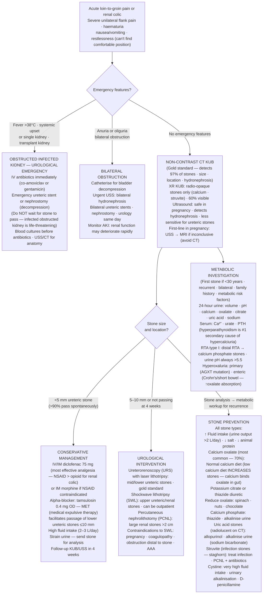

## Overview

Nephrolithiasis — renal stone disease — is common, affecting approximately 10–15% of the population at least once in a lifetime, with a high recurrence rate (50% within 10 years without intervention). Stones form when urine becomes supersaturated with stone-forming salts, either due to increased solute excretion or decreased inhibitory factors. The clinical presentation is determined by stone size and location. Understanding stone composition drives targeted prevention.

## Pathophysiology

Stone formation requires supersaturation of the urine with crystalline salts — calcium oxalate, uric acid, struvite, cystine — beyond their solubility threshold. This is facilitated by:
- **Increased solute concentration:** hypercalciuria, hyperoxaluria, hyperuricosuria, hypocystinuria
- **Reduced urine volume:** dehydration, inadequate fluid intake
- **Altered urine pH:** acid urine favours uric acid and cystine stones; alkaline urine favours calcium phosphate and struvite
- **Reduced inhibitors:** hypocitraturia, low levels of nephrocalcin and Tamm-Horsfall protein

**Stone types and associations:**

| Type | Composition | Frequency | Radiopacity | Key Associations |
|------|------------|-----------|------------|-----------------|
| Calcium oxalate | CaOx monohydrate/dihydrate | ~75% | Radiopaque | Hypercalciuria, hyperoxaluria, hypocitraturia |
| Calcium phosphate | Hydroxyapatite | ~10% | Radiopaque | Distal RTA (type 1), hyperparathyroidism |
| Uric acid | Urate | ~10% | Radiolucent (invisible on plain film) | Gout, DM, metabolic syndrome, acidic urine |
| Struvite (infection) | Mg-NH₄-phosphate | ~5% | Radiopaque | Urease-producing organisms (*Proteus*, *Klebsiella*, *Pseudomonas*) — forms staghorn calculi |
| Cystine | Cystine | ~1% | Mildly opaque | Cystinuria (autosomal recessive) — young patients with recurrent stones |

**Calcium stones** are most common. Causes of hypercalciuria: idiopathic (most common), hyperparathyroidism, sarcoidosis, vitamin D excess, immobility. Intestinal hyperoxaluria occurs after bowel resection or bariatric surgery (fat malabsorption → more oxalate absorbed).

**Uric acid stones** are unique in being radiolucent — invisible on plain abdominal X-ray but visible on CT. They form in acid urine (pH <5.5) and dissolve with urinary alkalinisation — the only stone type treatable medically.

## Clinical Presentation

**Renal colic:** The classic presentation. Severe, cramping, colicky loin pain that radiates to the ipsilateral iliac fossa and groin (following the ureter), associated with nausea, vomiting, and haematuria. The pain is **characteristically restless** — the patient moves constantly trying to find a position of comfort, distinguishing it from peritonitis where the patient lies still.

Pain from ureteric colic is among the most severe pains in clinical medicine. It occurs in waves as the ureter peristaltically contracts against the obstruction.

**Localisation of pain by stone position:**
- Pelviureteric junction (PUJ): loin pain, costovertebral angle tenderness
- Mid-ureter: pain radiates to the iliac fossa
- Lower ureter / vesicoureteric junction (VUJ): radiation to the groin, scrotum, or labia, with frequency and urgency (mimic of UTI or testicular pathology)

**Haematuria** — macroscopic or microscopic — is present in >90% of cases. Its absence does not exclude a stone (complete obstruction can prevent haematuria).

**Features suggesting complicated stone (requires urgent urology):**
- Fever and rigors (infected obstructed system — surgical emergency)
- Bilateral obstruction or obstruction of a solitary kidney (causing AKI)
- Stone in a transplant kidney
- Anuria

**Differential for loin-to-groin pain:**
- Pyelonephritis — fever, systemic upset, tenderness without colic, positive urine culture
- Appendicitis — right iliac fossa, migration of pain, guarding, Rovsing's sign
- Ruptured ectopic pregnancy — always in women of reproductive age; haemodynamic instability
- Aortic dissection or leaking AAA — older patient, pulsatile mass, haemodynamic compromise

## Diagnosis

**Urine dipstick:** Haematuria (positive in >90%). Nitrites/leucocytes if infection present.

**Non-contrast CT KUB (kidney, ureter, bladder):** Investigation of choice. Sensitivity and specificity >95% for all stone types including radiolucent uric acid stones. Identifies stone size, location, degree of hydronephrosis, and alternative diagnoses. Replaces plain X-ray as first-line imaging.

**Plain abdominal X-ray (KUB):** Can identify radiopaque stones (calcium, struvite) and is useful for follow-up of known radiopaque stones. Misses uric acid and cystine stones. Not reliable as an initial investigation.

**Ultrasound:** Sensitive for hydronephrosis but less sensitive for ureteric stones. Preferred in pregnancy (avoids radiation) and in children. May miss small stones.

**Bloods:** U&E (AKI from obstruction), FBC (infection), serum calcium, uric acid, PTH (if recurrent stones or hypercalcaemia).

**Stone analysis:** If a stone is passed or retrieved, send for chemical analysis to guide metabolic evaluation and prevention.

**24-hour urine collection** (after acute episode has resolved, for recurrent stone-formers): Calcium, oxalate, uric acid, citrate, sodium, creatinine, and volume — identifies specific metabolic abnormalities to target with prevention.

## Management

### Acute Renal Colic

**Analgesia is the priority:**
- **NSAIDs** (diclofenac IM or IV, or oral) — first-line for renal colic. Prostaglandin inhibition reduces ureteral smooth muscle contraction and ureteral oedema, providing superior analgesia to opioids in most patients.
- **Paracetamol** — adjunct or if NSAIDs contraindicated
- **Opioids** (morphine, pethidine) — for severe pain or NSAID contraindication; pethidine is preferred by some for renal colic but morphine is adequate
- **Antiemetics** — ondansetron or metoclopramide

**Hydration:** Maintain good hydration. High fluid intake (>2L/day) encourages stone passage. IV fluids if the patient cannot tolerate orally.

**Medical expulsive therapy:** **Tamsulosin** (alpha-1 blocker) — relaxes the distal ureteral smooth muscle, facilitating spontaneous stone passage. Most beneficial for stones in the lower ureter (VUJ). Increases passage rates for stones ≤10mm.

**Expectant management (watchful waiting):**
- Stones ≤5mm: 80–90% pass spontaneously. Discharge with analgesia and safety netting.
- Stones 5–10mm: 50% pass spontaneously. Tamsulosin increases passage rate.
- Stones >10mm: unlikely to pass; refer for intervention.

### Urological Intervention

| Indication | Preferred Approach |
|-----------|-------------------|
| Stone >10mm or failing to pass | Shockwave lithotripsy (SWL) or ureteroscopy |
| Infected obstructed system | Emergency ureteric stenting or nephrostomy (surgical emergency) |
| Staghorn calculus (struvite) | Percutaneous nephrolithotomy (PCNL) |
| Stone causing AKI from bilateral obstruction | Emergency decompression |

**Shockwave lithotripsy (SWL):** Non-invasive. Focused external shock waves fragment stones. Best for renal stones <20mm. Not suitable for cystine or calcium oxalate monohydrate stones (resistant to fragmentation).

**Ureteroscopy + laser lithotripsy:** Flexible ureteroscope passed retrograde. Holmium laser fragments stones. Effective for ureteric and small renal stones.

**PCNL (percutaneous nephrolithotomy):** Percutaneous tract into the renal collecting system under fluoroscopic guidance. For large (>20mm) or complex renal stones or staghorn calculi.

### Prevention of Recurrence

**Universal:** High fluid intake — target urine output >2.5 L/day. Reduce sodium intake (reduces urinary calcium excretion). Reduce animal protein (reduces urinary uric acid and calcium). Maintain normal calcium intake (low calcium diet paradoxically increases oxalate absorption).

**Type-specific:**

| Stone Type | Targeted Prevention |
|-----------|-------------------|
| Calcium oxalate | Thiazide diuretics (reduce urinary calcium), potassium citrate (increases citrate, alkalinises urine), reduce oxalate-rich foods (spinach, rhubarb, nuts) |
| Uric acid | Allopurinol (reduces uric acid production), potassium citrate (alkalinises urine — dissolves existing stones) |
| Struvite | Treat underlying infection; antibiotic prophylaxis; acetohydroxamic acid (urease inhibitor) |
| Cystine | High fluid intake, D-penicillamine or tiopronin (chelation), urinary alkalinisation |

## Complications

- Ureteric obstruction with AKI — particularly with solitary kidney or bilateral stones
- Infected obstructed system (pyonephrosis) — life-threatening sepsis; emergency decompression
- Chronic hydronephrosis from untreated obstruction → irreversible renal scarring
- Recurrence — high without targeted metabolic investigation and prevention

## Clinical Insight

Fever in the context of renal colic is an emergency until proven otherwise. A stone causing ureteral obstruction in the presence of a urinary tract infection creates a closed space infection — pyonephrosis — with septicaemia that can progress to septic shock within hours. These patients need emergency decompression (stent or nephrostomy) regardless of how unwell they look at presentation; they can deteriorate rapidly.

Uric acid stones are the only stones amenable to medical dissolution. Urinary alkalinisation with potassium citrate to achieve a urine pH of 6.5–7.0 dissolves uric acid stones that would otherwise require urological intervention. They are also invisible on plain X-ray — always use CT in patients with suspected stones, not plain KUB, to avoid missing this treatable diagnosis.

Always investigate a first stone in a child, a woman, or an adult under 25. Primary hyperparathyroidism, distal RTA, cystinuria, and hyperoxaluria are important treatable causes that present early. A 34-year-old on their second episode has already crossed the threshold for full metabolic evaluation.
