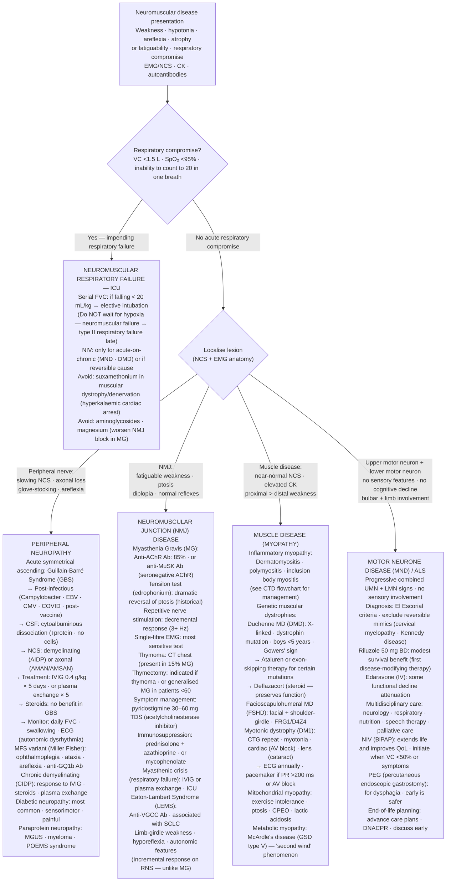

## Overview

Neuromuscular diseases affect the motor unit — the lower motor neuron (anterior horn cell), peripheral nerve, neuromuscular junction, or muscle. They present with weakness, wasting, reduced reflexes, and in some cases sensory disturbance. The anatomical level of pathology determines the clinical pattern and the most appropriate investigation. Two of the most clinically important conditions — Guillain-Barré syndrome and myasthenia gravis — are discussed in detail here, alongside an overview of other major neuromuscular conditions.

---

## Guillain-Barré Syndrome (GBS)

### Pathophysiology

GBS is an acute immune-mediated polyneuropathy. Molecular mimicry between pathogen antigens and peripheral nerve gangliosides (particularly GM1 and GQ1b) triggers an autoimmune attack on the peripheral nervous system. The most common variant — **acute inflammatory demyelinating polyneuropathy (AIDP)** — targets the myelin sheath, causing demyelination and saltatory conduction failure. Less common variants include axonal GBS (AMAN/AMSAN) — often following *Campylobacter jejuni* infection — and **Miller Fisher syndrome** (ophthalmoplegia, ataxia, areflexia, anti-GQ1b antibodies).

**Preceding triggers** include *Campylobacter jejuni* gastroenteritis (most common, ~30%), CMV, EBV, Mycoplasma, influenza, and — more recently recognised — SARS-CoV-2 and influenza vaccination (extremely rare).

### Clinical Presentation

**Classic presentation**: Ascending, symmetrical, rapidly progressive limb weakness beginning distally, with areflexia. Typically beginning 2–4 weeks after an infectious trigger.

Key features:
- **Ascending weakness**: Starts in the legs, progresses upward over days to weeks. Proximal and distal involvement.
- **Areflexia**: Loss of deep tendon reflexes is universal and often the earliest sign — even before weakness is clinically evident.
- **Sensory symptoms**: Tingling, numbness, and pain are common (particularly early), but motor features dominate.
- **Autonomic dysfunction**: Highly dangerous — cardiac arrhythmias, labile blood pressure, urinary retention, ileus. A major cause of death in GBS.
- **Cranial nerve involvement**: Facial diplegia (bilateral facial weakness — pathognomonic of GBS if combined with ascending weakness), oropharyngeal weakness (dysphagia), ophthalmoplegia (in Miller Fisher variant).
- **Back pain**: Common presenting feature, particularly in children.

**Respiratory failure** is the most life-threatening complication. The diaphragm and intercostal muscles may be involved as weakness ascends. Respiratory failure can develop rapidly — **serial vital capacity (VC) measurement every 4–6 hours is mandatory**, not ABG. By the time the ABG shows CO₂ retention, respiratory reserve is already critically compromised.

**Criteria for elective intubation** (the "20-30-40 rule"):
- VC <20 mL/kg (or <1.5 L in adults)
- Maximum inspiratory pressure <30 cmH₂O
- Maximum expiratory pressure <40 cmH₂O

### Diagnosis

**CSF** — classic finding: **albuminocytological dissociation** — elevated protein (>0.45 g/L, often >1 g/L) with normal cell count (<10 cells/mm³). CSF may be normal in the first week — repeat if strongly suspected.

**Nerve conduction studies (NCS)**: Demyelinating pattern in AIDP (reduced conduction velocity, prolonged F-waves, conduction block); axonal pattern in AMAN (reduced amplitude with preserved velocity).

**Anti-ganglioside antibodies**: Anti-GQ1b — Miller Fisher syndrome and Bickerstaff brainstem encephalitis. Anti-GM1 — axonal AMAN (post-Campylobacter).

**Bloods**: FBC, U&E, LFTs, CRP, stool culture (Campylobacter), serology for infectious triggers.

**Spirometry/peak cough flow**: Monitor VC 4-hourly. Vital capacity and cough strength are the key respiratory monitoring parameters — predict need for intubation better than ABG.

### Management

**Supportive care** is the cornerstone:
- ICU admission or high-dependency care for monitoring
- Serial VC — escalate to elective intubation if criteria met (far safer than emergency intubation during respiratory arrest)
- Autonomic monitoring — continuous cardiac monitoring, regular BP checks; treat arrhythmias and blood pressure instability
- VTE prophylaxis — LMWH + compression stockings (immobility + autonomic dysfunction = high DVT risk)
- Pain management — neuropathic pain is significant; gabapentin or carbamazepine
- Bladder catheterisation for urinary retention
- Nutritional support via NG tube if dysphagia present
- Physiotherapy and early rehabilitation

**Disease-modifying treatment** (equally effective — choose one):
- **IV immunoglobulin (IVIg) 2 g/kg over 5 days** — most widely used; neutralises antibodies, reduces complement activation
- **Plasma exchange (PLEX)** — removes circulating antibodies; equivalent efficacy to IVIg; five exchanges over 2 weeks

**Steroids are not effective in GBS** and are not recommended. (Contrast with CIDP, where steroids are beneficial.)

**Prognosis**: Most patients plateau within 4 weeks. 80% walk independently by 6 months. ~5% mortality (from autonomic instability, respiratory failure, PE). 5–10% have severe permanent disability. IVIG/PLEX accelerates recovery but does not improve long-term outcome in mild disease.

---

## Myasthenia Gravis

### Pathophysiology

Myasthenia gravis (MG) is an autoimmune disorder of the **neuromuscular junction** (NMJ). In ~85% of cases, IgG antibodies bind to **acetylcholine receptors (AChR)** on the postsynaptic membrane, causing receptor internalisation, complement-mediated destruction, and impaired neuromuscular transmission.

In ~5–10%, antibodies target **muscle-specific kinase (MuSK)** — associated with more severe bulbar and respiratory involvement. In ~10–15%, antibodies are not detected ("seronegative MG") — LRP4 antibodies or yet-unidentified targets.

**Thymus** is central to the pathogenesis: thymic hyperplasia is found in 70% of AChR-MG patients; thymoma in 10–15%. Thymectomy is beneficial regardless of thymoma status.

The hallmark is **fatigable weakness** — weakness that worsens with repeated activity and improves with rest, reflecting depletion of ACh vesicles at poorly receptive NMJs.

### Clinical Presentation

**Ocular features** (initial presentation in 60%, eventually in 90%):
- **Ptosis** — unilateral or bilateral, variable, worse toward end of day
- **Diplopia** — from variable ophthalmoplegia; does not conform to any single cranial nerve palsy (distinguishes from CN3/4/6 palsy)

**Bulbar features**: Dysarthria (nasal, slurred voice that worsens during conversation — "fatigable dysarthria"), dysphagia (difficulty with solid food), facial weakness ("snarl" rather than smile on attempted smiling), jaw fatigue.

**Limb weakness**: Proximal > distal; upper > lower limbs; bilateral and symmetric.

**Myasthenic crisis**: Rapid deterioration with severe bulbar weakness and respiratory failure — can be triggered by infection, surgery, pregnancy, or medication changes. **VC monitoring is essential** — same principles as GBS.

**Cholinergic crisis** (from excess acetylcholinesterase inhibitor): Miosis, bradycardia, hypersalivation, lacrimation, diarrhoea, muscle fasciculations — distinguish from myasthenic crisis (treatment is opposite).

### Diagnosis

**Anti-AChR antibodies**: Present in 85% of generalised MG; highly specific (>99%). Titre does not correlate with severity.

**Anti-MuSK antibodies**: In AChR-seronegative generalised MG.

**Tensilon (edrophonium) test**: Short-acting acetylcholinesterase inhibitor; dramatically and transiently improves ptosis and diplopia. Rarely used now due to bradycardia risk (have atropine available).

**Ice pack test**: Apply ice to closed eyelid for 2 minutes — temporary improvement in ptosis (cooling improves NMJ function). Safe, specific, bedside test.

**Repetitive nerve stimulation (RNS)**: Decremental response (>10% decrement in CMAP amplitude at 3 Hz) — moderately sensitive.

**Single-fibre EMG (SFEMG)**: Most sensitive investigation for NMJ disease. Increased "jitter" (variability in transmission time between two muscle fibres from the same motor unit). Sensitivity >95% for generalised MG.

**CT chest**: Mandatory — identify thymoma (treat urgently) or thymic hyperplasia.

### Management

**Acetylcholinesterase inhibitors (pyridostigmine)**: Symptomatic treatment — blocks ACh breakdown at NMJ, increasing available ACh. Improves strength but does not modify disease. Starting dose 30–60 mg orally every 4–6 hours. GI side effects (cramps, diarrhoea) managed with propantheline.

**Immunosuppression** (for disease modification):
- **Prednisolone** — first-line. Start low and increase slowly (rapid initiation can cause temporary worsening). Typically requires 2–4 months for full effect.
- **Azathioprine** — steroid-sparing agent; onset 12–18 months; combined with prednisolone. Check TPMT enzyme activity before starting (genetic polymorphism → severe myelosuppression if low).
- **Mycophenolate, ciclosporin, tacrolimus** — second-line steroid-sparing options.
- **Rituximab** — particularly effective in MuSK-MG.

**Thymectomy**: Recommended for all patients with thymoma (regardless of MG severity) and for AChR-positive generalised MG in patients <60 years without thymoma (MGTX trial: superior outcomes with thymectomy + prednisolone vs prednisolone alone).

**Myasthenic crisis management**:
- ICU, VC monitoring, elective intubation if VC <1.5 L
- IVIg 2 g/kg or PLEX (equally effective; faster onset than immunosuppression)
- Withhold pyridostigmine during intubation (reduces secretions)
- Identify and treat precipitant (infection is most common)

**Drugs to avoid in MG** (impair NMJ transmission):
- Aminoglycosides, fluoroquinolones, macrolides
- Beta-blockers
- Procainamide, quinidine
- Penicillamine (can induce MG)
- Iodinated contrast agents (use with caution)
- Magnesium (blocks NMJ)

---

## Other Neuromuscular Conditions — Overview

**Motor neurone disease (MND/ALS)**: Upper and lower motor neuron degeneration without sensory involvement. Progressive bulbar palsy (dysarthria, dysphagia) + limb weakness ± respiratory failure. Riluzole (modest survival benefit). Multidisciplinary care. PEG feeding, NIV for respiratory failure.

**Charcot-Marie-Tooth (CMT)**: Most common inherited peripheral neuropathy. Progressive distal weakness and wasting, high-arched feet (pes cavus), hammer toes, areflexia. Demyelinating (CMT1) or axonal (CMT2). No disease-modifying treatment.

**Myotonic dystrophy (DM1)**: Most common adult muscular dystrophy. CTG repeat expansion in DMPK gene. Myotonia (delayed muscle relaxation — cannot release grip), facial weakness, ptosis, distal limb weakness, cardiac conduction disease (ECG mandatory — risk of heart block and sudden death), endocrine involvement (diabetes, hypothyroidism, hypogonadism), cognitive features.

## Clinical Insight

In GBS, the vital capacity is the vital sign. ABG will remain reassuringly normal until the patient is in acute respiratory failure — by which time emergency intubation under difficult circumstances is required. A VC of 1.5 L, or a drop of 30% from baseline, is the threshold for elective intubation. Serial 4-hourly VC measurements from the moment of diagnosis allow a planned, controlled procedure rather than a crash intubation.

Drugs that worsen myasthenia gravis are encountered constantly in hospital medicine. Aminoglycosides, fluoroquinolones, and macrolides are all commonly prescribed antibiotics that impair neuromuscular transmission. Before prescribing any of these to a patient with MG, assess whether the risk is justified. In a myasthenic crisis precipitated by infection, the antibiotic choice must balance treating the infection against the risk of worsening NMJ transmission.

The fatigable nature of MG is its defining characteristic and the key to diagnosis at the bedside. Ask the patient to sustain upgaze for 60 seconds — progressive ptosis developing over this time is virtually diagnostic of MG. The ice pack test (ice on closed lid for 2 minutes → ptosis improves transiently) has over 80% sensitivity and is completely safe — it can be performed immediately while waiting for serological confirmation.
