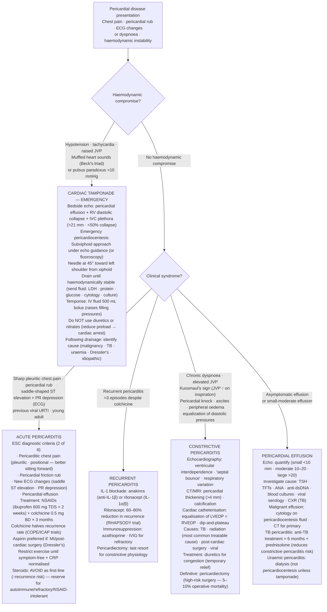

## Overview

Pericardial diseases encompass a spectrum of conditions affecting the two-layered fibroserous sac surrounding the heart. The three major clinical entities — acute pericarditis, pericardial effusion with tamponade, and constrictive pericarditis — represent a continuum of inflammation, fluid accumulation, and fibrosis, respectively.

## Pathophysiology

The pericardium normally contains 15–50 mL of serous fluid. Inflammation → exudate production → friction rub. Fluid accumulation → pericardial effusion. If fluid accumulates rapidly or in large quantity, intrapericardial pressure rises and compresses the cardiac chambers → tamponade.

Chronic inflammation or recurrent disease can lead to fibrosis and calcification of the pericardium, producing a rigid shell that restricts diastolic filling → constrictive pericarditis.

**Causes by frequency:**
- Viral (most common, ~85%) — Coxsackievirus B, Echovirus, EBV, CMV; often post-viral immune-mediated
- Bacterial — TB (most common bacterial cause worldwide), Staph, Strep. Purulent pericarditis is rare but life-threatening.
- Autoimmune — SLE, RA (serositis)
- Post-cardiac injury — Dressler's syndrome (autoimmune, weeks after MI or cardiac surgery)
- Uraemia — common in ESRD; does not respond to NSAIDs; treat with dialysis
- Malignancy — breast, lung, lymphoma
- Drug-induced — hydralazine, procainamide, isoniazid

---

## Acute Pericarditis

### Diagnosis

Diagnosis requires at least two of the following four criteria:

1. **Pericarditic chest pain** — sharp, pleuritic, positional (worse supine, better leaning forward)
2. **Pericardial friction rub** — three-component scratching sound, best heard at LLSB with patient leaning forward
3. **ECG changes** — diffuse saddle-shaped ST elevation with PR depression (reciprocal PR elevation in aVR)
4. **Pericardial effusion** on echocardiogram

**Distinguishing pericarditis ECG from STEMI:**

| Feature | Pericarditis | STEMI |
|---------|-------------|-------|
| ST morphology | Concave up ("saddle") | Convex up |
| Distribution | Diffuse (all territories) | Focal (one vascular territory) |
| PR depression | Present | Absent |
| Reciprocal ST depression | Absent | Present |

### Management

- **NSAIDs + colchicine** is the cornerstone of treatment. Ibuprofen 600mg three times daily for 1–2 weeks.
- **Colchicine 0.5mg BD for 3 months** is mandatory alongside NSAIDs — it halves the recurrence rate (COPE and ICAP trials).
- Restrict strenuous physical activity until symptom-free and CRP has normalised.
- **Post-MI pericarditis (early):** aspirin + colchicine. Avoid NSAIDs — they impair myocardial healing.
- **Uraemic pericarditis:** dialysis. NSAIDs are ineffective.
- **Steroids** — only if NSAIDs are contraindicated or disease is autoimmune/idiopathic recurrent; increases recurrence risk and should not be used routinely.
- **Anakinra** (IL-1 receptor antagonist) — for corticosteroid-dependent recurrent pericarditis refractory to colchicine (AIRTRIP trial)

---

## Pericardial Effusion and Cardiac Tamponade

### Pathophysiology

The pericardium has limited compliance. A slowly accumulating large effusion (e.g., 1 litre over months in malignancy) may be tolerated with minimal haemodynamic compromise. However, even 150–200 mL accumulating rapidly (e.g., haemopericardium from trauma or aortic dissection) can raise intrapericardial pressure above diastolic filling pressures, compressing the cardiac chambers and reducing cardiac output.

### Clinical Presentation — Tamponade

**Beck's Triad:**
1. Hypotension
2. Elevated JVP
3. Muffled heart sounds

**Pulsus paradoxus** — an exaggerated fall in systolic BP (>10 mmHg) during inspiration. Normally SBP drops <10 mmHg with inspiration. In tamponade, inspiratory RV expansion displaces the interventricular septum toward the LV, further reducing LV output during inspiration.

Additional features: sinus tachycardia, narrow pulse pressure, electrical alternans on ECG (alternating QRS axis from cardiac swinging in fluid), low voltage.

**Echocardiography** is diagnostic — diastolic collapse of the RA and RV is pathognomonic.

### Management

- IV fluids — maintain preload (tamponade is preload-dependent; these patients cannot tolerate diuretics or nitrates)
- **Urgent pericardiocentesis** — non-haemorrhagic tamponade. Dramatic haemodynamic improvement follows even small-volume drainage.
- **Surgical drainage** — haemorrhagic tamponade (trauma, aortic dissection)

---

## Constrictive Pericarditis

### Pathophysiology

Fibrous scarring of the pericardium creates a rigid, non-compliant shell. Diastolic filling is abruptly halted when the heart meets the stiff pericardium, producing characteristic "dip-plateau" haemodynamics. All four filling pressures equilibrate at the same elevated value.

**Causes:** TB (most common worldwide), prior pericarditis, post-cardiac surgery, radiation therapy, autoimmune disease.

### Clinical Presentation

- Progressive right heart failure — elevated JVP, peripheral oedema, hepatomegaly, ascites
- **Kussmaul's sign** — paradoxical rise in JVP with inspiration (opposite of normal). The constrictive pericardium prevents the RV from expanding to accommodate increased venous return with inspiration.
- **Pericardial knock** — early diastolic sound coinciding with abrupt termination of rapid ventricular filling
- No pulsus paradoxus (unlike tamponade)

**Distinguishing tamponade from constrictive pericarditis:**

| Feature | Tamponade | Constrictive Pericarditis |
|---------|-----------|--------------------------|
| Pulsus paradoxus | Present | Absent |
| Kussmaul's sign | Absent | Present |
| JVP waveform | Blunted y descent | Prominent y descent |
| Pericardial knock | Absent | Present |
| Calcification on imaging | Absent | Often present |

### Management

Pericardiectomy is the definitive treatment. Medical management of fluid overload provides symptom relief while awaiting surgery.

## Clinical Insight

Colchicine is not optional. Adding it to NSAIDs halves the recurrence rate at virtually zero additional cost or toxicity. Every patient with pericarditis should receive it for three months.

Beck's triad is present in only a minority of tamponade cases. The clinical diagnosis is made at the bedside by the combination of rising JVP, hypotension, tachycardia, and a plausible cause (recent procedure, malignancy, infection). Waiting for all three components of the classic triad before acting is dangerous.

Kussmaul's sign is a reliable and specific finding for constrictive pericarditis. Its presence in a patient with right heart failure, a history of TB, or prior chest irradiation should immediately raise the diagnosis.
