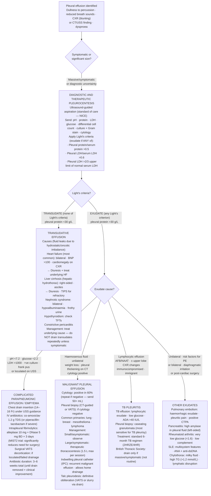

## Overview

A pleural effusion is an abnormal accumulation of fluid in the pleural space. The normal pleural space contains only 10–20 mL of fluid — the balance between production (primarily by the parietal pleura) and absorption (primarily via lymphatics). Effusions develop when this balance is disrupted by increased fluid production, reduced absorption, or both. The clinical priority is to determine whether the effusion is a **transudate** (a systemic process affecting fluid dynamics) or an **exudate** (a local process involving the pleura itself), as this fundamentally directs the diagnostic and management pathway.

## Pathophysiology

Fluid accumulates in the pleural space through four main mechanisms:

1. **Elevated hydrostatic pressure** (heart failure) — increased capillary pressure drives fluid from parietal pleural capillaries into the pleural space
2. **Reduced oncotic pressure** (hypoalbuminaemia in nephrotic syndrome, cirrhosis, malnutrition) — reduced plasma protein reduces the osmotic force holding fluid in the vasculature
3. **Increased capillary permeability** (inflammation, infection, malignancy) — disrupted endothelial integrity allows protein-rich fluid to leak
4. **Impaired lymphatic drainage** (malignancy, lymphoma) — normal pleural fluid reabsorption is blocked

Transudates result from mechanisms 1 and 2. Exudates result from mechanisms 3 and 4.

## Clinical Presentation

Small effusions (<300 mL) may be asymptomatic. As volume increases, breathlessness from lung compression becomes the dominant symptom. Associated symptoms provide critical diagnostic clues:

- **Pleuritic chest pain** — suggests pleural inflammation (infection, PE, malignant mesothelioma)
- **Fever and purulent sputum** — parapneumonic effusion or empyema
- **Peripheral oedema and orthopnoea** — heart failure
- **Weight loss, night sweats, haemoptysis** — malignancy or TB
- **Ascites and jaundice** — hepatic hydrothorax (cirrhosis)

**Examination findings:**
- Stony dullness to percussion — highly characteristic of pleural fluid (distinguishes from consolidation which produces a duller rather than stony note)
- Reduced or absent breath sounds and tactile vocal fremitus
- Tracheal deviation away from a large effusion; toward an effusion if the underlying lung is collapsed by an obstructing mass

## Diagnosis

**CXR:** Blunting of the costophrenic angle (>200 mL), meniscus sign, haziness of the lower zone. Mediastinal shift away from a large effusion; shift toward it suggests underlying collapse (malignant airway obstruction). Loculated effusions have an atypical distribution.

**Pleural ultrasound:** Mandatory before any pleural procedure. More sensitive than CXR for small effusions, identifies loculations, guides safe drainage, and reduces complication rates. Real-time ultrasound guidance is now the standard of care.

**CT thorax with contrast:** Characterises the pleura (smooth vs nodular/irregular — the latter strongly suggests malignancy or empyema), identifies underlying parenchymal or mediastinal pathology, and guides biopsy planning.

**Pleural fluid analysis — Light's criteria:**

An exudate is defined by **at least one** of the following:
- Pleural fluid protein / serum protein >0.5
- Pleural fluid LDH / serum LDH >0.6
- Pleural fluid LDH > 2/3 upper limit of normal for serum LDH

A transudate meets none of these criteria.

**Additional pleural fluid tests:**

| Test | Use |
|------|-----|
| pH | pH <7.2 in parapneumonic effusion = complicated; requires drainage |
| Glucose | Low in infection, malignancy, RA |
| Cytology | Malignant cells — sensitivity ~60%; send ≥50 mL for best yield |
| Microbiology | MC&S; Ziehl-Neelsen and TB culture if TB suspected |
| LDH | Elevated in infection, malignancy |
| Triglycerides | >1.24 mmol/L = chylothorax (lymphatic disruption) |
| Haematocrit | >50% of serum haematocrit = haemothorax |
| Amylase | Elevated in oesophageal rupture, pancreatitis |

**Causes by fluid type:**

| Transudate | Exudate |
|-----------|--------|
| Heart failure (most common) | Malignancy (most common in adults) |
| Liver cirrhosis (hepatic hydrothorax) | Parapneumonic effusion / empyema |
| Nephrotic syndrome | Tuberculosis |
| Hypoalbuminaemia | Pulmonary embolism |
| Hypothyroidism | Mesothelioma |
| Constrictive pericarditis | Autoimmune (RA, SLE) |

## Management

### Transudate

Treat the underlying cause. Heart failure effusions respond to diuresis. Hepatic hydrothorax requires management of portal hypertension (diuretics, TIPSS). Therapeutic thoracocentesis for symptom relief if diuresis is inadequate or slow.

### Parapneumonic Effusion and Empyema

Any pleural fluid associated with pneumonia should be aspirated and the pH measured. A complicated parapneumonic effusion (pH <7.2, glucose <2.2 mmol/L, LDH >1000 U/L, positive MC&S, or frankly purulent) requires **chest drain insertion**. Delay allows loculation and makes drainage progressively more difficult.

**Empyema:** Frank pus in the pleural space. Requires:
- Chest drain — small-bore Seldinger (if free-flowing) or large-bore (loculated)
- Prolonged IV antibiotics (typically 4–6 weeks for empyema)
- Intrapleural fibrinolytics (urokinase or alteplase/DNase combination) if loculated — significantly improves drainage (MIST2 trial)
- VATS decortication for treatment failure

### Malignant Pleural Effusion

Often recurs after simple thoracocentesis. Options for pleurodesis to prevent recurrence:
- **Talc pleurodesis** — talc slurry via chest drain or poudrage via thoracoscopy; induces pleural fibrosis; most effective method
- **Indwelling pleural catheter (IPC)** — tunnelled drain for ambulatory intermittent drainage; preferred if lung is trapped (unable to expand after drainage); equivalent to talc pleurodesis for dyspnoea relief (TIME2 trial)

### Haemothorax

Traumatic or spontaneous haemothorax. Requires large-bore chest drain. Surgical intervention for massive haemothorax (>1500 mL drained initially) or continued bleeding.

## Complications

- Empyema and pleural thickening if infection not drained promptly
- Trapped lung from cortical formation — limits expansion after drainage
- Re-expansion pulmonary oedema — avoid draining >1.5L in a single session
- Pneumothorax and haemothorax from pleural procedures — reduced by ultrasound guidance

## Clinical Insight

Bilateral transudates in the context of heart failure do not routinely need pleural aspiration — treat the heart failure and they will resolve. However, if one effusion is significantly larger than the other, or if there is any atypical feature (fever, chest pain, unilateral exudate), sample it.

A unilateral exudative effusion in a smoker with weight loss is a malignant effusion until proven otherwise. The absence of malignant cells on cytology does not exclude it — sensitivity is only about 60%. Thoracoscopy with pleural biopsy is the investigation of choice for unexplained exudative effusion and achieves a diagnosis in over 90% of malignant cases.

Mesothelioma is the one diagnosis that is easy to miss and devastating to delay. Any pleural effusion with a history of asbestos exposure — even decades prior — should prompt CT, thoracoscopy, and pleural biopsy, regardless of how the fluid looks macroscopically.
