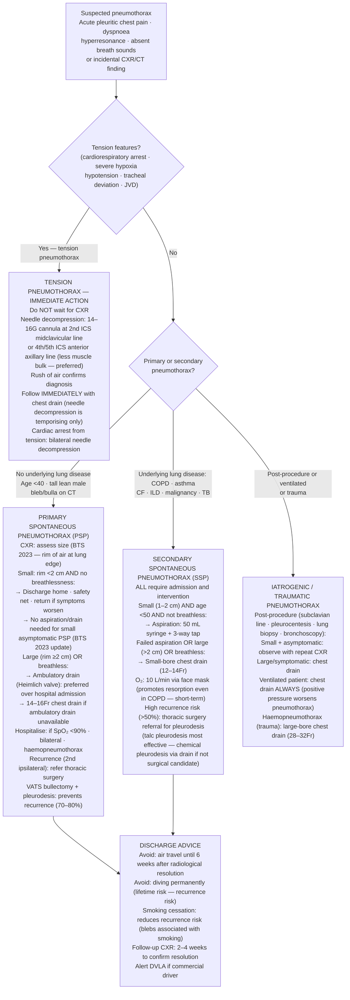

## Overview

A pneumothorax is the presence of air in the pleural space, between the visceral and parietal pleura, causing lung collapse. It is classified by aetiology as primary (no underlying lung disease) or secondary (complicating known lung disease), and clinically as spontaneous, traumatic, or iatrogenic. The distinction matters because management differs substantially.

## Pathophysiology

The pleural space is normally maintained at a slightly negative pressure relative to the atmosphere, which keeps the lungs inflated against the chest wall. Introduction of air — whether through a tear in the visceral pleura or a penetrating chest wound — equalises pleural pressure with atmospheric pressure, collapsing the lung.

**Primary spontaneous pneumothorax (PSP)** occurs in young, tall, thin individuals without diagnosed lung disease. The classic patient is a 20–30-year-old male with a high arm span-to-height ratio. The cause is rupture of subpleural blebs or bullae — small air-filled cysts that develop preferentially at the lung apices, where pleural pressure gradients are greatest in tall individuals. Despite the absence of "lung disease," these patients have subclinical structural vulnerability.

**Secondary spontaneous pneumothorax (SSP)** complicates underlying pulmonary pathology. The lung has reduced reserve, making even a small pneumothorax potentially life-threatening. Common causes include COPD (most common — rupture of emphysematous bullae), asthma, cystic fibrosis, TB, and *Pneumocystis jirovecii* pneumonia (bilateral pneumothoraces in HIV patients with PCP). Marfan syndrome, lymphangioleiomyomatosis (LAM — young women, bilateral recurrent pneumothoraces), and Langerhans cell histiocytosis are rarer causes.

**Tension pneumothorax** is a medical emergency. A one-way valve effect — air enters the pleural space on inspiration but cannot escape — causes progressive accumulation, mediastinal shift away from the affected side, compression of the contralateral lung, and kinking of the great veins. The result is catastrophic reduction in venous return and cardiac output.

## Clinical Presentation

**Typical features:** Sudden ipsilateral pleuritic chest pain and dyspnoea, often at rest. In PSP, symptoms may be mild and the patient may wait hours before presenting.

**Ipsilateral examination findings:** Hyperresonance to percussion, reduced or absent breath sounds, reduced chest expansion. Tracheal deviation **away** from the affected side occurs in large or tension pneumothorax.

**Tension pneumothorax:** This is a **clinical diagnosis** — do not wait for CXR. Features include all of the above plus haemodynamic instability (hypotension, tachycardia), elevated JVP, cyanosis, and deteriorating conscious level. **Decompress immediately** with a large-bore cannula in the 2nd intercostal space at the midclavicular line, followed by chest drain insertion.

**Differential for sudden pleuritic chest pain:**
- PE — risk factors for VTE, tachycardia, hypoxia, normal percussion
- Pneumonia — fever, productive cough, consolidation on CXR
- ACS — central, radiates to arm/jaw, ECG changes
- Aortic dissection — tearing, maximal at onset, mediastinal widening

## Diagnosis

**CXR (erect, PA):** Visible pleural line with absent lung markings beyond it. Size is measured as the rim of air between the lung edge and chest wall at the level of the hilum.

**BTS 2023 sizing:**
- Small: rim <2cm at the hilum
- Large: rim ≥2cm at the hilum

**CT thorax:** If CXR is equivocal (distinguishing bullae from pneumothorax in COPD), for pre-surgical planning, or if underlying pathology needs assessment.

**ABG:** In SSP or if SpO₂ is low — may show type 1 respiratory failure.

## Management

### Tension Pneumothorax — Immediate Action

Do not wait for CXR. **Needle decompression** with a large-bore (14–16G) cannula inserted in the 2nd ICS at the midclavicular line (or 4th/5th ICS at the anterior axillary line — increasingly preferred, less likely to be obstructed by chest wall muscle). A rush of air confirms the diagnosis. This is temporising only — insert a chest drain immediately after.

### Primary Spontaneous Pneumothorax (BTS 2023)

The 2023 guidelines introduced a more conservative approach, reflecting evidence that many PSPs resolve without intervention:

**Small PSP (<2cm) and minimally symptomatic:**
- Conservative management is now first-line — discharge with clear safety netting, analgesia, and advice to return if symptoms worsen
- Patient must be able to mobilise, SpO₂ ≥90%, HR <120, and RR <20
- High-flow oxygen (if admitted) accelerates reabsorption — nitrogen is absorbed faster when replaced by oxygen
- Review at 2–4 weeks

**Large PSP (≥2cm) or significantly symptomatic:**
- **Needle aspiration** — first-line intervention. 2nd ICS MCL or 4th/5th ICS AAL; aspirate with a 16G cannula and 3-way tap up to 2.5L. Successful if lung re-expands and remains expanded after 1 hour.
- If aspiration fails → **small-bore Seldinger chest drain** (8–14Fr)

### Secondary Spontaneous Pneumothorax

- **All patients admitted** — even a small SSP can be life-threatening in a patient with compromised lung function
- Small (<2cm) and mildly symptomatic → admit, oxygen, needle aspiration
- Large or symptomatic → chest drain
- Low threshold for surgical referral

### Surgical Referral Indications

- Second ipsilateral episode
- First contralateral episode
- Bilateral simultaneous pneumothorax
- Failure of drainage (persistent air leak >5 days)
- At-risk occupation (pilots, divers) — **permanent contraindication to diving without bilateral surgical pleurodesis**

Surgery typically involves video-assisted thoracoscopic surgery (VATS) with bullectomy and pleural abrasion or chemical pleurodesis.

**Advice on discharge:** No flying for at least 1 week after confirmed resolution (2 weeks if intervention required). Diving is permanently contraindicated until surgical pleurodesis has been performed.

## Complications

- Tension pneumothorax — haemodynamic collapse if not immediately decompressed
- Haemothorax — particularly with traumatic pneumothorax; requires large-bore drain
- Persistent air leak (bronchopleural fistula) — prolonged drainage, often requires surgery
- Re-expansion pulmonary oedema — rare, occurs after rapid re-expansion of a large or long-standing pneumothorax
- Recurrence — 25–50% after first PSP; 80% after second untreated episode

## Clinical Insight

Tension pneumothorax is a clinical diagnosis. Waiting for a CXR while a patient with a deviated trachea, absent breath sounds, and haemodynamic collapse deteriorates is a potentially fatal error. Recognise the clinical picture and decompress. The needle insertion takes 10 seconds.

In a COPD patient with sudden deterioration, the differential between a pneumothorax and a large bulla on CXR can be genuinely difficult. If in doubt, CT thorax clarifies the anatomy before inserting a drain. Draining a large emphysematous bulla in a patient with severe COPD causes a bronchopleural fistula and is very difficult to manage.

The combination of HIV, bilateral infiltrates, and bilateral spontaneous pneumothoraces is PCP (*Pneumocystis jirovecii* pneumonia) until proven otherwise. The cystic destruction characteristic of PCP creates a predisposition to pneumothorax, and bilateral cases are a hallmark of this diagnosis.
