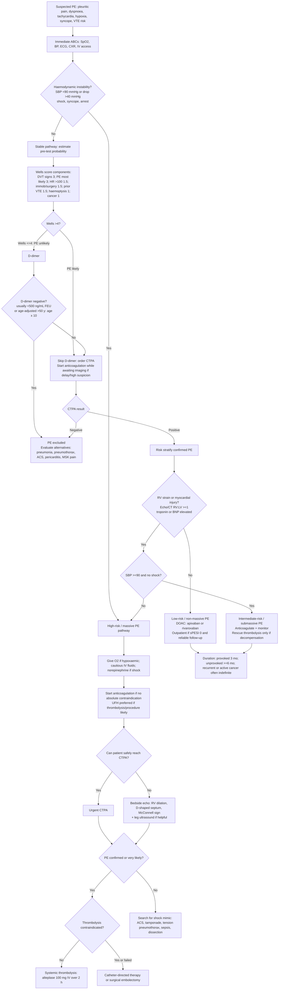

## Overview

Pulmonary embolism (PE) occurs when a thrombus — most commonly arising from the deep veins of the legs or pelvis — embolises to the pulmonary arterial tree, obstructing blood flow to part of the lung. It represents the most severe end of the venous thromboembolism (VTE) spectrum, which includes deep vein thrombosis (DVT). PE ranges from small, incidentally detected subsegmental clots to massive bilateral occlusion causing cardiovascular collapse and death.

## Pathophysiology

**Virchow's triad** describes the three conditions predisposing to venous thrombosis:

| Component | Examples |
|-----------|---------|
| Venous stasis | Immobility (long flights, bed rest, HF), venous obstruction, pregnancy |
| Hypercoagulability | OCP, pregnancy, malignancy, thrombophilia (Factor V Leiden, antiphospholipid syndrome, protein C/S deficiency), dehydration |
| Endothelial injury | Surgery, trauma, central venous catheters |

Once thrombus forms, it may embolise to the pulmonary arteries. The haemodynamic consequences depend on the extent of vascular obstruction and the patient's cardiopulmonary reserve:

- **Small PE:** V/Q mismatch → hypoxaemia. Pleuritic pain and haemoptysis if peripheral (infarction near pleura).
- **Submassive PE:** RV pressure overload → RV dilation and dysfunction → septal shift → LV underfilling → reduced cardiac output. Haemodynamically stable but RV strain evident.
- **Massive PE:** Complete RV failure → cardiogenic shock → cardiovascular collapse. This is a life-threatening emergency requiring immediate intervention.

**Pulmonary infarction** occurs in ~30% — particularly with peripheral clots occluding smaller vessels supplying the pleural surface. It produces the classic triad of pleuritic chest pain, haemoptysis, and a peripheral wedge-shaped opacity on CXR.

## Clinical Presentation

PE is highly variable in presentation. The classical triad of pleuritic pain, haemoptysis, and dyspnoea occurs in only a minority. More commonly, the presentation is dominated by one feature — isolated unexplained dyspnoea, tachycardia, or presyncope.

**Always consider PE in:**
- Unexplained tachycardia or hypoxia with a normal CXR
- Pleuritic chest pain in a young person
- Post-operative dyspnoea
- Dyspnoea with risk factors for VTE but no alternative explanation

**Pre-test probability — Wells PE score:**

| Criterion | Points |
|---------|--------|
| Clinical signs/symptoms of DVT | 3 |
| PE is the most likely diagnosis | 3 |
| HR >100 bpm | 1.5 |
| Immobilisation or surgery in past 4 weeks | 1.5 |
| Previous DVT/PE | 1.5 |
| Haemoptysis | 1 |
| Active malignancy | 1 |

Score ≤4: PE unlikely. Score >4: PE likely. This drives the investigative pathway.

## Diagnosis

**D-dimer:**
- High sensitivity (>95%), low specificity. Elevated in infection, malignancy, pregnancy, surgery, AF, and many other conditions.
- Use only to **rule out** PE in patients with **low pre-test probability** (Wells ≤4). A negative D-dimer in this group safely excludes PE.
- A positive D-dimer in a low-probability patient, or any D-dimer in a high-probability patient, requires imaging.
- Do not use D-dimer as a rule-in test.

**CT pulmonary angiography (CTPA):** Gold standard. Shows filling defects within pulmonary arteries. Also identifies RV dilation (prognostic), alternative diagnoses, and complications. Indicated for all patients with Wells >4, or Wells ≤4 with a positive D-dimer.

**ECG:** Sinus tachycardia (most common finding, >50% of cases). Classic S₁Q₃T₃ (deep S in I, Q wave and T-wave inversion in III) is present in only ~20% and is not specific. RBBB, right axis deviation, and T-wave inversions V1–V4 indicate RV strain. A normal ECG does not exclude PE.

**ABG:** Type 1 respiratory failure (↓PaO₂, ↓PaCO₂ — from hyperventilation). Normal ABG does not exclude PE.

**Echocardiography:** RV dilation and dysfunction, D-shaped septum, tricuspid regurgitation, elevated RVSP. Used when CTPA unavailable or patient is too unstable to transport; can also identify right heart thrombus.

**Lower limb ultrasound:** If DVT is confirmed in a high-probability patient, PE can be assumed and treatment started without waiting for CTPA.

## Management

### Massive PE (haemodynamic instability — systolic BP <90 mmHg or fall >40 mmHg)

- **Systemic thrombolysis** — alteplase 100mg IV over 2 hours. First-line if no absolute contraindications. Reverses RV failure, dramatically improves haemodynamics.
- Contraindications to thrombolysis: same as for STEMI. Prior haemorrhagic stroke is absolute. Recent major surgery or bleeding are relative.
- If thrombolysis fails or is absolutely contraindicated: surgical embolectomy or catheter-directed therapy at a specialist centre.
- Supportive: cautious IV fluids (excessive volume worsens RV dilation), vasopressors (noradrenaline), oxygen, consider intubation only if unavoidable.

### Submassive PE (RV dysfunction, haemodynamically stable)

- Anticoagulation as primary treatment
- Close monitoring for haemodynamic deterioration — if it occurs, consider escalation to thrombolysis or intervention
- Decision to thrombolyse requires careful individualised risk-benefit assessment

### Non-massive PE (haemodynamically stable, no RV dysfunction)

- **Anticoagulate immediately** — do not wait for imaging confirmation if clinical probability is high and the patient is deteriorating. Anticoagulation carries a lower risk than untreated PE.
- **DOACs are first-line** — rivaroxaban or apixaban (no bridging with LMWH required). Simple, effective, and safe.
- LMWH bridging to warfarin — if DOAC is contraindicated (e.g., severe renal impairment, antiphospholipid syndrome — warfarin only for APS).
- Cancer-associated VTE: LMWH or direct oral anticoagulants (edoxaban, rivaroxaban) are preferred over warfarin.

**Duration of anticoagulation:**

| Context | Duration |
|---------|---------|
| Provoked by transient risk factor (surgery, travel, OCP) | 3 months |
| Unprovoked or ongoing risk factor | Minimum 6 months; consider indefinite |
| Recurrent VTE | Indefinite |
| Malignancy-associated | Treat throughout active cancer course |

**Outpatient management:** Validated risk scores (PESI, sPESI) identify low-risk patients suitable for home treatment. sPESI score of 0 with no RV dysfunction and no haemodynamic compromise can be managed outpatient with a DOAC and clear safety-netting.

## Complications

- Death from massive PE or haemodynamic deterioration
- Post-PE pulmonary hypertension — chronic thromboembolic pulmonary hypertension (CTEPH); occurs in ~3–5% of PE survivors; presents with progressive dyspnoea months to years later
- Recurrent VTE — risk highest in unprovoked PE and cancer-associated PE
- Bleeding from anticoagulation

## Clinical Insight

D-dimer is a rule-out test, not a rule-in test. A positive D-dimer in a post-operative patient, someone with active cancer, or an elderly inpatient tells you almost nothing useful. The pre-test probability must drive the decision to image — not the D-dimer result alone.

Antiphospholipid syndrome (APS) is an important consideration in young patients with unprovoked PE, recurrent VTE, or a history of recurrent miscarriage. Test for lupus anticoagulant, anticardiolipin antibodies, and anti-β₂-glycoprotein I antibodies. If confirmed, lifelong warfarin (not DOACs — rivaroxaban performed poorly in APS) is required.

The OCP and long-haul flight are a classic combination. Both independently increase VTE risk — together they are additive. Any young woman on the OCP presenting with pleuritic chest pain and tachycardia after a long journey has PE until proven otherwise.
