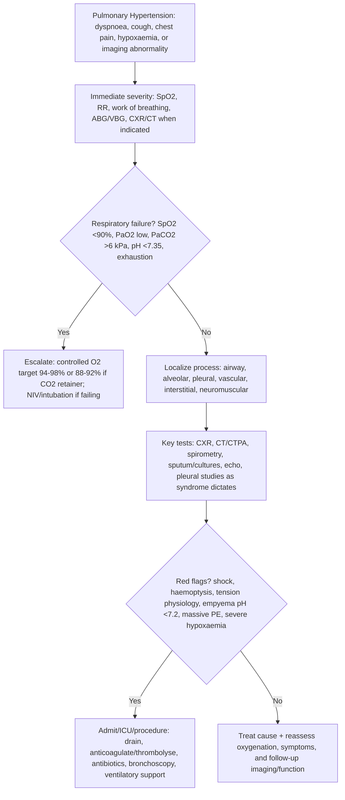

## Overview

Pulmonary hypertension (PH) is defined haemodynamically as a mean pulmonary arterial pressure (mPAP) ≥25 mmHg (≥20 mmHg in updated ESC 2022 guidelines) at rest, measured by right heart catheterisation. It is a haemodynamic finding — not a diagnosis in itself — with a broad range of underlying causes grouped into five WHO classifications. The clinical priority is to identify which group the patient belongs to, as this determines treatment.

**WHO Classification of Pulmonary Hypertension:**

| Group | Category | Common Causes |
|-------|---------|--------------|
| 1 | Pulmonary arterial hypertension (PAH) | Idiopathic, heritable (BMPR2 mutation), connective tissue disease (SSc), congenital heart disease, portal hypertension, HIV, drugs (anorexigens, methamphetamine) |
| 2 | PH due to left heart disease | HFrEF, HFpEF, valvular disease |
| 3 | PH due to lung disease/hypoxia | COPD, interstitial lung disease, OSA, high altitude |
| 4 | CTEPH (chronic thromboembolic PH) | Unresolved PE with organised thrombus |
| 5 | Unclear/multifactorial | Sarcoidosis, haematological disorders, metabolic disease |

**Group 2 (left heart disease) is by far the most common overall** — any cause of elevated left-sided filling pressures will eventually raise pulmonary venous pressure. Groups 1 and 4 are less common but clinically critical because they have specific, targeted treatments.

## Pathophysiology

In pulmonary arterial hypertension (Group 1), the primary abnormality is in the small pulmonary arteries themselves. Endothelial dysfunction leads to an imbalance between vasoconstrictors (endothelin-1, thromboxane A₂) and vasodilators (prostacyclin, nitric oxide), combined with vascular smooth muscle proliferation and in situ thrombosis. The result is progressive obliteration of the pulmonary vascular bed.

The right ventricle adapts to the increased afterload through hypertrophy and dilation. Initially, RV function is preserved. Eventually, as pulmonary pressures rise further, the RV fails — elevated RV filling pressures, impaired LV filling from septal shift, and reduced cardiac output produce the clinical syndrome of right heart failure and low cardiac output.

## Clinical Presentation

PH is insidious and frequently diagnosed late — a median delay of 2–3 years from symptom onset to diagnosis is typical.

**Symptoms:** Progressive exertional dyspnoea (most common initial symptom), exertional chest pain or presyncope (both indicate severely limited cardiac output with exertion), fatigue, peripheral oedema as right heart failure develops, and Raynaud's phenomenon in connective tissue disease-associated PAH.

**Signs of PH and right heart failure:**
- Loud P2 (elevated pulmonary artery pressure transmitted to the valve)
- Right ventricular heave (RV hypertrophy)
- Tricuspid regurgitation murmur (pansystolic at LLSB, louder with inspiration)
- Elevated JVP, peripheral oedema, hepatomegaly (right heart failure)
- Signs of underlying cause: telangiectasiae and sclerodactyly in systemic sclerosis (SSc); digital clubbing in congenital heart disease; signs of portal hypertension

## Diagnosis

**Echocardiography** is the key screening investigation — estimates RVSP (from tricuspid regurgitation jet velocity), assesses RV size and function, excludes congenital or valvular left heart disease, and identifies RV-LV interactions. It does not confirm the diagnosis.

**Right heart catheterisation** is the gold standard — the only investigation that definitively measures mPAP, pulmonary vascular resistance (PVR), pulmonary artery wedge pressure (PAWP), and cardiac output. It is required to confirm PH, classify it (elevated PAWP >15 mmHg = postcapillary / Group 2 vs normal PAWP with high PVR = precapillary / Group 1, 3, 4, 5), and perform vasoreactivity testing in PAH.

**Vasoreactivity testing** (with inhaled NO or IV adenosine) — positive response (>10 mmHg fall in mPAP to <40 mmHg without fall in CO) identifies patients with idiopathic PAH who may respond to high-dose calcium channel blockers (a minority, ~10%).

**Investigations to classify PH:**
- CXR: enlarged pulmonary arteries, pruned peripheral vessels, RV enlargement, underlying lung disease
- ECG: right axis deviation, RVH, P pulmonale, RBBB
- PFTs: distinguish Group 3 causes; reduced DLCO in PAH and ILD
- High-resolution CT (HRCT): identifies ILD (Group 3), emphysema
- CT pulmonary angiography and V/Q scanning: identifies CTEPH (Group 4) — V/Q is more sensitive than CTPA for CTEPH
- Autoimmune screen: ANA, anti-dsDNA, anti-Scl-70, anti-centromere (connective tissue disease)
- HIV test, liver function, hepatitis serology
- Sleep study: OSA

## Management

### Group 2 — Treat the Underlying Left Heart Disease

Optimise HF therapy, treat valvular disease. PAH-targeted therapies are harmful in Group 2 PH and must not be used.

### Group 3 — Treat the Underlying Lung Disease

Supplemental oxygen for hypoxia, CPAP for OSA. PAH-targeted therapies are generally not beneficial.

### Group 4 — CTEPH

**Pulmonary endarterectomy (PEA)** — surgical removal of organised thrombus from the proximal pulmonary arteries. Potentially curative. First-line in surgically accessible disease.

**Balloon pulmonary angioplasty (BPA)** — for inoperable distal disease.

**Riociguat** (soluble guanylate cyclase stimulator) — only PAH-targeted drug approved specifically for CTEPH; improves haemodynamics and exercise capacity.

Lifelong anticoagulation (warfarin) for all CTEPH.

### Group 1 — Pulmonary Arterial Hypertension

Management targets the three pathways driving vasoconstriction and remodelling:

| Pathway | Drug Class | Examples |
|---------|-----------|---------|
| Endothelin pathway | Endothelin receptor antagonists (ERAs) | Ambrisentan, macitentan, bosentan |
| Nitric oxide pathway | PDE-5 inhibitors | Sildenafil, tadalafil |
| Nitric oxide pathway | Soluble guanylate cyclase stimulators | Riociguat |
| Prostacyclin pathway | Prostacyclin analogues | Epoprostenol (IV), iloprost (inhaled), selexipag (oral) |

Modern management uses **combination therapy** upfront — typically an ERA + PDE-5 inhibitor — rather than sequential monotherapy (AMBITION trial: macitentan + tadalafil superior to either alone).

Epoprostenol (IV prostacyclin) remains the most effective agent for severe PAH and the only treatment shown to reduce mortality in a randomised trial. It requires continuous IV infusion via a central line.

**Lung transplantation** — for patients progressing despite maximal medical therapy.

**General measures:** Supervised exercise rehabilitation, oxygen supplementation for hypoxaemia, avoid pregnancy (high mortality), diuretics for right heart failure, anticoagulation in idiopathic PAH.

## Complications

- Right heart failure — the primary cause of death in PAH
- Haemoptysis — from rupture of dilated pulmonary vessels or in-situ thrombosis
- Sudden cardiac death — arrhythmia in advanced disease
- Paradoxical embolism — via patent foramen ovale if right atrial pressure exceeds left

## Clinical Insight

The diagnosis of PAH should never be accepted without right heart catheterisation. Echocardiography overestimates and underestimates RVSP regularly. Treating a patient with expensive, potentially harmful PAH-targeted therapy based on echo alone — without confirmed precapillary haemodynamics — is a significant error.

Systemic sclerosis (especially limited cutaneous SSc) carries a 10–15% lifetime risk of developing PAH, and it tends to be severe. Annual screening echocardiography and DLCO measurement is recommended for all SSc patients. Early detection before significant haemodynamic deterioration substantially improves outcomes.

CTEPH is one of the few conditions in medicine where surgery can be curative. Any patient with a history of PE who develops unexplained progressive breathlessness — even years later — should be evaluated for CTEPH with V/Q scanning, which is more sensitive than CTPA for chronic organised thrombus.
