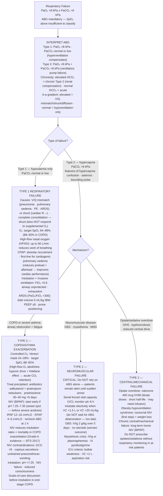

## Overview

Respiratory failure is defined as the inability of the respiratory system to maintain adequate gas exchange, resulting in arterial hypoxaemia (PaO₂ <8 kPa), with or without hypercapnia (PaCO₂ >6 kPa). It is a physiological diagnosis requiring blood gas analysis — clinical assessment alone is insufficient. Understanding the type and mechanism of failure is essential because it determines both the aetiology and the correct intervention.

## Pathophysiology

**Type 1 Respiratory Failure** (hypoxaemic): PaO₂ <8 kPa, PaCO₂ normal or low. The primary problem is oxygenation — the lungs cannot transfer oxygen from alveoli to blood. The patient hyperventilates to compensate, keeping or lowering PaCO₂.

Mechanisms:
- **V/Q mismatch** (most common) — perfusion exceeds ventilation in affected areas; blood passes through underventilated alveoli without being oxygenated. This is the mechanism in pneumonia, pulmonary oedema, PE, and ARDS. Supplemental oxygen improves V/Q mismatch by raising the FiO₂ in underventilated areas.
- **Shunt** — blood bypasses ventilated alveoli entirely (intracardiac right-to-left shunt, or complete consolidation/collapse). Supplemental oxygen cannot improve a true shunt — the blood never contacts the oxygen.
- **Diffusion impairment** — thickened alveolar membrane in ILD reduces gas transfer; exacerbated by exercise.
- **Hypoventilation** — reduces alveolar oxygen tension; always accompanied by ↑PaCO₂ (see Type 2).

**Type 2 Respiratory Failure** (hypercapnic/ventilatory): PaO₂ <8 kPa + PaCO₂ >6 kPa. The primary problem is ventilation — the lungs (or the pump driving them) cannot achieve sufficient minute ventilation to eliminate CO₂ or maintain alveolar oxygen.

Mechanisms — the respiratory pump fails when:
- **Reduced drive:** Brainstem injury, opiate or sedative toxicity
- **Neuromuscular failure:** Myasthenia gravis, GBS, spinal cord injury, motor neurone disease
- **Chest wall/mechanical failure:** Severe obesity (OHS), kyphoscoliosis, flail chest
- **Airway obstruction with fatigue:** Severe COPD exacerbation, severe asthma, upper airway obstruction

**Acid-base interpretation:**

| ABG Pattern | Interpretation |
|------------|---------------|
| Low pH, high PaCO₂, high HCO₃ | Acute-on-chronic type 2 failure (metabolic compensation = chronic hypercapnia) |
| Normal pH, high PaCO₂, high HCO₃ | Compensated chronic type 2 failure (COPD baseline) |
| Low pH, high PaCO₂, normal HCO₃ | Acute type 2 failure (no compensation yet) |
| Low pH, low PaCO₂, low HCO₃ | Metabolic acidosis with respiratory compensation |

The bicarbonate provides the key to chronicity. A raised HCO₃ in a hypercapnic patient indicates the kidneys have had time to retain bicarbonate — this is a **chronic** process. In acute type 2 failure, the HCO₃ is normal.

## Clinical Presentation

**Type 1:** Dyspnoea, tachypnoea, tachycardia, cyanosis. Mental status is often preserved until hypoxaemia is severe. Signs of the underlying cause dominate (crepitations in pulmonary oedema, unilateral reduced breath sounds in pneumonia).

**Type 2:** Dyspnoea, but also — critically — **features of hypercapnia**: headache (CO₂ is a vasodilator), confusion, drowsiness, asterixis (flapping tremor of outstretched hands), warm peripheries and bounding pulse (vasodilation), and ultimately coma. The presence of hypercapnic encephalopathy indicates severe ventilatory failure requiring immediate intervention.

**Clinical scenarios by mechanism:**

| Type | Clinical Context | Mechanism |
|------|----------------|-----------|
| Type 1 | Pneumonia, pulmonary oedema, ARDS, PE | V/Q mismatch or shunt |
| Type 1 | ILD on exercise | Diffusion impairment |
| Type 2 | COPD/asthma exacerbation | Airway obstruction + fatigue |
| Type 2 | Opiate overdose, post-operative sedation | Reduced central drive |
| Type 2 | GBS, myasthenia crisis | Neuromuscular failure |
| Type 2 | Severe obesity (OHS) | Mechanical disadvantage |

## Diagnosis

**ABG is mandatory** — clinical assessment and pulse oximetry alone are insufficient to determine the type of respiratory failure, quantify hypercapnia, or assess acid-base status.

The **alveolar-arterial (A-a) gradient** helps localise the problem:
- Normal A-a gradient with hypoxaemia → hypoventilation (look for elevated PaCO₂)
- Elevated A-a gradient with hypoxaemia → V/Q mismatch, shunt, or diffusion impairment

**Further investigations directed by type:**
- CXR: consolidation, pulmonary oedema, pleural effusion, hyperinflation, pneumothorax
- FBC, U&E, CRP, cultures if infectious cause
- CTPA if PE suspected
- Echo if cardiogenic cause suspected
- Spirometry and NCS/EMG if neuromuscular disease suspected

## Management

### Type 1 Respiratory Failure

Treat the underlying cause. Supplemental oxygen to maintain SpO₂ 94–98% (88–92% if COPD). High-flow nasal oxygen (HFNO) is increasingly used — delivers up to 60 L/min of humidified, blended gas; reduces WOB and provides a degree of CPAP effect.

**CPAP** — positive pressure throughout the respiratory cycle; maintains alveolar recruitment; preferred for cardiogenic pulmonary oedema (reduces preload and afterload) and moderate hypoxaemic failure.

**Intubation and invasive ventilation:** If FiO₂ >0.6 required to maintain adequate SpO₂, or if the patient cannot protect their airway or is exhausting.

### Type 2 Respiratory Failure

**Controlled oxygen** — avoid hyperoxia in chronic CO₂ retainers. Target SpO₂ 88–92%. High-flow oxygen abolishes hypoxic drive, causing acute CO₂ retention.

**Treat the precipitant** — antibiotics for infection, bronchodilators and steroids for COPD exacerbation, naloxone for opiate overdose, neostigmine for myasthenia.

**Non-invasive ventilation (NIV — BiPAP)** is the cornerstone of management for type 2 respiratory failure in COPD:

| Setting | IPAP | EPAP |
|---------|------|------|
| Starting settings | 12–16 cmH₂O | 4–6 cmH₂O |
| Target | PaCO₂ falling, pH improving | Comfort |

Indications: pH 7.25–7.35 with PaCO₂ >6 kPa in COPD exacerbation; type 2 failure in other causes of hypercapnia. NIV reduces intubation rates and mortality in COPD exacerbation (evidence grade A).

**NIV contraindications (relative/absolute):** Reduced conscious level (GCS <8 — cannot protect airway), copious secretions, undrained pneumothorax, facial trauma, vomiting.

**Intubation and invasive ventilation:** When NIV fails or is contraindicated. Requires careful consideration of goals of care and reversibility, particularly in end-stage COPD.

**Neuromuscular causes:** Serial measurement of vital capacity (not ABG alone) — VC <1.5L indicates need for elective intubation before crisis develops (GBS, myasthenia).

## Complications

- Ventilator-associated pneumonia — common in intubated patients
- Oxygen toxicity — from prolonged hyperoxia; worsens V/Q mismatch and causes absorption atelectasis
- Barotrauma / volutrauma — pneumothorax, pneumomediastinum from invasive ventilation
- ICU-acquired weakness, delirium, and post-ICU syndrome

## Clinical Insight

Oxygen is a drug. In type 2 respiratory failure with chronic hypercapnia, high-flow oxygen is potentially lethal. The mechanism is not simply "removing hypoxic drive" — it also involves reversal of hypoxic pulmonary vasoconstriction (worsening V/Q mismatch) and the Haldane effect (CO₂ displacement from haemoglobin). Use Venturi masks to deliver precise FiO₂. Titrate to 88–92%. Recheck the ABG 30–60 minutes after any oxygen change.

NIV should be started early in COPD exacerbation with type 2 failure — before the patient becomes severely acidotic (pH <7.25). Once pH falls below 7.25, NIV is less effective and intubation more likely to be needed. Early initiation at pH 7.25–7.35 is the sweet spot.

Neuromuscular causes of type 2 failure (GBS, myasthenia) are easily missed because these patients can be remarkably alert and communicative right up until the point of respiratory arrest. The critical monitoring parameter is serial vital capacity — a falling VC, not a worsening ABG, is the trigger to intubate electively and safely.
