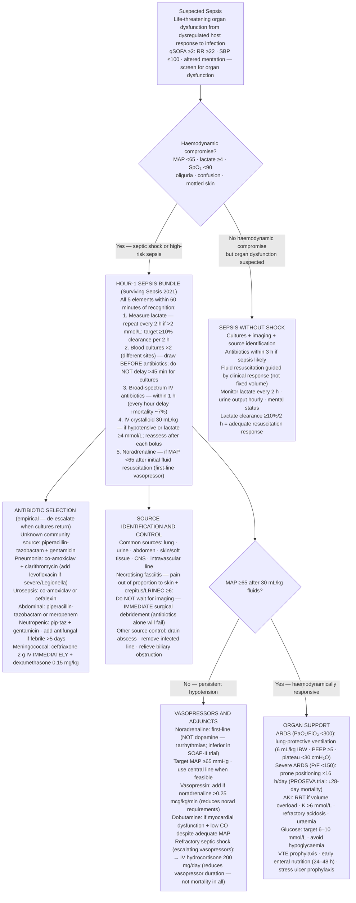

## Overview

Sepsis is defined as **life-threatening organ dysfunction caused by a dysregulated host response to infection** (Sepsis-3 definition, 2016). Septic shock is sepsis with circulatory failure — a vasopressor is required to maintain a MAP ≥65 mmHg despite adequate fluid resuscitation, and lactate remains >2 mmol/L. Sepsis is not simply infection with a systemic response — it represents the transition from a controlled, beneficial immune response to a destructive, dysregulated one.

## Pathophysiology

Infection → release of pathogen-associated molecular patterns (PAMPs) → activation of pattern recognition receptors (Toll-like receptors) on innate immune cells → massive cytokine storm (TNF-α, IL-1β, IL-6, IL-8) → systemic inflammation.

This cascade produces the haemodynamic hallmarks of septic shock:

- **Systemic vasodilation** (nitric oxide-mediated) → distributive shock → hypotension despite initially high cardiac output
- **Increased capillary permeability** → intravascular volume loss → effective hypovolaemia
- **Mitochondrial dysfunction** → impaired cellular oxygen utilisation → lactate accumulation even when oxygen delivery is adequate ("cytopathic hypoxia")
- **Microvascular thrombosis and endothelial injury** → organ ischaemia → multi-organ dysfunction syndrome (MODS)

**Types of shock:**

| Type | Mechanism | CO | SVR | Example |
|------|-----------|----|----|---------|
| Distributive | Vasodilation | ↑ | ↓↓ | Sepsis, anaphylaxis, neurogenic |
| Hypovolaemic | Volume loss | ↓ | ↑ | Haemorrhage, burns, diarrhoea |
| Cardiogenic | Pump failure | ↓↓ | ↑↑ | MI, severe HF, arrhythmia |
| Obstructive | Mechanical obstruction | ↓ | ↑ | Massive PE, tamponade, tension PTX |

Distinguishing shock type matters because the treatments differ and may be directly harmful if misapplied (e.g., aggressive IV fluids in cardiogenic shock).

## Clinical Presentation

**qSOFA score** (quick bedside screen — ≥2 suggests high risk of poor outcome):
- Altered mental status
- RR ≥22/min
- Systolic BP ≤100 mmHg

**Organ dysfunction in sepsis (SOFA score elements):** Altered consciousness (brain), hypoxaemia (lung), elevated creatinine (kidney), elevated bilirubin (liver), thrombocytopenia (coagulation), hypotension requiring vasopressors (cardiovascular).

**Common sources of sepsis — seek the source:**

| Source | Clues |
|--------|-------|
| Pulmonary (most common) | Consolidation, productive cough, focal signs |
| Urinary | Dysuria, loin pain, urinalysis positive |
| Abdominal | Peritonism, rigidity, post-operative, biliary signs |
| Skin / soft tissue | Cellulitis, wound infection, necrotising fasciitis (pain out of proportion) |
| CNS | Meningism, photophobia, purpuric rash (meningococcal) |
| Intravascular | Indwelling catheter or line |

**Necrotising fasciitis** — surgical emergency. Severe pain out of proportion to skin appearance, crepitus, rapidly spreading erythema, systemic toxicity. Do not wait for imaging if clinically suspected. Emergency surgical debridement is lifesaving.

## Diagnosis

**Investigations — simultaneous with resuscitation:**
- Blood cultures × 2 sets (different sites, before antibiotics — this is mandatory)
- FBC, U&E, LFTs, coagulation, CRP, procalcitonin
- **Lactate** — initial assessment and serial measurements every 2 hours to guide resuscitation
- ABG — metabolic acidosis (high anion gap from lactate), hypoxaemia, assess ventilatory status
- Blood glucose, calcium
- Urine MC&S, CXR, ECG
- CT imaging to identify source (especially if abdominal sepsis suspected)

**Lactate interpretation:**

| Lactate | Significance |
|---------|-------------|
| <2 mmol/L | Normal |
| 2–4 mmol/L | Sepsis (increased risk, begin intervention) |
| >4 mmol/L | Septic shock (independent mortality predictor) |

Target lactate clearance of ≥10% per 2 hours as a resuscitation endpoint.

## Management

### The Hour-1 Bundle (Surviving Sepsis Campaign 2021)

Complete all five elements within 1 hour of recognition:

1. **Measure lactate** — repeat if initial >2 mmol/L
2. **Blood cultures × 2** — before antibiotics, but do not delay antibiotics >45 minutes for cultures
3. **Broad-spectrum antibiotics** — within 1 hour. Every hour of delay in antibiotic administration increases mortality.
4. **IV crystalloid 30 mL/kg** — if hypotensive or lactate ≥4 mmol/L. Reassess after each bolus.
5. **Vasopressors** — if MAP <65 mmHg after initial fluid resuscitation

### Antibiotic Selection

Cover the most likely source with broad-spectrum agents, then de-escalate when cultures are available:

| Source | Empirical Regimen |
|--------|------------------|
| Community-acquired, unknown source | Piperacillin-tazobactam (Tazocin) ± gentamicin |
| Pneumonia | Co-amoxiclav + clarithromycin (add levofloxacin if severe/Legionella) |
| Urosepsis | Co-amoxiclav or cefalexin |
| Abdominal sepsis | Piperacillin-tazobactam or meropenem |
| Neutropenic sepsis | Piperacillin-tazobactam + gentamicin; add antifungal if >5 days |
| Suspected meningococcal | Ceftriaxone 2g IV immediately; add dexamethasone |

### Vasopressors

Indicated when hypotension persists despite adequate fluid resuscitation.

- **Noradrenaline (norepinephrine)** — first-line vasopressor. Alpha-1 agonist → vasoconstriction → raises SVR. Target MAP ≥65 mmHg.
- **Vasopressin** — add as a second agent if high-dose noradrenaline required; reduces noradrenaline requirements
- **Dobutamine** — add if myocardial dysfunction present (low CO, elevated filling pressures)

### Corticosteroids

IV hydrocortisone 200mg/day (as 50mg 6-hourly or continuous infusion) for patients in **refractory septic shock** — defined as requiring escalating vasopressor doses despite adequate resuscitation. Reduces vasopressor duration and requirement but does not improve mortality in all patients.

### Fluid Resuscitation

- Initial resuscitation: 30 mL/kg IV crystalloid (balanced crystalloid or 0.9% NaCl)
- Reassess after each bolus — passive leg raise test or pulse pressure variation to guide fluid responsiveness
- Avoid fluid overload — worsens pulmonary oedema, ARDS, and abdominal compartment syndrome
- Albumin may be added in patients requiring large volumes of crystalloid

### Organ Support

- **Lung-protective ventilation** — if ARDS develops (see below). Tidal volume 6 mL/kg ideal body weight. PEEP ≥5 cmH₂O. Plateau pressure <30 cmH₂O. Permissive hypercapnia.
- **Prone positioning** — for severe ARDS (P/F ratio <150); reduces mortality (PROSEVA trial)
- **Renal replacement therapy** — for AKI with volume overload, hyperkalaemia, acidosis, or uraemia unresponsive to medical management
- Glucose control — target 6–10 mmol/L; avoid hypoglycaemia
- VTE prophylaxis, stress ulcer prophylaxis, enteral nutrition early

## Complications

- Multi-organ dysfunction syndrome (MODS) — AKI, hepatic failure, ARDS, coagulopathy (DIC)
- ARDS — defined by Berlin criteria: acute onset, bilateral infiltrates, P/F ratio <300 mmHg, not fully explained by cardiac failure. Carry ~30–40% mortality.
- ICU-acquired weakness — prolonged critical illness causes profound neuromuscular weakness
- Post-intensive care syndrome — cognitive impairment, PTSD, physical deconditioning after ICU discharge

## Clinical Insight

Blood cultures before antibiotics is an absolute principle — but it must never delay antibiotics. The two actions should be near-simultaneous. Draw cultures from two different sites, do not delay beyond 45 minutes, and start empirical antibiotics based on the most likely source. Every hour of delay in appropriate antibiotic therapy increases mortality by approximately 7%.

Noradrenaline, not dopamine, is the vasopressor of choice in septic shock. Dopamine is associated with significantly more arrhythmias and was shown to be inferior in the SOAP-II trial. There is no longer a clinical role for dopamine as a first-line vasopressor in septic shock.

Lactate is not just about hypoperfusion. In sepsis, lactate may be elevated even when tissue oxygen delivery appears adequate — mitochondrial dysfunction impairs cellular utilisation of delivered oxygen. A high lactate in a patient who looks "not that sick" is a warning sign that should not be ignored.
