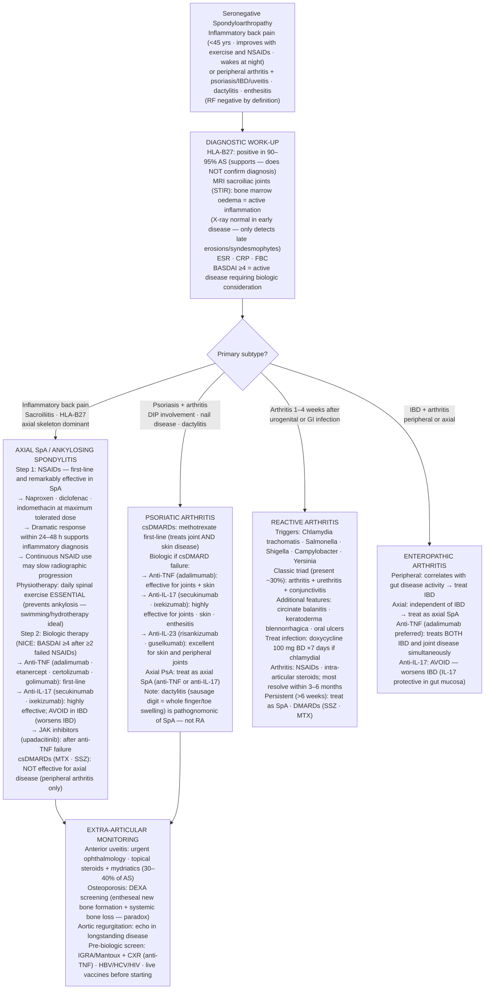

## Overview

The seronegative spondyloarthropathies (SpA) are a family of related inflammatory conditions sharing common clinical, genetic, and pathological features. They are called "seronegative" because RF is absent. The family includes ankylosing spondylitis (axial SpA), psoriatic arthritis, reactive arthritis, enteropathic arthritis (associated with IBD), and undifferentiated SpA. HLA-B27 is present in 90–95% of ankylosing spondylitis patients and links this family biologically, though its precise pathogenic role remains incompletely understood.

## Pathophysiology

**HLA-B27** is a class I MHC molecule. Several hypotheses explain its disease association:
- **Arthritogenic peptide hypothesis**: HLA-B27 preferentially presents self-peptides (possibly from gut bacteria) to CD8+ T-cells → autoimmune inflammation
- **Misfolding hypothesis**: HLA-B27 misfolds in the ER → unfolded protein response → IL-23 production → Th17 activation → IL-17 release → entheseal and synovial inflammation
- **Gut microbiome**: Dysbiosis drives immune activation — supported by the strong association between IBD and SpA, and the efficacy of IL-23/IL-17 inhibition

**Enthesitis** (inflammation at tendon/ligament insertions into bone) is the pathological hallmark of SpA — distinct from the synovitis that characterises RA. The enthesis is the primary anatomical target; synovitis is secondary. This explains the axial skeleton involvement (discovertebral junction, sacroiliac joints), plantar fascia, and Achilles tendon insertions.

Chronic inflammation leads to **new bone formation** (paradoxically — unlike RA which is destructive) — bridging syndesmophytes → fusion of vertebrae → "bamboo spine" → ankylosis.

## Clinical Presentations

### Ankylosing Spondylitis (Axial SpA)

**Inflammatory back pain** — the defining feature. Distinguished from mechanical back pain by:
- Onset <45 years
- Insidious onset over weeks to months
- Improves with exercise, not rest
- Improves with NSAIDs (strongly)
- Wakes patient from sleep in the second half of the night
- Morning stiffness >30–60 minutes

**Sacroiliitis** produces buttock pain radiating to the posterior thigh — often misdiagnosed as sciatica. True sciatica is dermatomal and worsened by straight leg raise; sacroiliitis pain is diffuse and non-dermatomal.

**Spinal features**: Progressive loss of lumbar lordosis → thoracic kyphosis → question-mark posture. Reduced chest expansion from costovertebral joint involvement (normal >5 cm; <2.5 cm is significant). **Schober's test**: Mark 5 cm below and 10 cm above the posterior superior iliac spines; on maximal forward flexion, the distance should increase by ≥5 cm; <4 cm increase indicates restriction.

**Extra-articular features** (shared across the SpA family):
- **Anterior uveitis** (iritis) — most common (30–40%); painful red eye, photophobia, blurred vision; unilateral, recurrent; urgent ophthalmology; treat with topical steroids and mydriatics
- **Psoriasis** — 30% of SpA patients; may predate, coincide, or follow joint disease
- **Inflammatory bowel disease** (Crohn's or UC) — 10%; check for GI symptoms in all SpA patients
- **Aortitis and aortic regurgitation** — rare but important
- **Apical pulmonary fibrosis** (late, rare — upper lobe cavities mimic TB)

### Psoriatic Arthritis (PsA)

Inflammatory arthritis occurring in ~30% of patients with psoriasis. Five clinical patterns:

| Pattern | Description |
|---------|------------|
| Oligoarthritis | Asymmetric, <4 joints; most common (~40%) |
| Polyarthritis | Symmetric, RA-like; RF negative |
| DIP arthropathy | Classic PsA — DIP joints with nail disease (pitting, onycholysis) |
| Axial disease | Sacroiliitis and spondylitis, often asymmetric |
| Arthritis mutilans | Severe destructive; "telescoping" digits from bone resorption |

**Nail disease** (pitting, onycholysis, subungual hyperkeratosis, oil drop sign) is present in ~80% of PsA — and helps confirm PsA when arthritis precedes skin disease.

**Dactylitis** ("sausage digit"): Diffuse swelling of an entire finger or toe from tenosynovitis and soft tissue inflammation — pathognomonic of SpA (PsA and reactive arthritis). A swollen whole digit is SpA; a swollen joint is RA.

### Reactive Arthritis (formerly Reiter's Syndrome)

Sterile inflammatory arthritis triggered by infection elsewhere, most commonly urogenital (*Chlamydia trachomatis*) or gastrointestinal (*Salmonella*, *Shigella*, *Campylobacter*, *Yersinia*). Presents 1–4 weeks after infection.

**Classic triad** (complete in only ~30%): Arthritis + urethritis/cervicitis + conjunctivitis ("can't see, can't pee, can't climb a tree").

Additional features: Circinate balanitis (shallow penile ulceration), keratoderma blennorrhagica (hyperkeratotic skin lesions on palms and soles — histologically identical to pustular psoriasis), oral ulcers, enthesitis, dactylitis.

Most cases self-limit within 3–6 months. Treat with NSAIDs; intra-articular steroids; if persistent >6 weeks, treat like SpA. Treat the triggering infection.

### Enteropathic Arthritis

Arthritis occurring in the context of IBD (Crohn's or UC). Two patterns:

- **Peripheral arthritis**: Correlates with gut disease activity — responds to bowel disease treatment
- **Axial arthritis** (sacroiliitis/spondylitis): Independent of bowel disease activity — does not respond to bowel disease treatment; managed as axial SpA

## Diagnosis

**ASAS classification criteria for axial SpA**: Back pain ≥3 months + age <45 + one of:
- Sacroiliitis on imaging (MRI — bone marrow oedema; or X-ray — erosions, sclerosis, ankylosis) + ≥1 SpA feature
- HLA-B27 positive + ≥2 SpA features

**SpA features**: Inflammatory back pain, arthritis, enthesitis, uveitis, dactylitis, psoriasis, IBD, good response to NSAIDs, family history of SpA, HLA-B27, elevated CRP.

**MRI sacroiliac joints**: Test of choice for early sacroiliitis. Bone marrow oedema (STIR sequence) = active inflammation. Essential before structural damage appears on X-ray. X-ray detects late changes only — normal X-ray does not exclude axial SpA.

**X-ray spine**: Late disease — syndesmophytes (bony bridges between vertebrae), "bamboo spine," "dagger sign" (ossification of interspinous ligament), "trolley track sign."

**HLA-B27**: Supports diagnosis but is not diagnostic — 8% of the general population is HLA-B27 positive without disease. Negative HLA-B27 does not exclude SpA (5–10% of ankylosing spondylitis is HLA-B27 negative).

**Inflammatory markers**: CRP and ESR are elevated in ~50% of active axial SpA — normal markers do not exclude active disease. MRI is the objective measure of inflammation.

## Management

### Axial SpA

**NSAIDs**: First-line and remarkably effective in SpA (more so than in RA). Continuous NSAID use may slow radiographic progression. Naproxen, diclofenac, indomethacin — give at maximum tolerated dose. If one NSAID fails, try a second before escalating.

**Physiotherapy**: Daily exercise programme is essential — maintains spinal mobility, prevents ankylosis, and improves pain and function. Swimming and hydrotherapy are particularly beneficial. Patients who do not exercise lose mobility rapidly.

**Biologic therapy** (NICE criteria: active disease — BASDAI ≥4, after 2 failed NSAIDs):
- **Anti-TNF**: Adalimumab, etanercept, certolizumab, golimumab — all highly effective for axial and peripheral SpA; etanercept less effective for uveitis and IBD
- **Anti-IL-17**: Secukinumab, ixekizumab — highly effective for axial SpA, psoriatic arthritis, enthesitis; avoid in IBD (IL-17 inhibition may worsen IBD)
- **Anti-IL-23**: Risankizumab, guselkumab — for psoriatic arthritis

**JAK inhibitors** (tofacitinib, upadacitinib): For axial SpA after anti-TNF failure.

**Conventional DMARDs** (methotrexate, sulfasalazine): **Not effective for axial disease** but may help peripheral arthritis and skin disease. Hydroxychloroquine has no role in SpA.

### Psoriatic Arthritis

Treatment approach mirrors RA for peripheral arthritis: csDMARDs (methotrexate preferred — also treats skin), then biologics. Anti-IL-17 and anti-IL-23 agents are particularly effective for PsA (target both joint and skin disease simultaneously). Anti-TNF remains widely used and effective.

## Complications

- **Spinal fusion (ankylosis)**: Irreversible loss of spinal mobility; risk of fracture across fused segments even with minor trauma
- **Osteoporosis**: From chronic inflammation; paradoxical — new bone forms at entheses while systemic bone loss occurs; DEXA screening recommended
- **Anterior uveitis**: Chronic or recurrent → cataract, glaucoma, visual impairment — ophthalmology follow-up
- **Aortic regurgitation and cardiac conduction defects**: In longstanding disease
- **Cauda equina syndrome**: Rare late complication of lumbar spine involvement

## Clinical Insight

The average delay from symptom onset to diagnosis of ankylosing spondylitis is 8–10 years. This is a failure of primary care recognition, not diagnostic complexity. Inflammatory back pain in a patient under 45, with morning stiffness, improvement with exercise, and no sciatica on straight leg raise, needs sacroiliac joint MRI and rheumatology referral — not physiotherapy and diclofenac prescribed indefinitely without investigation. The diagnostic criteria require only imaging evidence of sacroiliitis plus one additional feature; many patients with 5 years of undiagnosed disease already have structural damage that is entirely preventable.

NSAIDs work dramatically better in SpA than in RA or osteoarthritis. A patient with back pain that is strikingly, almost completely relieved within 24–48 hours of starting a full-dose NSAID has inflammatory back pain until proven otherwise. This response pattern is so characteristic that it constitutes a diagnostic criterion. The clinical utility of a good NSAID trial is underappreciated.

Anti-IL-17 agents (secukinumab, ixekizumab) are contraindicated or used with extreme caution in patients with IBD. IL-17 plays a protective role in maintaining gut mucosal integrity — blocking it can precipitate or worsen IBD. In a patient with both axial SpA and IBD, anti-TNF agents (particularly adalimumab) are the preferred biologic — they treat both conditions simultaneously.
