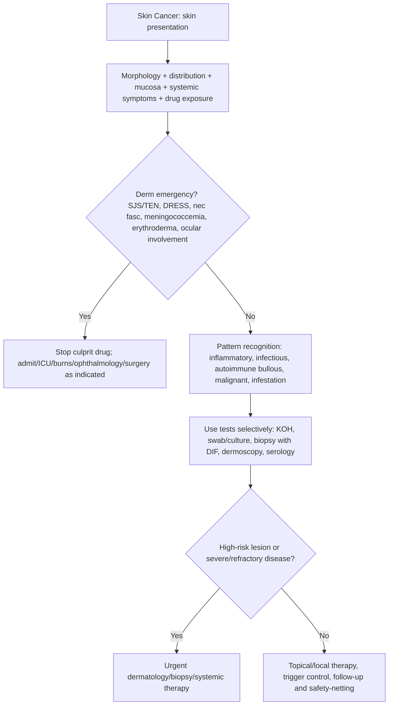

## Overview

Skin cancer is the most common cancer in white-skinned populations. It encompasses three main types: basal cell carcinoma (BCC), squamous cell carcinoma (SCC), and melanoma — each with distinct behaviour, metastatic potential, and management. BCC and SCC together are termed non-melanoma skin cancer (NMSC) and are far more common than melanoma. Melanoma, though less common, is responsible for the vast majority of skin cancer deaths due to its high metastatic potential. Early detection is the single most powerful determinant of survival.

---

## Melanoma

### Pathophysiology

Melanoma arises from malignant transformation of melanocytes — neural crest-derived cells that synthesise melanin and reside in the basal layer of the epidermis. UV radiation (both UVA and UVB) is the most important environmental risk factor, causing characteristic CC>TT mutation signatures in the BRAF and NRAS oncogenes.

**BRAF V600E mutation** is present in ~50% of cutaneous melanomas — activates the MAPK/ERK signalling pathway, driving uncontrolled proliferation. This mutation is the primary target of BRAF inhibitors (vemurafenib, dabrafenib), which have transformed systemic therapy.

**Precursor lesions**: Most melanomas arise de novo, but dysplastic (atypical) naevi carry increased risk. The risk of any single dysplastic naevus transforming is low, but patients with many dysplastic naevi have a substantially elevated lifetime risk.

**Radial vs vertical growth phases**: Melanoma initially proliferates horizontally within the epidermis (radial growth phase — low metastatic risk). It then invades vertically through the basement membrane into the dermis (vertical growth phase — metastatic potential correlates with Breslow thickness).

### Risk Factors

- UV exposure — intermittent intense exposure (sunburn) is most important for melanoma (vs cumulative for NMSC)
- Fair skin (Fitzpatrick type I–II), blue/green eyes, red/blonde hair, freckling
- Blistering sunburn history (especially childhood)
- Personal or family history of melanoma (first-degree relative: 2× risk)
- Large number of melanocytic naevi (>100 common naevi, or dysplastic naevi)
- Immunosuppression
- Congenital giant naevus

### Clinical Presentation

**The ABCDE criteria for clinical assessment:**

| Feature | Concern |
|---------|---------|
| **A**symmetry | One half unlike the other |
| **B**order | Irregular, notched, or poorly defined |
| **C**olour | Variation — multiple shades of brown, black, red, white, or blue |
| **D**iameter | >6 mm (though many melanomas are smaller at diagnosis) |
| **E**volving | Change in size, shape, colour, elevation, or new symptom (bleeding, itching) |

The "ugly duckling" sign: a lesion that looks different from all other moles on a patient's skin — regardless of the ABCDE score — warrants assessment.

**Clinical subtypes:**

| Type | Features | Notes |
|------|---------|-------|
| Superficial spreading melanoma | Most common (~70%). Flat, slow-growing, asymmetric pigmented plaque. ABCDE typically obvious. | Radial growth for months to years before vertical invasion |
| Nodular melanoma | Rapidly growing, dark/amelanotic nodule, raised from the start. | Most aggressive; vertical growth from outset; may be missed with ABCDE |
| Lentigo maligna melanoma | Slowly growing, sun-damaged facial skin; elderly. | In situ (lentigo maligna) for years before invasion |
| Acral lentiginous melanoma | Palms, soles, subungual. | Most common melanoma in darker-skinned populations; often diagnosed late |

**Amelanotic melanoma**: No or minimal pigment — mimics a basal cell carcinoma or benign lesion. A significant cause of delayed diagnosis.

**Staging: Breslow thickness** (depth of invasion in mm) is the most important prognostic factor:
- <0.8 mm: T1a — excellent prognosis (~95% 5-year survival)
- 0.8–2 mm: T2
- 2–4 mm: T3
- >4 mm: T4 — poor prognosis (~50% 5-year survival)
- Presence of ulceration upgrades T stage (a to b)

### Diagnosis

**Dermoscopy**: Handheld magnification with cross-polarised or immersion contact light. Skilled clinicians using dermoscopy have ~90% sensitivity for melanoma vs ~70% for naked eye. Distinguishes benign from malignant pigmented lesions.

**2-week wait urgent referral** (NICE NG12): Any pigmented lesion with features concerning for melanoma (ABCDE criteria), or unexplained nodule on skin that looks like melanoma.

**Excision biopsy**: Narrow margin (2 mm) excision of the entire lesion for histological diagnosis. Incisional biopsy only if lesion too large for excision (e.g., lentigo maligna on face). Do not do punch or shave biopsy of a suspected melanoma — compromises histological Breslow measurement.

**Sentinel lymph node biopsy (SLNB)**: For melanomas >0.8 mm Breslow thickness (or >0.8 mm with ulceration or high mitotic rate). The sentinel lymph node (first draining node) is identified with blue dye/radioisotope and removed for histology. Positive SLNB indicates nodal metastasis — upstages to stage III.

**Staging CT** (chest, abdomen, pelvis) and PET-CT for stage III–IV disease.

### Management

**Surgical excision margins** (based on Breslow thickness):
- In situ: 5 mm margin
- <1 mm: 1 cm margin
- 1–2 mm: 1–2 cm margin
- >2 mm: 2–3 cm margin

**Adjuvant systemic therapy** (stage III–IV, or high-risk resected stage II):
- **BRAF V600E-positive**: BRAF inhibitor + MEK inhibitor combination (dabrafenib + trametinib or vemurafenib + cobimetinib). Rapid responses but acquired resistance develops.
- **BRAF wild-type or as first-line immunotherapy**: **Anti-PD-1 checkpoint inhibitors** (pembrolizumab, nivolumab) — durable responses; immune-related adverse effects (colitis, pneumonitis, hepatitis, endocrinopathies). Combination anti-PD-1 + anti-CTLA-4 (nivolumab + ipilimumab) — higher response rate with greater toxicity.

---

## Basal Cell Carcinoma (BCC)

### Pathophysiology

BCC arises from basal keratinocytes. The PTCH1 tumour suppressor gene (part of the Hedgehog signalling pathway) is mutated in >90% of sporadic BCCs — allowing constitutive SMO (smoothened) activation and cell proliferation. UV radiation causes the characteristic CC>TT mutations. **Gorlin syndrome** (naevoid BCC syndrome): germline PTCH1 mutation → multiple BCCs at young age.

**BCCs almost never metastasise** but are locally destructive and can invade bone, cartilage, and the orbit if neglected.

### Clinical Presentation

Sun-exposed skin — face (especially nose, nasolabial folds, periocular), ears, scalp, upper trunk. Fair-skinned individuals over 50.

| Subtype | Clinical Features |
|---------|-----------------|
| Nodular | Most common. Pearly, flesh-coloured papule or nodule with rolled translucent border, surface telangiectasiae, central ulceration ("rodent ulcer") |
| Superficial | Flat, scaly, erythematous plaque with thread-like border. Trunk. Slower-growing. |
| Morphoeic (sclerosing) | Waxy, scar-like plaque with indistinct margins. Most infiltrative — margins extend beyond clinical borders. |
| Pigmented | BCC with melanin — dark brown/black; confused with melanoma |

### Management

- **Surgical excision** — first-line for most BCCs. 4 mm margin for well-defined nodular/superficial BCC; wider for morphoeic (Mohs surgery)
- **Mohs micrographic surgery** — precise margin-controlled technique; highest cure rate. Indicated for high-risk BCCs (morphoeic, periorbital, nasal, recurrent, large)
- **Radiotherapy** — for elderly or inoperable patients
- **Photodynamic therapy (PDT)** — for superficial BCC only
- **Vismodegib/sonidegib** (Hedgehog pathway inhibitors) — for locally advanced or metastatic BCC

---

## Squamous Cell Carcinoma (SCC)

### Pathophysiology

SCC arises from epidermal keratinocytes. UV radiation (cumulative, unlike melanoma) is the dominant cause. TP53 mutations are near-universal. Risk is markedly elevated in immunosuppression (organ transplant recipients have 60–100× baseline SCC risk — SCC, not BCC, is the main skin cancer concern in transplant patients).

**Precursor lesions**:
- **Actinic keratosis (solar keratosis)**: Scaly, rough, hyperkeratotic papules on sun-damaged skin. Risk of progression to SCC ~1% per year. Treated with cryotherapy, topical fluorouracil (5-FU), imiquimod, or photodynamic therapy.
- **Bowen's disease (SCC in situ)**: Full-thickness epidermal dysplasia without dermal invasion. Red, scaly, well-defined plaque. Treat before progression.

### Clinical Presentation

Sun-exposed skin — dorsum of hands, scalp, face, lower lip, ears. Also mucosal surfaces (lip, oral cavity, anogenital — often HPV-related). Immunosuppressed patients: multiple and often at unusual sites.

**Features of SCC**: Firm, fleshy or keratinous nodule or ulcer with indurated rolled edge. May be crusted, ulcerated, or exophytic. Tender (unlike BCC). Grows over weeks to months.

**High-risk SCC features** (elevated metastatic risk — up to 20%):
- Diameter >2 cm
- Depth >4 mm or Clark level ≥IV
- Poor differentiation
- Perineural/lymphovascular invasion
- Immunosuppressed host
- Site: ear, non-hair-bearing lip, anogenital
- Recurrent tumour

### Management

- **Excision with 4–6 mm margins** — first-line. Mohs surgery for high-risk features.
- Sentinel lymph node biopsy for high-risk SCC (controversial; practice varies)
- **Radiotherapy** — for inoperable disease or adjuvant after surgery
- **Cemiplimab or pembrolizumab** (anti-PD-1) — for locally advanced or metastatic SCC not amenable to surgery or radiotherapy

---

## Skin Cancer Prevention and Screening

**Primary prevention**: Sun avoidance (especially 10am–4pm), protective clothing, broad-spectrum SPF ≥30 sunscreen applied liberally and reapplied every 2 hours. Avoid sunbeds.

**Self-examination**: Monthly skin self-examination — know your moles and look for change.

**GP surveillance**: Patients with previous melanoma require annual skin checks. Organ transplant recipients require regular dermatology review for SCC.

## Clinical Insight

Nodular melanoma does not follow the ABCDE rules — it is raised from the outset (not flat), grows quickly, and may be symmetric, small, and relatively uniform in colour. Relying exclusively on ABCDE misses approximately 20% of melanomas. The ugly duckling sign — any lesion that stands out from the rest of the patient's skin as looking different — should prompt referral regardless of ABCDE score. Amelanotic nodular melanoma is particularly easy to miss and is frequently mistaken for a pyogenic granuloma or BCC.

In organ transplant recipients, SCC is the dominant skin cancer concern — not BCC. The risk of SCC is 60–100× higher than in immunocompetent individuals. These SCCs are more aggressive, more likely to metastasise, and more likely to be multiple. Dermatology review should begin 1–2 years post-transplant, and frequency of follow-up depends on the clinical burden. Sustained reduction in immunosuppression, if transplant function allows, reduces skin cancer risk.

BRAF-targeted therapy and PD-1 checkpoint immunotherapy have transformed the treatment of metastatic melanoma — from a disease with a median survival of 6 months to one where 40–50% of patients with advanced disease are alive at 5 years on combination immunotherapy. The mechanism matters clinically: BRAF inhibitors provide rapid responses but resistance develops; checkpoint inhibitors produce durable responses but with significant immune toxicity that requires active monitoring and management.
