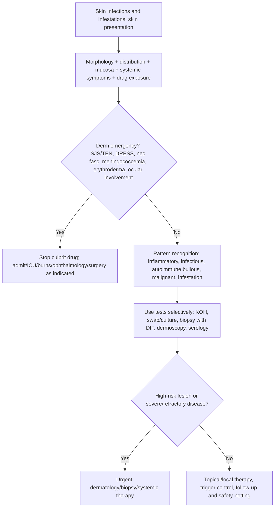

## Overview

Skin infections are among the most common reasons for acute medical presentation. They range from superficial, self-limiting conditions (impetigo, tinea) to life-threatening surgical emergencies (necrotising fasciitis). The clinical priority in all cases is to recognise the depth and severity of infection, identify the causative organism, and differentiate infectious from non-infectious mimics. In diabetic and immunocompromised patients, the threshold for aggressive investigation and treatment must be lower.

---

## Cellulitis and Erysipelas

### Pathophysiology

Cellulitis is a bacterial infection of the dermis and subcutaneous tissue. Erysipelas affects the upper dermis and superficial lymphatics, producing a raised, sharply demarcated edge (because the inflammatory oedema tracks along the lymphatic channels and creates a distinct boundary with normal skin).

**Causative organisms:**
- **Group A beta-haemolytic streptococcus** (*Streptococcus pyogenes*) — most common cause of both erysipelas and cellulitis
- **Staphylococcus aureus** — cellulitis, particularly when associated with a wound, abscess, or folliculitis
- **Gram-negative organisms** — in diabetics, immunosuppressed, water-related injuries (*Aeromonas*, *Vibrio vulnificus*)
- **Haemophilus influenzae** — facial cellulitis in children (pre-vaccination era; rare now)

Entry points: tinea pedis, wounds, abrasions, insect bites, ulcers — identify and treat the portal of entry to prevent recurrence.

### Clinical Presentation

**Erysipelas**: Bright red, raised, hot, tender plaque with a sharply defined advancing edge. Mainly affects the face (butterfly distribution) or lower leg. Systemic features common — fever, rigors, malaise. Lymphangitis (red streaking) and regional lymphadenopathy.

**Cellulitis**: Diffuse, non-raised erythema, warmth, swelling, and tenderness with a less well-defined edge. Lower limb most common site. Blistering and skin necrosis in severe cases.

**Severity classification (Eron classification):**

| Class | Features | Setting |
|-------|---------|---------|
| I | No systemic features; no significant comorbidity | Oral antibiotics at home |
| II | Mild-moderate systemic features OR significant comorbidity | Oral or IV antibiotics; may need admission |
| III | Severe systemic features; unstable comorbidity; involvement of special sites (face, periorbital, perineal) | IV antibiotics inpatient |
| IV | Sepsis; life-threatening | ICU; exclude necrotising fasciitis |

**Marking the edge of erythema** with a skin-safe marker pen at the time of assessment is essential to objectively document progression. Reassess at 24–48 hours.

**Differential diagnosis** — particularly important before prescribing antibiotics:
- **Deep vein thrombosis** — unilateral leg swelling, erythema; Doppler USS
- **Lipodermatosclerosis** — chronic, bilateral, bilateral, inverted champagne bottle legs; no fever; chronic venous insufficiency
- **Contact dermatitis/eczema** — itchy, no fever, often bilateral
- **Gout** — acute monoarthritis, periarticular rather than skin, urate crystals
- **Erythema migrans (Lyme disease)** — expanding annular rash with central clearing after tick bite; treat immediately
- **Eosinophilic cellulitis (Wells syndrome)** — eosinophilia, recurrent; biopsy diagnostic

### Management

**Antibiotics:**
- **Eron I/II**: Oral **flucloxacillin** 500 mg–1 g QDS (covers both streptococci and staphylococci). Clarithromycin or cefalexin if penicillin allergic.
- **Eron III/IV**: IV **benzylpenicillin** (streptococcal cellulitis) or IV **flucloxacillin** (staphylococcal/wound-related). Add IV vancomycin or linezolid if MRSA is suspected.
- Duration: 5–7 days for mild, 10–14 days for severe. Review at 48 hours.

**Treat the portal of entry**: Tinea pedis is the most common entry portal for recurrent lower leg cellulitis — always examine the interdigital spaces, and treat tinea with topical or oral antifungal.

**Limb elevation** — reduces oedema, accelerates resolution.

**Recurrent cellulitis prophylaxis**: ≥2 episodes in 12 months → consider long-term prophylactic phenoxymethylpenicillin 250 mg BD (or erythromycin if penicillin allergic) indefinitely.

---

## Necrotising Fasciitis

A rapidly progressive, life-threatening bacterial infection of the fascia and subcutaneous tissue, producing widespread tissue necrosis. Mortality 20–40% even with treatment.

**Types:**
- **Type I** (polymicrobial): Mixed aerobic and anaerobic organisms — diabetics, elderly, post-surgical. Gas-producing organisms → crepitus.
- **Type II** (monomicrobial): Group A *Streptococcus* — young, healthy patients; no portal of entry often identifiable ("strep toxic shock").

**Clinical hallmark — pain out of proportion to skin findings.** Early: erythema, swelling, warmth (appears as cellulitis). Later: dusky discolouration, blistering, skin necrosis, crepitus (gas in tissue — pathognomonic), loss of sensation (nerve destruction). Systemic toxicity — fever, tachycardia, hypotension.

**The "hard sign"**: Crepitus on palpation — indicates gas-forming organisms and is an absolute surgical emergency. The "soft sign" that must not be ignored: pain out of proportion to the skin appearance.

**Laboratory risk indicator for necrotising fasciitis (LRINEC score)**: CRP, WBC, Hb, Na, creatinine, glucose — score ≥6 suggests high probability; ≥8 = high risk. Useful but not sensitive enough to exclude necrotising fasciitis in high clinical suspicion.

**Management**: **Immediate surgical debridement** is the only definitive treatment — do not delay for imaging if clinical suspicion is high. Broad-spectrum IV antibiotics (meropenem + clindamycin + vancomycin) — adjunctive, not a substitute for surgery. ICU admission. Consider hyperbaric oxygen at specialist centres.

---

## Impetigo

Superficial bacterial skin infection — most common in children. **Non-bullous impetigo**: *S. aureus* or *Streptococcus pyogenes* — golden (honey-coloured) crusted lesions on the face, particularly around the nose and mouth. Highly contagious. **Bullous impetigo**: *S. aureus* only (exfoliative toxins cleave desmoglein-1) — fragile, clear-fluid bullae that rupture leaving a thin honey-coloured crust.

**Management**: Topical **fusidic acid** (first-line for localised); topical **mupirocin** (for MRSA-positive or fusidic acid-resistant). Oral **flucloxacillin** for widespread disease or systemic features.

---

## Tinea (Dermatophytosis)

Superficial fungal infections caused by dermatophytes (*Trichophyton*, *Microsporum*, *Epidermophyton*).

| Site | Name | Appearance |
|------|------|-----------|
| Scalp | Tinea capitis | Scaly patches + alopecia; kerion = inflammatory boggy mass |
| Body | Tinea corporis | Annular, scaly plaque with active raised edge and central clearing |
| Groin | Tinea cruris | Well-defined erythema with scaly edge in groin and inner thigh |
| Foot | Tinea pedis (athlete's foot) | Interdigital maceration, scaling, and fissuring; moccasin pattern |
| Nails | Onychomycosis | Subungual hyperkeratosis, onycholysis, yellow-brown discolouration |

**Diagnosis**: Skin scrapings for mycology (KOH preparation — hyphae visible; culture for species identification). Nail clippings sent in dry paper.

**Management:**
- Topical antifungals (clotrimazole, terbinafine cream) for tinea corporis, cruris, and pedis — 2–4 weeks
- **Oral terbinafine** for onychomycosis (6 weeks for fingernails, 12 weeks for toenails; check LFTs before)
- **Oral terbinafine or griseofulvin** for tinea capitis (topical ineffective — oral required; treat all household contacts)

---

## Scabies

Infestation by *Sarcoptes scabiei var. hominis* — a mite that burrows into the stratum corneum. Transmitted by prolonged skin-to-skin contact.

**Clinical features**: Intense pruritus, worse at night (when the mite is most active), sparing the face. Burrows (pathognomonic — short, tortuous, linear tracks with a visible white dot at the advancing end) in the web spaces of the fingers, wrists, nipples, genitalia, and periumbilical area. Secondary eczematisation and excoriation.

**Crusted (Norwegian) scabies**: Hyperkeratotic, crusted plaques covering large areas — occurs in immunocompromised patients. Millions of mites (vs ~10–15 in classical scabies). Highly contagious.

**Diagnosis**: Clinical — burrow pattern and distribution. Dermoscopy (delta-wing jet sign — the mite at the end of the burrow). Skin scraping and microscopy confirming mites/eggs.

**Management:**
- **Permethrin 5% cream** (first-line) — apply to the whole body from the neck down, wash off after 8–12 hours. Repeat after 7 days. Apply to face, scalp, and ears in elderly and immunocompromised.
- **Oral ivermectin** (alternative, unlicensed in UK) — for crusted scabies or treatment failure. Repeat after 7 days.
- Treat all household contacts and sexual partners simultaneously regardless of symptoms.
- Wash all clothing, bedding, and towels at 60°C on the treatment day.
- Pruritus may persist for 2–4 weeks after successful treatment (hypersensitivity reaction to dead mites) — reassure; prescribe antihistamines and mild steroid cream.

---

## Herpes Zoster (Shingles)

Reactivation of varicella-zoster virus (VZV) from dorsal root ganglia following primary varicella infection. Occurs when cell-mediated immunity wanes — with age, immunosuppression, or stress.

**Clinical features**: Prodromal pain (burning, hyperaesthesia) in a dermatomal distribution, typically 2–3 days before the rash. Then vesicular eruption in a dermatome — unilateral, does not cross the midline. Common sites: thoracic (most common), trigeminal (V1 — ophthalmic herpes zoster), and cervical.

**Herpes zoster ophthalmicus (HZO)**: V1 branch involvement — blistering on the forehead, nose, and periocular skin. **Hutchinson's sign** — vesicles on the tip or side of the nose (nasociliary branch innervates both the nasal tip and the cornea) → indicates corneal involvement is likely. Urgent ophthalmology referral.

**Ramsay-Hunt syndrome**: VZV reactivation in the geniculate ganglion → facial nerve palsy + vesicles in the external auditory canal and pinna + sensorineural hearing loss + vertigo. Treat with high-dose antivirals (aciclovir 800 mg 5× daily for 7 days) + prednisolone.

**Post-herpetic neuralgia (PHN)**: Persistent neuropathic pain in the affected dermatome beyond 90 days after the rash heals. More common in the elderly. Treat with: tricyclic antidepressants (amitriptyline), gabapentin or pregabalin, topical lidocaine patches, capsaicin cream.

**Management:**
- Antivirals (aciclovir 800 mg 5× daily, or valaciclovir 1 g TDS for 7 days) — start within 72 hours of rash onset; reduces duration, severity, and risk of PHN.
- Pain management: paracetamol, NSAIDs, neuropathic agents for severe pain.
- **Shingrix vaccine** (recombinant zoster vaccine) — recommended for adults ≥50; 97% efficacy against shingles; highly effective for preventing PHN; two doses 2–6 months apart. Preferred over Zostavax.

## Clinical Insight

Tinea pedis is the most important and most overlooked risk factor for recurrent lower leg cellulitis. The fissures between the toes provide a portal of entry for streptococcal infection. Treating the tinea — with topical terbinafine or clotrimazole applied consistently to the web spaces — is as important as the antibiotic for preventing recurrence. Every patient with lower leg cellulitis should have their interdigital spaces examined.

Necrotising fasciitis in its early stages is indistinguishable from cellulitis. The single most important clinical clue is **pain disproportionate to the skin appearance**. A patient who appears to have cellulitis but is in agonising pain, has systemic toxicity, or is not responding to 24 hours of IV antibiotics should be assumed to have necrotising fasciitis until proven otherwise. The consequences of delay are irreversible. Mark the skin, photograph it, and reassess frequently.

Post-herpetic neuralgia is best prevented, not treated. Starting antivirals within 72 hours of rash onset in patients over 50 significantly reduces the risk of PHN. The Shingrix vaccine should be offered proactively to all patients over 50 before they develop shingles — a 97% reduction in disease incidence is an extraordinary public health tool.
