## Overview

Stroke is the sudden onset of a focal neurological deficit lasting more than 24 hours, caused by disruption of blood supply to part of the brain. It is the second leading cause of death and the leading cause of disability worldwide. Ischaemic stroke accounts for 85% of cases; haemorrhagic stroke for 15%. A **transient ischaemic attack (TIA)** is clinically identical in presentation but resolves completely within 24 hours (usually within 60 minutes). TIA is not a benign event — it carries a 10–15% risk of stroke within 90 days, with the highest risk in the first 48 hours.

## Pathophysiology

**Ischaemic stroke** — three mechanisms:

1. **Thrombotic**: In situ thrombosis at a ruptured or eroded atherosclerotic plaque in a large vessel (ICA, MCA, basilar artery) or small vessel (lacunar infarct). Onset may be stuttering or on waking (low BP overnight).

2. **Embolic**: Clot originating from a proximal source embolises to a distal artery. Sources include the heart (AF is the most important — LAA thrombus; also valvular disease, mural thrombus post-MI, paradoxical embolism through PFO) and proximal atherosclerotic plaques in the carotid or aortic arch. Onset is typically sudden and maximal.

3. **Lacunar**: Occlusion of small perforating arteries (lenticulostriate, thalamogeniculate) from lipohyalinosis — a consequence of hypertension and diabetes. Produces discrete small-volume infarcts producing pure syndromes. Accounts for ~25% of ischaemic strokes.

**Haemorrhagic stroke:**

- **Intracerebral haemorrhage (ICH)**: Most commonly from rupture of small perforating arteries damaged by chronic hypertension (basal ganglia, thalamus, pons, cerebellum). Also from cerebral amyloid angiopathy (elderly, lobar haemorrhage), AVM, coagulopathy, or anticoagulation.
- **Subarachnoid haemorrhage (SAH)**: Rupture of a berry aneurysm (typically at arterial bifurcations on the circle of Willis). Presents as thunderclap headache — the "worst headache of my life", maximal at onset.

**The ischaemic penumbra**: After complete occlusion, the ischaemic core (irreversibly infarcted) is surrounded by a zone of salvageable ischaemic but still viable tissue — the penumbra. It depends on collateral flow and begins to die within hours. Thrombolysis and thrombectomy aim to rescue the penumbra. Approximately 1.9 million neurons are lost per minute without reperfusion.

## Clinical Presentation — Localise the Lesion

Neurological localisation is a core clinical skill. Identifying the vascular territory allows prediction of the aetiology and informs investigation.

**Anterior circulation (carotid territory):**

| Territory | Vessel | Deficits |
|-----------|--------|---------|
| MCA superior division | MCA | Contralateral face and arm > leg weakness and sensory loss; expressive aphasia (left hemisphere); hemineglect (right hemisphere) |
| MCA inferior division | MCA | Wernicke's (receptive) aphasia (left); homonymous superior quadrantanopia |
| ACA | ACA | Contralateral leg > arm weakness (medial cortex representation) |
| Internal capsule | Lenticulostriate arteries | Pure motor hemiplegia (contralateral face, arm, leg equally) |

**Posterior circulation (vertebrobasilar territory):**

| Syndrome | Vessel | Key Features |
|---------|--------|-------------|
| Lateral medullary (Wallenberg) | PICA | Ipsilateral face sensory loss + contralateral limb sensory loss (crossed); ipsilateral Horner's; dysphagia, dysarthria, vertigo, ataxia |
| Basilar artery occlusion | Basilar | Locked-in syndrome, coma, bilateral long tract signs |
| PCA | PCA | Contralateral homonymous hemianopia with macular sparing |
| AICA | AICA | Ipsilateral facial palsy, hearing loss, vertigo, ataxia |

**Lacunar syndromes** (small vessel, internal capsule or pons):
- Pure motor hemiplegia — posterior limb of internal capsule
- Pure sensory stroke — VPL thalamus
- Ataxic hemiparesis — corona radiata or pons
- Dysarthria-clumsy hand — pons

**FAST** (Face, Arms, Speech, Time) is a public screening tool. **ROSIER** (Recognition of Stroke in the Emergency Room) is the validated clinical scoring system used in hospitals.

**TIA** presents identically to stroke but resolves completely. Do not dismiss a resolved deficit — the ABCD² score (Age, BP, Clinical features, Duration, Diabetes) stratifies 2-day stroke risk.

**Differential for sudden focal neurological deficit:**
- Hypoglycaemia — always check glucose immediately; mimics stroke
- Todd's paresis — post-ictal weakness following focal seizure
- Hemiplegic migraine — younger patient, headache, preceding aura, resolves
- Space-occupying lesion — more gradual, but acute bleed into tumour can mimic
- MS relapse — younger, prior episodes, multiple lesion locations
- Peripheral nerve lesion — pattern does not match cerebral territory

## Diagnosis

**Non-contrast CT head — within 25 minutes of arrival**: The most urgent investigation. Its primary purpose is to **exclude haemorrhage before any thrombolysis is given**. Ischaemic stroke is often CT-negative in the first 6 hours. Early signs of ischaemia include: dense MCA sign (hyperdense MCA from clot), loss of grey-white differentiation, sulcal effacement.

**Blood glucose immediately** — hypoglycaemia mimics stroke and must be excluded before thrombolysis.

**Immediate bloods**: FBC, coagulation (INR — critical if on warfarin), U&E, glucose, lipids, troponin, group and save.

**ECG**: AF detection (and to exclude concurrent MI).

**MRI brain with DWI (diffusion-weighted imaging)**: Most sensitive for early ischaemic stroke — restricted diffusion appears bright within minutes of ischaemia. Used to confirm diagnosis, define territory, and identify the penumbra for thrombectomy planning.

**CT/MR angiography**: Essential if mechanical thrombectomy is being considered — identifies large vessel occlusion (ICA, M1/M2 MCA, basilar artery).

**After stabilisation — cardioembolic screen:**
- 12-lead ECG + prolonged cardiac monitoring (minimum 24 hours, ideally 7 days with implantable loop recorder) — AF detection
- Echocardiogram — LAA thrombus, structural heart disease, PFO
- Carotid Doppler USS — carotid stenosis

```mermaid
flowchart TD
    A["Suspected Stroke or TIA\nSudden focal neurological deficit: face/arm/leg weakness · aphasia · hemianopia\nvertigo + ataxia + diplopia (posterior circulation) · sudden severe headache (SAH)"] --> GLUCOSE["CHECK BLOOD GLUCOSE IMMEDIATELY\nHypoglycaemia mimics stroke — must be excluded before any intervention\nIf glucose &lt;3 mmol/L: correct and reassess completely"]

    GLUCOSE --> CT["NON-CONTRAST CT HEAD — within 25 minutes\nPrimary purpose: EXCLUDE HAEMORRHAGE before thrombolysis\n(NOT to confirm ischaemic stroke — CT often normal in first 6 hours)\nCT positive for blood = haemorrhagic stroke (see haemorrhagic pathway)\nCT negative + focal deficit = assume ischaemic stroke → proceed to reperfusion decision"]

    CT -->|"Blood on CT\nhaemorrhagic stroke"| HAEMO["HAEMORRHAGIC STROKE\nReverse anticoagulation IMMEDIATELY:\n→ Warfarin: vitamin K + prothrombin complex concentrate (PCC 4-factor)\n→ Dabigatran: idarucizumab\n→ Apixaban/rivaroxaban: andexanet alfa\nBP control: target systolic &lt;140 mmHg (INTERACT-2 trial) — avoid over-rapid reduction\nICP management if raised: head 30° · mannitol/hypertonic saline · EVD for hydrocephalus\nNeurosurgical referral: cerebellar haematoma &gt;3 cm · accessible lobar haematoma with deterioration\nDo NOT give antiplatelet or anticoagulant acutely"]

    CT -->|"No blood on CT\nischaemic stroke presumed"| WINDOW{"Time from onset\nor last known well?"}

    WINDOW -->|"Within 4.5 hours\nno contraindications"| THROMBOLYSIS["IV THROMBOLYSIS — alteplase 0.9 mg/kg (max 90 mg)\n10% as IV bolus · remainder over 60 minutes\nBP must be &lt;185/110 before giving — treat if needed\nContraindications: haemorrhage on CT · symptoms &gt;4.5 h · INR &gt;1.7\nplatelet &lt;100 · glucose &lt;2.8 or &gt;22 · recent major surgery or head trauma\nprior haemorrhagic stroke · active bleeding\nDo NOT lower BP aggressively in ischaemic stroke unless giving thrombolysis\n(permissive hypertension maintains perfusion to penumbra via collaterals)"]

    WINDOW -->|"Large vessel occlusion (ICA/MCA/basilar)\nconfirmed on CTA/MRA"| THROMBECTOMY["MECHANICAL THROMBECTOMY\nWindow: up to 24 hours with viable penumbra on CT perfusion\n(DAWN and DEFUSE-3 trials — extended window if penumbra confirmed)\nNNT ~2.5 for functional independence — most effective acute stroke intervention\nCan be combined with IV thrombolysis (bridging therapy)\nTarget: ICA · MCA M1/M2 · basilar artery occlusion"]

    THROMBOLYSIS & THROMBECTOMY --> SECPREV["SECONDARY PREVENTION\nAspirin 300 mg: start within 24–48 h of ischaemic stroke\n(wait 24 h after thrombolysis to reduce haemorrhagic transformation risk)\nDual antiplatelet (aspirin + clopidogrel) ×21 days: high-risk TIA or minor stroke\n(POINT and CHANCE trials: significantly reduces early recurrence)\nThen clopidogrel 75 mg indefinitely (CAPRIE trial — superior to aspirin alone)\nAF-related cardioembolic stroke: DOAC (start 4–14 days post-stroke)\nValvular AF (mechanical valve · rheumatic MS): warfarin only\nStatin: atorvastatin 80 mg in all ischaemic stroke/TIA regardless of baseline LDL\nBP: target &lt;130/80 — start 24–48 h after acute event\nCarotid stenosis 50–99% symptomatic: CEA within 2 WEEKS of TIA or minor stroke\n(delay beyond 2 weeks substantially increases recurrence risk)"]

    WINDOW -->|"TIA — fully resolved"| TIA["TIA MANAGEMENT\nABCD² score ≥4 or crescendo TIA: same-day specialist review (NICE NG128)\nMRI DWI: identifies acute ischaemia even without symptoms\n12-lead ECG + 7-day cardiac monitor: detect paroxysmal AF\nEchocardiogram + carotid Doppler\nInitiate secondary prevention before discharge: antiplatelet + statin + BP control\nDo NOT discharge without treatment initiated\n10–15% stroke risk within 90 days — highest in first 48 hours"]
```

## Management

### Acute Ischaemic Stroke

**IV thrombolysis (alteplase)**:
- Window: within **4.5 hours** of symptom onset (or last known well time)
- Dose: 0.9 mg/kg (max 90 mg) — 10% as IV bolus, remainder over 60 minutes
- Must exclude haemorrhage on CT first
- BP must be <185/110 mmHg before giving — treat if necessary

**Absolute contraindications to thrombolysis:**
- Haemorrhage on CT
- Symptoms >4.5 hours or unknown onset
- INR >1.7 or therapeutic anticoagulation
- Platelet count <100 × 10⁹/L
- Glucose <2.8 or >22 mmol/L
- Recent major surgery or serious head trauma (<3 months)
- Prior haemorrhagic stroke at any time
- Active internal bleeding

**Mechanical thrombectomy (MT)**:
- For large vessel occlusion (ICA, MCA M1/M2, basilar artery)
- Window: up to **24 hours** from onset with CT perfusion imaging confirming viable penumbra (DAWN and DEFUSE-3 trials)
- Superior to thrombolysis alone for LVO — number needed to treat ~2.5 for independence
- Can be combined with IV thrombolysis ("bridging therapy")

**Blood pressure management in acute ischaemic stroke**:
- Permissive hypertension — do **not** lower BP aggressively in acute ischaemic stroke unless giving thrombolysis. The elevated BP maintains perfusion pressure to the penumbra through collateral vessels; lowering it extends the infarct.
- If giving thrombolysis: keep BP <185/110 before and <180/105 during/after
- If not giving thrombolysis: only treat if BP >220/120 and sustained

**Aspirin 300 mg**: Start within 24–48 hours of confirmed ischaemic stroke (wait 24 hours after thrombolysis to reduce bleeding risk). Continue for 2 weeks then transition to long-term antiplatelet therapy.

**Supportive care**: Maintain normoglycaemia (glucose 4–11 mmol/L), normothermia, adequate hydration, early mobilisation, DVT prophylaxis, swallowing assessment before oral intake (aspiration risk), pressure area care.

### Haemorrhagic Stroke Management

- **Reverse anticoagulation immediately**: Vitamin K + prothrombin complex concentrate (PCC) for warfarin; specific reversal agents for DOACs (idarucizumab for dabigatran, andexanet alfa for apixaban/rivaroxaban).
- **BP control**: Target systolic <140 mmHg acutely (INTERACT-2 trial); avoid over-rapid reduction.
- **ICP management** if raised: head of bed 30°, avoid hypotonic fluids, osmotic therapy (mannitol, hypertonic saline), consider EVD for hydrocephalus.
- **Neurosurgical referral**: Cerebellar haematoma >3 cm (surgical evacuation prevents brainstem compression); accessible lobar haematoma with neurological deterioration.

### Secondary Prevention

**Antiplatelet therapy (non-cardioembolic ischaemic stroke):**
- Dual antiplatelet (aspirin + clopidogrel) for 21 days following high-risk TIA or minor ischaemic stroke (POINT and CHANCE trials) — significantly reduces early recurrence
- Then single antiplatelet indefinitely (clopidogrel 75 mg preferred over aspirin — CAPRIE trial)

**Anticoagulation (cardioembolic — AF):**
- Start 4–14 days after ischaemic stroke (earlier risks haemorrhagic transformation; later risks recurrence)
- DOAC preferred over warfarin in non-valvular AF
- Valvular AF (mechanical valve, rheumatic MS) — warfarin only

**Statin**: High-intensity statin (atorvastatin 80 mg) for all ischaemic stroke/TIA regardless of baseline LDL.

**Blood pressure control**: Target <130/80. Start 24–48 hours after the acute event.

**Carotid endarterectomy (CEA)**:
- For symptomatic carotid stenosis 50–99% — CEA within **2 weeks** of TIA or minor stroke
- Delay beyond 2 weeks substantially increases recurrence risk
- CAROTID stenting as alternative in patients unsuitable for surgery

**TIA management**: Same secondary prevention as ischaemic stroke. ABCD² score ≥4 or crescendo TIA — same-day specialist review and investigation. Do not discharge without initiating antiplatelet, statin, and BP management.

## Complications

- Haemorrhagic transformation — conversion of ischaemic infarct to haemorrhage, particularly after thrombolysis or in large infarcts
- Cerebral oedema and raised ICP — malignant MCA infarction; decompressive hemicraniectomy can be life-saving in selected patients aged <60
- Post-stroke seizures — occur in ~10%; treat as standard epilepsy
- Aspiration pneumonia — dysphagia is common; requires early SALT assessment and modified diet/NG feeding
- DVT and PE — early mobilisation and LMWH
- Post-stroke depression — very common; treat actively with antidepressants and psychological support
- Vascular dementia — cumulative cognitive impairment from multiple small vessel strokes

## Clinical Insight

Non-contrast CT is not good at seeing ischaemic stroke — it is good at excluding haemorrhage. A normal CT in a patient with a focal neurological deficit does not rule out ischaemic stroke. The question the CT is answering is: "is there blood?" If the answer is no and the presentation is consistent with stroke, thrombolyse — do not delay because the CT looks normal.

Never lower blood pressure aggressively in acute ischaemic stroke unless you are about to give thrombolysis. The hypertension is a physiological response to maintain perfusion to the penumbra through collateral vessels. Bringing the BP from 200 to 150 in an attempt to be helpful can extend the infarct by eliminating this collateral flow.

The TIA is the warning shot. A patient who has a TIA and is sent home without antiplatelet therapy, a statin, and urgent investigation has not been managed — they have been deferred. The risk of stroke in the 48 hours following a TIA is 5–10%. These patients need same-day specialist review and initiation of secondary prevention before they leave the department.
