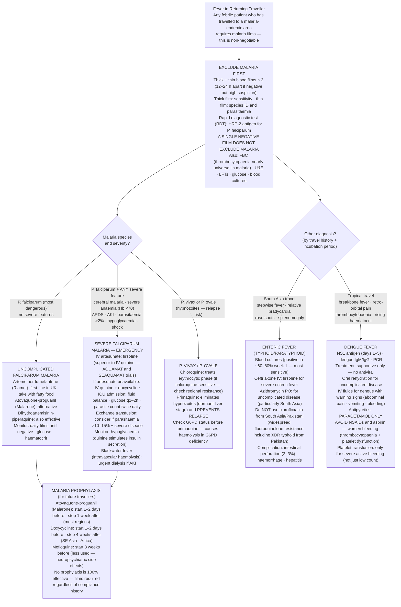

## Overview

Travel medicine encompasses the prevention and management of illnesses acquired during travel to endemic regions. The differential diagnosis of fever in a returning traveller is broad but must be approached systematically. Malaria is the most important cause — it is treatable but rapidly fatal if missed or delayed. The three rules of tropical fever: consider malaria in any febrile patient returning from a malaria-endemic area, consider malaria, and consider malaria.

---

## Malaria

### Pathophysiology

Malaria is caused by five *Plasmodium* species transmitted by the bite of female *Anopheles* mosquitoes. The infective sporozoites inoculated during the bite travel to the liver (exoerythrocytic stage) — this is the basis for prophylaxis and the "liver stage."

**Species characteristics:**

| Species | Key Features |
|---------|-------------|
| *P. falciparum* | Most dangerous; no hypnozoites (no relapse); can infect any age RBC; causes cerebral malaria, severe malaria |
| *P. vivax* | Hypnozoites (dormant liver stage) → relapse months/years later; infects young RBCs; lower mortality |
| *P. ovale* | Hypnozoites; rare; milder than vivax |
| *P. malariae* | No hypnozoites; causes quartan fever (72-hour cycle); can cause nephrotic syndrome |
| *P. knowlesi* | Zoonotic (macaque monkey); Southeast Asia; daily fever cycle; increasingly recognised |

After the liver stage, merozoites enter RBCs (erythrocytic stage). Cycles of RBC invasion, replication, and lysis produce the characteristic periodicity of fever:
- *P. vivax/ovale*: tertian fever (48-hour cycle — fever every other day)
- *P. malariae*: quartan fever (72-hour cycle)
- *P. falciparum*: irregular fever (cycles overlap due to asynchronous replication)

**Pathological mechanisms of severe falciparum malaria:**
- **Cytoadherence**: PfEMP1 (exported parasite protein) anchors infected RBCs to endothelial cells → microvascular obstruction → tissue ischaemia
- **Sequestration**: Infected RBCs accumulate in microvasculature (brain, lung, kidney) without appearing in peripheral blood — explains why parasitaemia level may underestimate severity
- **Rosetting**: Infected RBCs cluster with uninfected RBCs → worsens microvascular obstruction
- Haemolysis → anaemia; haem release → renal tubular toxicity (blackwater fever)

### Clinical Presentation

Fever (with or without classic cyclical periodicity), rigors, profuse sweating, myalgia, headache, nausea, vomiting. Splenomegaly (in repeated infections — chronic malaria). Mild jaundice (haemolysis).

**Severe falciparum malaria** (WHO criteria — any ONE of):
- Cerebral malaria — impaired consciousness, seizures, coma
- Severe anaemia (Hb <70 g/L)
- Respiratory distress / ARDS
- Circulatory collapse / septic shock
- Acute kidney injury
- Hypoglycaemia (from quinine-stimulated insulin secretion or parasite glucose consumption)
- Parasitaemia >2% (or >5% in non-immune patients)
- Abnormal bleeding / DIC
- Jaundice + end-organ dysfunction

### Diagnosis

**Thick and thin blood films** — gold standard. Thick film for sensitivity (concentration); thin film for species identification and parasitaemia. Three films taken 12–24 hours apart if initial films are negative and malaria remains suspected. **Do not exclude malaria on a single negative film.**

**Rapid diagnostic test (RDT)**: Detects *P. falciparum* HRP-2 antigen (and pan-*Plasmodium* pLDH). Fast, does not require microscopy expertise. Negative RDT does not exclude non-falciparum malaria — follow up with blood film.

**PCR**: Most sensitive; used for species confirmation and research. Not always available urgently.

**Additional**: FBC (thrombocytopaenia is nearly universal in malaria; anaemia), U&E and creatinine, bilirubin, glucose, LFTs, blood cultures (exclude concurrent bacteraemia).

### Management

**Uncomplicated *P. falciparum*:**
- **Artemether-lumefantrine (Riamet)** — first-line in UK (also artemisinin-based combination therapy, ACT). Take with fatty food.
- **Atovaquone-proguanil (Malarone)** — alternative.
- **Dihydroartemisinin-piperaquine** — also effective ACT.

**Severe/complicated falciparum malaria — medical emergency:**
- **IV artesunate** — first-line for severe malaria globally (superior to quinine — AQUAMAT and SEAQUAMAT trials). If unavailable: IV quinine + doxycycline.
- ICU admission, close monitoring (glucose, fluid balance, parasite count).
- **Exchange transfusion** — considered for very high parasitaemia (>10–15%) with severe disease.

***P. vivax* and *P. ovale*:** Chloroquine (if chloroquine-sensitive — check region) + **primaquine** to eliminate hypnozoites and prevent relapse. Check G6PD status before primaquine — causes haemolysis in G6PD deficiency.

**Prophylaxis for returning travellers:**

| Drug | Regimen | Use |
|------|---------|-----|
| Atovaquone-proguanil (Malarone) | Start 1–2 days before, take during, stop 1 week after travel | Most regions |
| Doxycycline | Start 1–2 days before, take during, stop 4 weeks after | SE Asia, Africa; avoid in pregnancy, children <8 |
| Mefloquine (Lariam) | Start 3 weeks before | Used less due to neuropsychiatric side effects |
| Chloroquine ± proguanil | Limited use — widespread resistance in Africa and SE Asia | Some specific regions |

Vector control: DEET repellent, permethrin-treated clothing, sleeping under insecticide-treated bed nets, indoor residual spraying.

---

## Enteric Fever (Typhoid)

*Salmonella typhi* (typhoid fever) and *S. paratyphi* (paratyphoid fever). Transmitted via contaminated food or water. Major cause of febrile illness in returning travellers from South Asia (including Pakistan), Southeast Asia, and Africa.

**Pathophysiology**: Bacteria ingested → survive gastric acid → penetrate Peyer's patches in terminal ileum → bacteraemia → seeded to RE system (liver, spleen, bone marrow) → secondary bacteraemia at end of first week → fever, rash, GI symptoms.

**Clinical presentation**: Stepwise rising fever over 1–2 weeks (rather than the sudden fever of malaria), relative bradycardia (pulse-temperature dissociation — expected tachycardia absent despite high fever), headache, malaise, dry cough, constipation early then diarrhoea. Rose spots — faint salmon-pink blanching macules on the trunk (10–30% of cases). Splenomegaly and hepatomegaly.

**Diagnosis**: Blood cultures (positive in ~60–80% in first week — most sensitive). Bone marrow culture (most sensitive overall — ~90%). Stool and urine cultures become positive later.

**Management**: **Ceftriaxone** IV (first-line for severe disease) or **azithromycin** (for uncomplicated disease, particularly in children and South Asia where fluoroquinolone resistance is widespread). **Ciprofloxacin** — previously first-line but widespread resistance in South Asia renders it unreliable.

**Complications**: Intestinal perforation (2–3%), intestinal haemorrhage, hepatitis, myocarditis, encephalopathy.

**Prevention**: Oral typhoid vaccine (Vivotif — live attenuated, 3 capsules alternate days; 3-year protection) or injectable Vi polysaccharide vaccine (Typherix/Typhim Vi — single IM injection; 3-year protection). Neither 100% effective — food and water precautions remain essential.

---

## Dengue Fever

*Flavivirus* transmitted by *Aedes aegypti* and *A. albopictus* mosquitoes (day-biting; breed in stagnant water). Distributed throughout tropical and subtropical regions — now present in southern Europe. No effective antiviral therapy.

**Clinical stages:**
1. **Febrile phase** (days 1–3): Abrupt high fever, severe headache, retro-orbital pain, myalgia, arthralgia ("breakbone fever"), facial flushing, early rash.
2. **Critical phase** (days 4–6): Fever defervesces but patient may deteriorate — capillary leak produces haematocrit rise, pleural effusions, ascites. Thrombocytopaenia and bleeding risk.
3. **Recovery phase** (days 6–7): Fluid reabsorption, bradycardia, convalescent rash.

**Dengue haemorrhagic fever/dengue shock syndrome**: Secondary infection with a different serotype → antibody-dependent enhancement → immune activation → severe capillary leak, haemorrhage, shock.

**Diagnosis**: NS1 antigen (positive days 1–5), dengue IgM/IgG serology, PCR.

**Management**: Supportive — oral rehydration, antipyretics (paracetamol only — **avoid NSAIDs and aspirin**: worsen bleeding). IV fluids for dengue with warning signs. Platelet transfusion only for severe bleeding.

---

## Approach to Fever in the Returning Traveller

**The history is paramount:**
- Countries visited (and specific regions within countries)
- Duration and purpose of travel
- Prophylaxis taken (and adherence)
- Vaccinations received
- Specific exposures: freshwater contact (schistosomiasis, leptospirosis), animal contact (rabies, Q fever), sexual activity (HIV, STIs), healthcare exposure (TB, hepatitis B/C), food and water safety
- Accommodation and insect bite precautions

**Incubation periods as a diagnostic guide:**

| Disease | Typical Incubation | Region |
|---------|-------------------|--------|
| Malaria (*P. falciparum*) | 7–21 days | Sub-Saharan Africa, SE Asia |
| Dengue | 4–10 days | Tropical worldwide |
| Typhoid | 7–21 days | South Asia, Africa |
| Hepatitis A | 15–50 days | Worldwide |
| Schistosomiasis (Katayama fever) | 4–8 weeks | Africa, Middle East, Brazil |
| Visceral leishmaniasis | Weeks–months | South Asia, East Africa |
| Malaria (*P. vivax*) | Weeks–months (can relapse years later) | Central/South America, SE Asia |

**Immediate management:** Malaria film (× 3 at intervals if negative) is mandatory for any febrile traveller from a malaria-endemic area — this is non-negotiable. Blood cultures, FBC, U&E, LFTs. Then consider the full differential based on travel history and incubation period.

## Complications

**Severe malaria**: Multi-organ failure, ARDS, cerebral malaria, renal failure, hypoglycaemia, blackwater fever (intravascular haemolysis), death.

**Typhoid**: Intestinal perforation, haemorrhage, relapse (~10%), chronic carriage (*S. typhi* in gallbladder — risk factor for gallbladder cancer).

**Dengue**: Dengue haemorrhagic fever, dengue shock syndrome, neurological complications (encephalitis, Guillain-Barré).

## Clinical Insight

Malaria must be excluded in any febrile traveller returning from an endemic area, even if they took prophylaxis. No prophylactic regimen is 100% effective, and non-adherence is extremely common. A patient who "took Malarone" but missed doses, took it without food, or has incomplete course is not protected. Blood films must be performed regardless of prophylaxis history.

Thrombocytopaenia is not a reason to delay treatment in malaria — it is expected and rarely causes life-threatening bleeding. The clinical urgency is to treat the malaria, which will resolve the thrombocytopaenia. Withholding treatment pending a "safer" platelet count is a dangerous misconception.

Returning travellers from South Asia with enteric fever should receive azithromycin rather than ciprofloxacin unless local susceptibility data suggests otherwise. Fluoroquinolone resistance in *S. typhi* from Pakistan, India, and Bangladesh is now so widespread that ciprofloxacin treatment failure is the rule, not the exception. In Pakistan in particular, extensively drug-resistant (XDR) typhoid strains have emerged — these require ceftriaxone or azithromycin.
