## Overview

Urinary tract infections (UTIs) are among the most common bacterial infections in clinical practice, accounting for approximately 15% of all community-prescribed antibiotics. They range from uncomplicated lower UTI (cystitis) — a self-limiting, low-risk condition in healthy women — to complicated upper UTI (pyelonephritis) and urosepsis, which carry significant morbidity and mortality. Distinguishing complicated from uncomplicated UTI determines the urgency of investigation and the choice of antibiotic.

## Pathophysiology

Most UTIs result from faecal flora ascending from the perineum through the urethra into the bladder and, in pyelonephritis, ascending further to the renal pelvis and parenchyma. Haematogenous seeding is rare (except *S. aureus* and *Candida* in bacteraemia).

**Organisms:**

| Organism | Frequency | Notes |
|---------|-----------|-------|
| *Escherichia coli* | ~80% of community UTIs | Possesses type 1 and P fimbriae for uroepithelial adhesion |
| *Klebsiella pneumoniae* | ~5–10% | Common in diabetics and hospital-acquired |
| *Staphylococcus saprophyticus* | ~5–10% | Second most common in young sexually active women |
| *Proteus mirabilis* | ~5% | Urease-producer → struvite stones; alkaline urine |
| *Enterococcus faecalis* | ~5% | Hospital-acquired, catheter-associated |
| *Pseudomonas aeruginosa* | <5% | Hospital-acquired, structural abnormality, immunocompromised |

**Risk factors for UTI:**
- Female anatomy (short urethra, proximity to anus)
- Sexual activity ("honeymoon cystitis")
- Urinary stasis — structural abnormality, obstruction, vesicoureteric reflux, neurogenic bladder
- Instrumentation — urinary catheter (most common nosocomial UTI risk factor)
- Diabetes mellitus (glucosuria, impaired immunity)
- Pregnancy
- Immunosuppression
- Urinary calculi

**Complicated vs uncomplicated UTI:**

| Uncomplicated | Complicated |
|--------------|------------|
| Healthy non-pregnant woman | Pregnancy |
| No structural abnormality | Structural abnormality (obstruction, calculi, stent) |
| No functional abnormality | Neurogenic bladder, urinary retention |
| Normal renal function | Male sex |
| Community-acquired | Diabetes, immunosuppression |
| | Hospital-acquired or catheter-associated |
| | AKI or CKD |

## Clinical Presentation

**Lower UTI (cystitis):** Dysuria, urinary frequency, urgency, suprapubic discomfort, haematuria (macroscopic or microscopic), smelly or cloudy urine. Absent fever and flank pain — their presence suggests upper tract involvement.

**Upper UTI (pyelonephritis):** All of the above plus **fever, rigors, loin/flank pain, costovertebral angle tenderness, nausea, and vomiting**. Systemic features indicate parenchymal involvement. Up to 30% of women with apparent lower UTI symptoms have subclinical pyelonephritis.

**Urosepsis:** Pyelonephritis progressing to systemic infection — sepsis criteria met. Can progress to septic shock. Gram-negative bacteraemia.

**Asymptomatic bacteraemia (ASB):** Significant bacteriuria (≥10⁵ CFU/mL on two samples) without symptoms. **Do not treat ASB except in pregnancy and prior to urological procedures.** Treating ASB in elderly patients, diabetics, or catheterised patients increases antibiotic resistance without clinical benefit.

**UTI in elderly patients** presents atypically — confusion, falls, reduced mobility, and functional decline rather than classic urinary symptoms. However, bacteriuria is also extremely common in this population without infection — always ensure genuine symptoms are present before treating.

**Recurrent UTI:** Defined as ≥2 episodes in 6 months or ≥3 in 12 months. Requires investigation for precipitating factors, microbiological culture, and a targeted prevention strategy.

## Diagnosis

**Urine dipstick:** Rapid bedside test. Leucocyte esterase (WBCs in urine) and nitrites (bacteria reducing dietary nitrates) together have a positive predictive value of ~80% for UTI. Negative dipstick in a low-probability patient largely excludes UTI.

**Urine MC&S:** Mid-stream clean catch urine (MSU). Required before antibiotics in: pyelonephritis, complicated UTI, pregnant women, men (always), recurrent UTI, and treatment failure. Results guide de-escalation to targeted therapy.

Significant bacteriuria = ≥10⁵ CFU/mL of a single organism (lower thresholds apply in symptomatic patients: ≥10² CFU/mL in catheter samples or men).

**Bloods (pyelonephritis/urosepsis):** FBC, U&E, CRP, blood cultures (before antibiotics), lactate. Renal function may be impaired.

**Imaging:**
- Renal ultrasound — if pyelonephritis is not improving after 48–72 hours, or if complication is suspected (abscess, obstruction)
- CT urography — for recurrent UTI in men, structural abnormality suspected, or stones
- All men with a first UTI warrant investigation for structural or functional abnormality

```mermaid
flowchart TD
    A["UTI Presentation\nDysuria · frequency · urgency · suprapubic discomfort\nhaematuria · cloudy/smelly urine"] --> SEPSIS{"Sepsis criteria?\nfever · hypotension · HR &gt;90 · confusion\nor loin pain + systemic upset"}

    SEPSIS -->|"Urosepsis — systemic\ninfection criteria met"| UROSEPSIS["UROSEPSIS — FOLLOW SEPSIS PATHWAY\nBlood cultures + MSU BEFORE antibiotics\nIV antibiotics immediately:\n→ piperacillin-tazobactam or co-amoxiclav\n→ meropenem if resistant organism suspected\nIV fluids · ICU if haemodynamic instability\nImaging: renal USS (exclude obstruction or abscess)\nSource control: nephrostomy if obstructed infected system"]

    SEPSIS -->|"No sepsis\nupper UTI features:\nfever · loin pain · rigors · CVA tenderness"| PYELO["PYELONEPHRITIS\nSend MSU for MC&S BEFORE antibiotics (guides de-escalation)\nBlood cultures if systemically unwell\nMild–moderate (tolerating oral): ciprofloxacin 500 mg BD × 7 days\nSevere (vomiting or septic): IV co-amoxiclav or cephalosporin → step down to oral\nDuration: 10–14 days total\nAdmit if: vomiting · sepsis · significant comorbidity · failure to improve after 24 h oral\nUSS if not improving by 72 h (exclude obstruction or renal abscess)\nNOTE: nitrofurantoin NOT suitable for pyelonephritis — inadequate tissue penetration"]

    SEPSIS -->|"No systemic features\nlower UTI symptoms only"| LOWER{"Complicated UTI?\npregnancy · male sex · structural/functional abnormality\nDM · immunosuppressed · AKI or CKD · hospital-acquired"}

    LOWER -->|"Uncomplicated lower UTI\nhealthy non-pregnant woman"| SYMPTOMS{"Symptomatic?"}

    SYMPTOMS -->|"Symptoms present\n(dysuria · frequency · urgency)"| UNCOMPLICATED["UNCOMPLICATED LOWER UTI — WOMEN\nNo urine culture required for first-episode uncomplicated UTI\nFirst-line: nitrofurantoin 100 mg MR BD × 5 days\n(NICE preferred — lower resistance than trimethoprim; avoid if eGFR &lt;30)\nAlternative: trimethoprim 200 mg BD × 7 days\n→ ONLY if local resistance rates &lt;20%\npivmecillinam 400 mg TDS × 3 days (where available)\nSymptom relief: paracetamol · adequate hydration"]

    SYMPTOMS -->|"Bacteriuria without symptoms\n(incidental or screening)"| ASB["ASYMPTOMATIC BACTERIURIA (ASB)\nDO NOT TREAT ASB in the following groups:\n→ Elderly patients · diabetics · catheterised patients · non-pregnant adults\n→ Treating ASB increases antibiotic resistance + C. difficile risk\n→ Bacteriuria in an asymptomatic patient = colonisation, NOT infection\nTREAT ASB ONLY in:\n1. Pregnancy (risk: ascending pyelonephritis → preterm labour)\n2. Before urological instrumentation (e.g., TURP, cystoscopy with biopsy)"]

    LOWER -->|"Complicated UTI\nor any UTI in a man"| COMPLICATED["COMPLICATED UTI\nSend MSU MC&S BEFORE antibiotics\nMale with first UTI: always investigate\n→ MSU culture · renal USS · PSA if age &gt;50 · consider cystoscopy\n→ Structural abnormality · STI · immunosuppression must be excluded\nAntibiotics: guided by culture and clinical severity\nDuration: 7–14 days depending on severity and response\nReview at 48 h with culture results → de-escalate to narrowest effective agent"]

    UNCOMPLICATED --> RECURRENT{"Recurrent UTI?\n≥2 episodes in 6 months\nor ≥3 in 12 months"}

    RECURRENT -->|"Yes — recurrent UTI"| PREV["RECURRENT UTI — PREVENTION STRATEGY\nNon-antibiotic (first-line):\n→ High fluid intake (&gt;1.5–2 L/day) · post-coital voiding\n→ Topical oestrogen: post-menopausal women (restores lactobacillus flora · reduces colonisation)\n→ D-mannose: reduces E. coli uroepithelial adhesion (evidence comparable to low-dose prophylaxis)\n→ Cranberry: modest evidence — reduces symptomatic episodes\nAntibiotic prevention (if non-antibiotic measures fail):\n→ Post-coital single dose: nitrofurantoin 50–100 mg or trimethoprim 100 mg\n→ Low-dose continuous prophylaxis: nitrofurantoin 50–100 mg nocte or trimethoprim 100 mg nocte\n→ Self-start therapy for motivated patients with reliable symptom recognition\nInvestigate for structural or functional cause (cystoscopy · USS · bladder diary)"]
```

## Management

### Uncomplicated Lower UTI (Women)

A 3-day course of antibiotics. Choose based on local antibiotic guidelines and resistance patterns:
- **Nitrofurantoin** 100mg modified-release BD for 5 days (NICE preferred — lower resistance rates than trimethoprim; avoid if eGFR <30)
- **Trimethoprim** 200mg BD for 7 days — only if local resistance rates are <20%
- **Pivmecillinam** 400mg TDS for 3 days (available in some regions)
- Urine culture is not required for uncomplicated first-presentation lower UTI in women

Phenazopyridine (urinary analgesic) or simple analgesia for symptom relief pending antibiotic effect.

### Pyelonephritis

Urine culture before starting antibiotics. Blood cultures if unwell. Admit if:
- Unable to tolerate oral medication
- Sepsis or haemodynamic instability
- Significant comorbidity, immunosuppression
- Failure to improve on oral antibiotics after 24 hours

**Oral (mild-moderate, able to tolerate):**
- Ciprofloxacin 500mg BD for 7 days (good tissue penetration)
- Co-amoxiclav if culture-guided
- Cefalexin if sensitive

**IV (severe, unable to tolerate oral):**
- IV co-amoxiclav or cephalosporin, stepping down to oral when improving
- Gentamicin for Gram-negative cover in severe cases
- Duration: 10–14 days total

**Imaging** — ultrasound if not responding after 72 hours to exclude obstruction or abscess. CT abdomen-pelvis if abscess suspected.

### Catheter-Associated UTI

Only treat if the patient is symptomatic. Remove or change the catheter if possible — this alone often resolves the bacteriuria. Do not treat asymptomatic bacteriuria in catheterised patients.

### Recurrent UTI

**Non-antibiotic prevention:**
- High fluid intake (>1.5–2 L/day)
- Post-coital voiding
- Cranberry products (modest evidence — reduce uropathogen adhesion)
- Topical oestrogen for post-menopausal women (restores vaginal flora, reduces colonisation)
- D-mannose (reduces *E. coli* adhesion)

**Antibiotic prevention:**
- Post-coital single-dose antibiotics (nitrofurantoin 50–100mg or trimethoprim 100mg)
- Low-dose continuous prophylaxis — nitrofurantoin 50–100mg nocte or trimethoprim 100mg nocte
- Self-start therapy (patient-initiated) for motivated patients with reliable recognition of symptoms

## Complications

- Pyelonephritis → renal abscess or pyonephrosis
- Urosepsis → septic shock and multi-organ failure
- Chronic pyelonephritis → renal scarring → CKD (particularly with recurrent UTI and vesicoureteric reflux in childhood)
- Emphysematous pyelonephritis — gas-forming organism, usually in diabetics; surgical emergency
- AKI from obstruction or sepsis

## Clinical Insight

Nitrofurantoin concentrates in the urine and bladder but achieves negligible tissue levels — it is not suitable for pyelonephritis, where parenchymal tissue penetration is required. Using nitrofurantoin for pyelonephritis is an antibiotic prescribing error that results in inadequate tissue drug levels and treatment failure.

Asymptomatic bacteriuria should not be treated except in pregnant women (risk of ascending pyelonephritis in pregnancy, preterm labour) and before urological instrumentation. Treating asymptomatic bacteriuria in elderly care home residents, diabetics, or catheterised patients leads to antibiotic overuse, resistant organisms, and *Clostridioides difficile* infection. The presence of bacteria in the urine of an asymptomatic patient is not an infection — it is colonisation.

In men, a first UTI always warrants investigation. UTI is uncommon in young men and its occurrence should raise suspicion for structural abnormality (bladder outflow obstruction, urethral stricture, stones), sexually transmitted infection, or immunosuppression. MSU culture, PSA (if >50), and renal ultrasound are minimum investigations.
