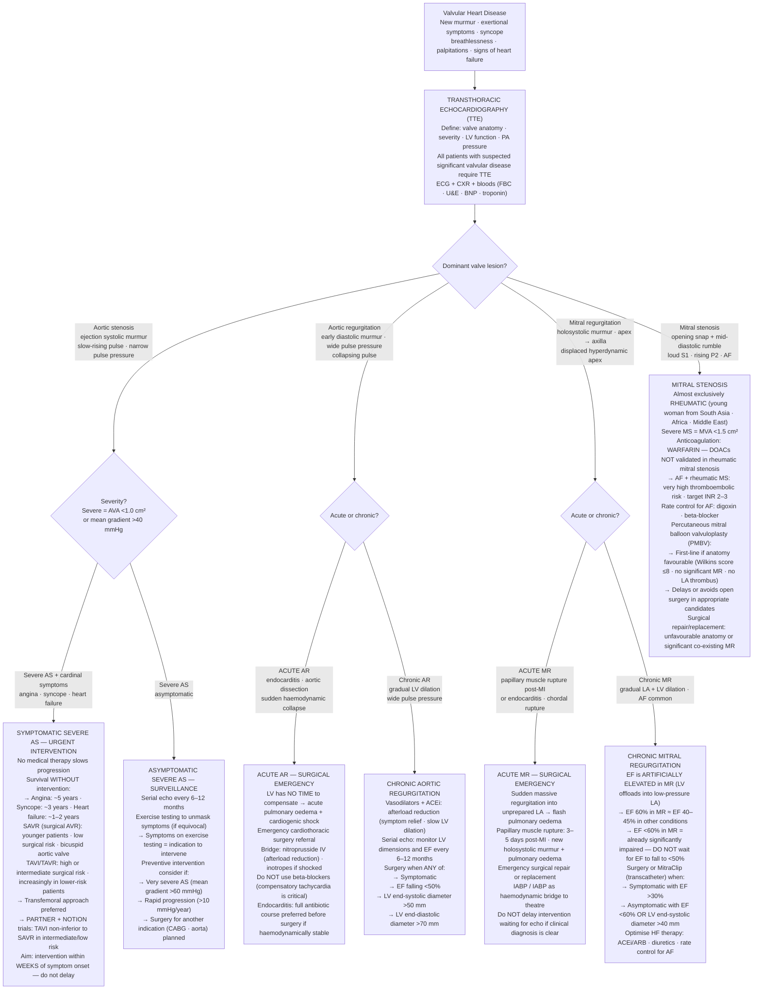

## Overview

Valvular heart disease results from stenosis (obstruction to forward flow) or regurgitation (backflow due to incompetent valve closure). The haemodynamic consequences depend on which valve is affected, the severity of the lesion, and critically — the acuity of onset. Acute valvular pathology is far more haemodynamically devastating than the same degree of chronic disease, because the heart has no time to adapt.

---

## Aortic Stenosis

### Pathophysiology

Calcific degeneration of the aortic valve — the most common valvular disease in the developed world — causes progressive narrowing of the valve orifice. The left ventricle must generate increasingly high pressures to maintain forward flow, resulting in **pressure overload** and concentric LVH. This initially compensates, but eventually diastolic dysfunction, reduced coronary reserve, and finally systolic failure ensue.

The three cardinal symptoms mark a turning point in prognosis:

| Symptom | Approximate Mean Survival Without Intervention |
|---------|----------------------------------------------|
| Angina (fixed CO cannot meet increased O₂ demand) | ~5 years |
| Syncope (fixed CO cannot increase with exertion) | ~3 years |
| Heart failure (LV decompensation) | ~1–2 years |

**Causes:** Calcific/degenerative (age >65, most common), bicuspid aortic valve (congenital, presents 20–30 years earlier), rheumatic disease.

### Examination

- Ejection systolic murmur — harsh, crescendo-decrescendo, right upper sternal edge, radiating to both carotids (the only murmur that does)
- Slow-rising, low-volume pulse (pulsus parvus et tardus)
- Narrow pulse pressure
- Soft or absent A2
- Heaving non-displaced apex (concentric hypertrophy, not dilation)
- S4 (stiff non-compliant ventricle)

**Severity on echo:** Severe AS = mean gradient >40 mmHg, AVA <1.0 cm² (normal 3–4 cm²).

### Management

No medical therapy slows progression. Once symptomatic, valve replacement is urgent — prognosis drops sharply with symptom onset.

- **SAVR** (surgical AVR) — standard for younger, low-surgical-risk patients
- **TAVI/TAVR** — transcatheter approach, now first-line in high-risk and intermediate-risk patients, increasingly used in lower-risk

---

## Aortic Regurgitation

### Pathophysiology

Incompetent aortic valve allows blood to regurgitate back into the LV during diastole, causing **volume overload**. The LV dilates and undergoes eccentric hypertrophy to accommodate the increased end-diastolic volume while maintaining a large stroke volume (large SV → high systolic BP; regurgitant flow → low diastolic BP → **wide pulse pressure**).

**Acute AR** (endocarditis, aortic dissection) is a surgical emergency — the LV has no time to compensate, causing acute pulmonary oedema and cardiogenic shock.

**Causes by mechanism:**
- Valve leaflet: bicuspid valve, endocarditis, rheumatic disease
- Aortic root dilation: Marfan syndrome, ankylosing spondylitis, syphilitic aortitis

### Examination

- Early diastolic murmur — blowing, decrescendo, left sternal border, best heard sitting forward in expiration
- Wide pulse pressure (>60 mmHg)
- Collapsing (water-hammer) pulse
- Austin Flint murmur — low-pitched mid-diastolic rumble at apex (regurgitant jet partially closing the mitral valve)
- de Musset's sign (head bobbing), Quincke's sign (nail bed pulsation)

### Management

Acute AR requires emergency surgery. Chronic AR: vasodilators and ACEi for afterload reduction; surgical replacement when symptomatic, or when EF falls or LV dilates excessively on serial echo.

---

## Mitral Regurgitation

### Pathophysiology

Regurgitant flow into the LA during systole causes volume overload of both LA and LV. LA dilation predisposes to AF. Eventually LV systolic function deteriorates. In ischaemic MR, the EF may appear preserved despite significant impairment — an EF of 60% in MR equals EF 40–45% in other conditions.

**Causes:** Mitral valve prolapse (most common in developed world), ischaemic (papillary muscle dysfunction or rupture post-MI), functional (dilated cardiomyopathy), endocarditis, rheumatic disease.

### Examination

- Holosystolic murmur at the apex radiating to the axilla
- Soft S1 (valve not closing properly)
- Displaced, hyperdynamic apex

### Management

Acute MR (papillary muscle rupture) is a surgical emergency. Chronic MR: optimise HF therapy; surgery when symptomatic or EF falling (EF <60% in MR is already impaired — act before it drops further).

---

## Mitral Stenosis

### Pathophysiology

Almost exclusively caused by **rheumatic heart disease** — molecular mimicry following Group A streptococcal infection leads to valve leaflet fusion. Obstruction to LA outflow raises LA pressure, causing pulmonary hypertension and eventually right heart failure. The enlarged LA predisposes to AF and thrombus formation.

### Examination

- Opening snap — high-pitched, early diastolic, follows S2. **Earlier opening snap = more severe MS** (higher LA pressure forces the leaflet open sooner after S2)
- Mid-diastolic low-pitched rumble at the apex (heard with the bell, patient in left lateral decubitus position)
- Loud S1 (valve snaps open)
- Loud P2 (pulmonary hypertension)

### Management

Rate control for AF (digoxin, beta-blocker). **Anticoagulation with warfarin** — DOACs are not validated in rheumatic MS. Percutaneous balloon valvuloplasty is definitive in suitable anatomy.

---

## Mitral Valve Prolapse

Myxomatous degeneration causes leaflet billowing into the LA during systole. Presents as a **mid-systolic click** followed by a late systolic murmur. The click moves **earlier** with standing or Valsalva (decreased preload → smaller LV → earlier prolapse) and **later** with squatting or leg raise (increased preload). Most cases are benign; surgery only if severe MR develops.

---

## Murmur Summary

| Lesion | Timing | Quality | Location and Radiation |
|--------|--------|---------|----------------------|
| Aortic stenosis | Systolic (ejection) | Harsh, crescendo-decrescendo | RUSB → carotids |
| Aortic regurgitation | Early diastolic | Blowing, decrescendo | LLSB, sitting forward |
| Mitral regurgitation | Holosystolic | Blowing, plateau | Apex → axilla |
| Mitral stenosis | Mid-diastolic | Low rumble | Apex (left lateral decubitus) |
| Mitral valve prolapse | Mid-systolic click + late systolic | Click then murmur | Apex |
| Tricuspid regurgitation | Holosystolic | Blowing | LLSB; increases with inspiration |

## Clinical Insight

Aortic stenosis is notoriously underappreciated until symptoms develop. A patient who has had a systolic murmur for years and then reports their first episode of exertional syncope has crossed a critical threshold — do not wait for a second episode. Refer for echo and surgical evaluation urgently.

In MR, the ejection fraction is a misleading metric. Because the LV can offload easily into the low-pressure LA, the EF is artificially elevated. An EF of 55% in MR may represent significantly impaired contractile reserve. The threshold for surgical intervention is EF <60%, not the usual <50%.

Mitral stenosis presenting in a young woman from Pakistan, Egypt, or sub-Saharan Africa should default to a diagnosis of rheumatic disease until proven otherwise. It remains the most common cause of MS worldwide.
